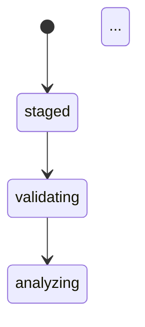

<objective>
Author the seven narrative guides under `guides/` (DOC-01..DOC-07). Each guide is a substantive markdown document — not a stub. Per D-15: explicit list of seven Markdown files. Per D-16: the getting-started snippet must mirror the adopter lifecycle test code path verbatim (CI grep gate from Plan 06 Task 4 enforces this). Per D-18: operations.md cross-links to existing Mix task `@moduledoc` blocks rather than re-authoring them.

Per D-15: guides live in `guides/` at repo root, one Markdown per DOC-01..07.
Per D-16: the getting-started snippet is the SAME code path as the adopter lifecycle test (Plan 04 source of truth).
Per D-18: `guides/operations.md` cross-links to existing Mix task `@moduledoc` — does not re-author them.

Output: 7 new guide Markdown files. Wave 4 — depends on Plan 04 (adopter lifecycle test exists as the DOC-01 code path source of truth). After Plan 06 wires `mix.exs docs/0 extras:` and Plan 07 delivers the files, `mix docs` builds successfully end-to-end.

Split rationale (per checker feedback Warning 2): Plan 06 contains DOC-08 audit + mix.exs wiring + drift CI step (10 files). DOC-01..07 guide authoring is a separate concern — 7 files of authored prose with embedded Mermaid diagrams — and benefits from its own context budget for high-quality narrative content.
</objective>

<execution_context>
@$HOME/.claude/get-shit-done/workflows/execute-plan.md
@$HOME/.claude/get-shit-done/templates/summary.md
</execution_context>

<context>
@.planning/PROJECT.md
@.planning/ROADMAP.md
@.planning/STATE.md
@.planning/phases/05-ci-1-0-readiness/05-CONTEXT.md
@.planning/phases/05-ci-1-0-readiness/05-RESEARCH.md
@.planning/phases/05-ci-1-0-readiness/05-PATTERNS.md
@.planning/phases/05-ci-1-0-readiness/05-04-SUMMARY.md
@README.md
@test/adopter/canonical_app/lifecycle_test.exs
@test/adopter/canonical_app/profile.ex
@lib/rindle/domain/asset_fsm.ex
@lib/rindle/domain/variant_fsm.ex
@lib/rindle/domain/upload_session_fsm.ex
@lib/rindle/upload/broker.ex
@lib/rindle/delivery.ex
@lib/rindle/profile.ex
@lib/mix/tasks/rindle.cleanup_orphans.ex
@lib/mix/tasks/rindle.regenerate_variants.ex
@lib/mix/tasks/rindle.verify_storage.ex
@lib/mix/tasks/rindle.abort_incomplete_uploads.ex
@lib/mix/tasks/rindle.backfill_metadata.ex

<interfaces>
<!-- Mermaid block format (RESEARCH lines 666-674) — used in core_concepts.md -->

````

````

The Mermaid renderer is wired by Plan 06 Task 3's `before_closing_head_tag:`; this plan's job is to produce the diagram source.

<!-- Adopter lifecycle test API surface (D-16 source of truth — guides/getting_started.md MUST mirror these calls) -->

From `test/adopter/canonical_app/lifecycle_test.exs`:
```elixir
{:ok, session} = Broker.initiate_session(AdopterProfile, filename: "adopter.png")
{:ok, %{session: signed, presigned: presigned}} = Broker.sign_url(session.id)
# (HTTP PUT to presigned.url)
{:ok, %{session: completed, asset: asset}} = Broker.verify_completion(session.id)
{:ok, signed_url} = Rindle.Delivery.url(AdopterProfile, asset.storage_key)
```

<!-- Mix task names (D-18 cross-link targets) -->

- `mix rindle.cleanup_orphans` (lib/mix/tasks/rindle.cleanup_orphans.ex)
- `mix rindle.regenerate_variants` (lib/mix/tasks/rindle.regenerate_variants.ex)
- `mix rindle.verify_storage` (lib/mix/tasks/rindle.verify_storage.ex)
- `mix rindle.abort_incomplete_uploads` (lib/mix/tasks/rindle.abort_incomplete_uploads.ex)
- `mix rindle.backfill_metadata` (lib/mix/tasks/rindle.backfill_metadata.ex)
</interfaces>
</context>

<tasks>

<task type="auto" tdd="false">
  <name>Task 1: Author guides/getting_started.md (DOC-01) + guides/core_concepts.md (DOC-02)</name>
  <files>
    - guides/getting_started.md (new)
    - guides/core_concepts.md (new)
  </files>

  <read_first>
    - test/adopter/canonical_app/lifecycle_test.exs (FULL — copy the exact API calls and sequence; this file is the D-16 source of truth)
    - test/adopter/canonical_app/profile.ex (the canonical adopter profile shape)
    - lib/rindle/domain/asset_fsm.ex (state list + allowed_transitions for Mermaid diagram)
    - lib/rindle/domain/variant_fsm.ex (state list + allowed_transitions)
    - lib/rindle/domain/upload_session_fsm.ex (state list + allowed_transitions)
    - lib/rindle/upload/broker.ex (public function signatures + return shapes)
    - lib/rindle/delivery.ex (url/3 signature)
    - .planning/phases/05-ci-1-0-readiness/05-CONTEXT.md (D-15 narrative shape; D-16 snippet parity)
  </read_first>

  <action>
    Step 1 — Create `guides/getting_started.md` (DOC-01). Required structure:

    ```markdown
    # Getting Started with Rindle

    Rindle is a media-handling library for Phoenix applications. This guide
    walks you from `mix new` to a working upload → process → deliver loop.

    ## Installation

    Add Rindle to your `mix.exs` deps:

    ```elixir
    def deps do
      [
        {:rindle, "~> 0.1"}
      ]
    end
    ```

    Run `mix deps.get` and `mix ecto.migrate` to install Rindle's schemas.

    ## Define a Profile

    A `Rindle.Profile` declares how a particular family of media is handled:

    ```elixir
    defmodule MyApp.MediaProfile do
      use Rindle.Profile,
        storage: Rindle.Storage.S3,
        variants: [thumb: [mode: :fit, width: 64, height: 64]],
        allow_mime: ["image/png", "image/jpeg"],
        max_bytes: 10_485_760
    end
    ```

    See [Profiles](profiles.html) for the full DSL.

    ## The Upload Lifecycle

    The canonical flow has four steps:

    ```elixir
    # 1. Initiate a session — gets a server-side row in the `staged` state.
    {:ok, session} = Rindle.Upload.Broker.initiate_session(MyApp.MediaProfile, filename: "photo.png")

    # 2. Request a presigned PUT URL — client uploads directly to storage.
    {:ok, %{session: signed, presigned: %{url: upload_url}}} =
      Rindle.Upload.Broker.sign_url(session.id)

    # ... your client PUTs the file bytes to upload_url over HTTPS ...

    # 3. Verify the upload — promotes the asset, enqueues variant jobs.
    {:ok, %{session: completed, asset: asset}} =
      Rindle.Upload.Broker.verify_completion(session.id)

    # 4. Deliver — request a signed URL for the original or any variant.
    {:ok, url} = Rindle.Delivery.url(MyApp.MediaProfile, asset.storage_key)
    ```

    This is the EXACT code path exercised by the adopter integration test in
    `test/adopter/canonical_app/lifecycle_test.exs`. Drift between this
    snippet and that test is a CI failure (per D-16).

    ## Next Steps

    - [Core Concepts](core_concepts.html) — assets, variants, sessions, FSMs
    - [Profiles](profiles.html) — full Profile DSL reference
    - [Secure Delivery](secure_delivery.html) — signed URLs, authorizers
    - [Background Processing](background_processing.html) — Oban workers
    - [Operations](operations.html) — Mix tasks for Day-2 maintenance
    - [Troubleshooting](troubleshooting.html) — common failure modes
    ```

    CRITICAL: The three calls `Broker.initiate_session`, `Broker.verify_completion`, and `Rindle.Delivery.url` MUST appear in this file — Plan 06 Task 4's CI grep step will fail otherwise. `Broker.sign_url` is also expected per the adopter lane but the gate only checks the three above.

    Step 2 — Create `guides/core_concepts.md` (DOC-02). Use Mermaid `stateDiagram-v2` blocks. Read the FSM modules to get the exact states. Skeleton:

    ````markdown
    # Core Concepts

    Rindle models media as three primary entities, each with its own
    lifecycle state machine:

    - **MediaAsset** — a single uploaded file (the canonical original)
    - **MediaVariant** — a derived output (thumbnail, large, etc.)
    - **MediaUploadSession** — a presigned upload in flight

    Each entity is governed by a finite-state machine that controls valid
    transitions. The diagrams below mirror the `@allowed_transitions`
    declarations in the corresponding FSM modules.

    ## Asset Lifecycle

    ```mermaid
    stateDiagram-v2
        [*] --> staged
        staged --> validating
        validating --> analyzing
        validating --> quarantined
        analyzing --> promoting
        promoting --> available
        available --> processing
        processing --> ready
        processing --> degraded
        ready --> deleted
        degraded --> deleted
        quarantined --> deleted
    ```

    See `Rindle.Domain.AssetFSM` for the canonical transition map.

    ## Variant Lifecycle

    ```mermaid
    stateDiagram-v2
        [*] --> planned
        planned --> queued
        queued --> processing
        processing --> ready
        processing --> failed
        ready --> stale
        ready --> missing
        ready --> purged
        stale --> queued
        missing --> queued
        failed --> purged
    ```

    See `Rindle.Domain.VariantFSM`.

    ## Upload Session Lifecycle

    ```mermaid
    stateDiagram-v2
        [*] --> initialized
        initialized --> signed
        signed --> uploading
        uploading --> uploaded
        uploaded --> verifying
        verifying --> completed
        verifying --> failed
        signed --> aborted
        signed --> expired
    ```

    See `Rindle.Domain.UploadSessionFSM`.

    ## How These Connect

    A user's upload triggers an UploadSession. Successful verification
    promotes the session and creates a MediaAsset. Variants are derived
    from the asset and processed by Oban workers (see
    [Background Processing](background_processing.html)).
    ````

    IMPORTANT: Before authoring the Mermaid blocks, READ the actual FSM
    modules and copy their `@allowed_transitions` literally. The states
    above are illustrative — adjust to match the real source.

    Step 3 — Verify both files: `wc -l guides/getting_started.md` ≥ 50, `wc -l guides/core_concepts.md` ≥ 60. Run `mix docs` and confirm both files appear in `doc/` HTML output (assuming Plan 06 has wired `extras:`).
  </action>

  <verify>
    <automated>test -f guides/getting_started.md && test -f guides/core_concepts.md && [ "$(wc -l < guides/getting_started.md)" -ge 50 ] && [ "$(wc -l < guides/core_concepts.md)" -ge 60 ] && grep -c "Broker.initiate_session\|Broker.verify_completion\|Rindle.Delivery.url" guides/getting_started.md && grep -c "stateDiagram-v2" guides/core_concepts.md</automated>
  </verify>

  <acceptance_criteria>
    - `test -f guides/getting_started.md` exits 0
    - `test -f guides/core_concepts.md` exits 0
    - `wc -l guides/getting_started.md` returns at least 50
    - `wc -l guides/core_concepts.md` returns at least 60
    - `grep -c "Broker.initiate_session" guides/getting_started.md` returns at least 1
    - `grep -c "Broker.verify_completion" guides/getting_started.md` returns at least 1
    - `grep -c "Rindle.Delivery.url" guides/getting_started.md` returns at least 1
    - `grep -c "stateDiagram-v2" guides/core_concepts.md` returns at least 3 (one per FSM)
    - `grep -c "AssetFSM\|VariantFSM\|UploadSessionFSM" guides/core_concepts.md` returns at least 3
  </acceptance_criteria>

  <done>
    DOC-01 and DOC-02 authored. The getting-started snippet matches the adopter lifecycle test API calls (D-16). Core concepts contains three Mermaid stateDiagram-v2 blocks with state names mirroring the actual FSM modules.
  </done>
</task>

<task type="auto" tdd="false">
  <name>Task 2: Author profiles, secure_delivery, background_processing guides (DOC-03/04/05)</name>
  <files>
    - guides/profiles.md (new)
    - guides/secure_delivery.md (new)
    - guides/background_processing.md (new)
  </files>

  <read_first>
    - lib/rindle/profile.ex (Profile DSL options — what `use Rindle.Profile` accepts)
    - lib/rindle/delivery.ex (delivery_mode, authorize_delivery, signed_url_ttl_seconds)
    - lib/rindle/workers/ (worker modules — list and inspect)
    - lib/rindle/storage/s3.ex (storage adapter capabilities)
    - test/adopter/canonical_app/profile.ex (a working profile example to reference)
    - .planning/phases/05-ci-1-0-readiness/05-CONTEXT.md (DOC-03/04/05 expectations)
  </read_first>

  <action>
    Step 1 — Create `guides/profiles.md` (DOC-03). Cover:
    - `use Rindle.Profile` DSL options: `storage`, `variants`, `allow_mime`, `max_bytes`, optional `delivery`, optional `authorizer`
    - One full working profile example (modeled on `test/adopter/canonical_app/profile.ex`)
    - Variant DSL: `mode`, `width`, `height`, optional format conversions
    - How to override storage adapter config per-profile (env-var-driven config)
    - At least one example showing multiple variants

    Minimum 50 lines. Include a code block per major DSL option.

    Step 2 — Create `guides/secure_delivery.md` (DOC-04). Cover:
    - Private-by-default delivery posture (signed URLs)
    - `signed_url_ttl_seconds` configuration on the profile
    - `delivery: [public: true]` opt-in
    - `delivery: [authorizer: SomeModule]` callback with the `authorize/3` contract
    - Storage adapter `capabilities/0` requirements (`:signed_url` for private mode)
    - Threat note: signed URLs are time-limited but bearer-token-equivalent until expiry

    Minimum 50 lines. Include code blocks for each configuration permutation.

    Step 3 — Create `guides/background_processing.md` (DOC-05). Cover:
    - Oban setup (queue config, repo binding)
    - Rindle's worker modules (`Rindle.Workers.PromoteAsset`, `Rindle.Workers.ProcessVariant`, `Rindle.Workers.PurgeStorage`, cleanup workers)
    - Transactional enqueueing (Oban jobs are inserted in the same transaction as the asset state change)
    - Retry behavior (defaults; how to override per-job)
    - How to scale variant processing (queue concurrency)
    - Telemetry: `[:rindle, :upload, :start | :stop]`, `[:rindle, :asset, :state_change]`, `[:rindle, :variant, :state_change]`, `[:rindle, :cleanup, :run]` with required `profile` + `adapter` metadata

    Minimum 50 lines. Reference the contract test as the source of truth for the telemetry surface.

    Step 4 — Verify line counts and that `mix docs` includes all three files.
  </action>

  <verify>
    <automated>test -f guides/profiles.md && test -f guides/secure_delivery.md && test -f guides/background_processing.md && [ "$(wc -l < guides/profiles.md)" -ge 50 ] && [ "$(wc -l < guides/secure_delivery.md)" -ge 50 ] && [ "$(wc -l < guides/background_processing.md)" -ge 50 ]</automated>
  </verify>

  <acceptance_criteria>
    - `test -f guides/profiles.md` exits 0
    - `test -f guides/secure_delivery.md` exits 0
    - `test -f guides/background_processing.md` exits 0
    - `wc -l guides/profiles.md` returns at least 50
    - `wc -l guides/secure_delivery.md` returns at least 50
    - `wc -l guides/background_processing.md` returns at least 50
    - `grep -c "use Rindle.Profile" guides/profiles.md` returns at least 1
    - `grep -ci "signed" guides/secure_delivery.md` returns at least 3
    - `grep -c "Oban" guides/background_processing.md` returns at least 2
    - `grep -c "telemetry\\|:rindle," guides/background_processing.md` returns at least 1
  </acceptance_criteria>

  <done>
    DOC-03, DOC-04, DOC-05 authored as substantive guides (≥ 50 lines each) with working code examples covering the Profile DSL, secure delivery configuration, and Oban-backed background processing.
  </done>
</task>

<task type="auto" tdd="false">
  <name>Task 3: Author operations + troubleshooting guides (DOC-06/07) and verify mix docs build</name>
  <files>
    - guides/operations.md (new)
    - guides/troubleshooting.md (new)
  </files>

  <read_first>
    - lib/mix/tasks/rindle.cleanup_orphans.ex (full @moduledoc — operations.md cross-links to it)
    - lib/mix/tasks/rindle.regenerate_variants.ex
    - lib/mix/tasks/rindle.verify_storage.ex
    - lib/mix/tasks/rindle.abort_incomplete_uploads.ex
    - lib/mix/tasks/rindle.backfill_metadata.ex
    - lib/rindle/domain/asset_fsm.ex (quarantine state)
    - lib/rindle/domain/variant_fsm.ex (failed, stale, missing states)
    - lib/rindle/domain/upload_session_fsm.ex (expired state)
    - .planning/phases/05-ci-1-0-readiness/05-CONTEXT.md (D-18 — operations.md is cross-linking, not re-authoring)
  </read_first>

  <action>
    Step 1 — Create `guides/operations.md` (DOC-06). PER D-18, this is cross-linking to existing Mix task `@moduledoc` blocks — DO NOT re-author the task documentation. Structure:

    ```markdown
    # Operations

    Rindle ships five Mix tasks for Day-2 operational maintenance. Each
    task has a detailed `@moduledoc` describing its arguments, options,
    and expected output — the canonical source.

    ## Task Reference

    ### `mix rindle.cleanup_orphans`

    Removes upload sessions that never completed plus their associated
    storage objects. See `Mix.Tasks.Rindle.CleanupOrphans` for the full
    command-line reference, options, and exit-code semantics.

    ### `mix rindle.regenerate_variants`

    Re-runs variant processing for assets whose recipe digest has
    changed. See `Mix.Tasks.Rindle.RegenerateVariants`.

    ### `mix rindle.verify_storage`

    Reconciles database records against the storage adapter, marking
    variants whose storage object is missing. See
    `Mix.Tasks.Rindle.VerifyStorage`.

    ### `mix rindle.abort_incomplete_uploads`

    Transitions stale upload sessions (past their TTL) to the `aborted`
    state. See `Mix.Tasks.Rindle.AbortIncompleteUploads`.

    ### `mix rindle.backfill_metadata`

    Re-extracts MIME / size / dimension metadata for existing assets.
    See `Mix.Tasks.Rindle.BackfillMetadata`.

    ## Recommended Schedule

    For a typical adopter:
    - `cleanup_orphans` — weekly (cron / Oban scheduler)
    - `abort_incomplete_uploads` — daily
    - `verify_storage` — weekly (or monthly for large catalogs)
    - `regenerate_variants` — on demand after recipe changes
    - `backfill_metadata` — one-shot after schema migrations

    ## Telemetry

    Cleanup workers emit `[:rindle, :cleanup, :run]` with numeric
    measurements (`sessions_deleted`, `objects_deleted`, etc.) and
    `worker` metadata identifying which worker fired. Wire your
    telemetry handler to surface cleanup throughput in your observability
    stack.
    ```

    Minimum 50 lines. Each Mix task name MUST appear (Plan 06 verify_storage is implicitly the verification step).

    Step 2 — Create `guides/troubleshooting.md` (DOC-07). Cover the FSM error states + recovery actions:
    - **Quarantined assets** — what triggers quarantine (MIME mismatch, scanner verdict); how to inspect; how to manually clear or delete
    - **Failed variants** — retry budget, how to manually re-enqueue, how to identify whether the failure is transient or schematic (recipe issue)
    - **Stale variants** — why this happens (recipe digest changed), how `mix rindle.regenerate_variants` fixes it
    - **Missing variants** — what `mix rindle.verify_storage` does, how to recover
    - **Expired upload sessions** — TTL behavior, how to abort cleanly
    - **Common error messages** — at least 3 common error tuples and what they mean

    Minimum 50 lines.

    Step 3 — Run `mix docs` to verify the full build succeeds (Plan 06 must have shipped the docs/0 wiring; if not yet merged, `mix docs` will warn — capture output for SUMMARY).

    Step 4 — Open `doc/` in a browser locally if possible to spot-check the Mermaid renderer (manual; not gated by automated check). The CI doesn't render diagrams — the validation is "the file builds without error."
  </action>

  <verify>
    <automated>test -f guides/operations.md && test -f guides/troubleshooting.md && [ "$(wc -l < guides/operations.md)" -ge 50 ] && [ "$(wc -l < guides/troubleshooting.md)" -ge 50 ] && grep -c "mix rindle\\." guides/operations.md && grep -ci "quarantine" guides/troubleshooting.md && mix docs 2>&1 | tee /tmp/mix-docs-output.txt; echo "exit=$?"; grep -i "error\\|undefined" /tmp/mix-docs-output.txt | head -10 || true</automated>
  </verify>

  <acceptance_criteria>
    - `test -f guides/operations.md` exits 0
    - `test -f guides/troubleshooting.md` exits 0
    - `wc -l guides/operations.md` returns at least 50
    - `wc -l guides/troubleshooting.md` returns at least 50
    - `grep -c "mix rindle.cleanup_orphans" guides/operations.md` returns at least 1
    - `grep -c "mix rindle.regenerate_variants" guides/operations.md` returns at least 1
    - `grep -c "mix rindle.verify_storage" guides/operations.md` returns at least 1
    - `grep -c "mix rindle.abort_incomplete_uploads" guides/operations.md` returns at least 1
    - `grep -c "mix rindle.backfill_metadata" guides/operations.md` returns at least 1
    - `grep -ci "quarantine" guides/troubleshooting.md` returns at least 1
    - `grep -ci "stale\\|missing\\|expired" guides/troubleshooting.md` returns at least 3 (state-specific recovery)
    - All seven guide files exist: `for f in getting_started core_concepts profiles secure_delivery background_processing operations troubleshooting; do test -f "guides/$f.md" || (echo "MISSING $f" && exit 1); done`
    - `mix docs` exits 0 (assuming Plan 06 has wired extras + before_closing_head_tag)
    - `mix format --check-formatted` exits 0 (markdown files are not formatted, but the command should pass on the existing source)
  </acceptance_criteria>

  <done>
    DOC-06 and DOC-07 authored. operations.md cross-links to all 5 Mix tasks (D-18). troubleshooting.md covers the FSM error states with recovery instructions. After Plan 06 has wired `mix.exs docs/0`, `mix docs` builds successfully end-to-end with all 7 guides + Mermaid diagrams.
  </done>
</task>

</tasks>

<threat_model>
## Trust Boundaries

| Boundary | Description |
|----------|-------------|
| Guide content → reader (adopter developer) | Documentation is read-only; no executable surface |

## STRIDE Threat Register

| Threat ID | Category | Component | Disposition | Mitigation Plan |
|-----------|----------|-----------|-------------|-----------------|
| T-05-07-01 | Information Disclosure | Guide content accidentally leaking real secrets/keys/PII in code examples | mitigate | All examples in this plan use placeholders (`MyApp.MediaProfile`, `"photo.png"`, `user_id`). No real keys, hostnames, or production paths. Reviewed at author time per task. |
| T-05-07-02 | Tampering | Documentation drift between guide and code (snippet shows API that no longer exists) | mitigate | Plan 06 Task 4 wires a CI grep step that fails the adopter lane if `guides/getting_started.md` does not reference `Broker.initiate_session`, `Broker.verify_completion`, `Rindle.Delivery.url`. D-16 enforced as gate. For other guides: drift is a docs-review concern, not a CI failure. |

Security disposition: LOW. Pure documentation; no production attack surface added.
</threat_model>

<verification>
- All seven guide files exist under `guides/` and are at least 50 lines each (60 for core_concepts.md).
- `guides/getting_started.md` references `Broker.initiate_session`, `Broker.verify_completion`, `Rindle.Delivery.url` (Plan 06 CI gate).
- `guides/core_concepts.md` contains three Mermaid `stateDiagram-v2` blocks (asset/variant/upload-session FSMs).
- `guides/operations.md` cross-links to all 5 Mix task names (D-18).
- `mix docs` builds successfully and produces HTML output for all 7 guides + Mermaid diagrams (assumes Plan 06 mix.exs wiring is in place).
</verification>

<success_criteria>
- DOC-01..07 satisfied: 7 substantive narrative guides authored, each with grep-verifiable content markers
- D-15 honored: explicit list of 7 markdown files under `guides/`
- D-16 honored: getting-started snippet matches adopter lifecycle test (Plan 06 CI gate enforces)
- D-18 honored: operations.md cross-links to existing Mix task @moduledoc, does not re-author them
- `mix docs` builds end-to-end (combined with Plan 06's wiring)
</success_criteria>

<output>
After completion, create `.planning/phases/05-ci-1-0-readiness/05-07-SUMMARY.md`. Document:
- Actual line counts per guide
- The exact Mermaid `stateDiagram-v2` source extracted from the FSM modules (so a future revision can re-derive)
- Whether `mix docs` built successfully end-to-end (depends on Plan 06 having shipped first)
- Any deviations from the planned content (e.g., if a Mix task @moduledoc reference was unexpectedly missing)
</output>
