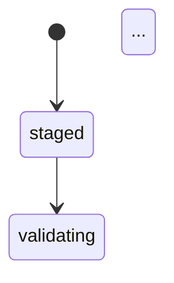

# Phase 5: CI & 1.0 Readiness - Pattern Map

**Mapped:** 2026-04-26
**Files analyzed:** 22 new/modified files
**Analogs found:** 20 / 22

---

## File Classification

| New/Modified File | Role | Data Flow | Closest Analog | Match Quality |
|-------------------|------|-----------|----------------|---------------|
| `lib/rindle/domain/asset_fsm.ex` | service (FSM) | transform | self (modify) | exact |
| `lib/rindle/domain/variant_fsm.ex` | service (FSM) | transform | `lib/rindle/domain/asset_fsm.ex` | exact |
| `lib/rindle/upload/broker.ex` | service | request-response | self (modify) | exact |
| `lib/rindle/delivery.ex` | service | request-response | self (modify) | exact |
| `lib/rindle/workers/cleanup_orphans.ex` | worker | batch | self (modify) | exact |
| `lib/rindle/workers/abort_incomplete_uploads.ex` | worker | batch | `lib/rindle/workers/cleanup_orphans.ex` | exact |
| `lib/rindle/ops/upload_maintenance.ex` | service | batch | self (modify) | exact |
| `test/rindle/contracts/telemetry_contract_test.exs` | test (contract) | event-driven | `test/rindle/contracts/behaviour_contract_test.exs` | role-match |
| `test/adopter/canonical_app/repo.ex` | config (Ecto.Repo) | CRUD | `lib/rindle/repo.ex` | role-match |
| `test/adopter/canonical_app/profile.ex` | config (Profile) | request-response | inline `LocalProfile` in `test/rindle/upload/lifecycle_integration_test.exs` | role-match |
| `test/adopter/canonical_app/lifecycle_test.exs` | test (integration) | request-response | `test/rindle/upload/lifecycle_integration_test.exs` | exact |
| `.github/workflows/ci.yml` | config (CI) | — | self (modify) | exact |
| `.github/workflows/release.yml` | config (CI) | — | `.github/workflows/ci.yml` | role-match |
| `coveralls.json` | config | — | no analog (new) | none |
| `mix.exs` | config | — | self (modify) | exact |
| `guides/getting_started.md` | documentation | — | `README.md` | partial |
| `guides/core_concepts.md` | documentation | — | `README.md` | partial |
| `guides/profiles.md` | documentation | — | `README.md` | partial |
| `guides/secure_delivery.md` | documentation | — | `README.md` | partial |
| `guides/background_processing.md` | documentation | — | `README.md` | partial |
| `guides/operations.md` | documentation | — | `lib/mix/tasks/rindle.cleanup_orphans.ex` (@moduledoc) | partial |
| `guides/troubleshooting.md` | documentation | — | `README.md` | partial |
| `lib/rindle/domain/media_asset.ex` | model | CRUD | self (modify) | exact |
| `lib/rindle/domain/media_attachment.ex` | model | CRUD | `lib/rindle/domain/media_asset.ex` | exact |
| `lib/rindle/domain/media_variant.ex` | model | CRUD | `lib/rindle/domain/media_asset.ex` | exact |
| `lib/rindle/domain/media_upload_session.ex` | model | CRUD | `lib/rindle/domain/media_asset.ex` | exact |
| `lib/rindle/domain/media_processing_run.ex` | model | CRUD | `lib/rindle/domain/media_asset.ex` | exact |
| `lib/rindle/repo.ex` | config (Repo) | — | self (modify) | exact |

---

## Pattern Assignments

### `lib/rindle/domain/asset_fsm.ex` (service/FSM, transform — telemetry backfill)

**Analog:** self — read the file as-is; emission is additive.

**Existing transition function** (`lib/rindle/domain/asset_fsm.ex` lines 33–40):
```elixir
@spec transition(state(), state(), map()) :: :ok | transition_error()
def transition(current_state, target_state, context \\ %{}) do
  if target_state in Map.get(@allowed_transitions, current_state, []) do
    :ok
  else
    log_transition_failure(current_state, target_state, context)
    {:error, {:invalid_transition, current_state, target_state}}
  end
end
```

**Additive emission pattern — copy this shape:**
```elixir
def transition(current_state, target_state, context \\ %{}) do
  if target_state in Map.get(@allowed_transitions, current_state, []) do
    :ok
    |> tap(fn _ ->
      :telemetry.execute(
        [:rindle, :asset, :state_change],
        %{system_time: System.system_time()},
        %{
          profile: Map.get(context, :profile, :unknown),
          adapter: Map.get(context, :adapter, :unknown),
          from: current_state,
          to: target_state
        }
      )
    end)
  else
    log_transition_failure(current_state, target_state, context)
    {:error, {:invalid_transition, current_state, target_state}}
  end
end
```

**Key rules:**
- `tap/2` returns its first argument unchanged — the `:ok` return is not altered.
- Emission fires only on successful transitions (the `if` branch), never on failure.
- `profile` and `adapter` are required metadata keys; use `Map.get(context, :profile, :unknown)` as fallback so the function signature (accepting an arbitrary map) is preserved.
- Do NOT emit inside `Rindle.Repo.transaction()` or `Ecto.Multi` steps — emit after the transaction returns `{:ok, ...}`.
- The existing `require Logger` import at line 3 stays; add nothing to module-level imports — `:telemetry` is already a dep.

---

### `lib/rindle/domain/variant_fsm.ex` (service/FSM, transform — telemetry backfill)

**Analog:** `lib/rindle/domain/asset_fsm.ex` — identical shape, different event name and context keys.

**Existing transition function** (`lib/rindle/domain/variant_fsm.ex` lines 21–27):
```elixir
@spec transition(state(), state(), map()) :: :ok | transition_error()
def transition(current_state, target_state, _context \\ %{}) do
  if target_state in Map.get(@allowed_transitions, current_state, []) do
    :ok
  else
    {:error, {:invalid_transition, current_state, target_state}}
  end
end
```

**Additive emission — rename `_context` to `context` and insert tap:**
```elixir
def transition(current_state, target_state, context \\ %{}) do
  if target_state in Map.get(@allowed_transitions, current_state, []) do
    :ok
    |> tap(fn _ ->
      :telemetry.execute(
        [:rindle, :variant, :state_change],
        %{system_time: System.system_time()},
        %{
          profile: Map.get(context, :profile, :unknown),
          adapter: Map.get(context, :adapter, :unknown),
          from: current_state,
          to: target_state
        }
      )
    end)
  else
    {:error, {:invalid_transition, current_state, target_state}}
  end
end
```

**Note:** VariantFSM currently has no `require Logger` and no `@moduledoc` body — the `@moduledoc` already exists at line 2. No import changes needed for emission.

---

### `lib/rindle/upload/broker.ex` (service, request-response — telemetry backfill)

**Analog:** self — `lib/rindle/upload/broker.ex` lines 16–52 (`initiate_session/2`) and lines 86–118 (`verify_completion/2`).

**Upload start emission site — after `Repo.transaction/1` in `initiate_session/2` returns `{:ok, session}`:**
```elixir
# After the existing Repo.transaction/1 call at lines 30–52, pattern match the result:
case Repo.transaction(fn -> ... end) do
  {:ok, session} ->
    :telemetry.execute(
      [:rindle, :upload, :start],
      %{system_time: System.system_time()},
      %{
        profile: profile_name,
        adapter: profile_module_to_name(profile_module),
        session_id: session.id
      }
    )
    {:ok, session}

  {:error, reason} ->
    {:error, reason}
end
```

**Upload stop emission site — after `Ecto.Multi` / `Repo.transaction/1` in `verify_completion/2` returns `{:ok, %{session: ..., asset: ...}}`:**
```elixir
# Inside the case do block at line 108–112, emit on success:
{:ok, %{session: updated_session, asset: updated_asset}} ->
  :telemetry.execute(
    [:rindle, :upload, :stop],
    %{system_time: System.system_time()},
    %{
      profile: asset.profile,
      adapter: profile_module |> to_string(),
      session_id: updated_session.id,
      asset_id: updated_asset.id
    }
  )
  {:ok, %{session: updated_session, asset: updated_asset}}
```

**Anti-pattern — do NOT emit inside the Multi steps themselves (lines 96–107); emit only in the case branch after `Repo.transaction()` returns.**

---

### `lib/rindle/delivery.ex` (service, request-response — telemetry backfill)

**Analog:** self — `lib/rindle/delivery.ex` lines 28–38 (`url/3`).

**Emission site — inside `url/3` after the `with` resolves successfully:**
```elixir
@spec url(module(), String.t(), keyword()) :: {:ok, String.t()} | {:error, term()}
def url(profile, key, opts \\ []) do
  mode = delivery_mode(profile)
  adapter = profile.storage_adapter()
  subject = %{profile: profile, key: key, mode: mode}

  with :ok <- authorize_delivery(profile, :deliver, subject, opts),
       :ok <- ensure_signed_delivery_support(adapter, mode),
       {:ok, url} <- resolve_url(adapter, key, mode, opts, signed_url_ttl_seconds(profile)) do
    :telemetry.execute(
      [:rindle, :delivery, :signed],
      %{system_time: System.system_time()},
      %{
        profile: profile,
        adapter: adapter,
        mode: mode
      }
    )
    {:ok, url}
  end
end
```

**Note:** Emission is inside the `with` success arm, after `resolve_url` succeeds. The return value `{:ok, url}` is not altered. Public deliveries (`:public` mode) are still delivery events — emit for both modes.

---

### `lib/rindle/workers/cleanup_orphans.ex` (worker, batch — telemetry backfill)

**Analog:** self — `lib/rindle/workers/cleanup_orphans.ex` lines 66–109 (`perform/1`).

**Existing success log pattern** (lines 76–86):
```elixir
{:ok, report} ->
  Logger.info("rindle.workers.cleanup_orphans.completed",
    sessions_found: report.sessions_found,
    ...
    dry_run: dry_run?
  )
  :ok
```

**Additive emission after the existing `Logger.info` call:**
```elixir
{:ok, report} ->
  Logger.info("rindle.workers.cleanup_orphans.completed", ...)
  :telemetry.execute(
    [:rindle, :cleanup, :run],
    %{
      sessions_deleted: report.sessions_deleted,
      objects_deleted: report.objects_deleted
    },
    %{
      profile: :unknown,
      adapter: storage_mod || :unknown,
      dry_run: dry_run?,
      worker: __MODULE__
    }
  )
  :ok
```

**Note:** `storage_mod` is already bound in the `with` arm (line 69). Use it as the `adapter` metadata value. Measurements must be numeric per the locked TEL contract — `sessions_deleted` and `objects_deleted` from the report struct satisfy this.

**Apply the same pattern to `lib/rindle/workers/abort_incomplete_uploads.ex`** (lines 73–90), using `[:rindle, :cleanup, :run]` with `sessions_aborted: report.sessions_aborted` as the measurement.

---

### `lib/rindle/ops/upload_maintenance.ex` (service, batch — telemetry backfill)

**Analog:** `lib/rindle/workers/cleanup_orphans.ex` — same event name `[:rindle, :cleanup, :run]`, emitted from the service layer instead of the worker layer if both fire. Decision: emit at the **worker** layer only (workers are the public-facing cron boundary). The ops service does not emit — this avoids double-counting when a worker calls the service. The planner must confirm this decision; the pattern above covers worker-layer emission.

---

### `test/rindle/contracts/telemetry_contract_test.exs` (test, event-driven)

**Analog:** `test/rindle/contracts/behaviour_contract_test.exs` (lines 1–86)

**Module structure pattern** (lines 1–7 of analog):
```elixir
defmodule Rindle.Contracts.BehaviourContractTest do
  use ExUnit.Case, async: true

  import Mox

  setup :set_mox_from_context
  setup :verify_on_exit!
```

**Telemetry contract diverges from behaviour contract in two ways:**
1. Tag is `:contract` not a default (behavior contract has no tag).
2. Uses `:telemetry_test.attach_event_handlers/2` not Mox.
3. Must be `async: false` — telemetry handlers are process-local but the global telemetry table is shared; concurrent attachment with the same event names in different test processes can cause collisions.

**Copy this module shell:**
```elixir
defmodule Rindle.Contracts.TelemetryContractTest do
  use ExUnit.Case, async: false
  @moduletag :contract

  @public_events [
    [:rindle, :upload, :start],
    [:rindle, :upload, :stop],
    [:rindle, :asset, :state_change],
    [:rindle, :variant, :state_change],
    [:rindle, :delivery, :signed],
    [:rindle, :cleanup, :run]
  ]

  setup do
    ref = :telemetry_test.attach_event_handlers(self(), @public_events)
    on_exit(fn -> :telemetry.detach(ref) end)
    {:ok, ref: ref}
  end
```

**Assertion pattern — copy from RESEARCH.md Pattern 3:**
```elixir
test "asset state change emits telemetry with required metadata", %{ref: ref} do
  Rindle.Domain.AssetFSM.transition("staged", "validating", %{
    profile: "TestProfile",
    adapter: SomeAdapter
  })
  assert_received {[:rindle, :asset, :state_change], ^ref, measurements, metadata}
  assert is_integer(measurements.system_time)
  assert Map.has_key?(metadata, :profile)
  assert Map.has_key?(metadata, :adapter)
end
```

**`assert_received` vs `assert_receive`:** Use `assert_received` (no timeout) for FSM and delivery calls that are synchronous in-process. Use `assert_receive` with a short timeout only if an emission is dispatched via an async process (not applicable here).

**Detach in `on_exit`:** Already shown above — critical to prevent handler leaks across test runs.

---

### `test/adopter/canonical_app/repo.ex` (config, CRUD)

**Analog:** `lib/rindle/repo.ex` (lines 1–5)

**Existing Repo** (`lib/rindle/repo.ex` lines 1–5):
```elixir
defmodule Rindle.Repo do
  use Ecto.Repo,
    otp_app: :rindle,
    adapter: Ecto.Adapters.Postgres
end
```

**Adopter Repo — copy this shape with a distinct module name:**
```elixir
defmodule Rindle.Adopter.CanonicalApp.Repo do
  @moduledoc false

  use Ecto.Repo,
    otp_app: :rindle,
    adapter: Ecto.Adapters.Postgres
end
```

**`otp_app: :rindle`** is intentional — the adopter test fixture lives inside the `:rindle` OTP app (in-repo fixture). The config key that distinguishes this Repo's pool is the module name itself, not a different OTP app.

---

### `test/adopter/canonical_app/profile.ex` (config, request-response)

**Analog:** Inline `LocalProfile` module from `test/rindle/upload/lifecycle_integration_test.exs` (lines 15–21):

```elixir
defmodule LocalProfile do
  use Rindle.Profile,
    storage: Rindle.Storage.Local,
    variants: [thumb: [mode: :fit, width: 8, height: 8]],
    allow_mime: ["image/png"],
    max_bytes: 10_485_760
end
```

**Adopter profile — extract this inline module into a standalone file, use `Rindle.Storage.S3` (or parametric) for MinIO lane:**
```elixir
defmodule Rindle.Adopter.CanonicalApp.Profile do
  @moduledoc false

  use Rindle.Profile,
    storage: Rindle.Storage.S3,
    variants: [thumb: [mode: :fit, width: 64, height: 64]],
    allow_mime: ["image/png", "image/jpeg"],
    max_bytes: 10_485_760
end
```

**Note:** Planner should decide whether to use `Rindle.Storage.Local` (no MinIO required) for a unit-speed adopter test, or `Rindle.Storage.S3` pointed at MinIO (validates the full adopter path). The pattern for either is identical — only the `storage:` key changes.

---

### `test/adopter/canonical_app/lifecycle_test.exs` (test, integration)

**Analog:** `test/rindle/upload/lifecycle_integration_test.exs` (lines 1–179) — exact same lifecycle sequence.

**Module and tag pattern** (lines 1–8 of analog):
```elixir
defmodule Rindle.Upload.LifecycleIntegrationTest do
  use Rindle.DataCase, async: false
  use Oban.Testing, repo: Rindle.Repo
  ...
  @tag :integration
  test "proxied upload promotes the asset and generates a ready variant", %{root: root} do
```

**Adopter test diverges in:**
1. Tag: `@moduletag :adopter` (not `:integration`).
2. Uses `Rindle.Adopter.CanonicalApp.Profile` (defined in `profile.ex`).
3. Adds an explicit `TODO` comment marking the `Rindle.Repo` hard-coding as a documented gap per D-09.
4. `use Rindle.DataCase` — reuse the existing test support module; the adopter test is still in-repo and can reference test support.

**Setup block pattern** (lines 27–46 of analog):
```elixir
setup do
  root =
    Path.join(System.tmp_dir!(), "rindle-adopter-#{System.unique_integer([:positive])}")
  File.mkdir_p!(root)
  previous_local = Application.get_env(:rindle, Rindle.Storage.Local)
  Application.put_env(:rindle, Rindle.Storage.Local, root: root)
  on_exit(fn ->
    case previous_local do
      nil -> Application.delete_env(:rindle, Rindle.Storage.Local)
      value -> Application.put_env(:rindle, Rindle.Storage.Local, value)
    end
    File.rm_rf(root)
  end)
  {:ok, root: root}
end
```

**Oban job execution pattern** (line 97 of analog):
```elixir
assert :ok = perform_job(PromoteAsset, %{"asset_id" => asset.id})
```

---

### `.github/workflows/ci.yml` (config, CI — extend existing)

**Analog:** self — full file read above (lines 1–190).

**Step ordering in quality job — insert libvips before `mix deps.get` (currently line 73):**
```yaml
- name: Install libvips
  run: sudo apt-get install -y libvips-dev

- name: Install dependencies
  run: mix deps.get
```

**Replace `mix test` step (currently lines 84–85) with coveralls:**
```yaml
- name: Run tests with coverage
  run: mix coveralls
```

**New `contract` job — copy the quality job header, strip service containers (no Postgres needed for contract tests), add `needs: quality`:**
```yaml
contract:
  name: Contract
  runs-on: ubuntu-latest
  needs: quality
  steps:
    - uses: actions/checkout@v4
    - uses: erlef/setup-beam@v1
      with:
        elixir-version: "1.17"
        otp-version: "27"
    - uses: actions/cache@v4
      with:
        path: deps
        key: deps-${{ runner.os }}-1.17-27-${{ hashFiles('**/mix.lock') }}
        restore-keys: deps-${{ runner.os }}-1.17-27-
    - run: mix deps.get
    - run: mix compile
    - name: Run contract tests
      run: mix test --only contract
```

**New `adopter` job — copy the integration job block verbatim, replace the final `Run integration tests` step, and add `needs: [contract, integration]`:**
```yaml
adopter:
  name: Adopter
  runs-on: ubuntu-latest
  needs: [contract, integration]
  # ... same env, services (postgres), MinIO steps as integration job ...
  steps:
    # ... same as integration job through "Create MinIO bucket" ...
    - name: Run adopter tests
      run: mix test test/adopter/canonical_app/lifecycle_test.exs --only adopter
```

**`integration` job `needs` field** — currently `needs: quality` (line 109). No change required; `adopter` job will `needs: [contract, integration]`.

---

### `.github/workflows/release.yml` (config, CI — new file)

**Analog:** `.github/workflows/ci.yml` jobs structure.

**Trigger + job pattern** (from RESEARCH.md Pattern 6):
```yaml
name: Release

on:
  workflow_dispatch:
  push:
    tags:
      - "v*"

jobs:
  release:
    name: Release Check
    runs-on: ubuntu-latest
    steps:
      - uses: actions/checkout@v4
      - uses: erlef/setup-beam@v1
        with:
          elixir-version: "1.17"
          otp-version: "27"
      - uses: actions/cache@v4
        with:
          path: deps
          key: deps-${{ runner.os }}-1.17-27-${{ hashFiles('**/mix.lock') }}
          restore-keys: deps-${{ runner.os }}-1.17-27-
      - run: mix deps.get
      - name: Dry-run publish
        run: mix hex.publish --dry-run
      - name: Build and inspect artifact
        run: |
          mix hex.build --unpack
          ls rindle-*/lib/rindle.ex
          ls rindle-*/mix.exs
          ls rindle-*/README.md
          ! test -e rindle-*/_build
          ! test -e rindle-*/.planning
          ! test -e rindle-*/priv/plts
```

**Note:** No PLT cache, no Postgres, no MinIO — release lane only needs mix + hex tooling. No `MIX_ENV: test` override needed since `mix hex.build` runs in the default env.

---

### `coveralls.json` (config — new file, no analog)

**Source pattern:** RESEARCH.md Pattern 1 (fully verified against excoveralls docs):
```json
{
  "coverage_options": {
    "minimum_coverage": 80
  },
  "skip_files": [
    "test/support",
    "test/adopter",
    "lib/rindle/repo.ex",
    "lib/rindle/application.ex",
    "priv/repo/migrations"
  ]
}
```

**Placed at repo root** — excoveralls reads it automatically with no config needed in `mix.exs` beyond `test_coverage: [tool: ExCoveralls]`.

---

### `mix.exs` (config — modify existing)

**Analog:** self — `mix.exs` lines 1–104.

**`project/0` additions** (insert after existing keys in `def project do` block, lines 7–25):
```elixir
test_coverage: [tool: ExCoveralls],
preferred_cli_env: [
  coveralls: :test,
  "coveralls.detail": :test,
  "coveralls.html": :test,
  "coveralls.json": :test
]
```

**`deps/0` additions** (after existing `:ex_doc` entry at line 73):
```elixir
{:excoveralls, "~> 0.18", only: [:test, :dev], runtime: false}
```

Also bump the existing `ex_doc` constraint from `"~> 0.34"` to `"~> 0.40"` to gain `groups_for_extras:` and `before_closing_head_tag:` support.

**`docs/0` replacement** (currently lines 77–85):
```elixir
defp docs do
  [
    main: "Rindle",
    source_url: @source_url,
    extras: [
      "README.md",
      "guides/getting_started.md",
      "guides/core_concepts.md",
      "guides/profiles.md",
      "guides/secure_delivery.md",
      "guides/background_processing.md",
      "guides/operations.md",
      "guides/troubleshooting.md"
    ],
    groups_for_extras: [
      Guides: ~r/guides\/.*/
    ],
    before_closing_head_tag: &before_closing_head_tag/1
  ]
end

defp before_closing_head_tag(:html) do
  """
  <script defer src="https://cdn.jsdelivr.net/npm/mermaid@10.2.3/dist/mermaid.min.js"></script>
  <script>
    let initialized = false;
    window.addEventListener("exdoc:loaded", () => {
      if (!initialized) {
        mermaid.initialize({
          startOnLoad: false,
          theme: document.body.className.includes("dark") ? "dark" : "default"
        });
        initialized = true;
      }
      let id = 0;
      for (const codeEl of document.querySelectorAll("pre code.mermaid")) {
        const preEl = codeEl.parentElement;
        const graphDefinition = codeEl.textContent;
        const graphEl = document.createElement("div");
        const graphId = "mermaid-graph-" + id++;
        mermaid.render(graphId, graphDefinition).then(({svg, bindFunctions}) => {
          graphEl.innerHTML = svg;
          bindFunctions?.(graphEl);
          preEl.insertAdjacentElement("afterend", graphEl);
          preEl.remove();
        });
      }
    });
  </script>
  """
end

defp before_closing_head_tag(:epub), do: ""
```

**`package/0` addition** (currently lines 87–92) — add `files:` allowlist:
```elixir
defp package do
  [
    licenses: ["MIT"],
    links: %{"GitHub" => @source_url},
    files: ~w(lib priv/repo/migrations mix.exs README.md LICENSE)
  ]
end
```

---

### `guides/*.md` (documentation — 7 new files)

**Analog:** `README.md` for structure; `lib/mix/tasks/rindle.cleanup_orphans.ex` `@moduledoc` for `guides/operations.md` cross-linking style.

**Mix task @moduledoc style to follow for operations.md** (`lib/mix/tasks/rindle.cleanup_orphans.ex` lines 1–57):
- Section headers: `## Usage`, `## Options`, `## Examples`, `## Safety default`, `## Notes`.
- Code blocks are fenced with `mix` or `elixir` language tags.
- No marketing prose — factual, operator-facing.

**ExDoc `extras:` requirement:** Every guide file must be listed explicitly in `mix.exs docs/0`. Do NOT use a glob.

**DOC-01 constraint (D-16):** The code snippet in `guides/getting_started.md` that shows the upload → promote → variant → signed URL lifecycle must be the **exact same code path** as `test/adopter/canonical_app/lifecycle_test.exs`. These two files must be authored together; if they diverge, the adopter lane fails.

**Mermaid diagram format for `guides/core_concepts.md`:** Use fenced code blocks with `mermaid` language tag:
````

````

---

### DOC-08: `@moduledoc` audit — domain schema models

**Analog:** `lib/rindle/domain/asset_fsm.ex` line 2 — the FSM modules already carry full `@moduledoc` blocks documenting states. Domain schema modules currently have none.

**Current state — all five domain schema modules** follow this pattern (shown for `media_asset.ex` lines 1–58):
```elixir
defmodule Rindle.Domain.MediaAsset do
  use Ecto.Schema
  import Ecto.Changeset
  # ... no @moduledoc
```

**Target pattern — add `@moduledoc` immediately after `defmodule`, before `use`:**
```elixir
defmodule Rindle.Domain.MediaAsset do
  @moduledoc """
  Ecto schema for a media asset.

  A `MediaAsset` represents a single uploaded file moving through the
  `Rindle.Domain.AssetFSM` lifecycle.

  ## States

  | State | Meaning |
  |-------|---------|
  | `"staged"` | Reserved slot; upload has not been verified. |
  | `"validating"` | Upload verified; MIME scan in progress. |
  | `"analyzing"` | Dimensions / metadata extraction in progress. |
  | `"promoting"` | Promotion job running. |
  | `"available"` | Ready for variant processing and delivery. |
  | `"processing"` | One or more variant jobs running. |
  | `"ready"` | All configured variants generated. |
  | `"degraded"` | One or more variants failed; original still deliverable. |
  | `"quarantined"` | MIME mismatch or scan failure; not deliverable. |
  | `"deleted"` | Soft-deleted; storage object may already be purged. |

  See `Rindle.Domain.AssetFSM` for valid state transitions.
  """

  use Ecto.Schema
  ...
```

**Apply the same `@moduledoc` structure to all five modules** (`media_asset`, `media_attachment`, `media_variant`, `media_upload_session`, `media_processing_run`):
- List the `@states` module attribute values as a table.
- Reference the paired FSM module (`AssetFSM`, `VariantFSM`, etc.) where applicable.
- `MediaAttachment` has no FSM — document what it represents (ownership record linking an asset to an owning entity + slot).

**`lib/rindle/repo.ex` — add `@moduledoc false`:**
```elixir
defmodule Rindle.Repo do
  @moduledoc false

  use Ecto.Repo,
    otp_app: :rindle,
    adapter: Ecto.Adapters.Postgres
end
```

---

## Shared Patterns

### Telemetry Emission (additive)
**Source:** RESEARCH.md Pattern 2; locked Phase 3 contract in `03-CONTEXT.md` D-07/D-08/D-09.
**Apply to:** All 5–6 emission sites (`asset_fsm.ex`, `variant_fsm.ex`, `broker.ex`, `delivery.ex`, `cleanup_orphans.ex`, `abort_incomplete_uploads.ex`).

Rules that apply to every emission site:
1. Event name is a list of atoms: `[:rindle, <domain>, <event>]`.
2. Measurements map: all values must be numeric (integer or float). `System.system_time()` returns an integer.
3. Metadata map: must include `profile:` and `adapter:` keys. Use `:unknown` as fallback atom, not `nil`.
4. Emit AFTER any `Repo.transaction()` or `Ecto.Multi` pipeline returns `{:ok, ...}` — never inside a Multi step.
5. Use `tap/2` to insert emission without altering the return value when the emission follows an `:ok` return.

### Tagged ExUnit Lane Pattern
**Source:** `test/rindle/storage/storage_adapter_test.exs` (`:minio` tag, lines 76–78); `test/rindle/upload/lifecycle_integration_test.exs` (`:integration` tag, line 58).
**Apply to:** `telemetry_contract_test.exs` (`:contract`), `lifecycle_test.exs` (`:adopter`).

```elixir
# Module-level tag (applies to all tests in file):
@moduletag :contract    # or :adopter

# Per-test tag (older pattern — prefer @moduletag for whole-file lanes):
@tag :integration
test "..." do
```

CI command per lane:
- `:contract` — `mix test --only contract`
- `:adopter` — `mix test --only adopter`
- `:integration` — `mix test --include integration` (existing pattern in `ci.yml` line 188)

Note: `--only` excludes all tests not tagged with the given tag. `--include` includes the tag in addition to untagged tests. The integration lane uses `--include` on a specific file path; the contract and adopter lanes use `--only` on module-tagged test files. Either pattern is valid.

### `String.to_existing_atom/1` for module resolution
**Source:** `lib/rindle/upload/broker.ex` lines 124–127; `lib/rindle/workers/cleanup_orphans.ex` lines 115–136; `lib/mix/tasks/rindle.cleanup_orphans.ex` lines 116–143.
**Apply to:** Any new fixture code that resolves a module name from a string (adopter test helpers, CI fixture profile loading).

```elixir
# Always use to_existing_atom/1, never String.to_atom/1
defp profile_name_to_module(name) do
  String.to_existing_atom(name)
rescue
  _ -> nil
end
```

### Oban.Worker pattern for cleanup workers
**Source:** `lib/rindle/workers/cleanup_orphans.ex` lines 59–109.

```elixir
use Oban.Worker, queue: :rindle_maintenance, max_attempts: 3

@impl Oban.Worker
def perform(%Oban.Job{args: args}) do
  # 1. Resolve any runtime inputs from args
  # 2. Call service layer (UploadMaintenance, etc.)
  # 3. On {:ok, report} — Logger.info + return :ok
  # 4. On {:error, reason} — Logger.error + return {:error, reason}
end
```

Workers are thin — no business logic. All logic lives in the `Ops.*` service layer.

---

## No Analog Found

| File | Role | Data Flow | Reason |
|------|------|-----------|--------|
| `coveralls.json` | config | — | No coverage configuration exists in this repo today; pattern is fully specified in RESEARCH.md Pattern 1 |
| `lib/rindle/workers/metadata_backfill.ex` | worker | batch | File does not exist at path referenced in `ls` output — planner should verify whether this is a planned file or a stale reference |
| `lib/rindle/workers/variant_maintenance.ex` | worker | batch | File does not exist at path referenced in workers dir listing — same verification needed |

---

## Metadata

**Analog search scope:** `lib/rindle/`, `test/rindle/`, `.github/workflows/`, `mix.exs`
**Files scanned:** 18 source files read
**Pattern extraction date:** 2026-04-26
