# Phase 7: Multipart Uploads - Research

**Researched:** 2026-04-28
**Domain:** Elixir direct-upload orchestration, S3 multipart semantics, adopter-owned runtime maintenance
**Confidence:** HIGH

<user_constraints>
## User Constraints (from CONTEXT.md)

### Locked Decisions
### Runtime and flow ownership
- **D-01:** Multipart support extends the existing direct-upload broker/runtime boundary instead of introducing a separate upload subsystem. The broker remains the orchestration point for session creation, storage handoff, completion, and verification.
- **D-02:** Multipart persistence and follow-up job behavior must stay on the Phase 6 adopter-owned runtime Repo seam via `Rindle.Config.repo/0`; Phase 7 must not reintroduce `Rindle.Repo` assumptions anywhere in broker, maintenance, or worker paths.

### Capability and adapter contract
- **D-03:** Multipart is capability-gated. Adapters must explicitly advertise multipart support before any multipart flow is offered, and unsupported adapters return a tagged capability error instead of falling through to storage-specific runtime failures.
- **D-04:** The capability model stays additive to the current `capabilities/0` contract so existing presigned PUT support remains intact and future provider-specific upload modes can compose onto the same honesty boundary.

### Verification and promotion path
- **D-05:** Multipart completion must converge back into the same trusted verification and promotion lane as the current presigned PUT flow. Completing remote parts is not itself a trust boundary; promotion still happens only after server-side completion verification.
- **D-06:** Multipart support is additive, not a replacement. Existing `presigned_put`-based direct uploads remain supported and planner work should avoid refactoring them into a different contract unless required by shared abstractions.

### Session lifecycle and maintenance
- **D-07:** Multipart state should build on the existing upload-session lifecycle rather than bypass it. Any new multipart metadata or part-tracking records must still leave `media_upload_sessions` as the authoritative session-level state machine visible to maintenance flows.
- **D-08:** Abandoned multipart uploads extend the existing two-step maintenance lane: timed-out sessions are first marked terminal by maintenance logic, then storage cleanup/abort work removes remote multipart residue without hiding storage I/O inside database transactions.

### Testing and provider proof
- **D-09:** Multipart support needs both unit/contract coverage and a real S3-compatible integration proof, following the existing MinIO-backed adopter/integration testing patterns already used for direct upload and storage behavior.

### Claude's Discretion
- Exact internal schema split for multipart-specific metadata or part manifests, as long as public lifecycle ownership stays with the existing broker/session boundary.
- Exact public function names and payload field names for multipart initiation/part-signing/completion, as long as the contract stays tagged-tuple based and capability-honest.
- Exact TTL defaults, part-size defaults, and maintenance batching strategy, as long as they remain production-safe and do not weaken verification or cleanup guarantees.

### Deferred Ideas (OUT OF SCOPE)
- Broad non-S3 multipart parity remains out of scope for v1.1 per `.planning/REQUIREMENTS.md`; Phase 7 should focus on the S3-compatible path and explicit unsupported behavior elsewhere.
- Future GCS resumable/tus-style flows remain deferred; Phase 7 should keep capability contracts extensible without taking on those protocols now.
</user_constraints>

<phase_requirements>
## Phase Requirements

| ID | Description | Research Support |
|----|-------------|------------------|
| MULT-01 | User can initiate an S3 multipart upload session when the selected storage adapter advertises multipart capability | Add broker-owned initiation plus S3 adapter wrappers over `initiate_multipart_upload` and presigned part URLs; gate entry with `capabilities/0`. [VERIFIED: .planning/REQUIREMENTS.md] [VERIFIED: lib/rindle/upload/broker.ex] [VERIFIED: lib/rindle/storage.ex] [VERIFIED: deps/ex_aws_s3/lib/ex_aws/s3.ex] |
| MULT-02 | User can upload parts, complete the multipart upload, and verify completion before promotion proceeds | Persist the server-issued `upload_id` and authoritative `{part_number, etag}` manifest, call `complete_multipart_upload`, then reuse `Broker.verify_completion/2` for promotion. [VERIFIED: .planning/REQUIREMENTS.md] [VERIFIED: lib/rindle/upload/broker.ex] [CITED: https://docs.aws.amazon.com/AmazonS3/latest/API/API_CompleteMultipartUpload.html] [CITED: https://docs.aws.amazon.com/AmazonS3/latest/userguide/mpuoverview.html] |
| MULT-03 | Timed-out or abandoned multipart uploads can be aborted by maintenance flows to prevent orphaned storage costs | Extend the existing `expired -> cleanup` lane so cleanup aborts remote multipart uploads before deleting session rows, and keep retries possible when storage abort fails. [VERIFIED: .planning/REQUIREMENTS.md] [VERIFIED: lib/rindle/ops/upload_maintenance.ex] [VERIFIED: lib/rindle/workers/abort_incomplete_uploads.ex] [CITED: https://docs.aws.amazon.com/AmazonS3/latest/API/API_AbortMultipartUpload.html] |
| MULT-04 | Requesting multipart upload on an adapter without multipart capability returns a tagged unsupported-capability error | Reuse the existing delivery-style capability gate pattern and return a tagged multipart capability error before any adapter-specific call. [VERIFIED: .planning/REQUIREMENTS.md] [VERIFIED: lib/rindle/delivery.ex] [VERIFIED: test/rindle/delivery_test.exs] |
</phase_requirements>

## Summary

Phase 7 should be planned as an extension of the existing broker-owned direct-upload system, not as a parallel upload subsystem. The current code already centralizes direct-upload lifecycle entrypoints in `Rindle.Upload.Broker`, persists session authority in `media_upload_sessions`, and routes promotion through `verify_completion/2`; that makes broker-owned multipart initiation, part signing, completion, and post-complete verification the lowest-churn shape. [VERIFIED: lib/rindle/upload/broker.ex] [VERIFIED: lib/rindle/domain/media_upload_session.ex] [VERIFIED: .planning/phases/07-multipart-uploads/07-CONTEXT.md]

The highest-value planning insight is that multipart support is not only adapter work. AWS requires the server to remember the multipart `upload_id` and the per-part `{PartNumber, ETag}` values used for `CompleteMultipartUpload`, and AWS explicitly recommends maintaining your own part list rather than depending on listing APIs for completion. That pushes Phase 7 toward persisted multipart metadata under the existing upload-session lifecycle, plus maintenance logic that can abort timed-out uploads without doing storage I/O inside a transaction. [CITED: https://docs.aws.amazon.com/AmazonS3/latest/API/API_CompleteMultipartUpload.html] [CITED: https://docs.aws.amazon.com/AmazonS3/latest/userguide/mpuoverview.html] [VERIFIED: lib/rindle/ops/upload_maintenance.ex]

There is also a pre-existing seam issue the planner should absorb explicitly: `Rindle.Ops.UploadMaintenance` still aliases `Rindle.Repo`, while Phase 7 context locks maintenance onto `Rindle.Config.repo/0`. If the plan treats multipart as “new API only,” it will miss the adopter-owned maintenance boundary required by D-02 and D-08. [VERIFIED: lib/rindle/ops/upload_maintenance.ex] [VERIFIED: .planning/phases/07-multipart-uploads/07-CONTEXT.md]

**Primary recommendation:** Implement multipart as four coupled workstreams: broker/session persistence, S3 adapter primitives plus capability gating, cleanup/abort on the runtime repo seam, and MinIO-backed end-to-end proof that completes and aborts real multipart uploads. [VERIFIED: lib/rindle/upload/broker.ex] [VERIFIED: lib/rindle/storage/s3.ex] [VERIFIED: test/adopter/canonical_app/lifecycle_test.exs] [CITED: https://docs.aws.amazon.com/AmazonS3/latest/userguide/abort-mpu.html]

## Architectural Responsibility Map

| Capability | Primary Tier | Secondary Tier | Rationale |
|------------|-------------|----------------|-----------|
| Multipart session initiation | API / Backend | Database / Storage | The broker creates the staged asset + upload session transactionally and only then asks storage for multipart bootstrap data. [VERIFIED: lib/rindle/upload/broker.ex] |
| Per-part upload URL signing | API / Backend | Storage | Clients should upload bytes directly to S3-compatible storage, but the server must sign each `UploadPart` request with the correct `uploadId` and `partNumber`. [CITED: https://hexdocs.pm/ex_aws_s3/ExAws.S3.html] [CITED: https://docs.aws.amazon.com/AmazonS3/latest/API/API_UploadPart.html] |
| Part upload byte transfer | Browser / Client | Storage | Rindle’s current direct-upload design already keeps file bytes off the app server; multipart should preserve that property. [VERIFIED: test/adopter/canonical_app/lifecycle_test.exs] |
| Multipart completion request | API / Backend | Storage | The server must submit the ordered part manifest to `CompleteMultipartUpload` and then drive verification/promotion. [CITED: https://docs.aws.amazon.com/AmazonS3/latest/API/API_CompleteMultipartUpload.html] [VERIFIED: lib/rindle/upload/broker.ex] |
| Verification and promotion | API / Backend | Database / Storage | Trust still enters at `verify_completion/2`, which reads storage metadata, advances FSM state, and enqueues promotion. [VERIFIED: lib/rindle/upload/broker.ex] |
| Abandonment detection and expiry | API / Backend | Database / Storage | Existing maintenance logic already owns timeout detection and terminal-state transitions. [VERIFIED: lib/rindle/ops/upload_maintenance.ex] [VERIFIED: lib/rindle/workers/abort_incomplete_uploads.ex] |
| Remote multipart abort and cleanup retry | Storage | API / Backend | S3-compatible storage performs the abort, but the app owns retry policy, reporting, and row retention when abort fails. [CITED: https://docs.aws.amazon.com/AmazonS3/latest/API/API_AbortMultipartUpload.html] [VERIFIED: lib/rindle/ops/upload_maintenance.ex] |

## Standard Stack

### Core

| Library / Module | Version | Purpose | Why Standard |
|------------------|---------|---------|--------------|
| `Rindle.Upload.Broker` | repo code surface, no new dep [VERIFIED: lib/rindle/upload/broker.ex] | Existing orchestration point for direct-upload session creation, signing, verification, telemetry, and promotion. [VERIFIED: lib/rindle/upload/broker.ex] | Locked by D-01 and already proven in broker/adopter tests, so multipart should extend it rather than fork it. [VERIFIED: .planning/phases/07-multipart-uploads/07-CONTEXT.md] [VERIFIED: test/rindle/upload/broker_test.exs] |
| `Rindle.Domain.MediaUploadSession` + `UploadSessionFSM` | repo code surface [VERIFIED: lib/rindle/domain/media_upload_session.ex] | Authoritative session row and lifecycle FSM for direct uploads. [VERIFIED: lib/rindle/domain/media_upload_session.ex] [VERIFIED: lib/rindle/domain/upload_session_fsm.ex] | D-07 locks session authority here; planner should extend this lifecycle instead of inventing a separate multipart state machine. [VERIFIED: .planning/phases/07-multipart-uploads/07-CONTEXT.md] |
| `ExAws.S3` / `ex_aws_s3` | `2.5.9` [VERIFIED: deps/ex_aws_s3/mix.exs] [CITED: https://hexdocs.pm/ex_aws_s3/ExAws.S3.html] | Existing S3 client already exposes `initiate_multipart_upload`, `upload_part`, `complete_multipart_upload`, `abort_multipart_upload`, `list_parts`, and `list_multipart_uploads`. [VERIFIED: deps/ex_aws_s3/lib/ex_aws/s3.ex] | No new S3 client is needed; Phase 7 should wrap these primitives in the storage adapter seam. [VERIFIED: deps/ex_aws_s3/lib/ex_aws/s3.ex] |
| `Ecto.Multi` / `ecto` | `3.13.5` [VERIFIED: deps/ecto/mix.exs] [CITED: https://hexdocs.pm/ecto/Ecto.Multi.html] | Transactional persistence for asset/session state changes and job enqueueing. [VERIFIED: lib/rindle/upload/broker.ex] | Existing verification already uses `Ecto.Multi`; multipart completion should persist local state with the same transaction style after remote complete succeeds. [VERIFIED: lib/rindle/upload/broker.ex] |
| `Oban` | `2.21.1` [VERIFIED: deps/oban/mix.exs] | Existing maintenance and promotion job backend. [VERIFIED: lib/rindle/workers/abort_incomplete_uploads.ex] | Project constraint locks background work onto Oban instead of a parallel runner. [VERIFIED: .planning/PROJECT.md] |

### Supporting

| Library / Module | Version | Purpose | When to Use |
|------------------|---------|---------|-------------|
| `Rindle.Storage` capability seam | repo code surface [VERIFIED: lib/rindle/storage.ex] | Behavior boundary for adapter honesty and multipart capability gating. [VERIFIED: lib/rindle/storage.ex] | Use for all adopter-facing multipart operations so unsupported adapters fail early with tagged errors. [VERIFIED: lib/rindle/delivery.ex] |
| `ExAws.S3.presigned_url/5` | `2.5.9` docs/source [CITED: https://hexdocs.pm/ex_aws_s3/ExAws.S3.html] | Generates signed `UploadPart` URLs with signed query params like `uploadId` and `partNumber`. [CITED: https://hexdocs.pm/ex_aws_s3/ExAws.S3.html] | Use for browser/client part uploads instead of proxying bytes through Rindle. [VERIFIED: test/adopter/canonical_app/lifecycle_test.exs] |
| Existing MinIO adopter lane | repo test harness [VERIFIED: test/adopter/canonical_app/lifecycle_test.exs] | Real S3-compatible proof path for direct upload behavior. [VERIFIED: test/adopter/canonical_app/lifecycle_test.exs] | Extend it to multipart completion and abort flows instead of creating a separate harness. [VERIFIED: .planning/phases/07-multipart-uploads/07-CONTEXT.md] |

### Alternatives Considered

| Instead of | Could Use | Tradeoff |
|------------|-----------|----------|
| Persisting the authoritative part manifest in Rindle | Rely on `ListParts` during completion | AWS explicitly warns to maintain your own part-number/ETag list for completion; listing is for verification, not authority. [CITED: https://docs.aws.amazon.com/AmazonS3/latest/userguide/mpuoverview.html] |
| Extending `media_upload_sessions` authority | A separate multipart-only table or subsystem as the public source of truth | That would violate D-01 and D-07 by splitting lifecycle ownership away from the existing upload-session boundary. [VERIFIED: .planning/phases/07-multipart-uploads/07-CONTEXT.md] |
| Using `ExAws.S3` multipart primitives | Hand-built SigV4 URLs, raw XML, and raw abort/list requests | The project already depends on ExAws S3 and its multipart API surface, so custom signing/parsing would add risk without leverage. [VERIFIED: deps/ex_aws_s3/lib/ex_aws/s3.ex] [CITED: https://hexdocs.pm/ex_aws_s3/ExAws.S3.html] |

**Installation:** No new Mix dependencies are required for Phase 7; the needed S3, Ecto, and Oban primitives are already present in the repo. [VERIFIED: mix.exs] [VERIFIED: deps/ex_aws_s3/lib/ex_aws/s3.ex]

**Version verification:** `ecto` is `3.13.5`, `ex_aws_s3` is `2.5.9`, and `oban` is `2.21.1` in the installed dependency sources on 2026-04-28. [VERIFIED: deps/ecto/mix.exs] [VERIFIED: deps/ex_aws_s3/mix.exs] [VERIFIED: deps/oban/mix.exs]

## Architecture Patterns

### System Architecture Diagram

```mermaid
flowchart LR
  A[Client asks for multipart session] --> B[Broker initiate multipart]
  B --> C[(Repo transaction: staged asset + upload session + multipart metadata)]
  B --> D[S3 adapter capability gate]
  D -->|supports multipart| E[S3 CreateMultipartUpload]
  D -->|unsupported| X[tagged capability error]
  E --> F[Return upload_id, key, part_size policy]
  F --> G[Client asks for signed part URLs]
  G --> H[Broker signs UploadPart URLs]
  H --> I[S3 presigned UploadPart URLs]
  I --> J[Client uploads parts directly to storage]
  J --> K[Client reports uploaded part ETags]
  K --> L[(Repo persists authoritative part manifest)]
  L --> M[Client requests completion]
  M --> N[Broker calls CompleteMultipartUpload]
  N --> O[Broker verify_completion/head]
  O --> P[(Repo transaction: session completed, asset validating, enqueue PromoteAsset)]
  P --> Q[Existing promotion pipeline]
  C --> R[Maintenance worker scans expired sessions]
  R --> S[Mark terminal on runtime repo seam]
  S --> T[Cleanup service aborts remote multipart]
  T --> U[(Delete session row only after abort success or not_found)]
```



### Recommended Project Structure

```text
lib/rindle/
├── upload/
│   └── broker.ex                  # add multipart entrypoints beside current direct-upload flow
├── storage/
│   ├── ex                        # extend behaviour with multipart callbacks/capability helpers
│   ├── s3.ex                     # wrap ExAws multipart primitives + presigned UploadPart URLs
│   └── local.ex                  # explicit unsupported multipart behavior
├── domain/
│   ├── media_upload_session.ex   # persist multipart identifiers / authority
│   └── upload_session_fsm.ex     # extend lifecycle only if a new state is truly needed
├── ops/
│   └── upload_maintenance.ex     # runtime-repo seam + remote multipart abort
└── workers/
    └── abort_incomplete_uploads.ex # unchanged job shape; widened behavior through service
```

### Pattern 1: Broker-Orchestrated Multipart Session

**What:** Keep all adopter-facing multipart lifecycle entrypoints in `Rindle.Upload.Broker` and persist multipart authority on the same upload-session lane as presigned PUT. [VERIFIED: lib/rindle/upload/broker.ex] [VERIFIED: .planning/phases/07-multipart-uploads/07-CONTEXT.md]

**When to use:** Use for initiation, part-URL signing, part-manifest recording, completion, and verification. Do not expose adapter calls directly from controllers or LiveViews. [VERIFIED: .planning/phases/07-multipart-uploads/07-CONTEXT.md]

**Example:**

```elixir
# Source: existing broker verification pattern +
# https://docs.aws.amazon.com/AmazonS3/latest/API/API_CompleteMultipartUpload.html
with %MediaUploadSession{} = session <- repo.get(MediaUploadSession, session_id),
     {:ok, manifest} <- multipart_manifest_for(session),
     {:ok, _remote} <- adapter.complete_multipart(session.upload_key, session.multipart_upload_id, manifest, opts) do
  verify_completion(session.id, opts)
end
```

### Pattern 2: Server-Signed UploadPart URLs With Client-Owned Bytes

**What:** The server should sign each `UploadPart` request while the client uploads bytes directly to storage. [CITED: https://hexdocs.pm/ex_aws_s3/ExAws.S3.html] [CITED: https://docs.aws.amazon.com/AmazonS3/latest/API/API_UploadPart.html]

**When to use:** Use for browser/mobile multipart uploads on S3-compatible adapters. Do not proxy large file parts through Phoenix. [VERIFIED: .planning/PROJECT.md]

**Example:**

```elixir
# Source: https://hexdocs.pm/ex_aws_s3/ExAws.S3.html
{:ok, url} =
  ExAws.S3.presigned_url(
    s3_config(opts),
    :put,
    bucket,
    key,
    expires_in: expires_in,
    query_params: [
      {"uploadId", upload_id},
      {"partNumber", Integer.to_string(part_number)}
    ]
  )
```

### Pattern 3: Two-Step Expire Then Abort Cleanup

**What:** Keep timeout detection and remote cleanup as separate phases: first mark eligible sessions terminal, then perform storage abort outside the DB transaction and delete the row only when cleanup is safe. [VERIFIED: lib/rindle/ops/upload_maintenance.ex] [VERIFIED: .planning/phases/07-multipart-uploads/07-CONTEXT.md]

**When to use:** Use for abandoned multipart uploads and retries. [VERIFIED: lib/rindle/workers/abort_incomplete_uploads.ex]

**Example:**

```elixir
# Source: existing upload maintenance shape in lib/rindle/ops/upload_maintenance.ex
case adapter.abort_multipart(key, upload_id, opts) do
  {:ok, _} -> repo.delete(session)
  {:error, :not_found} -> repo.delete(session)
  {:error, reason} -> keep_row_for_retry(session, reason)
end
```

### Anti-Patterns to Avoid

- **Bypassing broker state:** Calling `Rindle.Storage.S3` multipart functions from controllers, LiveViews, or workers without a broker-owned session record would split trust and break D-01/D-07. [VERIFIED: .planning/phases/07-multipart-uploads/07-CONTEXT.md]
- **Remote-complete implies trust:** `CompleteMultipartUpload` is not the trust boundary; promotion must still go through `verify_completion/2`. [VERIFIED: lib/rindle/upload/broker.ex] [VERIFIED: .planning/phases/07-multipart-uploads/07-CONTEXT.md]
- **Relying on `ListParts` as completion authority:** AWS says to keep your own part-number/ETag list for completion. [CITED: https://docs.aws.amazon.com/AmazonS3/latest/userguide/mpuoverview.html]
- **Storage abort inside a DB transaction:** The project explicitly forbids storage side effects inside DB transactions. [VERIFIED: .planning/PROJECT.md] [VERIFIED: lib/rindle/storage.ex]
- **Keeping `Rindle.Repo` in maintenance paths:** Current maintenance code still does this, and Phase 7 locks that seam onto `Rindle.Config.repo/0`. [VERIFIED: lib/rindle/ops/upload_maintenance.ex] [VERIFIED: .planning/phases/07-multipart-uploads/07-CONTEXT.md]

## Don't Hand-Roll

| Problem | Don't Build | Use Instead | Why |
|---------|-------------|-------------|-----|
| SigV4 multipart part signing | A custom URL signer for `UploadPart` | `ExAws.S3.presigned_url/5` with signed query params | ExAws already documents signed query params for multipart browser uploads. [CITED: https://hexdocs.pm/ex_aws_s3/ExAws.S3.html] |
| Multipart XML completion body | Manual string protocol outside adapter boundary | `ExAws.S3.complete_multipart_upload/4` wrapper in `Rindle.Storage.S3` | ExAws already generates the request body and parses the result. [VERIFIED: deps/ex_aws_s3/lib/ex_aws/s3.ex] [VERIFIED: deps/ex_aws_s3/lib/ex_aws/s3/parsers.ex] |
| Storage-client abort/list request plumbing | Raw HTTP calls in broker or maintenance code | `ExAws.S3.abort_multipart_upload/3`, `list_parts/4`, and `list_multipart_uploads/2` | The dependency already exposes the needed operations. [VERIFIED: deps/ex_aws_s3/lib/ex_aws/s3.ex] |
| Capability fallback behavior | Silent no-op or adapter crash | Delivery-style tagged capability gate | The repo already has a proven explicit-unsupported pattern for signed delivery. [VERIFIED: lib/rindle/delivery.ex] [VERIFIED: test/rindle/delivery_test.exs] |

**Key insight:** Phase 7 complexity is in lifecycle authority and cleanup correctness, not in inventing a new storage client. Keep custom code at the Rindle contract layer and delegate protocol details to ExAws plus the existing broker/FSM/Multi patterns. [VERIFIED: deps/ex_aws_s3/lib/ex_aws/s3.ex] [VERIFIED: lib/rindle/upload/broker.ex]

## Common Pitfalls

### Pitfall 1: Treating remote completion as sufficient proof

**What goes wrong:** The app marks an asset promotable immediately after `CompleteMultipartUpload`, skipping the existing verification lane. [VERIFIED: .planning/phases/07-multipart-uploads/07-CONTEXT.md]

**Why it happens:** Multipart completion feels like “the upload is finished,” but Rindle’s trust boundary is server-side verification plus promotion enqueue. [VERIFIED: lib/rindle/upload/broker.ex]

**How to avoid:** Call remote complete first, then reuse `verify_completion/2` or an extracted shared verifier so asset state still becomes `validating` only after storage metadata is checked. [VERIFIED: lib/rindle/upload/broker.ex]

**Warning signs:** A plan that introduces a new “multipart_completed -> available” shortcut or a second promotion path. [VERIFIED: .planning/ROADMAP.md]

### Pitfall 2: Losing the authoritative part manifest

**What goes wrong:** Completion fails or becomes nondeterministic because the server does not retain the uploaded parts’ ETags and part numbers. [CITED: https://docs.aws.amazon.com/AmazonS3/latest/API/API_CompleteMultipartUpload.html]

**Why it happens:** AWS requires the completion request to include the part list, and AWS warns not to use list results as the authority for building that request. [CITED: https://docs.aws.amazon.com/AmazonS3/latest/userguide/mpuoverview.html]

**How to avoid:** Persist the authoritative manifest in Rindle-owned session metadata or a related table before completion, and sort by part number when calling complete. [CITED: https://docs.aws.amazon.com/AmazonS3/latest/API/API_CompleteMultipartUpload.html] [VERIFIED: deps/ex_aws_s3/lib/ex_aws/s3.ex]

**Warning signs:** A proposed complete API that accepts only `upload_id` with no server-side record of uploaded parts. [CITED: https://docs.aws.amazon.com/AmazonS3/latest/API/API_CompleteMultipartUpload.html]

### Pitfall 3: Cleaning DB state before remote abort succeeds

**What goes wrong:** Orphaned parts continue accruing storage cost, but the session row is gone so the system cannot retry cleanup. [CITED: https://docs.aws.amazon.com/AmazonS3/latest/userguide/abort-mpu.html] [VERIFIED: lib/rindle/ops/upload_maintenance.ex]

**Why it happens:** It is tempting to delete expired rows first and then best-effort abort storage. [VERIFIED: lib/rindle/ops/upload_maintenance.ex]

**How to avoid:** Mirror the current cleanup invariant: perform remote abort first, keep the row when storage returns a retryable error, and only delete after success or a safe `:not_found` equivalent. [VERIFIED: lib/rindle/ops/upload_maintenance.ex]

**Warning signs:** Cleanup code that cannot retry because `upload_id` or `upload_key` only existed on the deleted DB row. [VERIFIED: lib/rindle/ops/upload_maintenance.ex]

### Pitfall 4: Missing the maintenance repo seam

**What goes wrong:** Multipart works in the happy path but maintenance and workers silently revert to `Rindle.Repo`, breaking adopter-owned runtime guarantees. [VERIFIED: lib/rindle/ops/upload_maintenance.ex] [VERIFIED: .planning/phases/07-multipart-uploads/07-CONTEXT.md]

**Why it happens:** Current `UploadMaintenance` still aliases `Rindle.Repo`, so a planner can assume Phase 6 already covered it when it did not. [VERIFIED: lib/rindle/ops/upload_maintenance.ex] [VERIFIED: .planning/phases/06-adopter-runtime-ownership/06-adopter-runtime-ownership-02-SUMMARY.md]

**How to avoid:** Make runtime-repo seam closure an explicit Phase 7 task for maintenance services and their tests before adding multipart-specific cleanup behavior. [VERIFIED: lib/rindle/ops/upload_maintenance.ex]

**Warning signs:** New multipart abort tests still inserting and asserting through `Rindle.Repo` only. [VERIFIED: test/rindle/ops/upload_maintenance_test.exs] [VERIFIED: test/rindle/workers/maintenance_workers_test.exs]

## Code Examples

Verified patterns from official sources and the codebase:

### Presign a multipart part upload

```elixir
# Source: https://hexdocs.pm/ex_aws_s3/ExAws.S3.html
def presigned_upload_part(bucket, key, upload_id, part_number, expires_in, aws_config) do
  ExAws.S3.presigned_url(
    ExAws.Config.new(:s3, aws_config),
    :put,
    bucket,
    key,
    expires_in: expires_in,
    query_params: [
      {"uploadId", upload_id},
      {"partNumber", Integer.to_string(part_number)}
    ]
  )
end
```

### Complete using a sorted authoritative manifest

```elixir
# Source: deps/ex_aws_s3/lib/ex_aws/s3.ex + AWS CompleteMultipartUpload docs
parts =
  manifest
  |> Enum.sort_by(& &1.part_number)
  |> Enum.map(fn part -> {part.part_number, part.etag} end)

ExAws.S3.complete_multipart_upload(bucket, key, upload_id, parts)
|> ExAws.request(aws_config)
```

### Persist local state and enqueue follow-up work atomically

```elixir
# Source: lib/rindle/upload/broker.ex + https://hexdocs.pm/ecto/Ecto.Multi.html
Ecto.Multi.new()
|> Ecto.Multi.update(:session, MediaUploadSession.changeset(session, %{state: "completed"}))
|> Ecto.Multi.update(:asset, MediaAsset.changeset(asset, %{state: "validating"}))
|> Oban.insert(:promote_job, PromoteAsset.new(%{asset_id: asset.id}))
|> repo.transaction()
```

## State of the Art

| Old Approach | Current Approach | When Changed | Impact |
|--------------|------------------|--------------|--------|
| Single-call presigned PUT for all direct uploads | Multipart for larger S3 workloads, with client-uploaded parts and server-completed assembly | Current AWS guidance; multipart remains the standard large-object path. [CITED: https://docs.aws.amazon.com/AmazonS3/latest/userguide/mpuoverview.html] | Phase 7 should add a first-class multipart lane without removing presigned PUT. [VERIFIED: .planning/ROADMAP.md] |
| Hidden adapter failure when capability is absent | Explicit capability gate returning tagged unsupported errors | Already established in `Rindle.Delivery.url/3`. [VERIFIED: lib/rindle/delivery.ex] | Multipart should use the same honesty pattern for MULT-04. [VERIFIED: test/rindle/delivery_test.exs] |
| Ad hoc cleanup or bucket-only lifecycle reliance | App-owned session FSM plus Oban maintenance plus remote abort | Current Rindle maintenance design. [VERIFIED: lib/rindle/ops/upload_maintenance.ex] [VERIFIED: lib/rindle/workers/abort_incomplete_uploads.ex] | Multipart orphan cleanup should extend that lane, not bypass it with storage-only lifecycle rules. [VERIFIED: .planning/phases/07-multipart-uploads/07-CONTEXT.md] |

**Deprecated/outdated:**

- Using remote multipart listings as the source of truth for completion is outdated for this phase; AWS says to maintain your own part-number/ETag list for the `CompleteMultipartUpload` request. [CITED: https://docs.aws.amazon.com/AmazonS3/latest/userguide/mpuoverview.html]
- Treating maintenance as library-repo-owned is outdated for this phase because D-02 explicitly locks multipart maintenance onto `Rindle.Config.repo/0`. [VERIFIED: .planning/phases/07-multipart-uploads/07-CONTEXT.md]

## Assumptions Log

| # | Claim | Section | Risk if Wrong |
|---|-------|---------|---------------|
| A1 | Docker can serve as the practical fallback to supply a local MinIO instance if direct MinIO infrastructure is unavailable later. [ASSUMED] | Environment Availability | Low; the planner may need to swap in an already-running MinIO or CI service instead of Docker. |
| A2 | The targeted broker/storage/maintenance test command should stay under roughly 30 seconds on a warm build. [ASSUMED] | Validation Architecture | Low; task-level sampling frequency may need to be relaxed if the suite is slower locally or in CI. |
| A3 | A 30-day validity window is sufficient before re-checking fast-moving ExAws/AWS multipart guidance. [ASSUMED] | Metadata | Low; a planner may want a shorter refresh cadence if implementation is delayed. |

## Open Questions (RESOLVED)

1. **Multipart part manifests should live on `media_upload_sessions` for v1.1.**
   - Resolution: Persist the authoritative multipart manifest on the existing session row rather than introducing a child table in this phase. [VERIFIED: .planning/phases/07-multipart-uploads/07-01-PLAN.md]
   - Why: D-07 locks session-level lifecycle authority onto `media_upload_sessions`, and Phase 7 needs the lowest-churn path that still preserves retry-safe cleanup and authoritative completion input. A row-local manifest satisfies AWS completion requirements without splitting lifecycle state across new tables. [VERIFIED: .planning/phases/07-multipart-uploads/07-CONTEXT.md] [CITED: https://docs.aws.amazon.com/AmazonS3/latest/API/API_CompleteMultipartUpload.html]
   - Consequence for planning: Plan 07-01 extends `media_upload_sessions` with multipart-specific fields and treats that row as the source of truth for `upload_id` and ordered part metadata. [VERIFIED: .planning/phases/07-multipart-uploads/07-01-PLAN.md]

2. **Phase 7 scope is broker/public API plus storage/maintenance proof, not new LiveView multipart UX.**
   - Resolution: Keep LiveView multipart ergonomics out of scope for Phase 7. [VERIFIED: .planning/phases/07-multipart-uploads/07-03-PLAN.md]
   - Why: The locked requirements are MULT-01..04, which focus on broker initiation, completion verification, cleanup, and capability honesty. `Rindle.LiveView` currently talks to `presigned_put/3` directly, and broadening that surface would expand public UX scope beyond the phase goal without being required for the milestone trust gap. [VERIFIED: .planning/REQUIREMENTS.md] [VERIFIED: lib/rindle/live_view.ex]
   - Consequence for planning: Phase 7 plans must prove multipart correctness through broker/public APIs, maintenance services, and the MinIO-backed adopter lane; LiveView can adopt those broker endpoints in a later phase if needed. [VERIFIED: .planning/phases/07-multipart-uploads/07-03-PLAN.md]

## Environment Availability

| Dependency | Required By | Available | Version | Fallback |
|------------|------------|-----------|---------|----------|
| Elixir | compile + tests | ✓ [VERIFIED: local shell] | `1.19.5` [VERIFIED: local shell] | — |
| Mix | test runner | ✓ [VERIFIED: local shell] | `1.19.5` [VERIFIED: local shell] | — |
| PostgreSQL | Ecto/Oban tests | ✓ [VERIFIED: local shell `pg_isready`] | `14.17` client, server accepting on `:5432` [VERIFIED: local shell] | — |
| Docker | MinIO-backed multipart proof | ✓ [VERIFIED: local shell] | `29.4.0` [VERIFIED: local shell] | Run an external MinIO if Docker is unavailable later. [ASSUMED] |
| AWS CLI | optional manual multipart debugging | ✓ [VERIFIED: local shell] | `2.11.27` [VERIFIED: local shell] | Not required for automated tests. [VERIFIED: test/adopter/canonical_app/lifecycle_test.exs] |
| MinIO env vars | existing S3 adopter lane | not set in current shell output [VERIFIED: local shell] | — | Tests already default to `http://localhost:9000` and standard MinIO credentials; planner can use Docker to satisfy that default. [VERIFIED: test/adopter/canonical_app/lifecycle_test.exs] |
| `mc` (MinIO client) | manual inspection only | ✗ [VERIFIED: local shell] | — | Use AWS CLI or HTTP assertions in tests. [VERIFIED: local shell] [VERIFIED: test/adopter/canonical_app/lifecycle_test.exs] |

**Missing dependencies with no fallback:**

- None found. [VERIFIED: local shell]

**Missing dependencies with fallback:**

- `mc` is absent, but the codebase does not depend on it for automation. [VERIFIED: local shell]

## Validation Architecture

### Test Framework

| Property | Value |
|----------|-------|
| Framework | ExUnit + Oban testing + Ecto SQL Sandbox. [VERIFIED: test/test_helper.exs] [VERIFIED: test/support/data_case.ex] |
| Config file | `test/test_helper.exs`, `config/test.exs`. [VERIFIED: test/test_helper.exs] [VERIFIED: config/test.exs] |
| Quick run command | `mix test test/rindle/upload/broker_test.exs test/rindle/storage/s3_test.exs test/rindle/ops/upload_maintenance_test.exs test/rindle/workers/maintenance_workers_test.exs` [VERIFIED: repo test file layout] |
| Full suite command | `mix test` plus targeted adopter/integration files when validating multipart against MinIO. [VERIFIED: test/test_helper.exs] |

### Phase Requirements → Test Map

| Req ID | Behavior | Test Type | Automated Command | File Exists? |
|--------|----------|-----------|-------------------|-------------|
| MULT-01 | Broker initiates multipart only when adapter advertises capability and returns session + client upload data | unit/contract | `mix test test/rindle/upload/broker_test.exs` | ✅ extend existing file [VERIFIED: test/rindle/upload/broker_test.exs] |
| MULT-02 | Client can complete multipart upload and verification still drives promotion | MinIO adopter/integration + unit | `mix test test/adopter/canonical_app/lifecycle_test.exs --include minio` and `mix test test/rindle/upload/lifecycle_integration_test.exs` | ✅ extend existing files [VERIFIED: test/adopter/canonical_app/lifecycle_test.exs] [VERIFIED: test/rindle/upload/lifecycle_integration_test.exs] |
| MULT-03 | Timed-out multipart uploads are expired, remotely aborted, and retried safely on abort failure | unit/worker + integration | `mix test test/rindle/ops/upload_maintenance_test.exs test/rindle/workers/maintenance_workers_test.exs` | ✅ extend existing files [VERIFIED: test/rindle/ops/upload_maintenance_test.exs] [VERIFIED: test/rindle/workers/maintenance_workers_test.exs] |
| MULT-04 | Unsupported adapters return a tagged capability error | unit/contract | `mix test test/rindle/upload/broker_test.exs test/rindle/storage/storage_adapter_test.exs` | ✅ extend existing files [VERIFIED: test/rindle/storage/storage_adapter_test.exs] |

### Sampling Rate

- **Per task commit:** targeted files for the touched seam, with broker/storage/maintenance tests under 30 seconds on a warm build. [ASSUMED]
- **Per wave merge:** `mix test` plus the specific targeted adopter/integration command for multipart if the wave touches MinIO behavior. [VERIFIED: test/test_helper.exs]
- **Phase gate:** full local suite green and multipart-specific MinIO proof green before `/gsd-verify-work`. [VERIFIED: .planning/phases/07-multipart-uploads/07-CONTEXT.md]

### Wave 0 Gaps

- [ ] Add multipart broker contract cases to [`test/rindle/upload/broker_test.exs`](/Users/jon/projects/rindle/test/rindle/upload/broker_test.exs:1) for capability gating, part-signing, manifest persistence, and completion. [VERIFIED: test/rindle/upload/broker_test.exs]
- [ ] Add S3 adapter multipart unit coverage, likely in a new [`test/rindle/storage/multipart_s3_test.exs`](/Users/jon/projects/rindle/test/rindle/storage/s3_test.exs:1) or by expanding `s3_test.exs`, to prove initiate/complete/abort/list wrappers and presigned part URLs. [VERIFIED: test/rindle/storage/s3_test.exs]
- [ ] Extend [`test/rindle/ops/upload_maintenance_test.exs`](/Users/jon/projects/rindle/test/rindle/ops/upload_maintenance_test.exs:1) with multipart abort semantics and runtime-repo seam assertions. [VERIFIED: test/rindle/ops/upload_maintenance_test.exs]
- [ ] Extend [`test/adopter/canonical_app/lifecycle_test.exs`](/Users/jon/projects/rindle/test/adopter/canonical_app/lifecycle_test.exs:101) with a real MinIO multipart happy path and an abandoned-upload cleanup proof. [VERIFIED: test/adopter/canonical_app/lifecycle_test.exs]

## Security Domain

### Applicable ASVS Categories

| ASVS Category | Applies | Standard Control |
|---------------|---------|-----------------|
| V2 Authentication | no [VERIFIED: phase scope] | Adopter auth is outside Phase 7; this phase signs storage requests but does not authenticate users itself. [VERIFIED: .planning/PROJECT.md] |
| V3 Session Management | yes [VERIFIED: phase scope] | `media_upload_sessions` + `expires_at` + `UploadSessionFSM` remain the lifecycle control plane. [VERIFIED: lib/rindle/domain/media_upload_session.ex] [VERIFIED: lib/rindle/domain/upload_session_fsm.ex] |
| V4 Access Control | yes [VERIFIED: phase scope] | Capability gating and broker-owned completion prevent callers from using unsupported or unsafe adapter paths. [VERIFIED: lib/rindle/delivery.ex] [VERIFIED: .planning/phases/07-multipart-uploads/07-CONTEXT.md] |
| V5 Input Validation | yes [VERIFIED: project invariant] | Existing server-side verification through `head` + promotion lane preserves Rindle’s “do not trust client MIME/filename” invariant. [VERIFIED: .planning/PROJECT.md] [VERIFIED: lib/rindle/upload/broker.ex] |
| V6 Cryptography | yes [VERIFIED: phase scope] | Use ExAws/AWS SigV4 signing; do not hand-roll multipart presign logic. [CITED: https://hexdocs.pm/ex_aws_s3/ExAws.S3.html] |

### Known Threat Patterns for This Stack

| Pattern | STRIDE | Standard Mitigation |
|---------|--------|---------------------|
| Client claims completion without a full object in storage | Spoofing / Tampering | Server completes remotely only with the persisted manifest and then reuses `verify_completion/2` before promotion. [VERIFIED: lib/rindle/upload/broker.ex] [CITED: https://docs.aws.amazon.com/AmazonS3/latest/API/API_CompleteMultipartUpload.html] |
| Forged or replayed part upload parameters | Tampering | Sign `uploadId` and `partNumber` into each presigned `UploadPart` URL rather than trusting client-composed URLs. [CITED: https://hexdocs.pm/ex_aws_s3/ExAws.S3.html] |
| Orphaned multipart parts causing storage-cost leak | Denial of Service / Resource Exhaustion | Use existing expiry + maintenance workers + remote abort retry semantics. [VERIFIED: lib/rindle/ops/upload_maintenance.ex] [CITED: https://docs.aws.amazon.com/AmazonS3/latest/userguide/abort-mpu.html] |
| Unsupported adapter path crashes at runtime | Reliability / Information Disclosure | Capability gate before adapter invocation and return a tagged unsupported error. [VERIFIED: lib/rindle/delivery.ex] |
| Storage I/O in DB transaction leading to lock amplification or partial cleanup | Tampering / Availability | Keep remote complete/abort outside DB transactions and use `Ecto.Multi` only for local state + job enqueue. [VERIFIED: lib/rindle/storage.ex] [VERIFIED: lib/rindle/upload/broker.ex] |

## Sources

### Primary (HIGH confidence)

- `lib/rindle/upload/broker.ex` - current direct-upload orchestration, verification boundary, and repo usage. [VERIFIED: lib/rindle/upload/broker.ex]
- `lib/rindle/storage.ex`, `lib/rindle/storage/s3.ex`, `lib/rindle/storage/local.ex` - current adapter seam, capabilities, and S3 implementation. [VERIFIED: lib/rindle/storage.ex] [VERIFIED: lib/rindle/storage/s3.ex] [VERIFIED: lib/rindle/storage/local.ex]
- `lib/rindle/ops/upload_maintenance.ex`, `lib/rindle/workers/abort_incomplete_uploads.ex` - current cleanup lane and maintenance ownership. [VERIFIED: lib/rindle/ops/upload_maintenance.ex] [VERIFIED: lib/rindle/workers/abort_incomplete_uploads.ex]
- `test/rindle/upload/broker_test.exs`, `test/rindle/upload/lifecycle_integration_test.exs`, `test/adopter/canonical_app/lifecycle_test.exs`, `test/rindle/ops/upload_maintenance_test.exs`, `test/rindle/workers/maintenance_workers_test.exs` - existing proof harnesses to extend. [VERIFIED: test/rindle/upload/broker_test.exs] [VERIFIED: test/rindle/upload/lifecycle_integration_test.exs] [VERIFIED: test/adopter/canonical_app/lifecycle_test.exs] [VERIFIED: test/rindle/ops/upload_maintenance_test.exs] [VERIFIED: test/rindle/workers/maintenance_workers_test.exs]
- `deps/ex_aws_s3/lib/ex_aws/s3.ex`, `deps/ex_aws_s3/lib/ex_aws/s3/parsers.ex` - installed multipart primitive support used by the current dependency graph. [VERIFIED: deps/ex_aws_s3/lib/ex_aws/s3.ex] [VERIFIED: deps/ex_aws_s3/lib/ex_aws/s3/parsers.ex]
- AWS S3 official docs:
  - https://docs.aws.amazon.com/AmazonS3/latest/userguide/mpuoverview.html
  - https://docs.aws.amazon.com/AmazonS3/latest/API/API_CompleteMultipartUpload.html
  - https://docs.aws.amazon.com/AmazonS3/latest/API/API_AbortMultipartUpload.html
  - https://docs.aws.amazon.com/AmazonS3/latest/userguide/qfacts.html

### Secondary (MEDIUM confidence)

- Context7 / HexDocs for ExAws S3 multipart and presigned query-parameter support: https://hexdocs.pm/ex_aws_s3/ExAws.S3.html [CITED: https://hexdocs.pm/ex_aws_s3/ExAws.S3.html]
- Context7 / HexDocs for Ecto.Multi transactional composition: https://hexdocs.pm/ecto/Ecto.Multi.html [CITED: https://hexdocs.pm/ecto/Ecto.Multi.html]

### Tertiary (LOW confidence)

- None. [VERIFIED: source set above]

## Metadata

**Confidence breakdown:**
- Standard stack: HIGH - the repo already contains the required broker, maintenance, Ecto, Oban, and ExAws primitives, and multipart support is verified in installed dependency sources. [VERIFIED: codebase and deps]
- Architecture: HIGH - phase constraints explicitly lock broker/session ownership, capability gating, and maintenance shape, and those constraints align with the current code surface. [VERIFIED: .planning/phases/07-multipart-uploads/07-CONTEXT.md] [VERIFIED: lib/rindle/upload/broker.ex]
- Pitfalls: HIGH - the main failure modes are documented both in AWS multipart docs and in the current Rindle maintenance invariants. [CITED: https://docs.aws.amazon.com/AmazonS3/latest/userguide/mpuoverview.html] [CITED: https://docs.aws.amazon.com/AmazonS3/latest/API/API_AbortMultipartUpload.html] [VERIFIED: lib/rindle/ops/upload_maintenance.ex]

**Research date:** 2026-04-28
**Valid until:** 2026-05-28 for planning purposes; revisit before implementation if ExAws S3 or AWS multipart docs materially change. [VERIFIED: research date] [ASSUMED]
