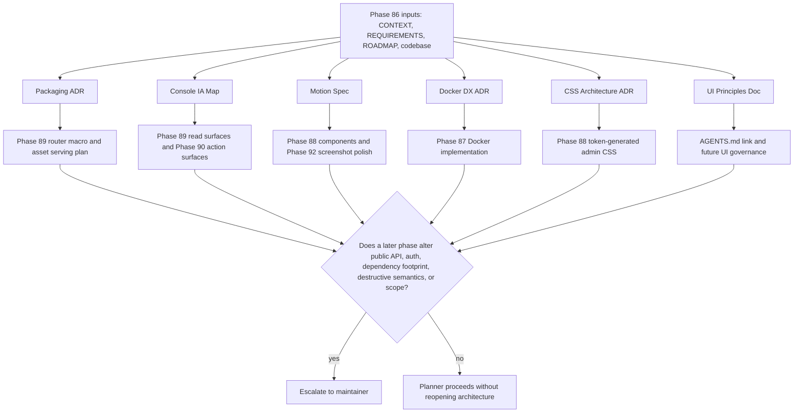

# Phase 86: Research & Architecture Lock - Research

**Researched:** 2026-06-11
**Domain:** Elixir/Phoenix mountable admin console architecture, design-system governance, Docker demo DX, and durable UI principles
**Confidence:** HIGH

<user_constraints>
## User Constraints (from CONTEXT.md)

### Locked Decisions
[VERIFIED: `.planning/phases/86-research-architecture-lock/86-CONTEXT.md`]

### Mountable Console Packaging

- **D-86-01:** Treat the admin console as a library-owned,
  LiveDashboard/Oban Web-style surface. Downstream design should converge on a
  router macro such as `Rindle.Admin.Router.rindle_admin/2`, mounted inside the
  host router's authenticated scope.
- **D-86-02:** Host apps own the browser pipeline, auth pipeline, and LiveView
  `on_mount` hook. Rindle should accept those hooks/options and refuse unsafe
  unauthenticated production mounting by default.
- **D-86-03:** Rindle owns the console assets. The console must ship
  self-contained, precompiled CSS/JS and must not require host Tailwind,
  esbuild, or asset-pipeline integration.
- **D-86-04:** Packaging research must cover CSP nonce options, socket path /
  transport options, route helper naming, logo/home path behavior, and
  optional-dependency matrix shape.

### Optional Dependency Boundary

- **D-86-05:** Preserve the current optional dependency posture. Non-console
  adopters must not pay a required LiveView/Phoenix dependency cost.
- **D-86-06:** Console modules that need Phoenix/LiveView should compile only
  when required modules are available, following the existing
  `Code.ensure_loaded?/1` pattern used by `Rindle.LiveView`, Mux provider
  modules, and GCS checks.
- **D-86-07:** ADMIN-06 is a hard requirement: when `phoenix_live_view` is
  absent, the console compiles away cleanly.

### Console IA And Query Boundary

- **D-86-08:** Research should define a task-first IA around actual Rindle
  operator jobs: home/status, assets, upload sessions, variants/jobs,
  doctor/runtime status, and action surfaces.
- **D-86-09:** Console reads belong in `Rindle.Admin.Queries`; they must not be
  promoted into the public `Rindle` facade as convenience APIs.
- **D-86-10:** Phase 86 should translate GOV.UK/GDS navigation patterns into
  Rindle's maintainer/operator context: clear service identity, obvious task
  grouping, ordered flows where order helps, and no decorative dashboard sprawl.

### Design System, CSS, And Motion

- **D-86-11:** Console CSS is a vanilla `rindle-admin` layer generated from
  `brandbook/tokens/tokens.json`, using BEM class names and CSS custom
  properties.
- **D-86-12:** Theme behavior is `data-theme="light|dark|auto"` plus
  `prefers-color-scheme`, consistent with the existing token generator.
- **D-86-13:** Status chips and operational state indicators must use token-gated
  color pairs and labels/icons; never rely on color alone.
- **D-86-14:** Motion is operational, fast, and restrained: use token durations,
  `prefers-reduced-motion`, origin-aware popovers/drawers, immediate action
  feedback, and no decorative animation.
- **D-86-15:** Cohort keeps its existing Tailwind/daisyUI momentum. The shipped
  library console does not inherit Cohort's frontend stack.

### Docker And Cohort Adoption Lab

- **D-86-16:** Phase 87 should fix Docker before UI-heavy phases iterate: project
  namespacing, env-driven ports, conflict guidance, better layer caching, and a
  launch URL map are prerequisites for efficient UI/E2E work.
- **D-86-17:** The current Dockerfile shape is a known DX issue: copying the
  whole repo before `mix deps.get` prevents useful dependency cache reuse.
- **D-86-18:** Cohort remains the demo domain. Later phases should extend it with
  Cohort branding, audio and document profiles, full lifecycle-state seeds,
  console mounting, and walkthrough/E2E evidence rather than replacing the demo.

### Phase 86 Outputs

- **D-86-19:** Phase 86 should produce locked research/ADR docs, not code
  implementation. Planning should split the research outputs so phases 87-93 can
  execute without reopening architecture.
- **D-86-20:** PRIN-01 should land as durable UI-principles guidance linked from
  `AGENTS.md`, covering design-system values, visual/a11y audit checklist,
  deterministic E2E rules, screenshot polish rules, and motion constraints.

### the agent's Discretion

The maintainer confirmed the assumptions as presented. Routine naming, file
layout, and internal helper decisions can be recommended by research/planning
without returning to the maintainer unless they affect public API shape,
security/auth semantics, destructive operations, dependency footprint, or
milestone scope.

### Deferred Ideas (OUT OF SCOPE)

None - analysis stayed within Phase 86 scope.

### Reviewed Todos (not folded)

No matching pending todos were found for Phase 86.
</user_constraints>

<phase_requirements>
## Phase Requirements

| ID | Description | Research Support |
|----|-------------|------------------|
| PRIN-01 | Durable UI-principles doc covering design-system values, audit checklist, deterministic-E2E rules, linked from `AGENTS.md`. [VERIFIED: `.planning/REQUIREMENTS.md`] | Use `guides/ui_principles.md` as the durable target, link it from `AGENTS.md`, and include the audit checklist, deterministic E2E rules, screenshot polish loop, motion constraints, IA rules, and CSS/token boundaries defined below. [VERIFIED: `.planning/phases/86-research-architecture-lock/86-CONTEXT.md`; VERIFIED: codebase] |
</phase_requirements>

## Project Constraints (from AGENTS.md)

- Research/planning subagents in this repo should resolve to Cursor `auto`; execution/verify subagents should resolve to `composer-2.5`. [VERIFIED: `AGENTS.md`; VERIFIED: `.planning/config.json`]
- Keep edits focused, run the checks named in `RUNNING.md` for the change, and update `.planning/PROJECT.md` only when product scope or shipped claims intentionally change. [VERIFIED: `AGENTS.md`; VERIFIED: `RUNNING.md`]
- Default to the repo's green-main release train posture: merge-blocking CI lanes include Quality/coveralls, Integration, Proof, Package Consumer, and Adopter. [VERIFIED: `AGENTS.md`; VERIFIED: `RUNNING.md`; VERIFIED: `.github/workflows/ci.yml`]
- Prefer PR-first execution for serious milestone or feature-depth work. [VERIFIED: `AGENTS.md`; VERIFIED: `.planning/DEVELOPMENT-TRAIN.md` reference in `AGENTS.md`]
- Avoid speculative milestone reopening outside recorded demand or maintainer override. [VERIFIED: `AGENTS.md`; VERIFIED: `.planning/STATE.md`]
- Before release prep, run `./scripts/maintainer/repo_hygiene_check.sh`. [VERIFIED: `AGENTS.md`; VERIFIED: `RUNNING.md`]

## Summary

Phase 86 should produce a small set of locked architecture documents rather than implementation code. [VERIFIED: `.planning/phases/86-research-architecture-lock/86-CONTEXT.md`] The recommended output set is: `guides/admin_console_architecture.md`, `guides/admin_console_ia.md`, `guides/admin_console_motion.md`, `guides/docker_demo_dx.md`, `guides/rindle_admin_css.md`, and `guides/ui_principles.md`, with `AGENTS.md` linking to the UI principles doc. [VERIFIED: `.planning/ROADMAP.md`; VERIFIED: `.planning/REQUIREMENTS.md`; ASSUMED]

The mountable console should follow the LiveDashboard/Oban Web prior-art shape: a router macro mounted inside a host-authenticated router scope, host-supplied `on_mount`, configurable socket/transport/CSP nonce options, and library-owned assets served from the OTP app. [CITED: https://phoenix-live-dashboard.hexdocs.pm/Phoenix.LiveDashboard.Router.html; CITED: https://oban.pro/docs/web/Oban.Web.Router.html; CITED: https://phoenix-live-view.hexdocs.pm/Phoenix.LiveView.Router.html; CITED: https://plug.hexdocs.pm/Plug.Static.html] Rindle's existing optional-dependency posture must be preserved with `Code.ensure_loaded?/1` compile gates because `phoenix_live_view` is currently optional in `mix.exs` and `Rindle.LiveView` is already wrapped that way. [VERIFIED: `mix.exs`; VERIFIED: `lib/rindle/live_view.ex`]

The design decisions should be locked as constraints for phases 87-93: task-first IA, `Rindle.Admin.Queries` read isolation, token-generated vanilla CSS with BEM, no host Tailwind requirement, restrained motion from brand `motion` tokens, `prefers-reduced-motion`, env-driven Docker ports, and no Traefik unless a later phase has a real multi-host routing need. [VERIFIED: `.planning/phases/86-research-architecture-lock/86-CONTEXT.md`; VERIFIED: `brandbook/tokens/tokens.json`; CITED: https://docs.docker.com/compose/how-tos/environment-variables/envvars/]

**Primary recommendation:** Plan Phase 86 as six documentation/ADR tasks plus one linkage/validation task; do not implement console modules, Docker changes, CSS generation, or E2E suites in this phase. [VERIFIED: `.planning/phases/86-research-architecture-lock/86-CONTEXT.md`]

## Architectural Responsibility Map

| Capability | Primary Tier | Secondary Tier | Rationale |
|------------|--------------|----------------|-----------|
| Router macro and safe mount contract | API / Backend | Frontend Server (SSR/LiveView) | The macro changes host Phoenix router behavior and must enforce mount options before LiveView routes render. [CITED: https://phoenix-live-view.hexdocs.pm/Phoenix.LiveView.Router.html; VERIFIED: `.planning/phases/86-research-architecture-lock/86-CONTEXT.md`] |
| Host authentication boundary | Frontend Server (SSR/LiveView) | API / Backend | Phoenix LiveView docs state plugs authenticate the initial request and `on_mount` validates LiveView sessions; host apps own both. [CITED: https://phoenix-live-view.hexdocs.pm/Phoenix.LiveView.Router.html] |
| Console static assets | API / Backend | Browser / Client | Library-owned `priv/static` assets should be served from the OTP app by Plug.Static while CSS/JS executes in the browser. [CITED: https://plug.hexdocs.pm/Plug.Static.html; VERIFIED: `.planning/phases/86-research-architecture-lock/86-CONTEXT.md`] |
| Console reads | API / Backend | Database / Storage | `Rindle.Admin.Queries` should own read models over the configured `Rindle.Config.repo/0`; the public facade should not grow convenience read APIs. [VERIFIED: `lib/rindle/config.ex`; VERIFIED: `.planning/phases/86-research-architecture-lock/86-CONTEXT.md`] |
| Live updates | API / Backend | Browser / Client | `Rindle.Application` already starts `Rindle.PubSub`, and `Rindle.LiveView` already defines asset, variant, provider asset, and upload-session topics. [VERIFIED: `lib/rindle/application.ex`; VERIFIED: `lib/rindle/live_view.ex`] |
| Information architecture | Browser / Client | API / Backend | IA is a navigation/content responsibility but must map to backend domain states and ops read models. [VERIFIED: `lib/rindle/domain/media_asset.ex`; VERIFIED: `lib/rindle/ops/runtime_status.ex`] |
| CSS/token architecture | Browser / Client | CDN / Static | CSS custom properties and BEM classes are browser concerns shipped as static library assets. [VERIFIED: `brandbook/src/tokens-build.mjs`; VERIFIED: `.planning/phases/86-research-architecture-lock/86-CONTEXT.md`] |
| Docker demo DX | Infrastructure / Tooling | API / Backend | Compose project names, ports, build cache, and launch URL map are local toolchain concerns around the Cohort demo stack. [VERIFIED: `docker/compose.cohort-demo.yml`; VERIFIED: `docker/Dockerfile.cohort-demo`; CITED: https://docs.docker.com/compose/how-tos/environment-variables/envvars/] |
| UI-principles governance | Documentation / Process | Browser / Client | PRIN-01 is a durable guidance requirement linked from `AGENTS.md`, not a runtime feature. [VERIFIED: `.planning/REQUIREMENTS.md`; VERIFIED: `AGENTS.md`] |

## Standard Stack

### Core

| Library / Tool | Version | Purpose | Why Standard |
|----------------|---------|---------|--------------|
| Elixir / Mix | Elixir 1.19.5 local; project supports `~> 1.15` | Author and validate architecture docs in the existing Elixir repo. | Repo is an Elixir library and CI tests Elixir 1.15/OTP 26 plus Elixir 1.17/OTP 27. [VERIFIED: `mix.exs`; VERIFIED: `.github/workflows/ci.yml`; VERIFIED: local `elixir --version`] |
| Phoenix LiveView | Locked dependency 1.1.30; optional `~> 1.0` | Prior-art and future console rendering/mount boundary. | Existing `Rindle.LiveView` uses LiveView only when loaded, and official router docs define `live_session`, `live`, and `on_mount` semantics. [VERIFIED: `mix.lock`; VERIFIED: `lib/rindle/live_view.ex`; CITED: https://phoenix-live-view.hexdocs.pm/Phoenix.LiveView.Router.html] |
| Plug.Static | Locked dependency 1.19.2 | Library-owned asset serving plan. | Official docs support serving from an OTP app tuple and recommend that form for releases/current-directory independence. [VERIFIED: `mix.lock`; CITED: https://plug.hexdocs.pm/Plug.Static.html] |
| Phoenix.LiveDashboard.Router | Docs v0.8.7 checked | Router macro precedent for mountable dashboards. | Official docs expose `live_dashboard(path, opts)` with `:live_socket_path`, `:csp_nonce_assign_key`, `:home_app`, `:on_mount`, and destructive action defaults. [CITED: https://phoenix-live-dashboard.hexdocs.pm/Phoenix.LiveDashboard.Router.html] |
| Oban.Web.Router | Docs v2.10.6 checked | Router macro precedent for admin dashboards with customization. | Official docs expose `oban_dashboard(path, opts)` with resolver, `:on_mount`, socket path, transport, and CSP nonce options. [CITED: https://oban.pro/docs/web/Oban.Web.Router.html] |
| Docker Compose | Docker 29.5.2 / Compose v5.1.3 local | Demo DX architecture lock. | Official docs define `COMPOSE_PROJECT_NAME` precedence and container name namespacing behavior. [VERIFIED: local `docker --version`; VERIFIED: local `docker compose version`; CITED: https://docs.docker.com/compose/how-tos/environment-variables/envvars/] |
| GOV.UK Design System / GDS patterns | Current docs checked 2026-06-11 | IA research source for service identity, nav grouping, and ordered flows. | Service navigation guidance emphasizes service identity; step-by-step guidance limits ordered journeys to flows where order helps. [CITED: https://design-system.service.gov.uk/components/service-navigation/; CITED: https://design-system.service.gov.uk/patterns/step-by-step-navigation/] |
| Rindle brand tokens | `brandbook/tokens/tokens.json` v1.0.0 | CSS, theme, status, focus, and motion source of truth. | Token generator writes `--rindle-*` custom properties and already supports `data-theme="dark"` plus `[data-theme="auto"]` with `prefers-color-scheme`. [VERIFIED: `brandbook/tokens/tokens.json`; VERIFIED: `brandbook/src/tokens-build.mjs`] |

### Supporting

| Library / Tool | Version | Purpose | When to Use |
|----------------|---------|---------|-------------|
| ExCoveralls | Locked dependency 0.18.5 | Merge-blocking default test coverage run. | Use `mix coveralls` as the full-suite phase gate unless a task only edits docs and a narrower proof is justified. [VERIFIED: `mix.lock`; VERIFIED: `RUNNING.md`; VERIFIED: `.github/workflows/ci.yml`] |
| Playwright | Existing Cohort config; package version not verified in this research | Deterministic E2E and screenshot guidance for downstream phases. | Phase 86 should specify deterministic rules; implementation happens in Phase 92. [VERIFIED: `examples/adoption_demo/playwright.config.js`; VERIFIED: `.planning/ROADMAP.md`] |
| Node.js | v22.14.0 local | Brand token generation and contrast scripts. | Use for `brandbook/src/tokens-build.mjs` and `brandbook/src/contrast.mjs` validation. [VERIFIED: local `node --version`; VERIFIED: `brandbook/src/tokens-build.mjs`; VERIFIED: `brandbook/src/contrast.mjs`] |

### Alternatives Considered

| Instead of | Could Use | Tradeoff |
|------------|-----------|----------|
| Router macro docs modeled on LiveDashboard/Oban Web | A bare `forward` plug | LiveView docs state `live_session` does not work with `forward`, so a forward-only plan would fight the auth/session model. [CITED: https://phoenix-live-view.hexdocs.pm/Phoenix.LiveView.Router.html] |
| Library-owned static assets via Plug.Static from OTP app | Host asset pipeline integration | Host integration contradicts ADMIN-02/D-86-03 because adopters would need Tailwind/esbuild or app asset config. [VERIFIED: `.planning/REQUIREMENTS.md`; VERIFIED: `.planning/phases/86-research-architecture-lock/86-CONTEXT.md`] |
| Env-driven direct ports | Traefik reverse proxy | Traefik helps multi-host routing but adds another service, labels, and port 80/443 conflicts; Phase 87 only requires local port conflict avoidance and URL map. [VERIFIED: `.planning/REQUIREMENTS.md`; ASSUMED] |
| Vanilla BEM + CSS custom properties for console | Tailwind/daisyUI for console | Tailwind/daisyUI remains valid for Cohort, but a shipped library console must be host-independent. [VERIFIED: `.planning/phases/86-research-architecture-lock/86-CONTEXT.md`] |

**Installation:**

```bash
# No external package installation is required for Phase 86 research/docs.
```

**Version verification:**

```bash
mix deps
mix run -e 'IO.inspect(Application.spec(:phoenix_live_view, :vsn)); IO.inspect(Application.spec(:plug, :vsn)); IO.inspect(Application.spec(:phoenix, :vsn)); IO.inspect(Application.spec(:oban, :vsn))'
elixir --version
node --version
docker --version
docker compose version
```

The local checks reported Phoenix LiveView 1.1.30, Plug 1.19.2, Phoenix 1.8.7, Oban 2.21.1, Elixir 1.19.5/OTP 28, Node 22.14.0, Docker 29.5.2, and Docker Compose v5.1.3. [VERIFIED: local commands]

## Package Legitimacy Audit

Phase 86 installs no external packages, so the package legitimacy gate is not applicable. [VERIFIED: `.planning/phases/86-research-architecture-lock/86-CONTEXT.md`; VERIFIED: `.planning/ROADMAP.md`]

| Package | Registry | Age | Downloads | Source Repo | slopcheck | Disposition |
|---------|----------|-----|-----------|-------------|-----------|-------------|
| none | — | — | — | — | — | No package install in this phase. [VERIFIED: `.planning/ROADMAP.md`] |

**Packages removed due to slopcheck [SLOP] verdict:** none. [VERIFIED: no phase package installs]
**Packages flagged as suspicious [SUS]:** none. [VERIFIED: no phase package installs]

## Architecture Patterns

### System Architecture Diagram



The diagram is a planning data-flow map because Phase 86's product is locked documentation consumed by phases 87-93. [VERIFIED: `.planning/phases/86-research-architecture-lock/86-CONTEXT.md`]

### Recommended Project Structure

```text
guides/
├── admin_console_architecture.md  # router macro, safe mount, assets, CSP, optional deps
├── admin_console_ia.md            # persona/JTBD-to-surface map and navigation rules
├── admin_console_motion.md        # token-bound motion and reduced-motion rules
├── docker_demo_dx.md              # compose namespacing, env ports, cache, URL map, Traefik decision
├── rindle_admin_css.md            # BEM, generated custom properties, theme/status rules
└── ui_principles.md               # PRIN-01 durable checklist linked from AGENTS.md
```

This file layout is a recommendation because no existing Phase 86 target docs exist yet. [ASSUMED] It keeps PRIN-01 and architecture locks in `guides/`, which is already packaged in Hex files and grouped in ExDoc extras. [VERIFIED: `mix.exs`]

### Pattern 1: Router Macro With Host-Owned Auth

**What:** Define a `Rindle.Admin.Router.rindle_admin/2` macro that expands to direct LiveView routes under the host router scope and accepts options for `:on_mount`, route helper `:as`, `:socket_path`, `:transport`, `:csp_nonce_assign_key`, `:home_path`, and logo options. [VERIFIED: `.planning/phases/86-research-architecture-lock/86-CONTEXT.md`; CITED: https://oban.pro/docs/web/Oban.Web.Router.html; CITED: https://phoenix-live-dashboard.hexdocs.pm/Phoenix.LiveDashboard.Router.html]

**When to use:** Downstream Phase 89 should use this for the only new public console surface. [VERIFIED: `.planning/STATE.md`; VERIFIED: `.planning/ROADMAP.md`]

**Example:**

```elixir
# Source: LiveDashboard/Oban Web router macro precedent and Rindle Phase 86 lock.
scope "/ops", MyAppWeb do
  pipe_through [:browser, :require_admin]

  rindle_admin "/rindle",
    on_mount: [MyAppWeb.AdminLiveAuth],
    socket_path: "/live",
    transport: "websocket",
    csp_nonce_assign_key: %{
      img: :img_csp_nonce,
      style: :style_csp_nonce,
      script: :script_csp_nonce
    },
    as: :rindle_admin,
    home_path: "/ops"
end
```

The macro should reject unsafe unauthenticated production mounting unless an explicit, documented dev/test escape hatch is set. [VERIFIED: `.planning/phases/86-research-architecture-lock/86-CONTEXT.md`]

### Pattern 2: Optional Console Compilation Gate

**What:** Wrap console modules that reference Phoenix/LiveView in compile-time availability checks, matching `Rindle.LiveView` and Mux provider modules. [VERIFIED: `lib/rindle/live_view.ex`; VERIFIED: `lib/rindle/streaming/provider/mux.ex`; VERIFIED: `mix.exs`]

**When to use:** Any module that aliases or uses Phoenix LiveView, Phoenix Component, or Phoenix Router APIs. [VERIFIED: `lib/rindle/live_view.ex`; ASSUMED]

**Example:**

```elixir
# Source: lib/rindle/live_view.ex pattern.
if Code.ensure_loaded?(Phoenix.LiveView) and Code.ensure_loaded?(Phoenix.LiveView.Router) do
  defmodule Rindle.Admin.Router do
    @moduledoc false
    # macro implementation lives here in Phase 89
  end
end
```

### Pattern 3: Library-Owned Static Asset Surface

**What:** Serve `rindle-admin` CSS/JS from the Rindle OTP app, preferably under a namespaced path such as `/rindle-admin/assets`, using `Plug.Static` with `from: {:rindle, "priv/static/rindle_admin"}`. [CITED: https://plug.hexdocs.pm/Plug.Static.html; VERIFIED: `.planning/phases/86-research-architecture-lock/86-CONTEXT.md`; ASSUMED]

**When to use:** Phase 89 asset-serving plug/macro implementation. [VERIFIED: `.planning/ROADMAP.md`]

**Example:**

```elixir
# Source: Plug.Static official docs.
plug Plug.Static,
  at: "/rindle-admin/assets",
  from: {:rindle, "priv/static/rindle_admin"},
  only: ~w(rindle-admin.css rindle-admin.js logo.svg favicon.svg)
```

### Pattern 4: Task-First IA

**What:** Organize the console around operator jobs: Home/Status, Assets, Upload Sessions, Variants/Jobs, Runtime/Doctor, and Actions. [VERIFIED: `.planning/phases/86-research-architecture-lock/86-CONTEXT.md`; VERIFIED: `lib/rindle/ops/runtime_status.ex`; VERIFIED: `lib/mix/tasks/rindle.doctor.ex`]

**When to use:** Phase 86 IA doc and downstream Phase 89/90 screen planning. [VERIFIED: `.planning/ROADMAP.md`]

**Example IA Map:**

| Surface | Primary Job | Backing Truth |
|---------|-------------|---------------|
| Home / Status | See whether Rindle is healthy and what needs attention. | `Rindle.Ops.RuntimeStatus.runtime_status/1`, `mix rindle.doctor`. [VERIFIED: `lib/rindle/ops/runtime_status.ex`; VERIFIED: `lib/mix/tasks/rindle.doctor.ex`] |
| Assets | Find assets by lifecycle state and inspect detail/timeline. | `MediaAsset` states and FSMs. [VERIFIED: `lib/rindle/domain/media_asset.ex`] |
| Upload Sessions | Diagnose stuck, failed, expired, or resumable uploads. | `MediaUploadSession` states and runtime status report. [VERIFIED: `lib/rindle/domain/media_upload_session.ex`; VERIFIED: `lib/rindle/ops/runtime_status.ex`] |
| Variants / Jobs | Inspect ready, stale, failed, cancelled, or missing variants. | `MediaVariant` states and Oban-backed runtime report. [VERIFIED: `lib/rindle/domain/media_variant.ex`; VERIFIED: `lib/rindle/ops/runtime_status.ex`] |
| Actions | Run existing repair/destructive operations deliberately. | `Rindle.Ops.LifecycleRepair`, owner-erasure facade. [VERIFIED: `lib/rindle/ops/lifecycle_repair.ex`; VERIFIED: `lib/rindle.ex`] |

### Pattern 5: Token-Generated BEM CSS

**What:** Generate a vanilla `rindle-admin` CSS layer from `brandbook/tokens/tokens.json`, exposing custom properties and BEM selectors such as `.rindle-admin-shell`, `.rindle-admin-nav__item`, and `.rindle-admin-status-chip--ready`. [VERIFIED: `brandbook/tokens/tokens.json`; VERIFIED: `brandbook/src/tokens-build.mjs`; VERIFIED: `.planning/phases/86-research-architecture-lock/86-CONTEXT.md`; ASSUMED]

**When to use:** Phase 88 design-system implementation. [VERIFIED: `.planning/ROADMAP.md`]

**Example:**

```css
/* Source: brandbook/src/tokens-build.mjs output shape + Phase 86 lock. */
.rindle-admin-status-chip {
  display: inline-flex;
  align-items: center;
  gap: var(--rindle-space-2);
  border-radius: var(--rindle-radius-pill);
  font: inherit;
}

.rindle-admin-status-chip--ready {
  color: var(--rindle-status-ready);
  background: var(--rindle-status-ready-surface);
}
```

### Anti-Patterns to Avoid

- **Adding admin reads to `Rindle` facade:** This violates D-86-09 and expands public API beyond the router macro/mount contract. [VERIFIED: `.planning/phases/86-research-architecture-lock/86-CONTEXT.md`; VERIFIED: `.planning/STATE.md`]
- **Mounting LiveViews through `forward`:** LiveView docs state `live_session` does not currently work with `forward`; admin auth should be direct live routes within the host router. [CITED: https://phoenix-live-view.hexdocs.pm/Phoenix.LiveView.Router.html]
- **Requiring host Tailwind/esbuild:** ADMIN-02 requires self-contained precompiled console assets and zero host asset pipeline dependency. [VERIFIED: `.planning/REQUIREMENTS.md`]
- **Relying on color-only status meaning:** WCAG 2.1 SC 1.4.1 says color cannot be the only visual means of conveying information, and Rindle tokens repeat this rule. [CITED: https://www.w3.org/WAI/WCAG21/Understanding/use-of-color.html; VERIFIED: `brandbook/tokens/tokens.json`]
- **Decorative dashboard sprawl:** D-86-10 requires task grouping and no decorative dashboard sprawl; GOV.UK step-by-step guidance also warns against ordered navigation where the user mostly sees a series of options. [VERIFIED: `.planning/phases/86-research-architecture-lock/86-CONTEXT.md`; CITED: https://design-system.service.gov.uk/patterns/step-by-step-navigation/]
- **Copying full repo before dependency fetch in Dockerfile:** The current Dockerfile does this and D-86-17 records it as a known DX issue. [VERIFIED: `docker/Dockerfile.cohort-demo`; VERIFIED: `.planning/phases/86-research-architecture-lock/86-CONTEXT.md`]

## Don't Hand-Roll

| Problem | Don't Build | Use Instead | Why |
|---------|-------------|-------------|-----|
| LiveView route/session/auth semantics | Custom socket/auth router layer | Phoenix LiveView router `live_session` + host `on_mount` | LiveView docs define how auth must be enforced across initial HTTP request and live navigation. [CITED: https://phoenix-live-view.hexdocs.pm/Phoenix.LiveView.Router.html] |
| Static asset serving | Custom file server plug | `Plug.Static` from `{:rindle, "priv/static/..."}` | Plug.Static already handles OTP-app paths and caching behavior. [CITED: https://plug.hexdocs.pm/Plug.Static.html] |
| CSP nonce model | Custom nonce convention disconnected from host assigns | `:csp_nonce_assign_key` option mirroring LiveDashboard/Oban Web | Both dashboard precedents expose assign-key based nonce options. [CITED: https://phoenix-live-dashboard.hexdocs.pm/Phoenix.LiveDashboard.Router.html; CITED: https://oban.pro/docs/web/Oban.Web.Router.html] |
| Operational health queries | New ad hoc query semantics in templates | `Rindle.Admin.Queries` over existing ops/domain modules | Existing runtime status, doctor checks, and domain schemas already define operational truth. [VERIFIED: `lib/rindle/ops/runtime_status.ex`; VERIFIED: `lib/mix/tasks/rindle.doctor.ex`; VERIFIED: `.planning/phases/86-research-architecture-lock/86-CONTEXT.md`] |
| Design tokens | One-off CSS variables or hard-coded colors | `brandbook/tokens/tokens.json` + generator pattern | Tokens JSON is the source of truth and generator already writes CSS custom properties. [VERIFIED: `brandbook/tokens/tokens.json`; VERIFIED: `brandbook/src/tokens-build.mjs`] |
| Contrast checks | Manual visual judgment | Extend `brandbook/src/contrast.mjs` pattern | Existing script mechanically gates declared contrast pairs. [VERIFIED: `brandbook/src/contrast.mjs`] |
| Docker project namespacing | Manual container renames | `COMPOSE_PROJECT_NAME` / `-p` / Compose top-level `name:` | Docker Compose officially defines project-name precedence and container prefixing. [CITED: https://docs.docker.com/compose/how-tos/environment-variables/envvars/] |

**Key insight:** Phase 86 should lock boundaries around mature primitives and existing Rindle truth; custom solutions are riskier because they create new public API, new auth semantics, or new styling/toolchain obligations. [VERIFIED: `.planning/STATE.md`; VERIFIED: `.planning/phases/86-research-architecture-lock/86-CONTEXT.md`]

## Common Pitfalls

### Pitfall 1: Optional Dependency Drift

**What goes wrong:** A console module references Phoenix/LiveView at compile time and breaks non-console adopters. [VERIFIED: `.planning/REQUIREMENTS.md`]
**Why it happens:** `phoenix_live_view` is optional in `mix.exs`; unguarded module references load only in environments with that dependency present. [VERIFIED: `mix.exs`; VERIFIED: `lib/rindle/live_view.ex`]
**How to avoid:** Require all console Phoenix/LiveView modules to live behind `Code.ensure_loaded?/1` gates and add a no-LiveView compile matrix task in Phase 89. [VERIFIED: `lib/rindle/live_view.ex`; VERIFIED: `.planning/REQUIREMENTS.md`]
**Warning signs:** `alias Phoenix.*` or `use Phoenix.*` outside a guarded module. [ASSUMED]

### Pitfall 2: Host Auth Bypass Through Live Navigation

**What goes wrong:** A LiveView route looks protected on first HTTP request but live navigation reaches it without equivalent authorization. [CITED: https://phoenix-live-view.hexdocs.pm/Phoenix.LiveView.Router.html]
**Why it happens:** LiveView docs state plugs authenticate regular requests, while LiveView mount/session checks are needed after connection and for navigation boundaries. [CITED: https://phoenix-live-view.hexdocs.pm/Phoenix.LiveView.Router.html]
**How to avoid:** Require host `pipe_through` plus `on_mount`; refuse production mounting when no auth hook/pipeline acknowledgement is supplied. [VERIFIED: `.planning/phases/86-research-architecture-lock/86-CONTEXT.md`]
**Warning signs:** Console macro examples mounted under `pipe_through :browser` only. [ASSUMED]

### Pitfall 3: Admin API Scope Creep

**What goes wrong:** Helpful console reads become public `Rindle` facade APIs. [VERIFIED: `.planning/STATE.md`]
**Why it happens:** Templates need query data, and facade methods feel convenient during implementation. [ASSUMED]
**How to avoid:** Lock `Rindle.Admin.Queries` as the read boundary and add API surface tests if downstream implementation adds modules. [VERIFIED: `.planning/phases/86-research-architecture-lock/86-CONTEXT.md`; VERIFIED: `test/rindle/api_surface_boundary_test.exs`]
**Warning signs:** New `def list_assets`, `def admin_*`, or dashboard read helpers in `lib/rindle.ex`. [ASSUMED]

### Pitfall 4: Token Drift

**What goes wrong:** Console components hard-code color/motion values and diverge from the brandbook. [VERIFIED: `brandbook/tokens/tokens.json`]
**Why it happens:** Component work moves faster than token generation unless the source-of-truth rule is explicit. [ASSUMED]
**How to avoid:** Phase 86 CSS ADR should require generated custom properties from `tokens.json`, BEM selectors, and contrast script extension for console token pairs. [VERIFIED: `brandbook/src/tokens-build.mjs`; VERIFIED: `brandbook/src/contrast.mjs`; VERIFIED: `.planning/phases/86-research-architecture-lock/86-CONTEXT.md`]
**Warning signs:** Hex colors, raw transition durations, or one-off status classes in console templates. [VERIFIED: `brandbook/tokens/tokens.json`; ASSUMED]

### Pitfall 5: Motion That Feels Like Marketing

**What goes wrong:** Operational pages use decorative animation that distracts from failures, queues, and destructive operations. [VERIFIED: `.planning/phases/86-research-architecture-lock/86-CONTEXT.md`]
**Why it happens:** Dashboard polish can drift into entertainment. [ASSUMED]
**How to avoid:** Bind motion to `press`, `popover`, `toast`, and `transition` tokens; include `prefers-reduced-motion`; use animation only for materialization, feedback, and continuity. [VERIFIED: `brandbook/tokens/tokens.json`; CITED: https://developer.mozilla.org/en-US/docs/Web/CSS/Reference/At-rules/@media/prefers-reduced-motion]
**Warning signs:** Infinite loops, bouncing, large-scale transforms, parallax, or async progress animation not backed by real state. [VERIFIED: `brandbook/tokens/tokens.json`; ASSUMED]

### Pitfall 6: Docker Port Conflicts Hidden By Fixed Defaults

**What goes wrong:** Cohort demo conflicts with sibling projects on ports 4102, 9000, or 9001. [VERIFIED: `docker/compose.cohort-demo.yml`; VERIFIED: `.planning/REQUIREMENTS.md`]
**Why it happens:** Current compose file publishes fixed ports and has top-level `name: cohort-demo`. [VERIFIED: `docker/compose.cohort-demo.yml`]
**How to avoid:** Lock env-driven host ports, explicit `COMPOSE_PROJECT_NAME` guidance, and launch output that prints the active URL map. [CITED: https://docs.docker.com/compose/how-tos/environment-variables/envvars/; VERIFIED: `.planning/REQUIREMENTS.md`]
**Warning signs:** Hard-coded `"4102:4102"`, `"9000:9000"`, or `"9001:9001"` surviving Phase 87. [VERIFIED: `docker/compose.cohort-demo.yml`]

## Code Examples

Verified patterns from official and codebase sources:

### Compile-Gated Optional Integration

```elixir
# Source: lib/rindle/live_view.ex
if Code.ensure_loaded?(Phoenix.LiveView) do
  defmodule Rindle.LiveView do
    # LiveView-specific helpers.
  end
end
```

### PubSub Topic Reuse

```elixir
# Source: lib/rindle/live_view.ex
defp topic_for(:variant, id), do: "rindle:variant:#{id}"
defp topic_for(:asset, id), do: "rindle:asset:#{id}"
defp topic_for(:provider_asset, id), do: "rindle:provider_asset:#{id}"
defp topic_for(:upload_session, id), do: "rindle:upload_session:#{id}"
```

### Token-Generated Theme Shape

```css
/* Source: brandbook/src/tokens-build.mjs */
[data-theme="dark"] {
  --rindle-surface: #0E1316;
}

@media (prefers-color-scheme: dark) {
  [data-theme="auto"] {
    --rindle-surface: #0E1316;
  }
}
```

### Docker Env-Driven Ports

```yaml
# Source: Docker Compose env/project-name docs + current compose file.
services:
  cohort-demo:
    ports:
      - "${COHORT_DEMO_PORT:-4102}:4102"
  minio:
    ports:
      - "${COHORT_MINIO_PORT:-9000}:9000"
      - "${COHORT_MINIO_CONSOLE_PORT:-9001}:9001"
```

## State of the Art

| Old Approach | Current Approach | When Changed | Impact |
|--------------|------------------|--------------|--------|
| "Admin UI out of scope" | Mountable Rindle admin console is in v1.18 scope | 2026-06-10 v1.18 charter | TRUTH-07 must update prior facade/docs truth after console ships. [VERIFIED: `.planning/REQUIREMENTS.md`; VERIFIED: `.planning/STATE.md`] |
| Host-app asset pipeline for app UI | Shipped library console owns precompiled assets | Locked in Phase 86 context | Console cannot require host Tailwind/esbuild. [VERIFIED: `.planning/phases/86-research-architecture-lock/86-CONTEXT.md`] |
| Cohort as generic Phoenix placeholder demo | Cohort remains demo domain and grows into adoption lab | 2026-06-10 v1.18 charter | Later phases extend Cohort; they do not replace the demo. [VERIFIED: `.planning/REQUIREMENTS.md`; VERIFIED: `.planning/STATE.md`] |
| Docker fixed ports and cache-hostile Dockerfile | Phase 87 must implement project namespacing, env ports, and layer-cache fix | Phase 86 lock for Phase 87 | UI/E2E iteration depends on Docker DX landing before UI-heavy phases. [VERIFIED: `.planning/ROADMAP.md`; VERIFIED: `docker/compose.cohort-demo.yml`; VERIFIED: `docker/Dockerfile.cohort-demo`] |

**Deprecated/outdated:**
- Treating admin UI as out of scope is outdated for v1.18 and must be corrected in Phase 93 truth docs. [VERIFIED: `.planning/REQUIREMENTS.md`; VERIFIED: `.planning/STATE.md`]
- Using color alone for operational status is invalid for this console because WCAG and Rindle token rules require additional text/icon meaning. [CITED: https://www.w3.org/WAI/WCAG21/Understanding/use-of-color.html; VERIFIED: `brandbook/tokens/tokens.json`]

## Assumptions Log

| # | Claim | Section | Risk if Wrong |
|---|-------|---------|---------------|
| A1 | Use six `guides/*.md` architecture docs plus a UI-principles link as the Phase 86 artifact layout. | Summary / Recommended Project Structure | Planner may choose a different doc layout, but the content boundaries still apply. |
| A2 | Traefik should be rejected for Phase 87 unless a later phase has a real multi-host routing need. | Alternatives / Summary | If maintainer expects reverse-proxy demo URLs, Docker DX plan may need a checkpoint. |
| A3 | Specific BEM class names such as `.rindle-admin-shell` and `.rindle-admin-status-chip--ready` are acceptable naming recommendations. | Pattern 5 / Code Examples | Phase 88 may rename classes, but must preserve BEM and token-generated CSS. |
| A4 | Warning signs for future implementation are inferred from the locked constraints. | Common Pitfalls | Planner should convert them into checks rather than treating them as existing defects. |

## Open Questions (RESOLVED)

1. **Exact doc filenames**
   - Resolution: Use the recommended `guides/*.md` filenames in this research output for Phase 86 plans. The maintainer locked durable research/ADR docs and PRIN-01 linkage, not exact filenames; this is a local documentation layout decision and does not affect public API shape, security/auth semantics, destructive operations, dependency footprint, or milestone scope. [VERIFIED: `.planning/phases/86-research-architecture-lock/86-CONTEXT.md`; ASSUMED]

2. **Safe mount option name**
   - Resolution: Phase 86 locks the safe-mount policy, not the exact escape-hatch option name. The architecture doc and plans must say unsafe unauthenticated production mounting is refused by default and that any dev/test-only escape hatch remains a narrow implementation-phase public API decision for Phase 89. Do not lock an exact option name in Phase 86 because the name affects auth/security/public API shape. [VERIFIED: `.planning/phases/86-research-architecture-lock/86-CONTEXT.md`; ASSUMED]

3. **Whether to include console architecture docs in HexDocs extras immediately**
   - Resolution: Create the Phase 86 architecture docs in `guides/` now because `guides/` is already a packaged documentation home, but do not change public README/facade truth claims in this phase. Phase 93 remains responsible for public truth/docs parity after the console exists. [VERIFIED: `mix.exs`; VERIFIED: `.planning/ROADMAP.md`; ASSUMED]

## Environment Availability

| Dependency | Required By | Available | Version | Fallback |
|------------|-------------|-----------|---------|----------|
| Elixir / Mix | Docs/test validation | yes | Elixir 1.19.5, Mix 1.19.5, OTP 28 local | CI still validates supported Elixir 1.15/OTP 26 and 1.17/OTP 27. [VERIFIED: local commands; VERIFIED: `.github/workflows/ci.yml`] |
| Node.js | Brand token scripts | yes | v22.14.0 | None needed. [VERIFIED: local command] |
| npm | Brandbook deps/scripts if needed | yes | 11.1.0 | None needed. [VERIFIED: local command] |
| Docker | Docker DX research and later Phase 87 validation | yes | 29.5.2 | If unavailable in CI/local, Phase 87 should document manual non-Docker demo path. [VERIFIED: local command; ASSUMED] |
| Docker Compose | Compose project/env behavior | yes | v5.1.3 | Use Docker docs and static compose review if runtime unavailable. [VERIFIED: local command; CITED: https://docs.docker.com/compose/how-tos/environment-variables/envvars/] |
| Context7 CLI (`ctx7`) | Preferred library doc lookup fallback | no | — | Official docs were fetched directly from HexDocs, Docker Docs, GOV.UK, MDN, and W3C. [VERIFIED: local command; CITED: source URLs below] |
| slopcheck | Package legitimacy gate | yes | command present | Not used because Phase 86 installs no packages. [VERIFIED: local command] |

**Missing dependencies with no fallback:** none for Phase 86. [VERIFIED: environment audit]

**Missing dependencies with fallback:**
- `ctx7` is absent; direct official documentation lookup was used instead. [VERIFIED: local command]

## Validation Architecture

### Test Framework

| Property | Value |
|----------|-------|
| Framework | ExUnit with ExCoveralls for Elixir tests; Playwright exists in Cohort demo for browser proof. [VERIFIED: `mix.exs`; VERIFIED: `examples/adoption_demo/playwright.config.js`] |
| Config file | `mix.exs`; `examples/adoption_demo/playwright.config.js`. [VERIFIED: codebase] |
| Quick run command | `mix test test/rindle/api_surface_boundary_test.exs` for public surface guard; `node brandbook/src/contrast.mjs` for token contrast if CSS docs change token rules. [VERIFIED: codebase] |
| Full suite command | `mix coveralls`; downstream browser phases use `cd examples/adoption_demo && npx playwright test`. [VERIFIED: `.github/workflows/ci.yml`; VERIFIED: `examples/adoption_demo/playwright.config.js`] |

### Phase Requirements → Test Map

| Req ID | Behavior | Test Type | Automated Command | File Exists? |
|--------|----------|-----------|-------------------|--------------|
| PRIN-01 | UI-principles doc exists and is linked from `AGENTS.md`. | docs/static | `rg -n "ui_principles|UI principles|visual/a11y|deterministic" AGENTS.md guides .planning/phases/86-research-architecture-lock` | Partial: `AGENTS.md` exists; target doc does not yet exist. [VERIFIED: codebase] |
| PRIN-01 | Principles include design-system values, audit checklist, deterministic E2E rules, screenshot polish rules, and motion constraints. | docs/static | `rg -n "design-system|audit checklist|deterministic|screenshot|motion|prefers-reduced-motion" guides/ui_principles.md` | Missing: Wave 0 creates `guides/ui_principles.md`. [VERIFIED: `.planning/REQUIREMENTS.md`; ASSUMED] |
| PRIN-01 | Principles remain aligned with token and contrast source of truth. | script/static | `node brandbook/src/contrast.mjs` | Exists. [VERIFIED: `brandbook/src/contrast.mjs`] |

### Sampling Rate

- **Per task commit:** `rg` checks for doc/link presence plus any touched-doc markdown lint/checks available in the repo. [ASSUMED]
- **Per wave merge:** `mix test test/rindle/api_surface_boundary_test.exs` when architecture docs mention public API boundaries; `node brandbook/src/contrast.mjs` when token/contrast rules are edited. [VERIFIED: codebase; ASSUMED]
- **Phase gate:** `mix coveralls` if implementation-adjacent code or packaged docs are changed; for docs-only changes, planner may use targeted static checks plus `mix compile --warnings-as-errors` if `mix.exs` extras are edited. [VERIFIED: `.github/workflows/ci.yml`; ASSUMED]

### Wave 0 Gaps

- [ ] `guides/ui_principles.md` — covers PRIN-01. [VERIFIED: `.planning/REQUIREMENTS.md`]
- [ ] `AGENTS.md` link to `guides/ui_principles.md` — makes PRIN-01 durable for future agents. [VERIFIED: `.planning/REQUIREMENTS.md`; VERIFIED: `AGENTS.md`]
- [ ] Optional static docs parity test if Phase 86 wants automated lock on the AGENTS link. [ASSUMED]

## Security Domain

### Applicable ASVS Categories

| ASVS Category | Applies | Standard Control |
|---------------|---------|------------------|
| V2 Authentication | yes | Host app browser/auth pipeline plus LiveView `on_mount`; Rindle refuses unsafe unauthenticated production mount by default. [VERIFIED: `.planning/phases/86-research-architecture-lock/86-CONTEXT.md`; CITED: https://phoenix-live-view.hexdocs.pm/Phoenix.LiveView.Router.html] |
| V3 Session Management | yes | LiveView `live_session` boundary and host session validation in `on_mount`. [CITED: https://phoenix-live-view.hexdocs.pm/Phoenix.LiveView.Router.html] |
| V4 Access Control | yes | Host-owned auth hook for read surfaces; existing facade/ops calls for actions; no console-owned RBAC in v1.18. [VERIFIED: `.planning/REQUIREMENTS.md`; VERIFIED: `.planning/phases/86-research-architecture-lock/86-CONTEXT.md`] |
| V5 Input Validation | yes | Use existing Rindle option validation/query normalization patterns; do not accept arbitrary filters/actions directly in templates. [VERIFIED: `lib/rindle/ops/runtime_status.ex`; VERIFIED: `lib/rindle/ops/lifecycle_repair.ex`] |
| V6 Cryptography | yes | Do not hand-roll CSP nonce generation; consume host-provided nonce assign keys and document CSP behavior. [CITED: https://developer.mozilla.org/en-US/docs/Web/HTTP/Guides/CSP; CITED: https://oban.pro/docs/web/Oban.Web.Router.html] |

### Known Threat Patterns for Elixir/Phoenix LiveView Admin Console

| Pattern | STRIDE | Standard Mitigation |
|---------|--------|---------------------|
| Unauthenticated production mount | Spoofing / Elevation of Privilege | Require host pipeline + `on_mount`; refuse unsafe production mount by default. [VERIFIED: `.planning/phases/86-research-architecture-lock/86-CONTEXT.md`; CITED: https://phoenix-live-view.hexdocs.pm/Phoenix.LiveView.Router.html] |
| Live navigation bypasses plug-only auth | Elevation of Privilege | Place admin routes in an auth-specific `live_session` with `on_mount`. [CITED: https://phoenix-live-view.hexdocs.pm/Phoenix.LiveView.Router.html] |
| CSP breakage or unsafe inline assets | Information Disclosure / Tampering | Accept `:csp_nonce_assign_key` and apply nonces to script/style assets; MDN recommends nonces for restricting script/style resources. [CITED: https://developer.mozilla.org/en-US/docs/Web/HTTP/Guides/CSP] |
| Destructive action accidents | Tampering | Keep Phase 86 doc clear that destructive flows need typed confirmation and collateral preview in Phase 90. [VERIFIED: `.planning/REQUIREMENTS.md`] |
| Public API overexposure | Information Disclosure | Keep admin reads in `Rindle.Admin.Queries`; do not add convenience reads to `Rindle`. [VERIFIED: `.planning/phases/86-research-architecture-lock/86-CONTEXT.md`] |

## Sources

### Primary (HIGH confidence)

- `.planning/phases/86-research-architecture-lock/86-CONTEXT.md` - locked Phase 86 decisions and scope. [VERIFIED: codebase]
- `.planning/REQUIREMENTS.md` - PRIN-01 and v1.18 requirement boundaries. [VERIFIED: codebase]
- `.planning/STATE.md` and `.planning/ROADMAP.md` - current milestone state and phase sequencing. [VERIFIED: codebase]
- `AGENTS.md`, `RUNNING.md`, `.planning/config.json` - repo workflow and validation constraints. [VERIFIED: codebase]
- `mix.exs`, `mix.lock`, `lib/rindle/live_view.ex`, `lib/rindle/application.ex`, `lib/rindle/config.ex` - optional dependency and integration patterns. [VERIFIED: codebase]
- `lib/rindle/domain/*.ex`, `lib/rindle/ops/*.ex`, `lib/mix/tasks/rindle.*.ex` - IA backing domain and ops surfaces. [VERIFIED: codebase]
- `brandbook/tokens/tokens.json`, `brandbook/src/tokens-build.mjs`, `brandbook/src/contrast.mjs` - token, CSS, theme, motion, and contrast sources. [VERIFIED: codebase]
- `docker/compose.cohort-demo.yml`, `docker/Dockerfile.cohort-demo`, `scripts/demo/up.sh` - current Docker DX baseline. [VERIFIED: codebase]
- Phoenix LiveDashboard Router docs - router macro and options. [CITED: https://phoenix-live-dashboard.hexdocs.pm/Phoenix.LiveDashboard.Router.html]
- Oban Web Router docs - dashboard macro, socket/transport, `on_mount`, CSP nonce options. [CITED: https://oban.pro/docs/web/Oban.Web.Router.html]
- Phoenix LiveView Router docs - `live_session`, `on_mount`, security considerations, and `forward` limitation. [CITED: https://phoenix-live-view.hexdocs.pm/Phoenix.LiveView.Router.html]
- Plug.Static docs - OTP app static serving and cache behavior. [CITED: https://plug.hexdocs.pm/Plug.Static.html]
- Docker Compose env vars docs - `COMPOSE_PROJECT_NAME` precedence and project naming behavior. [CITED: https://docs.docker.com/compose/how-tos/environment-variables/envvars/]
- GOV.UK Service Navigation and Step by Step Navigation docs - service identity and ordered-flow rules. [CITED: https://design-system.service.gov.uk/components/service-navigation/; CITED: https://design-system.service.gov.uk/patterns/step-by-step-navigation/]
- MDN CSP and `prefers-reduced-motion`, W3C WCAG 2.1 Use of Color - security/a11y constraints. [CITED: https://developer.mozilla.org/en-US/docs/Web/HTTP/Guides/CSP; CITED: https://developer.mozilla.org/en-US/docs/Web/CSS/Reference/At-rules/@media/prefers-reduced-motion; CITED: https://www.w3.org/WAI/WCAG21/Understanding/use-of-color.html]

### Secondary (MEDIUM confidence)

- Local environment probes for Elixir, Node, Docker, Docker Compose, `ctx7`, and `slopcheck`. [VERIFIED: local commands]

### Tertiary (LOW confidence)

- Assumed filenames, exact BEM class examples, and Traefik rejection wording are planner-facing recommendations derived from locked decisions. [ASSUMED]

## Metadata

**Confidence breakdown:**
- Standard stack: HIGH - local dependencies and official docs were verified. [VERIFIED: local commands; CITED: official docs]
- Architecture: HIGH - major decisions are locked in CONTEXT.md and align with LiveDashboard/Oban Web/LiveView prior art. [VERIFIED: `.planning/phases/86-research-architecture-lock/86-CONTEXT.md`; CITED: official docs]
- Pitfalls: HIGH for optional deps/auth/CSP/token/Docker issues verified in code/docs; MEDIUM for inferred future warning signs. [VERIFIED: codebase; ASSUMED]

**Research date:** 2026-06-11
**Valid until:** 2026-07-11 for repo-local architecture locks; re-check official docs before implementation phases that touch LiveView/Phoenix APIs. [ASSUMED]
