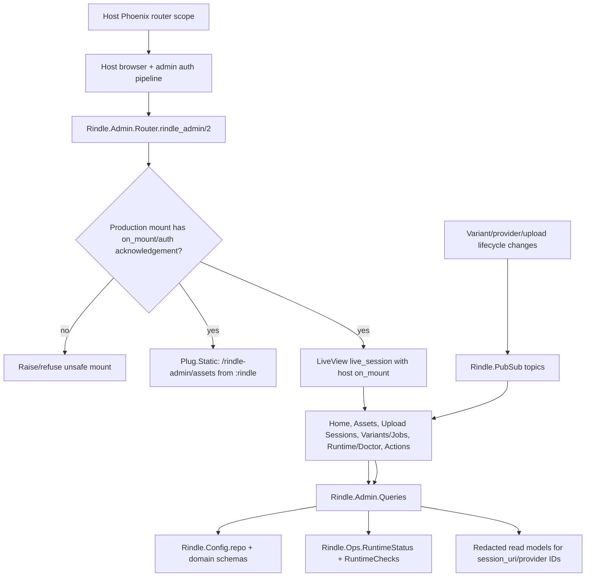

# Phase 89: Console Read Surfaces - Research

**Researched:** 2026-06-12 [VERIFIED: system date]  
**Domain:** Phoenix LiveView mountable admin console, optional dependency boundaries, Plug static assets, Rindle admin read models [VERIFIED: `.planning/ROADMAP.md`; VERIFIED: `.planning/phases/89-console-read-surfaces/89-CONTEXT.md`]  
**Confidence:** HIGH [VERIFIED: repo inspection; CITED: https://phoenix-live-view.hexdocs.pm/Phoenix.LiveView.Router.html; CITED: https://plug.hexdocs.pm/Plug.Static.html]

<user_constraints>
## User Constraints (from CONTEXT.md)

### Locked Decisions

Source: `.planning/phases/89-console-read-surfaces/89-CONTEXT.md` [VERIFIED: codebase grep]

### Mount And Auth Boundary

- **D-89-01:** Implement `Rindle.Admin.Router.rindle_admin/2` as the only new
  public console surface in Phase 89. The macro is mounted from a host router
  scope, expands to direct LiveView routes, and follows the locked
  LiveDashboard/Oban Web-style option shape.
- **D-89-02:** Host apps own browser pipeline, auth pipeline, and LiveView
  `:on_mount` checks. Rindle must refuse unsafe unauthenticated production
  mounts by default.
- **D-89-03:** Provide only a narrow development/test escape hatch for examples,
  CI, and preview apps. The planner may choose the exact option name, but the
  behavior must be unavailable as a production auth bypass and must not weaken
  the host-owned auth boundary.
- **D-89-04:** Preserve explicit mount options for `:on_mount`, route helper
  `:as`, `:home_path`, `:live_socket_path`, `:transport`, and
  `:csp_nonce_assign_key`. Apply host-provided CSP nonce assigns rather than
  generating Rindle-owned nonces.

### Optional LiveView Boundary

- **D-89-05:** Guard every Phoenix/LiveView-specific admin module with the
  existing `Code.ensure_loaded?/1` pattern before Phoenix or LiveView aliases
  expand.
- **D-89-06:** Add an ADMIN-06 proof that default/non-console installs compile
  without `phoenix_live_view`. This must be a real no-LiveView compile/package
  boundary check, not just a source grep.
- **D-89-07:** Do not make `phoenix_live_view` a required dependency and do not
  add a new runtime UI framework or registry dependency.

### Assets And Package Serving

- **D-89-08:** Move or copy the generated Phase 88 admin assets into
  `priv/static/rindle_admin` and serve them from the `:rindle` OTP app with a
  library-owned static asset route.
- **D-89-09:** The shipped console assets remain self-contained: generated
  `rindle-admin` CSS, any minimal console JS, logo/favicon assets, and no host
  Tailwind, daisyUI, esbuild, or asset-pipeline requirement.
- **D-89-10:** Add a package-file assertion in the same phase so Hex includes
  the `priv/static/rindle_admin` asset files. Local success without package
  inclusion is not sufficient for ADMIN-02.
- **D-89-11:** Continue treating `brandbook/tokens/tokens.json` and Phase 88
  generators as the design-system source of truth. Do not hand-edit generated
  CSS artifacts.

### Read Surfaces And Query Boundary

- **D-89-12:** Build the six top-level read surfaces exactly as locked:
  `Home/Status`, `Assets`, `Upload Sessions`, `Variants/Jobs`,
  `Runtime/Doctor`, and `Actions`.
- **D-89-13:** Keep Phase 89 read-only. The `Actions` surface may list or route
  toward future operations, but destructive execution, repair, regeneration,
  and quarantine write flows belong to Phase 90.
- **D-89-14:** Put console read composition in `Rindle.Admin.Queries`.
  `Rindle.Admin.Queries` may query domain schemas and compose existing read
  models such as `Rindle.Ops.RuntimeStatus` and `Rindle.Ops.RuntimeChecks`.
- **D-89-15:** Do not add admin convenience reads to `lib/rindle.ex`. The
  Phase 89 public API expansion is the mountable console boundary, not facade
  query helpers.
- **D-89-16:** Keep sensitive runtime output redacted where existing surfaces
  already do so, especially upload `session_uri` values and provider-internal
  IDs.

### Live Updates

- **D-89-17:** Reuse `Rindle.PubSub` and the existing topic grammar for
  `:asset`, `:variant`, and `:upload_session`; do not create a second realtime
  channel for the console.
- **D-89-18:** The codebase already broadcasts variant/asset and provider-asset
  events. Phase 89 should add or normalize upload-session broadcasts where
  lifecycle changes occur so the upload-session read surface can update live.
- **D-89-19:** Console LiveViews should subscribe to the minimum relevant topics
  for the visible page and refresh through `Rindle.Admin.Queries` rather than
  trusting PubSub payloads as the full data source.

### Cohort Boundary

- **D-89-20:** Use tests and minimal host/demo support as needed to prove the
  mount contract, but leave Cohort rebrand, audio/document media expansion,
  full lifecycle-state seeds, click-around walkthrough, and demo polish to
  Phase 91.
- **D-89-21:** If Cohort needs a small router mount hook to prove Phase 89, keep
  it narrow and avoid turning this phase into DEMO-01..03 implementation.

### the agent's Discretion

The maintainer confirmed the assumptions as presented. Routine internal module
layout, helper naming, test file naming, LiveView template decomposition, and
exact read-model formatting can be resolved by research/planning as long as the
decisions above are preserved.

Escalate before proceeding only if implementation would change public API shape
beyond the router macro and narrow dev/test escape hatch, weaken auth semantics,
make LiveView or UI tooling required for non-console adopters, add destructive
semantics, expose sensitive runtime IDs/URLs, or reshape milestone scope.

### Deferred Ideas (OUT OF SCOPE)

No separate `## Deferred Ideas` section exists in the Phase 89 context. Phase boundary text states destructive/repair flows, Cohort rebrand/expanded seeds/walkthrough, deterministic full console E2E, screenshot polish loops, and docs/facade parity are scoped to phases 90-93. [VERIFIED: `.planning/phases/89-console-read-surfaces/89-CONTEXT.md`]
</user_constraints>

<phase_requirements>
## Phase Requirements

| ID | Description | Research Support |
|----|-------------|------------------|
| ADMIN-01 | Host app mounts the console via router macro with host-supplied auth pipeline plus `on_mount`; safe by default. [VERIFIED: `.planning/REQUIREMENTS.md`] | Use `Rindle.Admin.Router.rindle_admin/2`, host router scope, `live_session`/`on_mount`, and a production refusal rule. [VERIFIED: `.planning/phases/89-console-read-surfaces/89-CONTEXT.md`; CITED: https://phoenix-live-view.hexdocs.pm/Phoenix.LiveView.html; CITED: https://phoenix-live-dashboard.hexdocs.pm/Phoenix.LiveDashboard.Router.html] |
| ADMIN-02 | Console ships self-contained precompiled assets with zero host asset-pipeline/Tailwind dependency and library serving. [VERIFIED: `.planning/REQUIREMENTS.md`] | Move/copy Phase 88 generated assets into `priv/static/rindle_admin`, serve with `Plug.Static` from `:rindle`, and assert Hex package inclusion. [VERIFIED: `guides/admin_design_system.md`; CITED: https://plug.hexdocs.pm/Plug.Static.html; CITED: https://hex.pm/docs/publish] |
| ADMIN-03 | Read surfaces include home, assets list/detail, upload sessions, variant/job activity, doctor, and runtime status. [VERIFIED: `.planning/REQUIREMENTS.md`] | Compose `Rindle.Admin.Queries` from domain schemas, `Rindle.Ops.RuntimeStatus`, and `Rindle.Ops.RuntimeChecks`; use the six locked surfaces from IA docs. [VERIFIED: `guides/admin_console_ia.md`; VERIFIED: `lib/rindle/ops/runtime_status.ex`; VERIFIED: `lib/rindle/ops/runtime_checks.ex`] |
| ADMIN-05 | Live updates use existing PubSub topics; queries isolated in `Rindle.Admin.Queries`, not the public facade. [VERIFIED: `.planning/REQUIREMENTS.md`] | Reuse `Rindle.PubSub` and topic grammar from `Rindle.LiveView`; refresh via queries on PubSub events. [VERIFIED: `lib/rindle/live_view.ex`; VERIFIED: `lib/rindle/workers/process_variant.ex`; VERIFIED: `lib/rindle/workers/ingest_provider_webhook.ex`] |
| ADMIN-06 | `phoenix_live_view` stays optional and console compiles away when absent. [VERIFIED: `.planning/REQUIREMENTS.md`] | Guard Phoenix/LiveView modules with top-level `Code.ensure_loaded?/1` and add CI/test proof using `mix compile --no-optional-deps --warnings-as-errors`. [VERIFIED: `lib/rindle/live_view.ex`; CITED: https://mix.hexdocs.pm/Mix.Tasks.Deps.html] |
</phase_requirements>

## Project Constraints (from AGENTS.md)

- Honor `RUNNING.md` for CI lanes and release gates. [VERIFIED: `AGENTS.md`; VERIFIED: `RUNNING.md`]
- Keep edits focused and update `.planning/PROJECT.md` only for intentional product scope or shipped-claim changes. [VERIFIED: `AGENTS.md`]
- For UI/admin-console work, follow `guides/ui_principles.md`. [VERIFIED: `AGENTS.md`; VERIFIED: `guides/ui_principles.md`]
- Maintain green-main release-train posture: Quality/coveralls, Integration, Proof, Package Consumer, and Adopter lanes are merge-blocking. [VERIFIED: `AGENTS.md`; VERIFIED: `RUNNING.md`; VERIFIED: `.github/workflows/ci.yml`]
- Prefer PR-first execution for serious milestone or feature-depth work. [VERIFIED: `AGENTS.md`]
- Avoid speculative milestone reopening outside the recorded v1.18 maintainer-pull override. [VERIFIED: `AGENTS.md`; VERIFIED: `.planning/STATE.md`]
- Before release prep, run `./scripts/maintainer/repo_hygiene_check.sh`. [VERIFIED: `AGENTS.md`]

## Summary

Phase 89 should implement the console as a host-authenticated Phoenix LiveView surface mounted through `Rindle.Admin.Router.rindle_admin/2`, with the host retaining browser/auth pipeline and `on_mount` ownership. [VERIFIED: `.planning/phases/89-console-read-surfaces/89-CONTEXT.md`; CITED: https://phoenix-live-view.hexdocs.pm/Phoenix.LiveView.html] The macro should follow the LiveDashboard/Oban Web prior-art option shape for route helper naming, `on_mount`, LiveView socket path/transport, CSP nonce assign keys, and home/logo behavior. [CITED: https://phoenix-live-dashboard.hexdocs.pm/Phoenix.LiveDashboard.Router.html; CITED: https://oban-web.hexdocs.pm/Oban.Web.Router.html]

The highest-risk planning areas are optional dependency leakage and auth bypass semantics. [VERIFIED: `.planning/phases/89-console-read-surfaces/89-CONTEXT.md`; VERIFIED: `MIX_ENV=test mix compile --no-optional-deps --warnings-as-errors`] Every Phoenix/LiveView-specific module needs the same top-level `Code.ensure_loaded?/1` guard pattern used by `Rindle.LiveView`, and the phase must add a real no-optional-deps compile proof. [VERIFIED: `lib/rindle/live_view.ex`; CITED: https://mix.hexdocs.pm/Mix.Tasks.Deps.html]

Read surfaces should be thin LiveView pages over a new `Rindle.Admin.Queries` namespace, not new public facade functions. [VERIFIED: `.planning/phases/89-console-read-surfaces/89-CONTEXT.md`; VERIFIED: `test/rindle/api_surface_boundary_test.exs`] Query composition can reuse existing domain schemas, `Rindle.Ops.RuntimeStatus`, `Rindle.Ops.RuntimeChecks`, existing redaction helpers, and PubSub topic grammar. [VERIFIED: `lib/rindle/domain/media_asset.ex`; VERIFIED: `lib/rindle/ops/runtime_status.ex`; VERIFIED: `lib/rindle/ops/runtime_checks.ex`; VERIFIED: `lib/rindle/live_view.ex`]

**Primary recommendation:** Plan Phase 89 as four vertical tracks: mount/auth/static assets, `Rindle.Admin.Queries`, six read-only LiveViews with PubSub refresh, and optional-dependency/package inclusion proof. [VERIFIED: `.planning/ROADMAP.md`; VERIFIED: `.planning/phases/89-console-read-surfaces/89-CONTEXT.md`; ASSUMED]

## Architectural Responsibility Map

| Capability | Primary Tier | Secondary Tier | Rationale |
|------------|--------------|----------------|-----------|
| Router macro mount | Frontend Server (Phoenix router/LiveView) | API / Backend | Host routers own scopes/pipelines, while Rindle owns macro expansion to LiveView routes. [VERIFIED: `guides/admin_console_architecture.md`; CITED: https://phoenix-live-view.hexdocs.pm/Phoenix.LiveView.Router.html] |
| Host auth and safe mount refusal | Frontend Server (Phoenix router/LiveView) | API / Backend | LiveView `on_mount` runs before disconnected and connected mounts, and Phase 89 locks host-owned auth plus production refusal. [CITED: https://phoenix-live-view.hexdocs.pm/Phoenix.LiveView.html; VERIFIED: `.planning/phases/89-console-read-surfaces/89-CONTEXT.md`] |
| Static asset serving | API / Backend | Browser / Client | `Plug.Static` serves files from an OTP app; browser consumes CSS/JS/logo assets. [CITED: https://plug.hexdocs.pm/Plug.Static.html; VERIFIED: `guides/admin_console_architecture.md`] |
| Console layout, nav, theme, status chips | Browser / Client | Frontend Server (LiveView) | Phase 88 generated BEM/CSS/theme/status contracts that LiveView markup should consume. [VERIFIED: `guides/admin_design_system.md`; VERIFIED: `brandbook/tokens/rindle-admin.css`] |
| Admin read queries | API / Backend | Database / Storage | `Rindle.Admin.Queries` should query via `Rindle.Config.repo/0` and domain schemas while keeping the public facade unchanged. [VERIFIED: `lib/rindle/config.ex`; VERIFIED: `.planning/phases/89-console-read-surfaces/89-CONTEXT.md`] |
| Runtime/doctor reads | API / Backend | Frontend Server (LiveView) | Existing `RuntimeStatus` and `RuntimeChecks` already produce bounded read models that the UI can format. [VERIFIED: `lib/rindle/ops/runtime_status.ex`; VERIFIED: `lib/rindle/ops/runtime_checks.ex`] |
| Live updates | API / Backend | Browser / Client | Existing workers broadcast `{:rindle_event, event_type, payload}` over `Rindle.PubSub`, and LiveViews should refresh data through queries. [VERIFIED: `lib/rindle/workers/process_variant.ex`; VERIFIED: `lib/rindle/workers/ingest_provider_webhook.ex`; VERIFIED: `.planning/phases/89-console-read-surfaces/89-CONTEXT.md`] |
| Optional dependency proof | Build / CI | API / Backend | Mix optional deps can be tested with `mix compile --no-optional-deps --warnings-as-errors`, and Phase 89 requires a real compile/package boundary check. [CITED: https://mix.hexdocs.pm/Mix.Tasks.Deps.html; VERIFIED: `MIX_ENV=test mix compile --no-optional-deps --warnings-as-errors`] |

## Standard Stack

### Core

| Library | Version | Purpose | Why Standard |
|---------|---------|---------|--------------|
| Elixir/Mix | Project supports `~> 1.15`; local Elixir 1.19.5/OTP 28. [VERIFIED: `mix.exs`; VERIFIED: local `elixir --version`] | Compile/test the Rindle library and optional-dep matrix. | Repo is an Elixir library and CI tests Elixir/OTP matrix lanes. [VERIFIED: `.github/workflows/ci.yml`] |
| Phoenix LiveView | `phoenix_live_view` optional `~> 1.0`; lock has 1.1.30; Hex latest reported 1.2.0 on 2026-06-12. [VERIFIED: `mix.exs`; VERIFIED: `mix deps`; VERIFIED: `mix hex.info phoenix_live_view`] | Routed LiveView console pages and host `on_mount` auth hook. | Official LiveView docs define `live`, `live_session`, `on_mount`, and lifecycle halting behavior. [CITED: https://phoenix-live-view.hexdocs.pm/Phoenix.LiveView.Router.html; CITED: https://phoenix-live-view.hexdocs.pm/Phoenix.LiveView.html] |
| Phoenix | Lock has 1.8.7; Hex latest reported 1.8.8 on 2026-06-12. [VERIFIED: `mix deps`; VERIFIED: `mix hex.info phoenix`] | Host endpoint/router conventions and LiveView runtime dependency. | Phoenix endpoint docs define endpoint request boundary and plug pipeline role. [CITED: https://phoenix.hexdocs.pm/Phoenix.Endpoint.html] |
| Plug.Static | Plug lock has 1.19.2. [VERIFIED: `mix deps`; VERIFIED: `mix hex.info plug`] | Serve `priv/static/rindle_admin` from `:rindle`. | Official Plug.Static docs show `from: :my_app` and `only:` allowlisting. [CITED: https://plug.hexdocs.pm/Plug.Static.html] |
| Phoenix.PubSub | Lock has 2.2.0. [VERIFIED: `mix deps`] | Existing `Rindle.PubSub` live update transport. | `Rindle.Application` already starts `{Phoenix.PubSub, name: Rindle.PubSub}`. [VERIFIED: `lib/rindle/application.ex`] |
| Ecto SQL/Postgrex | `ecto_sql` lock has 3.13.5; `postgrex` lock has 0.22.2. [VERIFIED: `mix deps`] | Query domain schemas for admin reads. | Runtime status and domain schemas already query via Ecto over `Rindle.Config.repo/0`. [VERIFIED: `lib/rindle/ops/runtime_status.ex`; VERIFIED: `lib/rindle/config.ex`] |
| Oban | Lock has 2.21.1. [VERIFIED: `mix deps`; VERIFIED: `mix hex.info oban`] | Variant/job activity source. | `RuntimeStatus` already indexes Oban jobs for variant findings. [VERIFIED: `lib/rindle/ops/runtime_status.ex`] |

### Supporting

| Library | Version | Purpose | When to Use |
|---------|---------|---------|-------------|
| `brandbook` Node scripts | Node local v22.14.0; npm local 11.1.0. [VERIFIED: local `node --version`; VERIFIED: local `npm --version`] | Regenerate/copy/admin asset CSS and run contrast/gallery checks. | Use when Phase 89 moves generated assets or validates CSS remains source-derived. [VERIFIED: `guides/admin_design_system.md`] |
| ExUnit/ExCoveralls | ExCoveralls lock has 0.18.5. [VERIFIED: `mix deps`] | Unit/boundary tests and full coverage lane. | Use focused `mix test` for each task and `mix coveralls` for full phase gate. [VERIFIED: `RUNNING.md`; VERIFIED: `.github/workflows/ci.yml`] |
| Mix Hex build | Hex local task available through current Mix/Hex setup. [VERIFIED: `test/install_smoke/package_metadata_test.exs`] | Package inclusion proof for `priv/static/rindle_admin`. | Use `mix hex.build --unpack --output ...` in package metadata tests. [VERIFIED: `test/install_smoke/package_metadata_test.exs`; CITED: https://hex.pm/docs/publish] |

### Alternatives Considered

| Instead of | Could Use | Tradeoff |
|------------|-----------|----------|
| LiveDashboard/Oban Web-style router macro | A forwarded Plug-only console | Locked decisions require direct LiveView routes and host `on_mount`; LiveView Router docs define routed live pages and live sessions. [VERIFIED: `.planning/phases/89-console-read-surfaces/89-CONTEXT.md`; CITED: https://phoenix-live-view.hexdocs.pm/Phoenix.LiveView.Router.html] |
| `Plug.Static` from `{:rindle, "priv/static/rindle_admin"}` | Host asset pipeline or copied host assets | Host pipeline dependency violates ADMIN-02 and Phase 88 package boundary. [VERIFIED: `.planning/REQUIREMENTS.md`; VERIFIED: `guides/admin_design_system.md`] |
| `Rindle.Admin.Queries` | New `Rindle.*` facade query helpers | Facade expansion is explicitly forbidden for Phase 89. [VERIFIED: `.planning/phases/89-console-read-surfaces/89-CONTEXT.md`; VERIFIED: `test/rindle/api_surface_boundary_test.exs`] |
| Query refresh on PubSub events | Trust PubSub payloads as page data | Phase 89 locks refresh-through-query to avoid stale/partial/sensitive payloads. [VERIFIED: `.planning/phases/89-console-read-surfaces/89-CONTEXT.md`] |
| Existing vanilla `rindle-admin` CSS | Tailwind, daisyUI, shadcn, Radix, Tailwind UI, or UI registry components | Runtime UI dependency additions are forbidden by Phase 88/89 decisions. [VERIFIED: `guides/admin_design_system.md`; VERIFIED: `.planning/phases/89-console-read-surfaces/89-CONTEXT.md`] |

**Installation:**

```bash
# No new external packages should be installed in Phase 89.
mix deps.get
```

**Version verification commands used:**

```bash
mix deps
mix hex.info phoenix_live_view
mix hex.info phoenix
mix hex.info plug
mix hex.info ecto_sql
mix hex.info oban
```

## Package Legitimacy Audit

Phase 89 should not install new external packages. [VERIFIED: `.planning/phases/89-console-read-surfaces/89-CONTEXT.md`] Existing dependencies were discovered from `mix.exs`/`mix.lock` and official docs, not newly selected for install. [VERIFIED: `mix.exs`; VERIFIED: `mix deps`; CITED: https://phoenix-live-view.hexdocs.pm/Phoenix.LiveView.html]

| Package | Registry | Age | Downloads | Source Repo | slopcheck | Disposition |
|---------|----------|-----|-----------|-------------|-----------|-------------|
| none new | Hex | — | — | — | not run | Approved: no package install task. [VERIFIED: `.planning/phases/89-console-read-surfaces/89-CONTEXT.md`] |

**Packages removed due to slopcheck [SLOP] verdict:** none. [VERIFIED: no new package recommendation]  
**Packages flagged as suspicious [SUS]:** none. [VERIFIED: no new package recommendation]

## Architecture Patterns

### System Architecture Diagram



This diagram reflects the locked data flow: host auth first, macro expands routes, LiveViews render read-only pages, PubSub triggers refreshes, and query modules re-read authoritative state. [VERIFIED: `.planning/phases/89-console-read-surfaces/89-CONTEXT.md`; VERIFIED: `guides/admin_console_architecture.md`; VERIFIED: `lib/rindle/live_view.ex`]

### Recommended Project Structure

```text
lib/rindle/admin/
├── router.ex              # Rindle.Admin.Router.rindle_admin/2 and static asset route macro
├── queries.ex             # read-only query composition for all console surfaces
├── components.ex          # guarded LiveView function components/layout helpers
└── live/
    ├── home_live.ex       # Home/Status
    ├── assets_live.ex     # asset list/detail via live_action or params
    ├── upload_sessions_live.ex
    ├── variants_jobs_live.ex
    ├── runtime_doctor_live.ex
    └── actions_live.ex    # read-only placeholders/routes toward Phase 90

priv/static/rindle_admin/
├── rindle-admin.css
├── rindle-admin.js
├── logo.svg
└── favicon.svg

test/rindle/admin/
├── router_test.exs
├── queries_test.exs
├── live/*_test.exs
└── optional_dependency_test.exs
```

The exact file names are discretionary, but the module boundaries should preserve router, query, component, LiveView, asset, and proof concerns. [VERIFIED: `.planning/phases/89-console-read-surfaces/89-CONTEXT.md`; ASSUMED]

### Pattern 1: Optional LiveView Compile Gate

**What:** Wrap every admin module that imports/aliases Phoenix or LiveView APIs in top-level `if Code.ensure_loaded?(Phoenix.LiveView) do ... end`. [VERIFIED: `lib/rindle/live_view.ex`]

**When to use:** Any `Rindle.Admin.Router`, `Rindle.Admin.Components`, or `Rindle.Admin.Live.*` module that references `Phoenix.Router`, `Phoenix.LiveView.Router`, `Phoenix.Component`, or LiveView socket types. [VERIFIED: `.planning/phases/89-console-read-surfaces/89-CONTEXT.md`; CITED: https://mix.hexdocs.pm/Mix.Tasks.Deps.html]

**Example:**

```elixir
# Source: lib/rindle/live_view.ex
if Code.ensure_loaded?(Phoenix.LiveView) do
  defmodule Rindle.Admin.Router do
    @moduledoc false

    defmacro rindle_admin(path, opts \\ []) do
      # import/use Phoenix modules only inside the guard.
    end
  end
end
```

### Pattern 2: Router Macro Mounted Inside Host Auth Scope

**What:** Host apps import/use the router macro inside an authenticated Phoenix router scope; the macro expands to `live_session` plus `live` routes and a static asset route. [VERIFIED: `guides/admin_console_architecture.md`; CITED: https://phoenix-live-view.hexdocs.pm/Phoenix.LiveView.Router.html]

**When to use:** The only public console surface for Phase 89. [VERIFIED: `.planning/phases/89-console-read-surfaces/89-CONTEXT.md`]

**Example:**

```elixir
# Source: guides/admin_console_architecture.md + LiveDashboard/Oban Web option precedent.
scope "/admin", MyAppWeb do
  pipe_through [:browser, :require_admin]

  rindle_admin "/rindle",
    on_mount: [MyAppWeb.AdminLiveAuth],
    as: :rindle_admin,
    home_path: "/admin",
    live_socket_path: "/live",
    transport: "websocket",
    csp_nonce_assign_key: %{
      img: :img_csp_nonce,
      style: :style_csp_nonce,
      script: :script_csp_nonce
    }
end
```

### Pattern 3: Static Assets From OTP App With Allowlist

**What:** Serve only console-owned files from the `:rindle` OTP app under a namespaced URL. [VERIFIED: `guides/admin_console_architecture.md`; CITED: https://plug.hexdocs.pm/Plug.Static.html]

**When to use:** Phase 89 asset-serving plug or macro expansion. [VERIFIED: `.planning/ROADMAP.md`]

**Example:**

```elixir
# Source: Plug.Static docs and guides/admin_console_architecture.md
plug Plug.Static,
  at: "/rindle-admin/assets",
  from: {:rindle, "priv/static/rindle_admin"},
  only: ~w(rindle-admin.css rindle-admin.js logo.svg favicon.svg)
```

### Pattern 4: PubSub Event Means "Refresh Query"

**What:** Subscribe to the minimum visible topic set, then call `Rindle.Admin.Queries` on `{:rindle_event, _type, _payload}`. [VERIFIED: `.planning/phases/89-console-read-surfaces/89-CONTEXT.md`; VERIFIED: `lib/rindle/live_view.ex`]

**When to use:** Any page with live lifecycle data. [VERIFIED: `.planning/REQUIREMENTS.md`]

**Example:**

```elixir
# Source: Rindle.LiveView topic grammar; Phase 89 D-89-19.
def handle_info({:rindle_event, _event_type, _payload}, socket) do
  {:noreply, assign(socket, :report, Rindle.Admin.Queries.home_status())}
end
```

### Anti-Patterns to Avoid

- **Adding `use Phoenix.LiveView` outside a compile gate:** This breaks ADMIN-06 when optional deps are absent. [VERIFIED: `MIX_ENV=test mix compile --no-optional-deps --warnings-as-errors`; CITED: https://mix.hexdocs.pm/Mix.Tasks.Deps.html]
- **Mounting under unauthenticated production `:browser` only:** This violates host-auth ownership and safe-by-default requirements. [VERIFIED: `.planning/phases/89-console-read-surfaces/89-CONTEXT.md`]
- **Adding `Rindle.admin_*` facade helpers:** The public API expansion is limited to the router macro. [VERIFIED: `.planning/phases/89-console-read-surfaces/89-CONTEXT.md`; VERIFIED: `test/rindle/api_surface_boundary_test.exs`]
- **Trusting PubSub payloads as complete read models:** Existing provider payloads deliberately omit provider IDs, and Phase 89 requires query refresh. [VERIFIED: `lib/rindle/workers/ingest_provider_webhook.ex`; VERIFIED: `.planning/phases/89-console-read-surfaces/89-CONTEXT.md`]
- **Hand-editing generated CSS:** Phase 88 locks generators and token source of truth. [VERIFIED: `guides/admin_design_system.md`; VERIFIED: `brandbook/src/admin-css-build.mjs`]
- **Implementing Phase 90 destructive actions early:** Phase 89 is read-only. [VERIFIED: `.planning/phases/89-console-read-surfaces/89-CONTEXT.md`; VERIFIED: `.planning/ROADMAP.md`]

## Don't Hand-Roll

| Problem | Don't Build | Use Instead | Why |
|---------|-------------|-------------|-----|
| LiveView routing/session integration | Custom websocket/router dispatch | Phoenix LiveView `live`/`live_session` macros | Official router APIs already support live routes and live session grouping. [CITED: https://phoenix-live-view.hexdocs.pm/Phoenix.LiveView.Router.html] |
| Mount auth lifecycle | Rindle-owned auth/session framework | Host pipeline plus host `on_mount` hook | Phase 89 delegates auth to host apps and forbids weakening that boundary. [VERIFIED: `.planning/phases/89-console-read-surfaces/89-CONTEXT.md`] |
| Static file serving | Custom file reader/sendfile plug | `Plug.Static` with `from: {:rindle, ...}` and `only:` | Plug.Static already handles app-relative static serving and request filtering. [CITED: https://plug.hexdocs.pm/Plug.Static.html] |
| Console design system | Runtime UI framework or registry components | Phase 88 generated `rindle-admin` CSS | Dependency footprint and host asset tooling are locked out. [VERIFIED: `guides/admin_design_system.md`] |
| Runtime status summaries | New ad hoc SQL for every dashboard card | `Rindle.Ops.RuntimeStatus` composed by `Rindle.Admin.Queries` | Existing read model already has counts, findings, resumable summaries, provider findings, and recommendations. [VERIFIED: `lib/rindle/ops/runtime_status.ex`] |
| Doctor output | Shelling out to `mix rindle.doctor` from LiveView | `Rindle.Ops.RuntimeChecks.run/2` | Existing Mix task is a wrapper over a pure report function. [VERIFIED: `lib/mix/tasks/rindle.doctor.ex`; VERIFIED: `lib/rindle/ops/runtime_checks.ex`] |
| Sensitive redaction | New one-off masking code | `MediaUploadSession.redact_session_uri/1` and `MediaProviderAsset.redact_id/1` patterns | Existing schemas already define redaction helpers and Inspect redaction. [VERIFIED: `lib/rindle/domain/media_upload_session.ex`; VERIFIED: `lib/rindle/domain/media_provider_asset.ex`] |

**Key insight:** The console should orchestrate existing Rindle read models and LiveView primitives; hand-rolling auth, static serving, PubSub channels, or UI systems increases blast radius without satisfying new product requirements. [VERIFIED: `.planning/phases/89-console-read-surfaces/89-CONTEXT.md`; VERIFIED: `guides/admin_console_architecture.md`]

## Common Pitfalls

### Pitfall 1: Optional Dependency Leakage

**What goes wrong:** A module aliases `Phoenix.LiveView`, `Phoenix.Component`, or `Phoenix.LiveView.Router` before a `Code.ensure_loaded?/1` guard. [VERIFIED: `lib/rindle/live_view.ex`; CITED: https://mix.hexdocs.pm/Mix.Tasks.Deps.html]  
**Why it happens:** Elixir alias/import/use expansion happens at compile time. [ASSUMED]  
**How to avoid:** Put the entire module definition behind the guard and prove it with `mix compile --no-optional-deps --warnings-as-errors`. [VERIFIED: `MIX_ENV=test mix compile --no-optional-deps --warnings-as-errors`]  
**Warning signs:** `mix compile --no-optional-deps` fails or `rg "Phoenix\\.|LiveView" lib/rindle/admin` finds unguarded references. [VERIFIED: local command behavior]

### Pitfall 2: Safe-Mount Escape Hatch Becomes Production Bypass

**What goes wrong:** A convenience option intended for tests/examples allows unauthenticated production mounting. [VERIFIED: `.planning/phases/89-console-read-surfaces/89-CONTEXT.md`]  
**Why it happens:** Router macros run at compile time and can normalize options without runtime environment checks if not designed carefully. [ASSUMED]  
**How to avoid:** Make the escape hatch explicit, dev/test scoped, and rejected for `Mix.env() == :prod` or production config. [VERIFIED: `.planning/phases/89-console-read-surfaces/89-CONTEXT.md`; ASSUMED]  
**Warning signs:** Cohort/test router can mount without `on_mount` in all environments. [ASSUMED]

### Pitfall 3: Package Includes Source But Not Runtime Assets

**What goes wrong:** Local dev works from `brandbook/`, but Hex consumers lack `priv/static/rindle_admin` files. [VERIFIED: `guides/admin_design_system.md`; CITED: https://hex.pm/docs/publish]  
**Why it happens:** `mix.exs` currently packages `priv/repo/migrations`, not all future `priv/static` paths, and Phase 88 intentionally did not add `priv/static/rindle_admin`. [VERIFIED: `mix.exs`; VERIFIED: `test/brandbook/admin_design_system_validation_test.exs`]  
**How to avoid:** Add a package metadata assertion using `mix hex.build --unpack` and verify CSS/JS/logo/favicon paths exist. [VERIFIED: `test/install_smoke/package_metadata_test.exs`]  
**Warning signs:** `mix hex.build --unpack` output lacks `priv/static/rindle_admin/rindle-admin.css`. [VERIFIED: `test/install_smoke/package_metadata_test.exs`]

### Pitfall 4: PubSub Payload Data Leaks Or Goes Stale

**What goes wrong:** UI renders sensitive or partial event payloads instead of authoritative redacted queries. [VERIFIED: `lib/rindle/workers/ingest_provider_webhook.ex`; VERIFIED: `.planning/phases/89-console-read-surfaces/89-CONTEXT.md`]  
**Why it happens:** Existing PubSub events are notification events, not full read models. [VERIFIED: `lib/rindle/workers/process_variant.ex`; VERIFIED: `lib/rindle/workers/ingest_provider_webhook.ex`]  
**How to avoid:** Treat PubSub as invalidation and re-run `Rindle.Admin.Queries`. [VERIFIED: `.planning/phases/89-console-read-surfaces/89-CONTEXT.md`]  
**Warning signs:** LiveView assigns are built directly from payload maps. [ASSUMED]

### Pitfall 5: Phase 89 Becomes Phase 90/91/92

**What goes wrong:** Actions, Cohort polish, deterministic E2E, or screenshot loops get pulled into read-surface work. [VERIFIED: `.planning/ROADMAP.md`; VERIFIED: `.planning/phases/89-console-read-surfaces/89-CONTEXT.md`]  
**Why it happens:** The `Actions` nav surface exists in Phase 89 but execution belongs to Phase 90. [VERIFIED: `guides/admin_console_ia.md`]  
**How to avoid:** Implement read-only `Actions` placeholders/links and keep destructive flows out. [VERIFIED: `.planning/phases/89-console-read-surfaces/89-CONTEXT.md`]  
**Warning signs:** New code calls `erase_owner`, `requeue_variants`, repair functions, or mutation queries from admin LiveViews. [VERIFIED: `lib/rindle.ex`; ASSUMED]

## Code Examples

### Query Boundary Shape

```elixir
# Source: lib/rindle/config.ex and lib/rindle/ops/runtime_status.ex
defmodule Rindle.Admin.Queries do
  import Ecto.Query

  alias Rindle.Config
  alias Rindle.Domain.MediaAsset
  alias Rindle.Ops.{RuntimeChecks, RuntimeStatus}

  def home_status(opts \\ []) do
    with {:ok, runtime} <- RuntimeStatus.runtime_status(opts) do
      {:ok,
       %{
         runtime: runtime,
         doctor: RuntimeChecks.run([], []),
         assets: asset_counts()
       }}
    end
  end

  defp asset_counts do
    from(a in MediaAsset, select: {a.state, count(a.id)}, group_by: a.state)
    |> Config.repo().all()
  end
end
```

This is a pattern sketch, not a verified existing module. [ASSUMED]

### Package Inclusion Test Pattern

```elixir
# Source: test/install_smoke/package_metadata_test.exs
{output, 0} =
  System.cmd("mix", ["hex.build", "--unpack", "--output", package_root],
    cd: @repo_root,
    env: [{"MIX_ENV", "dev"}],
    stderr_to_stdout: true
  )

assert output =~ "Building rindle"
assert File.exists?(Path.join(package_root, "priv/static/rindle_admin/rindle-admin.css"))
```

### LiveView PubSub Refresh Pattern

```elixir
# Source: lib/rindle/live_view.ex topic grammar and Phase 89 D-89-19
def mount(%{"id" => asset_id}, _session, socket) do
  if connected?(socket), do: Phoenix.PubSub.subscribe(Rindle.PubSub, "rindle:asset:#{asset_id}")
  {:ok, load_asset(socket, asset_id)}
end

def handle_info({:rindle_event, _event, _payload}, socket) do
  {:noreply, load_asset(socket, socket.assigns.asset_id)}
end
```

This is a pattern sketch and must be guarded inside LiveView-loaded modules. [ASSUMED]

## State of the Art

| Old Approach | Current Approach | When Changed | Impact |
|--------------|------------------|--------------|--------|
| Generic admin UI out of scope | v1.18 explicitly ships a mountable Rindle-branded console | v1.18 charter recorded 2026-06-10 [VERIFIED: `.planning/REQUIREMENTS.md`; VERIFIED: `.planning/STATE.md`] | Phase 89 may add router macro/public mount surface but not facade read helpers. [VERIFIED: `.planning/phases/89-console-read-surfaces/89-CONTEXT.md`] |
| Phase 88 assets only under `brandbook/` | Phase 89 moves/copies runtime assets into `priv/static/rindle_admin` | Phase 89 scope [VERIFIED: `guides/admin_design_system.md`] | Planner must include asset movement and package metadata proof. [VERIFIED: `.planning/phases/89-console-read-surfaces/89-CONTEXT.md`] |
| Optional LiveView helpers only | Optional full admin console modules | Phase 89 scope [VERIFIED: `.planning/ROADMAP.md`] | Compile gates must expand from `Rindle.LiveView` to all admin modules. [VERIFIED: `lib/rindle/live_view.ex`] |
| CLI/operator text surfaces | LiveView read surfaces over the same read models | Phase 89 scope [VERIFIED: `.planning/ROADMAP.md`] | Reuse `RuntimeStatus` and `RuntimeChecks` instead of shelling out to Mix tasks. [VERIFIED: `lib/mix/tasks/rindle.runtime_status.ex`; VERIFIED: `lib/mix/tasks/rindle.doctor.ex`] |

**Deprecated/outdated:**
- Adding admin reads to `lib/rindle.ex` is out of bounds for Phase 89. [VERIFIED: `.planning/phases/89-console-read-surfaces/89-CONTEXT.md`]
- Depending on host Tailwind/daisyUI/esbuild for shipped console assets is out of bounds. [VERIFIED: `guides/admin_design_system.md`]
- Rendering raw `session_uri` or provider asset IDs is forbidden by existing redaction posture. [VERIFIED: `lib/rindle/domain/media_upload_session.ex`; VERIFIED: `lib/rindle/domain/media_provider_asset.ex`; VERIFIED: `.planning/phases/89-console-read-surfaces/89-CONTEXT.md`]

## Assumptions Log

| # | Claim | Section | Risk if Wrong |
|---|-------|---------|---------------|
| A1 | Recommended file layout under `lib/rindle/admin/` and `test/rindle/admin/` is the best planning split. | Architecture Patterns | Planner may choose different filenames while preserving boundaries. |
| A2 | Escape hatch can be enforced with Mix env or equivalent production config check. | Common Pitfalls | Planner must validate exact implementation against release/runtime config semantics. |
| A3 | Example `Rindle.Admin.Queries.home_status/1` shape is a suitable composition sketch. | Code Examples | Implementation may need different return structs/maps after test design. |
| A4 | Direct payload-to-assigns warning signs are predictive of stale/sensitive UI bugs. | Common Pitfalls | Planner should verify in code review rather than treating the heuristic as complete. |

## Open Questions

1. **Exact dev/test escape hatch option name**
   - What we know: Phase 89 allows a narrow dev/test escape hatch and lets planner choose the name. [VERIFIED: `.planning/phases/89-console-read-surfaces/89-CONTEXT.md`]
   - What's unclear: The exact option name and whether it should require `Mix.env()` or application config. [VERIFIED: `.planning/phases/89-console-read-surfaces/89-CONTEXT.md`]
   - Recommendation: Plan a small router test matrix that proves production refusal, authenticated mount success, and dev/test escape hatch rejection in prod. [ASSUMED]

2. **Upload-session broadcast insertion points**
   - What we know: `Rindle.LiveView` already defines upload-session topic grammar; current grep found variant/provider broadcasts but not normalized upload-session broadcasts. [VERIFIED: `lib/rindle/live_view.ex`; VERIFIED: codebase `rg`]
   - What's unclear: Which upload session transitions should broadcast without over-notifying. [ASSUMED]
   - Recommendation: Plan a small audit of `Rindle.Upload.Broker` and `Rindle.Domain.UploadSessionFSM` before adding broadcasts. [VERIFIED: `.planning/phases/89-console-read-surfaces/89-CONTEXT.md`; ASSUMED]

3. **Asset detail state timeline source**
   - What we know: `MediaProcessingRun` stores worker outcomes, and schemas have `updated_at`/state fields. [VERIFIED: `lib/rindle/domain/media_processing_run.ex`; VERIFIED: `lib/rindle/domain/media_asset.ex`]
   - What's unclear: Whether Phase 89 needs a true historical timeline or a current-state-plus-related-runs view. [ASSUMED]
   - Recommendation: Implement current state, variants, attachments, upload sessions, and processing runs first; avoid inventing history if not stored. [ASSUMED]

## Environment Availability

| Dependency | Required By | Available | Version | Fallback |
|------------|-------------|-----------|---------|----------|
| Elixir | compile/test/admin modules | yes | 1.19.5 / OTP 28 | CI matrix still validates supported 1.15/26 and 1.17/27. [VERIFIED: local `elixir --version`; VERIFIED: `.github/workflows/ci.yml`] |
| Mix | compile/test/hex build | yes | 1.19.5 | none needed. [VERIFIED: local `mix --version`] |
| Node.js | admin CSS/generator checks | yes | v22.14.0 | Use existing generated assets if scripts are not changed, but Phase 89 asset moves should still run package checks. [VERIFIED: local `node --version`; VERIFIED: `guides/admin_design_system.md`] |
| npm | existing browser tooling dependency management | yes | 11.1.0 | Do not install new runtime UI packages. [VERIFIED: local `npm --version`; VERIFIED: `.planning/phases/89-console-read-surfaces/89-CONTEXT.md`] |
| FFmpeg | existing doctor/runtime checks | yes | 8.0.1 | CI installs FFmpeg; console should display doctor output, not require FFmpeg for compile. [VERIFIED: local `ffmpeg -version`; VERIFIED: `RUNNING.md`] |
| ctx7 | documentation lookup fallback | no | — | Official HexDocs/web sources used. [VERIFIED: local `command -v ctx7`] |

**Missing dependencies with no fallback:** none for planning/research. [VERIFIED: environment probes]  
**Missing dependencies with fallback:** ctx7 is missing; official docs were fetched directly. [VERIFIED: local `command -v ctx7`; CITED: https://phoenix-live-view.hexdocs.pm/Phoenix.LiveView.html]

## Validation Architecture

### Test Framework

| Property | Value |
|----------|-------|
| Framework | ExUnit with Mix; coverage via ExCoveralls. [VERIFIED: `mix.exs`; VERIFIED: `RUNNING.md`] |
| Config file | `test/test_helper.exs`; project config in `mix.exs`. [VERIFIED: `test/test_helper.exs`; VERIFIED: `mix.exs`] |
| Quick run command | `MIX_ENV=test mix test test/rindle/admin/queries_test.exs test/rindle/admin/router_test.exs` [ASSUMED] |
| Full suite command | `mix coveralls` [VERIFIED: `RUNNING.md`; VERIFIED: `.github/workflows/ci.yml`] |

### Phase Requirements -> Test Map

| Req ID | Behavior | Test Type | Automated Command | File Exists? |
|--------|----------|-----------|-------------------|--------------|
| ADMIN-01 | Router macro mounts inside host scope, preserves options, and refuses unsafe production mount. [VERIFIED: `.planning/REQUIREMENTS.md`] | unit/integration | `MIX_ENV=test mix test test/rindle/admin/router_test.exs` | no, Wave 0 [VERIFIED: `find test`] |
| ADMIN-02 | Static assets are served from `priv/static/rindle_admin` and included in Hex package. [VERIFIED: `.planning/REQUIREMENTS.md`] | unit/package | `MIX_ENV=test mix test test/install_smoke/package_metadata_test.exs test/rindle/admin/assets_test.exs` | partial: package test exists; admin asset test missing [VERIFIED: `test/install_smoke/package_metadata_test.exs`; VERIFIED: `find test`] |
| ADMIN-03 | Six read surfaces render read-only data from `Rindle.Admin.Queries`. [VERIFIED: `.planning/REQUIREMENTS.md`] | LiveView/query | `MIX_ENV=test mix test test/rindle/admin/queries_test.exs test/rindle/admin/live` | no, Wave 0 [VERIFIED: `find test`] |
| ADMIN-05 | Live updates subscribe to existing topics and refresh via queries; no facade reads added. [VERIFIED: `.planning/REQUIREMENTS.md`] | unit/LiveView/boundary | `MIX_ENV=test mix test test/rindle/admin/live_update_test.exs test/rindle/api_surface_boundary_test.exs` | partial: boundary test exists; admin live update test missing [VERIFIED: `test/rindle/api_surface_boundary_test.exs`; VERIFIED: `find test`] |
| ADMIN-06 | No-`phoenix_live_view` compile proof passes. [VERIFIED: `.planning/REQUIREMENTS.md`] | compile/package | `MIX_ENV=test mix compile --no-optional-deps --warnings-as-errors` | command exists; dedicated CI/test wrapper missing [VERIFIED: command run] |

### Sampling Rate

- **Per task commit:** focused `mix test` for touched admin query/router/live/static tests. [ASSUMED]
- **Per wave merge:** `MIX_ENV=test mix compile --no-optional-deps --warnings-as-errors` plus all Phase 89 focused tests. [VERIFIED: command run; ASSUMED]
- **Phase gate:** `mix coveralls` and package metadata proof before `$gsd-verify-work`. [VERIFIED: `RUNNING.md`; VERIFIED: `.github/workflows/ci.yml`; ASSUMED]

### Wave 0 Gaps

- [ ] `test/rindle/admin/router_test.exs` - covers ADMIN-01 safe mount/options. [VERIFIED: `find test`]
- [ ] `test/rindle/admin/queries_test.exs` - covers ADMIN-03/05 query read models and redaction. [VERIFIED: `find test`]
- [ ] `test/rindle/admin/live/*_test.exs` - covers six read surfaces and PubSub refresh. [VERIFIED: `find test`]
- [ ] `test/rindle/admin/assets_test.exs` or package metadata extension - covers ADMIN-02 static file serving and package inclusion. [VERIFIED: `test/install_smoke/package_metadata_test.exs`; ASSUMED]
- [ ] CI or test wrapper for `mix compile --no-optional-deps --warnings-as-errors` - covers ADMIN-06. [VERIFIED: `.github/workflows/ci.yml`; VERIFIED: command run]

### Verification Evidence From Research

| Command | Result |
|---------|--------|
| `MIX_ENV=test mix compile --no-optional-deps --warnings-as-errors` | PASS; compiled 113 files and generated app. [VERIFIED: command output] |
| `MIX_ENV=test mix test test/rindle/api_surface_boundary_test.exs test/brandbook/admin_design_system_validation_test.exs` | PASS; 17 tests, 0 failures, 4 integration-tagged exclusions. [VERIFIED: command output] |
| `MIX_ENV=test mix test test/rindle/ops/runtime_status_test.exs test/rindle/live_view_test.exs` | PASS; 42 tests, 0 failures. [VERIFIED: command output] |

## Security Domain

### Applicable ASVS Categories

| ASVS Category | Applies | Standard Control |
|---------------|---------|------------------|
| V2 Authentication | yes | Host router auth pipeline plus host LiveView `on_mount`; Rindle refuses unsafe production mounts. [VERIFIED: `.planning/phases/89-console-read-surfaces/89-CONTEXT.md`; CITED: https://phoenix-live-view.hexdocs.pm/Phoenix.LiveView.html] |
| V3 Session Management | yes | Host LiveView session/auth hook owns session checks; Rindle must not invent session handling. [VERIFIED: `.planning/phases/89-console-read-surfaces/89-CONTEXT.md`] |
| V4 Access Control | yes | Host scopes/pipelines and `on_mount` control access; dev/test bypass unavailable in production. [VERIFIED: `.planning/phases/89-console-read-surfaces/89-CONTEXT.md`] |
| V5 Input Validation | yes | Query filters should be normalized in `Rindle.Admin.Queries`; existing `RuntimeStatus.normalize_filters/1` validates runtime filters. [VERIFIED: `lib/rindle/ops/runtime_status.ex`; ASSUMED] |
| V6 Cryptography | yes | CSP nonces are host-provided assign keys; Rindle applies but does not generate nonce values. [VERIFIED: `.planning/phases/89-console-read-surfaces/89-CONTEXT.md`; CITED: https://oban-web.hexdocs.pm/Oban.Web.Router.html] |
| V7 Error Handling and Logging | yes | Runtime output must preserve existing redaction for `session_uri` and provider IDs. [VERIFIED: `lib/rindle/domain/media_upload_session.ex`; VERIFIED: `lib/rindle/domain/media_provider_asset.ex`] |
| V10 Malicious Code | yes | No new runtime UI package or registry dependency; generated assets come from repo-local Phase 88 generator. [VERIFIED: `guides/admin_design_system.md`; VERIFIED: `.planning/phases/89-console-read-surfaces/89-CONTEXT.md`] |

### Known Threat Patterns for Phoenix LiveView Admin Console

| Pattern | STRIDE | Standard Mitigation |
|---------|--------|---------------------|
| Unauthenticated production mount | Elevation of Privilege | Require host `on_mount`/auth acknowledgement and refuse unsafe mount. [VERIFIED: `.planning/phases/89-console-read-surfaces/89-CONTEXT.md`] |
| Dev/test bypass escaping to production | Elevation of Privilege | Reject escape hatch under production config and test this explicitly. [VERIFIED: `.planning/phases/89-console-read-surfaces/89-CONTEXT.md`; ASSUMED] |
| Raw provider/upload secrets in UI | Information Disclosure | Use existing redaction helpers and query-level redacted DTOs. [VERIFIED: `lib/rindle/domain/media_upload_session.ex`; VERIFIED: `lib/rindle/domain/media_provider_asset.ex`] |
| PubSub payload spoof/staleness | Tampering | Treat events as invalidation and re-query through `Rindle.Admin.Queries`. [VERIFIED: `.planning/phases/89-console-read-surfaces/89-CONTEXT.md`] |
| CSP breakage in host app | Security Misconfiguration | Accept `:csp_nonce_assign_key` and apply host-provided nonces to assets. [VERIFIED: `.planning/phases/89-console-read-surfaces/89-CONTEXT.md`; CITED: https://phoenix-live-dashboard.hexdocs.pm/Phoenix.LiveDashboard.Router.html] |
| Optional dependency denial of service | Denial of Service | Compile admin modules away when LiveView is absent and prove with `--no-optional-deps`. [VERIFIED: command run; CITED: https://mix.hexdocs.pm/Mix.Tasks.Deps.html] |

## Sources

### Primary (HIGH confidence)

- `.planning/phases/89-console-read-surfaces/89-CONTEXT.md` - locked Phase 89 decisions, scope, canonical refs. [VERIFIED: codebase]
- `.planning/REQUIREMENTS.md` - ADMIN-01, ADMIN-02, ADMIN-03, ADMIN-05, ADMIN-06. [VERIFIED: codebase]
- `.planning/ROADMAP.md` - Phase 89 scope, dependencies, success criteria. [VERIFIED: codebase]
- `.planning/STATE.md` - current milestone position and Phase 88 completion context. [VERIFIED: codebase]
- `AGENTS.md`, `RUNNING.md`, `.github/workflows/ci.yml` - repo workflow and CI lanes. [VERIFIED: codebase]
- `guides/admin_console_architecture.md`, `guides/admin_console_ia.md`, `guides/rindle_admin_css.md`, `guides/admin_design_system.md`, `guides/ui_principles.md` - locked admin console architecture/design contracts. [VERIFIED: codebase]
- `lib/rindle/live_view.ex`, `lib/rindle/application.ex`, `lib/rindle/config.ex`, domain schemas, runtime status/check modules, worker broadcast modules. [VERIFIED: codebase]
- Phoenix LiveView docs - router and `on_mount` behavior. [CITED: https://phoenix-live-view.hexdocs.pm/Phoenix.LiveView.Router.html; CITED: https://phoenix-live-view.hexdocs.pm/Phoenix.LiveView.html]
- Plug.Static docs - OTP app static serving and `only:` request filtering. [CITED: https://plug.hexdocs.pm/Plug.Static.html]
- Mix deps docs - optional dependency semantics and `--no-optional-deps` recommendation. [CITED: https://mix.hexdocs.pm/Mix.Tasks.Deps.html]
- Hex publish docs - package `:files` and Hex build/publish package behavior. [CITED: https://hex.pm/docs/publish]

### Secondary (MEDIUM confidence)

- Phoenix LiveDashboard Router docs - dashboard macro option precedent. [CITED: https://phoenix-live-dashboard.hexdocs.pm/Phoenix.LiveDashboard.Router.html]
- Oban Web Router docs - admin dashboard option precedent for `on_mount`, socket/transport, CSP nonce. [CITED: https://oban-web.hexdocs.pm/Oban.Web.Router.html]

### Tertiary (LOW confidence)

- None used as authoritative sources. [VERIFIED: research source log]

## Metadata

**Confidence breakdown:**
- Standard stack: HIGH - verified against `mix.exs`, `mix.lock`/`mix deps`, `mix hex.info`, and official docs. [VERIFIED: local commands; CITED: https://phoenix-live-view.hexdocs.pm/Phoenix.LiveView.html]
- Architecture: HIGH - locked by Phase 86/88/89 context and verified against existing code seams. [VERIFIED: `.planning/phases/89-console-read-surfaces/89-CONTEXT.md`; VERIFIED: `guides/admin_console_architecture.md`; VERIFIED: `lib/rindle/live_view.ex`]
- Pitfalls: HIGH for optional deps/auth/assets/redaction; MEDIUM for exact escape-hatch mechanics because option naming is intentionally discretionary. [VERIFIED: `.planning/phases/89-console-read-surfaces/89-CONTEXT.md`; ASSUMED]

**Research date:** 2026-06-12 [VERIFIED: system date]  
**Valid until:** 2026-07-12 for repo-locked architecture; re-check Phoenix/LiveView/Hex docs if dependency versions change before implementation. [ASSUMED]
