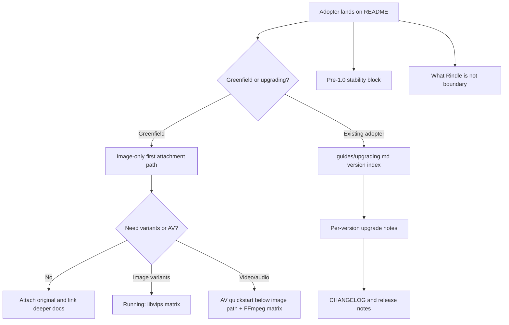

# Phase 115: Versioning & README Positioning - Research

**Researched:** 2026-07-01 [VERIFIED: `node /Users/jon/.codex/gsd-core/bin/gsd-tools.cjs query init.phase-op 115`]
**Domain:** documentation architecture, pre-1.0 versioning contract, README onboarding order [VERIFIED: `.planning/ROADMAP.md`]
**Confidence:** MEDIUM [VERIFIED: repo inspection + official-source lookups]

## User Constraints

No `CONTEXT.md` exists for this phase, so there are no locked discuss-phase decisions to copy. [VERIFIED: `init.phase-op 115` returned `has_context: false`]

Phase 115 must address `VERSION-01`, `VERSION-02`, `README-01`, and `README-02`. [VERIFIED: `.planning/REQUIREMENTS.md`]

The phase goal is to state Rindle's pre-1.0 stability contract, generalize `guides/upgrading.md`, lead README with an image-only first attachment path, and add a clear "what Rindle is NOT / when not to use it" block. [VERIFIED: `.planning/ROADMAP.md`]

Deferred work from the milestone remains out of scope for this phase: Phase 116 owns the `Rindle.Migration` implementation and the v1.23 schema isolation flip remains future work. [VERIFIED: `.planning/STATE.md`]

## Project Constraints (from AGENTS.md)

- Keep edits focused and run the checks named by `RUNNING.md` for the change. [VERIFIED: `AGENTS.md`]
- Update `.planning/PROJECT.md` only when intentionally changing product scope or shipped claims. [VERIFIED: `AGENTS.md`]
- Preserve the green-main release-train posture and keep merge-blocking CI jobs green: Quality/coveralls, Integration, Proof, Package Consumer, and Adopter. [VERIFIED: `AGENTS.md`]
- Prefer PR-first execution for serious milestone or feature-depth work. [VERIFIED: `AGENTS.md`]
- Avoid speculative milestone reopening during demand-gated pause unless LIFE-06 or STREAM-10 signal exists. [VERIFIED: `AGENTS.md`]
- Before release prep, run `./scripts/maintainer/repo_hygiene_check.sh`. [VERIFIED: `AGENTS.md`]
- For UI/admin-console work, follow `guides/ui_principles.md`; Phase 115 is README/docs positioning, so this is relevant only if the planner treats "UI hint" as skimmability guidance, not app UI work. [VERIFIED: `AGENTS.md`, `.planning/ROADMAP.md`]
- Repo-local skill `.codex/skills/gsd-milestone-next-step/SKILL.md` exists, but it is a milestone-boundary assessment workflow, not an implementation rule for this docs phase. [VERIFIED: project skill discovery + `SKILL.md`]

<phase_requirements>

## Phase Requirements

| ID | Description | Research Support |
|----|-------------|------------------|
| VERSION-01 | README and CONTRIBUTING state the SemVer/pre-1.0 stability contract and what 1.0 will mean. [VERIFIED: `.planning/REQUIREMENTS.md`] | SemVer 2.0.0 says 0.y.z is initial development and public API stability starts at 1.0.0. [CITED: https://semver.org/] |
| VERSION-02 | `guides/upgrading.md` becomes reusable versioned upgrade notes, not a single pre-0.1.4 runbook. [VERIFIED: `.planning/REQUIREMENTS.md`] | Keep a Changelog recommends an `Unreleased` section, one entry per version, newest first, release dates, linkable sections, and grouped change types. [CITED: https://keepachangelog.com/en/1.1.0/] |
| README-01 | README leads with an image-only first attachment path needing no FFmpeg/libvips and demotes AV quickstart. [VERIFIED: `.planning/REQUIREMENTS.md`] | README currently leads with AV quickstart at `## First Run: AV Quickstart`, and `Rindle.Profile` accepts `variants: []`; however background image promotion currently uses `Rindle.Probe.Image` backed by Image/libvips. [VERIFIED: `README.md`, `MIX_ENV=test mix run --no-start`, `lib/rindle/probe/image.ex`] |
| README-02 | README adds a clear "what Rindle is NOT / when not to use it" block lifted from `guides/user_flows.md`. [VERIFIED: `.planning/REQUIREMENTS.md`] | `guides/user_flows.md` already says Rindle is a library, not a platform, and names out-of-scope domains such as full HLS/DASH platform, DRM, AI/GPU processing, broad PDF/Office handling, and CDN replacement. [VERIFIED: `guides/user_flows.md`] |

</phase_requirements>

## Summary

Phase 115 is a docs-and-tests phase. The planner should scope implementation to `README.md`, `CONTRIBUTING.md`, `guides/upgrading.md`, and `test/install_smoke/docs_parity_test.exs`, with optional generated docs verification through ExDoc. [VERIFIED: `.planning/ROADMAP.md`, `mix.exs`, `test/install_smoke/docs_parity_test.exs`]

The README should be reordered from AV-first to image-first. The current README puts AV setup and `FFmpeg >= 6.0` in the first-run section, while the requirement asks for a first attachment path that does not require FFmpeg/libvips. [VERIFIED: `README.md`, `.planning/REQUIREMENTS.md`] The safest docs-only route is an original-only image attachment path using `variants: []`, followed by explicit notes that libvips is needed when image probing/variant processing runs and FFmpeg is needed for AV. [VERIFIED: `MIX_ENV=test mix run --no-start`, `lib/rindle/probe/image.ex`, `RUNNING.md`]

Two planning risks matter. First, the live Hex API reports latest `rindle` as `0.3.2`, but the checked-out `mix.exs`, `.release-please-manifest.json`, and `CHANGELOG.md` still say `0.3.1`, while planning state says Phase 113 reconciled these files. [VERIFIED: Hex API curl, `mix.exs`, `.release-please-manifest.json`, `CHANGELOG.md`, `.planning/STATE.md`] Second, a literal "no libvips" runtime promise conflicts with current image promotion internals because `Rindle.Probe.Image` uses Image/libvips even when a profile has no variants. [VERIFIED: `lib/rindle/probe/image.ex`, `lib/rindle/workers/promote_asset.ex`]

**Primary recommendation:** Keep Phase 115 docs-only, add parity tests before or alongside prose edits, phrase the first-run path as "first attachment before variants/AV processing" unless the planner intentionally expands scope to code. [VERIFIED: `.planning/ROADMAP.md`, `test/install_smoke/docs_parity_test.exs`]

## Architectural Responsibility Map

| Capability | Primary Tier | Secondary Tier | Rationale |
|------------|--------------|----------------|-----------|
| Pre-1.0 stability contract | Documentation / Repository | Release metadata | README and CONTRIBUTING are the adopter/contributor expectation surfaces, while CHANGELOG remains the upgrade reference. [VERIFIED: `.planning/REQUIREMENTS.md`, `README.md`, `CONTRIBUTING.md`] |
| Versioned upgrade home | Documentation / HexDocs extras | Release workflow | `guides/upgrading.md` is already an ExDoc extra and release runbook already deep-links to it for upgrade guidance. [VERIFIED: `mix.exs`, `guides/release_publish.md`] |
| Image-first README onboarding | Documentation / README | Runtime docs | README is the quickstart entrypoint, while RUNNING keeps host dependency matrices. [VERIFIED: `README.md`, `RUNNING.md`] |
| "When not to use" boundary | Documentation / README | User Flows guide | The canonical source copy already lives in `guides/user_flows.md`; README should lift and compress it. [VERIFIED: `guides/user_flows.md`] |
| Regression locking | Test / Proof lane | Documentation | `test/install_smoke/docs_parity_test.exs` already reads README, getting-started, upgrading, release, running, and user-flows docs. [VERIFIED: `test/install_smoke/docs_parity_test.exs`] |

## Standard Stack

### Core

| Library / Surface | Version | Purpose | Why Standard |
|-------------------|---------|---------|--------------|
| Markdown docs in `README.md`, `CONTRIBUTING.md`, `guides/upgrading.md` | repo files | Adopter and contributor expectation surfaces. [VERIFIED: repo grep] | These files are already shipped in package metadata or ExDoc extras. [VERIFIED: `mix.exs`] |
| ExDoc | locked `0.40.3`, released 2026-05-21 | Renders README and guides as HexDocs extras. [VERIFIED: `mix.lock`, `mix hex.info ex_doc`] | The project already configures `extras` and `groups_for_extras` in `mix.exs`; ExDoc documents `:extras` for additional pages. [VERIFIED: `mix.exs`; CITED: https://github.com/elixir-lang/ex_doc/tree/v0.40.3] |
| ExUnit docs parity tests | Elixir/Mix local `1.19.5` with OTP 28 | Locks doc claims and ordering. [VERIFIED: `mix --version`, `test/install_smoke/docs_parity_test.exs`] | The project already centralizes README/guide truth checks in `DocsParityTest`. [VERIFIED: `test/install_smoke/docs_parity_test.exs`] |
| Semantic Versioning 2.0.0 | spec | Source of public API and 0.y.z stability language. [CITED: https://semver.org/] | It is the conventional contract named by the requirement. [VERIFIED: `.planning/REQUIREMENTS.md`] |
| Keep a Changelog 1.1.0 | convention | Structure for versioned human-readable change notes. [CITED: https://keepachangelog.com/en/1.1.0/] | Its `Unreleased` and per-version structure maps directly to a reusable upgrade home. [CITED: https://keepachangelog.com/en/1.1.0/] |

### Supporting

| Library / Tool | Version | Purpose | When to Use |
|----------------|---------|---------|-------------|
| ExCoveralls | locked `0.18.5`, released 2025-01-26 | Full coverage gate in `mix ci`. [VERIFIED: `mix.lock`, `mix hex.info excoveralls`] | Use only for phase/full gate, not the quick docs proof. [VERIFIED: `CONTRIBUTING.md`] |
| JUnit formatter | locked `3.4.0`, released 2024-04-02 | CI test report formatting. [VERIFIED: `mix.lock`, `mix hex.info junit_formatter`] | Existing CI support only; Phase 115 should not modify it. [VERIFIED: `mix.exs`] |
| `scripts/maintainer/check_docs_links.sh` | repo script | Docs link checking. [VERIFIED: `rg --files`] | Use if README/upgrading link changes need a link-focused check. [VERIFIED: repo file list] |

### Alternatives Considered

| Instead of | Could Use | Tradeoff |
|------------|-----------|----------|
| `guides/upgrading.md` as upgrade home | GitHub Releases only | GitHub Releases are less portable/discoverable than repo docs for users; Keep a Changelog explicitly warns against relying on non-portable release surfaces alone. [CITED: https://keepachangelog.com/en/1.1.0/] |
| ExDoc extras | A new docs site or generated guide index | A new docs system would duplicate existing ExDoc extras wiring and increase release surface. [VERIFIED: `mix.exs`] |
| Docs parity test | Manual review only | Manual review would miss the existing proof-lane pattern and allow README order regressions. [VERIFIED: `test/install_smoke/docs_parity_test.exs`, `CONTRIBUTING.md`] |
| Code change to remove libvips from image promotion | Keep docs-only phase | Code change would expand beyond Phase 115's docs-only scope and conflict with roadmap sequencing. [VERIFIED: `.planning/ROADMAP.md`] |

**Installation:**

No new packages should be installed for Phase 115. [VERIFIED: phase scope in `.planning/ROADMAP.md`]

**Version verification performed:**

```bash
mix hex.info ex_doc
mix hex.info excoveralls
mix hex.info junit_formatter
mix --version
elixir --version
node --version
pg_isready
```

The Hex auth warning during `mix hex.info` did not block public package metadata lookup. [VERIFIED: command output]

## Package Legitimacy Audit

Phase 115 should install no external packages, so the package legitimacy gate is not required for execution. [VERIFIED: `.planning/ROADMAP.md`]

| Package | Registry | Age | Downloads | Source Repo | Verdict | Disposition |
|---------|----------|-----|-----------|-------------|---------|-------------|
| none | none | n/a | n/a | n/a | n/a | No install planned. [VERIFIED: phase scope] |

**Packages removed due to [SLOP] verdict:** none. [VERIFIED: no packages recommended]
**Packages flagged as suspicious [SUS]:** none. [VERIFIED: no packages recommended]

The GSD package-legitimacy seam supports npm, pypi, and crates, not Hex; no Hex package install is recommended in this phase. [VERIFIED: `package-legitimacy check --ecosystem hex` error]

## Architecture Patterns

### System Architecture Diagram



The diagram reflects the Phase 115 requirement that README lead with an image-only path, keep upgrade guidance in `guides/upgrading.md`, and state the stability boundary. [VERIFIED: `.planning/REQUIREMENTS.md`]

### Recommended Project Structure

```text
README.md                                  # primary adopter quickstart and positioning
CONTRIBUTING.md                            # contributor-facing stability note and CHANGELOG pointer
guides/upgrading.md                        # versioned upgrade-note home
guides/user_flows.md                       # source copy for boundary language
test/install_smoke/docs_parity_test.exs    # regression locks for docs claims
```

This structure uses existing shipped docs and tests rather than adding a new docs subsystem. [VERIFIED: repo file list, `mix.exs`]

### Pattern 1: Stability Contract Near The Top

**What:** Add a concise README stability block near the intro/install area and a matching CONTRIBUTING block near the contributor posture/CI introduction. [VERIFIED: `README.md`, `CONTRIBUTING.md`]

**When to use:** Use when a package is pre-1.0 and adopters need an explicit API-change expectation before copying dependency snippets. [CITED: https://semver.org/]

**Example:**

```markdown
## Versioning and Stability

Rindle follows Semantic Versioning. While Rindle is `0.x`, public APIs may change
between minor versions; check `CHANGELOG.md` and `guides/upgrading.md` before
upgrading. Rindle `1.0` will mean the public API has stabilized enough that
breaking public API changes move to major versions.
```

The example maps directly to `VERSION-01` and SemVer's 0.y.z/1.0.0 rules. [VERIFIED: `.planning/REQUIREMENTS.md`; CITED: https://semver.org/]

### Pattern 2: Upgrade Guide As Versioned Notes, Not A One-Off Runbook

**What:** Keep the current pre-0.1.4 upgrade path as one version section inside a reusable guide with an index, `Unreleased / Next`, and per-version entries. [VERIFIED: `guides/upgrading.md`; CITED: https://keepachangelog.com/en/1.1.0/]

**When to use:** Use when future releases need a documented home for breaking or behavior-changing upgrade steps. [VERIFIED: `.planning/REQUIREMENTS.md`]

**Example:**

```markdown
# Upgrading Existing Adopters

Use this guide with `CHANGELOG.md`: the changelog names what changed, and this
guide explains how existing apps should move safely.

## Version Index

- [Unreleased / next](#unreleased--next)
- [0.1.3 and earlier -> current AV-aware runtime](#013-and-earlier---current-av-aware-runtime)

## Unreleased / Next

No upgrade notes yet.

## 0.1.3 and earlier -> current AV-aware runtime

### Applies To
Apps on the pre-0.1.4 image-only shape.

### What Changed
The runtime gained AV-aware asset and variant handling.

### Upgrade Steps
1. Confirm runtime ownership.
2. Run host and packaged migrations.
3. Run `mix rindle.doctor`.

### Verification
Run the generated-app upgrade proof or the documented smoke path.
```

The shape borrows Keep a Changelog's reusable version index and release-section discipline while preserving Rindle-specific upgrade steps. [CITED: https://keepachangelog.com/en/1.1.0/; VERIFIED: `guides/upgrading.md`]

### Pattern 3: Image-First Path Uses Original-Only Attachment

**What:** Teach first attachment with an image profile that declares `variants: []`, then initiate, sign, verify, attach, and URL the original asset. [VERIFIED: `MIX_ENV=test mix run --no-start`, `README.md`, `guides/user_flows.md`]

**When to use:** Use for the README first-run path because it avoids AV variants and image variants in the first snippet. [VERIFIED: `.planning/REQUIREMENTS.md`]

**Example:**

```elixir
defmodule MyApp.AvatarProfile do
  use Rindle.Profile,
    storage: Rindle.Storage.S3,
    variants: [],
    allow_mime: ["image/png", "image/jpeg", "image/webp"],
    max_bytes: 8_000_000
end
```

This compiles today and returns `[]` from `variants/0`; however background image promotion still uses `Rindle.Probe.Image`, so do not claim full background processing is libvips-free without a code change. [VERIFIED: `MIX_ENV=test mix run --no-start`, `lib/rindle/probe/image.ex`, `lib/rindle/workers/promote_asset.ex`]

### Pattern 4: Parity Tests Lock User-Facing Claims

**What:** Add focused assertions to `test/install_smoke/docs_parity_test.exs` for stability wording, upgrade guide structure, README image-before-AV order, and "not a platform" boundary. [VERIFIED: `test/install_smoke/docs_parity_test.exs`]

**When to use:** Use whenever README/guide prose encodes adopter contract, because this repo already treats docs parity as proof-lane material. [VERIFIED: `CONTRIBUTING.md`, `test/install_smoke/docs_parity_test.exs`]

**Example:**

```elixir
test "README leads with image-first attachment before AV quickstart", %{readme: readme} do
  assert readme =~ "First Attachment"
  assert readme =~ "AV Quickstart"
  assert string_index(readme, "First Attachment") < string_index(readme, "AV Quickstart")
  refute introductory_section(readme) =~ "FFmpeg >= 6.0"
end
```

The helper `string_index/2` already exists in `DocsParityTest`. [VERIFIED: `test/install_smoke/docs_parity_test.exs`]

### Anti-Patterns to Avoid

- **Promising "no libvips" for completed background processing:** Current image probing uses Image/libvips, so this promise is only safe for docs that stop before image promotion or explicitly say variants/background image processing need libvips. [VERIFIED: `lib/rindle/probe/image.ex`, `RUNNING.md`]
- **Replacing `guides/upgrading.md` with CHANGELOG duplication:** `CHANGELOG.md` names changes, while `guides/upgrading.md` should tell existing adopters how to move. [VERIFIED: `guides/upgrading.md`, `CHANGELOG.md`; CITED: https://keepachangelog.com/en/1.1.0/]
- **Pulling Phase 116 migration prose forward:** Phase 116 owns the versioned `Rindle.Migration` module and docs convergence. [VERIFIED: `.planning/ROADMAP.md`]
- **Editing release version files inside Phase 115 without an explicit task:** Live Hex says 0.3.2, but local release files say 0.3.1; this is a planning risk, not an implicit docs-positioning task. [VERIFIED: Hex API curl, `mix.exs`, `.release-please-manifest.json`, `CHANGELOG.md`]

## Don't Hand-Roll

| Problem | Don't Build | Use Instead | Why |
|---------|-------------|-------------|-----|
| Pre-1.0 stability language | A custom versioning policy detached from SemVer | SemVer 2.0.0 wording adapted to Rindle | The requirement explicitly names SemVer and the official spec defines 0.y.z and 1.0.0 semantics. [VERIFIED: `.planning/REQUIREMENTS.md`; CITED: https://semver.org/] |
| Upgrade note structure | A one-off prose page for each release | Versioned sections in `guides/upgrading.md` with `Unreleased / Next` | Keep a Changelog's structure is reusable and human-oriented. [CITED: https://keepachangelog.com/en/1.1.0/] |
| Docs navigation | A new docs generator | Existing ExDoc `extras` | Rindle already ships README and guides through ExDoc. [VERIFIED: `mix.exs`] |
| README regression proof | Manual eyeballing | `DocsParityTest` assertions | The repo already reads and asserts the relevant docs from one test module. [VERIFIED: `test/install_smoke/docs_parity_test.exs`] |
| Boundary copy | New positioning claims | Lift and compress `guides/user_flows.md` | The requirement says to lift from `guides/user_flows.md`, and that file already carries the boundary. [VERIFIED: `.planning/REQUIREMENTS.md`, `guides/user_flows.md`] |

**Key insight:** The risk in this phase is not code complexity; it is overclaiming. The planner should make docs more honest and skimmable while locking those claims in existing parity tests. [VERIFIED: `.planning/REQUIREMENTS.md`, `test/install_smoke/docs_parity_test.exs`]

## Common Pitfalls

### Pitfall 1: Literal No-Libvips Claim

**What goes wrong:** README says the image path needs no libvips in all runtime states. [VERIFIED: `.planning/REQUIREMENTS.md`]

**Why it happens:** The first attachment can avoid variants, but `PromoteAsset` still calls `Rindle.Probe.Image`, and that probe uses Image/libvips. [VERIFIED: `lib/rindle/workers/promote_asset.ex`, `lib/rindle/probe/image.ex`]

**How to avoid:** Phrase the path as original-only first attachment and keep libvips documented for image variants/background processing unless a later code phase changes probing. [VERIFIED: `RUNNING.md`, `lib/rindle/probe/image.ex`]

**Warning signs:** The new README removes all libvips mentions or tells users to run background workers without libvips. [VERIFIED: `RUNNING.md`]

### Pitfall 2: AV Quickstart Remains Above Image Path

**What goes wrong:** README still presents FFmpeg, `Rindle.Profile.Presets.Web`, `kind: :video`, and `web_720p` before the image-first path. [VERIFIED: `README.md`]

**Why it happens:** Existing `DocsParityTest` currently asserts locked AV onboarding but does not assert image-before-AV order. [VERIFIED: `test/install_smoke/docs_parity_test.exs`]

**How to avoid:** Add an order assertion that image first-run heading appears before AV quickstart heading. [VERIFIED: `test/install_smoke/docs_parity_test.exs`]

**Warning signs:** `README.md` still has `## First Run: AV Quickstart` as the first first-run section. [VERIFIED: `README.md`]

### Pitfall 3: Upgrade Guide Loses Existing Proof Sequence

**What goes wrong:** Generalizing `guides/upgrading.md` removes the pre-0.1.4 checkpoints that current generated-app proof expects. [VERIFIED: `guides/upgrading.md`, `test/install_smoke/support/generated_app_helper.ex`]

**Why it happens:** A broad rewrite can change headings and wording that `DocsParityTest` matches. [VERIFIED: `test/install_smoke/docs_parity_test.exs`]

**How to avoid:** Wrap the existing path inside a versioned section and update tests deliberately. [VERIFIED: `guides/upgrading.md`, `test/install_smoke/docs_parity_test.exs`]

**Warning signs:** The upgrade guide no longer contains `Application.app_dir(:rindle, "priv/repo/migrations")`, `mix rindle.doctor`, `mix rindle.runtime_status`, `Rindle.requeue_variants/2`, or `mix rindle.regenerate_variants`. [VERIFIED: `guides/upgrading.md`, `test/install_smoke/generated_app_smoke_test.exs`]

### Pitfall 4: CONTRIBUTING Is Forgotten

**What goes wrong:** README gets the stability contract but CONTRIBUTING does not. [VERIFIED: `.planning/REQUIREMENTS.md`]

**Why it happens:** CONTRIBUTING is currently CI-focused and has no versioning section. [VERIFIED: `CONTRIBUTING.md`]

**How to avoid:** Add a short contributor-facing versioning section near the top that points to CHANGELOG and upgrading notes. [VERIFIED: `CONTRIBUTING.md`, `.planning/REQUIREMENTS.md`]

**Warning signs:** `DocsParityTest` only checks README for SemVer wording. [VERIFIED: `test/install_smoke/docs_parity_test.exs`]

### Pitfall 5: Phase 116 Scope Creep

**What goes wrong:** Phase 115 rewrites migration install snippets to the future `Rindle.Migration` API before that module exists. [VERIFIED: `.planning/ROADMAP.md`]

**Why it happens:** `guides/upgrading.md` and README both discuss migrations today, and Phase 116 will change that path later. [VERIFIED: `README.md`, `guides/upgrading.md`, `.planning/ROADMAP.md`]

**How to avoid:** Keep current migration snippets unless Phase 116 work has landed, and leave a versioned upgrade home ready for the future. [VERIFIED: `.planning/ROADMAP.md`]

**Warning signs:** Phase 115 docs mention `Rindle.Migration.up/1` or `down/1`. [VERIFIED: `.planning/ROADMAP.md`]

## Code Examples

Verified patterns from official and repo sources.

### SemVer Contract Text

```markdown
## Versioning and Stability

Rindle follows Semantic Versioning. While Rindle is `0.x`, public APIs may change
between minor versions; review `CHANGELOG.md` and `guides/upgrading.md` before
upgrading. Rindle `1.0` will mean the public API is stable enough that breaking
public API changes move to major versions.
```

Source: SemVer 2.0.0 0.y.z and 1.0.0 rules plus `VERSION-01`. [CITED: https://semver.org/; VERIFIED: `.planning/REQUIREMENTS.md`]

### README Image-First Profile

```elixir
defmodule MyApp.AvatarProfile do
  use Rindle.Profile,
    storage: Rindle.Storage.S3,
    variants: [],
    allow_mime: ["image/png", "image/jpeg", "image/webp"],
    max_bytes: 8_000_000
end
```

Source: `Rindle.Profile` compile check with `variants: []`; current profile DSL requires the `:variants` key and accepts an empty keyword list. [VERIFIED: `MIX_ENV=test mix run --no-start`, `lib/rindle/profile/validator.ex`]

### README First Attachment Flow

```elixir
{:ok, session} =
  Rindle.initiate_upload(MyApp.AvatarProfile, filename: "avatar.png")

{:ok, %{presigned: presigned}} =
  Rindle.Upload.Broker.sign_url(session.id)

# your client PUTs bytes to presigned.url

{:ok, %{asset: asset}} =
  Rindle.verify_completion(session.id)

{:ok, _attachment} =
  Rindle.attach(asset.id, current_user, "avatar")

{:ok, signed_url} =
  Rindle.url(MyApp.AvatarProfile, asset.storage_key)
```

Source: Existing README and User Flows teach initiate/sign/verify/attach/render as the lifecycle spine. [VERIFIED: `README.md`, `guides/user_flows.md`, `lib/rindle.ex`]

### Docs Parity Assertions

```elixir
test "versioning contract is present in README and CONTRIBUTING", %{readme: readme} do
  contributing = File.read!(@contributing_path)

  for doc <- [readme, contributing] do
    assert doc =~ "Semantic Versioning"
    assert doc =~ "0.x"
    assert doc =~ "CHANGELOG"
    assert doc =~ "1.0"
  end
end
```

Source: `DocsParityTest` already reads docs into setup and can add a `@contributing_path`. [VERIFIED: `test/install_smoke/docs_parity_test.exs`]

## State of the Art

| Old Approach | Current Approach | When Changed | Impact |
|--------------|------------------|--------------|--------|
| README first-run path is AV-heavy. [VERIFIED: `README.md`] | README should lead with image-only first attachment and demote AV below. [VERIFIED: `.planning/REQUIREMENTS.md`] | Phase 115 planned. [VERIFIED: `.planning/ROADMAP.md`] | Lower first-run prerequisite burden, but requires careful libvips wording. [VERIFIED: `RUNNING.md`, `lib/rindle/probe/image.ex`] |
| `guides/upgrading.md` is a single pre-0.1.4 image-only to AV runbook. [VERIFIED: `guides/upgrading.md`] | Upgrade guide should become a versioned reusable home. [VERIFIED: `.planning/REQUIREMENTS.md`] | Phase 115 planned. [VERIFIED: `.planning/ROADMAP.md`] | Future breaking/behavior changes have a documented place. [VERIFIED: `.planning/REQUIREMENTS.md`] |
| README/CONTRIBUTING lack explicit SemVer/pre-1.0 contract. [VERIFIED: `rg SemVer README.md CONTRIBUTING.md`] | Both files should state 0.x minor instability and 1.0 meaning. [VERIFIED: `.planning/REQUIREMENTS.md`] | Phase 115 planned. [VERIFIED: `.planning/ROADMAP.md`] | Adopters understand upgrade risk before pinning. [CITED: https://semver.org/] |
| "Not a platform" boundary lives in User Flows only. [VERIFIED: `guides/user_flows.md`] | README should include a concise boundary block lifted from User Flows. [VERIFIED: `.planning/REQUIREMENTS.md`] | Phase 115 planned. [VERIFIED: `.planning/ROADMAP.md`] | Evaluators can self-disqualify quickly. [VERIFIED: `guides/user_flows.md`] |

**Deprecated/outdated:**

- Treating README as AV-first onboarding is outdated for Phase 115 because the requirement explicitly asks for image-first first attachment. [VERIFIED: `.planning/REQUIREMENTS.md`, `README.md`]
- Treating `guides/upgrading.md` as only the pre-0.1.4 case is outdated for Phase 115 because future changes need a reusable upgrade home. [VERIFIED: `.planning/REQUIREMENTS.md`, `guides/upgrading.md`]

## Assumptions Log

| # | Claim | Section | Risk if Wrong |
|---|-------|---------|---------------|
| none | No claims are tagged `[ASSUMED]`; all research claims are tied to repo inspection, command output, or official sources. | all | n/a |

## Open Questions (RESOLVED)

1. **How should the planner handle the live Hex vs local release-file mismatch?** [VERIFIED: Hex API curl, `mix.exs`, `.release-please-manifest.json`, `CHANGELOG.md`, `.planning/STATE.md`]
   - What we know: Hex API reports latest `rindle` as `0.3.2`; local release files still report `0.3.1`; planning state says Phase 113 reconciled release files. [VERIFIED: Hex API curl, repo files, `.planning/STATE.md`]
   - Resolution (RESOLVED via D-22): Phase 115 must not reconcile local release version files (`mix.exs`, `.release-please-manifest.json`, `CHANGELOG.md`) as an implicit task. The mismatch is a planning risk and scope guardrail only; the Phase 115 plan keeps release-truth edits out of scope unless a separate scoped task authorizes them. [VERIFIED: `.planning/phases/115-versioning-readme-positioning/115-CONTEXT.md`, `.planning/phases/115-versioning-readme-positioning/115-01-PLAN.md`]

2. **Can README literally promise no libvips for the complete image lifecycle?** [VERIFIED: `lib/rindle/probe/image.ex`, `lib/rindle/workers/promote_asset.ex`]
   - What we know: `variants: []` compiles, but image promotion still probes via Image/libvips. [VERIFIED: `MIX_ENV=test mix run --no-start`, `lib/rindle/probe/image.ex`]
   - Resolution (RESOLVED via D-12): README must phrase the path as original-only first attachment before variants/AV processing, and must not promise that complete image background processing is libvips-free. Image variants and background image processing still require libvips; AV work still requires FFmpeg. [VERIFIED: `.planning/phases/115-versioning-readme-positioning/115-CONTEXT.md`, `.planning/phases/115-versioning-readme-positioning/115-01-PLAN.md`, `RUNNING.md`]

## Environment Availability

| Dependency | Required By | Available | Version | Fallback |
|------------|-------------|-----------|---------|----------|
| Elixir | ExUnit docs parity and `mix ci` | yes | 1.19.5 / OTP 28 locally | CI supports project matrix; local version is not the full support matrix. [VERIFIED: `elixir --version`, `CONTRIBUTING.md`] |
| Mix | ExUnit, docs, Hex metadata checks | yes | 1.19.5 / OTP 28 locally | none needed. [VERIFIED: `mix --version`] |
| Node | `mix ci` brandbook token gates | yes | v20.18.1 locally | Skip full `mix ci` only if running quick docs test. [VERIFIED: `node --version`, `CONTRIBUTING.md`] |
| PostgreSQL | `mix test` alias creates/migrates `rindle_test` | yes | accepting on `/tmp:5432` | none for full local test alias. [VERIFIED: `pg_isready`, `CONTRIBUTING.md`] |
| ExDoc | Optional docs generation proof | yes | locked 0.40.3 | Use docs parity test if docs build is too broad. [VERIFIED: `mix.lock`, `mix hex.info ex_doc`] |

**Missing dependencies with no fallback:** none found for Phase 115 research and likely docs validation. [VERIFIED: environment probes]

**Missing dependencies with fallback:** Context7 CLI `ctx7` was not available during research, so official web/source lookups were used for ExDoc. [VERIFIED: `command -v ctx7`, official ExDoc source]

## Validation Architecture

### Test Framework

| Property | Value |
|----------|-------|
| Framework | ExUnit via Mix. [VERIFIED: `mix.exs`, `test/install_smoke/docs_parity_test.exs`] |
| Config file | `mix.exs` aliases and `test/test_helper.exs`. [VERIFIED: `mix.exs`, repo file list] |
| Quick run command | `MIX_ENV=test mix test test/install_smoke/docs_parity_test.exs --trace` [VERIFIED: `DocsParityTest` exists] |
| Full suite command | `mix ci` [VERIFIED: `CONTRIBUTING.md`, `mix.exs`] |
| Optional docs command | `MIX_ENV=dev mix docs --warnings-as-errors` [VERIFIED: `guides/release_publish.md`] |

### Phase Requirements -> Test Map

| Req ID | Behavior | Test Type | Automated Command | File Exists? |
|--------|----------|-----------|-------------------|--------------|
| VERSION-01 | README and CONTRIBUTING state SemVer/pre-1.0 contract and 1.0 meaning. [VERIFIED: `.planning/REQUIREMENTS.md`] | docs parity unit | `MIX_ENV=test mix test test/install_smoke/docs_parity_test.exs --trace` | yes; add assertions. [VERIFIED: `test/install_smoke/docs_parity_test.exs`] |
| VERSION-02 | Upgrade guide has reusable versioned sections and preserves existing pre-0.1.4 proof sequence. [VERIFIED: `.planning/REQUIREMENTS.md`, `guides/upgrading.md`] | docs parity unit | `MIX_ENV=test mix test test/install_smoke/docs_parity_test.exs --trace` | yes; extend assertions. [VERIFIED: `test/install_smoke/docs_parity_test.exs`] |
| README-01 | README image-first first attachment appears before AV quickstart and intro avoids FFmpeg/libvips prerequisite language. [VERIFIED: `.planning/REQUIREMENTS.md`, `README.md`] | docs parity unit | `MIX_ENV=test mix test test/install_smoke/docs_parity_test.exs --trace` | yes; add order assertion. [VERIFIED: `test/install_smoke/docs_parity_test.exs`] |
| README-02 | README contains "what Rindle is not" boundary lifted from User Flows. [VERIFIED: `.planning/REQUIREMENTS.md`, `guides/user_flows.md`] | docs parity unit | `MIX_ENV=test mix test test/install_smoke/docs_parity_test.exs --trace` | yes; add assertions. [VERIFIED: `test/install_smoke/docs_parity_test.exs`] |

### Sampling Rate

- **Per task commit:** `MIX_ENV=test mix test test/install_smoke/docs_parity_test.exs --trace` plus `mix format --check-formatted test/install_smoke/docs_parity_test.exs` when the test file changes. [VERIFIED: `mix.exs`, `test/install_smoke/docs_parity_test.exs`]
- **Per wave merge:** `mix ci` if the wave changes test code; otherwise run quick docs parity plus optional docs build. [VERIFIED: `CONTRIBUTING.md`, `guides/release_publish.md`]
- **Phase gate:** `mix ci` or documented equivalent per maintainer instructions before `$gsd-verify-work`. [VERIFIED: `AGENTS.md`, `CONTRIBUTING.md`]

### Wave 0 Gaps

- [ ] Add `@contributing_path` and VERSION-01 assertions to `test/install_smoke/docs_parity_test.exs`. [VERIFIED: current file lacks CONTRIBUTING read]
- [ ] Add README heading-order assertions for image-first before AV quickstart. [VERIFIED: current file lacks this order check]
- [ ] Add upgrade-guide structure assertions for version index and `Unreleased / Next`. [VERIFIED: current guide lacks versioned structure]
- [ ] Add README boundary assertions using source phrases from `guides/user_flows.md`. [VERIFIED: `guides/user_flows.md`]

## Security Domain

Security enforcement is enabled by default because `.planning/config.json` does not set `security_enforcement: false`. [VERIFIED: `.planning/config.json`]

OWASP ASVS is a basis for testing web application technical security controls and secure development requirements. [CITED: https://owasp.org/www-project-application-security-verification-standard/]

### Applicable ASVS Categories

| ASVS Category | Applies | Standard Control |
|---------------|---------|------------------|
| V2 Authentication | no direct change | Do not add auth claims; Rindle keeps adopter auth ownership. [VERIFIED: `guides/user_flows.md`] |
| V3 Session Management | no direct change | Do not change upload/session behavior in docs beyond existing facade examples. [VERIFIED: `README.md`, `lib/rindle.ex`] |
| V4 Access Control | no direct change | Preserve "you keep your auth" boundary and private delivery wording. [VERIFIED: `guides/user_flows.md`, `guides/secure_delivery.md`] |
| V5 Input Validation | yes | README examples should preserve `allow_mime` and `max_bytes` constraints. [VERIFIED: `guides/profiles.md`, `lib/rindle/profile/validator.ex`] |
| V6 Cryptography | no new crypto | Do not hand-roll or re-document signing/HMAC internals in this phase. [VERIFIED: `.planning/ROADMAP.md`, `guides/user_flows.md`] |

### Known Threat Patterns for Docs-Only README Changes

| Pattern | STRIDE | Standard Mitigation |
|---------|--------|---------------------|
| Unsafe upload examples without MIME/size limits | Tampering | Keep `allow_mime` and `max_bytes` in first-run profile snippets. [VERIFIED: `guides/profiles.md`] |
| Misleading public/private delivery claims | Information Disclosure | Preserve signed/private delivery wording and link to Secure Delivery for details. [VERIFIED: `README.md`, `guides/secure_delivery.md`] |
| Encouraging raw FFmpeg/libvips troubleshooting in README | Tampering / DoS | Keep host-runtime matrices in RUNNING and heavy AV details below the first path. [VERIFIED: `RUNNING.md`, `.planning/REQUIREMENTS.md`] |

## Sources

### Primary (HIGH confidence)

- Repo files: `README.md`, `CONTRIBUTING.md`, `guides/upgrading.md`, `guides/user_flows.md`, `RUNNING.md`, `mix.exs`, `mix.lock`, `test/install_smoke/docs_parity_test.exs`. [VERIFIED: repo inspection]
- Phase planning files: `.planning/REQUIREMENTS.md`, `.planning/ROADMAP.md`, `.planning/STATE.md`, `.planning/config.json`. [VERIFIED: repo inspection]
- Runtime probes: `MIX_ENV=test mix run --no-start` for `variants: []`, `mix --version`, `elixir --version`, `node --version`, `pg_isready`. [VERIFIED: command output]

### Secondary (MEDIUM confidence)

- Semantic Versioning 2.0.0 official specification: https://semver.org/ [CITED: semver.org]
- Keep a Changelog 1.1.0: https://keepachangelog.com/en/1.1.0/ [CITED: keepachangelog.com]
- ExDoc v0.40.3 official source/README: https://github.com/elixir-lang/ex_doc/tree/v0.40.3 [CITED: github.com/elixir-lang/ex_doc]
- OWASP ASVS project page: https://owasp.org/www-project-application-security-verification-standard/ [CITED: owasp.org]
- Hex package API for live Rindle version: https://hex.pm/api/packages/rindle [VERIFIED: curl]

### Tertiary (LOW confidence)

- None. [VERIFIED: no web-only non-official claims used]

## Metadata

**Confidence breakdown:**

- Standard stack: HIGH for repo-local docs/test stack, MEDIUM for external conventions because official web docs were fetched through web/curl rather than Context7. [VERIFIED: repo inspection; CITED: semver.org, keepachangelog.com]
- Architecture: HIGH for touched files and validation home because they are repo-local. [VERIFIED: `mix.exs`, `test/install_smoke/docs_parity_test.exs`]
- Pitfalls: MEDIUM because the libvips/no-libvips interpretation requires planner judgment against a success criterion that is broader than current code behavior. [VERIFIED: `.planning/REQUIREMENTS.md`, `lib/rindle/probe/image.ex`]

**Research date:** 2026-07-01 [VERIFIED: GSD tool timestamps]
**Valid until:** 2026-07-08 because live release/version state is actively changing while v1.22 phases run. [VERIFIED: `.planning/STATE.md`, Hex API curl]
