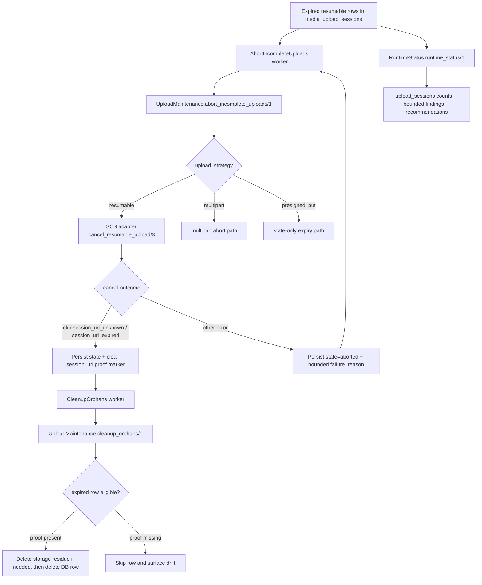

# Phase 40: Maintenance + Cancel Contract - Research

**Researched:** 2026-05-07 [VERIFIED: system date]
**Domain:** Resumable-upload maintenance, operator reporting, and cancel idempotency in Rindle's existing maintenance lane [VERIFIED: codebase grep]
**Confidence:** HIGH [VERIFIED: codebase grep] [CITED: https://docs.cloud.google.com/storage/docs/performing-resumable-uploads] [CITED: https://docs.cloud.google.com/storage/docs/resumable-uploads]

<user_constraints>
## User Constraints (from CONTEXT.md) [VERIFIED: codebase grep]

### Locked Decisions [VERIFIED: codebase grep]
- **D-01:** Keep the public contract narrow. Do not add a new public cancel-failure state, new public return tuple family, or a new durable FSM state such as `"cancel_failed"`. [VERIFIED: codebase grep]
- **D-02:** When resumable remote cancel fails for a non-idempotent reason, the row stays in terminal `"aborted"` with a bounded, operator-facing `failure_reason` taxonomy rather than raw `inspect(reason)` output. [VERIFIED: codebase grep]
- **D-03:** The `failure_reason` vocabulary should stay low-cardinality and action-oriented, e.g. `resumable_cancel_failed:goth_unconfigured`, `resumable_cancel_failed:gcs_http_4xx`, `resumable_cancel_failed:gcs_http_5xx`, `resumable_cancel_failed:transport`. [VERIFIED: codebase grep]
- **D-04:** `{:error, :session_uri_unknown}` and `{:error, :session_uri_expired}` remain idempotent success for maintenance cleanup and must not be recorded as failures. [VERIFIED: codebase grep]
- **D-05:** `abort_incomplete_uploads/1` is the only maintenance step allowed to perform resumable remote cancel. `cleanup_orphans/1` must not issue provider cancel requests on its own. [VERIFIED: codebase grep]
- **D-06:** Resumable rows become cleanup-eligible only after local proof that remote cancel already succeeded or was idempotently resolved. The preferred proof marker is clearing `session_uri` after successful/idempotent cancel. [VERIFIED: codebase grep]
- **D-07:** `cleanup_orphans/1` may delete resumable rows only when they are in `"expired"` and satisfy the local proof marker above. If a resumable row is `"expired"` but still retains its cancel-required marker, cleanup skips it and reports the drift instead of deleting silently. [VERIFIED: codebase grep]
- **D-08:** Remote cancel stays outside DB transactions and inside the abort lane's retryable maintenance flow, preserving the existing Rindle pattern that network side effects are not hidden inside persistence work. [VERIFIED: codebase grep]
- **D-09:** Keep `upload_sessions` as the primary runtime-status section. Do not add a new top-level `resumable_sessions` report. [VERIFIED: codebase grep]
- **D-10:** Add a bounded nested resumable summary under `upload_sessions` carrying exactly the Phase 40 counters: `resumable_sessions_pending`, `resumable_sessions_expired`, `resumable_session_uris_stale`. [VERIFIED: codebase grep]
- **D-11:** Reuse the existing top-level `recommendations` surface for repair guidance. Do not invent resumable-only repair verbs when the correct operator action is still the maintenance lane (`abort_incomplete_uploads` then `cleanup_orphans`). [VERIFIED: codebase grep]
- **D-12:** `runtime_status` must never expose `session_uri`, partial URIs, offset details, provider headers, or other protocol-debugging internals. [VERIFIED: codebase grep]
- **D-13:** The secret-gated real-GCS lane should prove exactly two end-to-end maintenance scenarios with intermediate assertions: initiate -> cancel/idempotent cancel -> runtime_status visible -> cleanup, and initiate -> expire -> runtime_status visible -> cleanup. [VERIFIED: codebase grep]
- **D-14:** The live lane should assert stable public/operator surfaces: maintenance reports, persisted row transitions, and `runtime_status` output. Do not make worker telemetry the main live proof target. [VERIFIED: codebase grep]
- **D-15:** Richer branch/error permutations stay in local ExUnit coverage using existing Bypass-style seams. The live lane should stay thin enough to preserve trust without becoming a flaky conformance matrix. [VERIFIED: codebase grep]
- **D-16:** For this phase, downstream researcher/planner/executor work should synthesize one coherent recommendation set, decide by default, and escalate only for high-blast-radius choices such as semver-significant public reshapes, security boundary changes, destructive irreversibility, or major CI/runtime cost surprises. [VERIFIED: codebase grep]

### Claude's Discretion [VERIFIED: codebase grep]
- Exact low-cardinality `failure_reason` strings, as long as they stay bounded, operator-meaningful, and non-public. [VERIFIED: codebase grep]
- Exact local proof mechanism for cleanup eligibility, as long as it is durable, privacy-safe, and prevents silent deletion of remotely-uncancelled resumable rows. [VERIFIED: codebase grep]
- Exact placement of resumable counters in text/JSON formatter output, as long as `upload_sessions` remains the primary section and no duplicate top-level resumable report is introduced. [VERIFIED: codebase grep]

### Deferred Ideas (OUT OF SCOPE) [VERIFIED: codebase grep]
None — discussion stayed within phase scope. [VERIFIED: codebase grep]
</user_constraints>

<phase_requirements>
## Phase Requirements [VERIFIED: codebase grep]

| ID | Description | Research Support |
|----|-------------|------------------|
| RESUMABLE-09 | `abort_incomplete_uploads/1` must cancel resumable sessions, treat `:session_uri_unknown` and `:session_uri_expired` as idempotent success, and distinguish resumable abort counters. [VERIFIED: codebase grep] | Use the existing abort lane and worker telemetry boundary; extend the timeout query to include `"resuming"` and classify cancel outcomes using the officially documented GCS session-invalid responses plus the repo's locked atom mapping. [VERIFIED: codebase grep] [CITED: https://docs.cloud.google.com/storage/docs/performing-resumable-uploads] [CITED: https://docs.cloud.google.com/storage/docs/resumable-uploads] |
| RESUMABLE-10 | Local deletion must happen only after success-or-idempotent remote cancel; remote-failure rows stay `"aborted"` with bounded `failure_reason` and are retryable. [VERIFIED: codebase grep] | Keep remote cancel in `abort_incomplete_uploads/1`, clear `session_uri` as the cleanup proof marker, and make worker-level failure propagation explicit so Oban retries actually happen for per-session cancel failures. [VERIFIED: codebase grep] |
| RESUMABLE-11 | `mix rindle.runtime_status` must surface bounded resumable counters without exposing URIs. [VERIFIED: codebase grep] | Reuse `upload_sessions.counts`, add a nested resumable summary or additive count keys, and keep recommendations on the existing cleanup surface. The formatter already prints whatever appears in `upload_sessions.counts`; no new top-level report is needed. [VERIFIED: codebase grep] |
</phase_requirements>

## Summary

Phase 40 should be planned as a backend-only extension of the existing two-step maintenance lane, not as a new resumable subsystem. The codebase already centralizes timeout selection in `Rindle.Ops.UploadMaintenance.abort_incomplete_uploads/1`, destructive removal in `cleanup_orphans/1`, worker telemetry in `Rindle.Workers.AbortIncompleteUploads` and `Rindle.Workers.CleanupOrphans`, and operator read models in `Rindle.Ops.RuntimeStatus.runtime_status/1`; the phase work is to make those existing seams resumable-aware and idempotent. [VERIFIED: codebase grep]

Google still documents the load-bearing GCS resumable semantics this phase depends on: status probing is a zero-length `PUT` using `Content-Range: bytes */OBJECT_SIZE`; session URIs expire after one week; JSON API cancellation is an explicit `DELETE` against the session URI; cancelled/invalid sessions later return `4xx`; and expired/invalid session URIs return `410 Gone` when the session is less than a week old and `404 Not Found` when it is older than a week. Those semantics line up with the repo's existing `:session_uri_expired` and `:session_uri_unknown` adapter mappings and justify treating exactly those two atoms as idempotent success in maintenance. [CITED: https://docs.cloud.google.com/storage/docs/performing-resumable-uploads] [CITED: https://docs.cloud.google.com/storage/docs/resumable-uploads] [VERIFIED: codebase grep]

The main planning-critical gap is retry behavior. Today `abort_incomplete_uploads/1` always returns `{:ok, report}` after per-session failures, and `Rindle.Workers.AbortIncompleteUploads.perform/1` always returns `:ok` on such reports, so Oban does not currently retry per-session abort failures. If Phase 40 must satisfy the roadmap and requirement language about "existing Oban backoff retries," the plan must explicitly add worker-visible failure propagation for non-idempotent resumable cancel errors. [VERIFIED: codebase grep]

**Primary recommendation:** Implement resumable cancel only in `abort_incomplete_uploads/1`, clear `session_uri` on success or idempotent cancel as the cleanup proof marker, keep failed rows in `"aborted"` with a bounded `failure_reason`, and make abort-worker retries observable by turning per-session cancel failures into worker failure when `abort_errors > 0`. [VERIFIED: codebase grep] [CITED: https://docs.cloud.google.com/storage/docs/performing-resumable-uploads]

## Architectural Responsibility Map

| Capability | Primary Tier | Secondary Tier | Rationale |
|------------|-------------|----------------|-----------|
| Timed-out resumable cancel orchestration | API / Backend [ASSUMED] | Database / Storage [ASSUMED] | `abort_incomplete_uploads/1` is service-layer code that selects DB rows, calls the storage adapter over HTTP, and writes session state changes; the browser is not in this flow. [VERIFIED: codebase grep] |
| Cleanup deletion eligibility proof | Database / Storage [ASSUMED] | API / Backend [ASSUMED] | The proof marker is persisted on `media_upload_sessions`, and `cleanup_orphans/1` decides whether the row can be deleted from DB and storage based on that local state. [VERIFIED: codebase grep] |
| Worker retries and cleanup telemetry | API / Backend [ASSUMED] | — | Both maintenance workers are Oban workers that wrap the service layer and emit `[:rindle, :cleanup, :run]` after service completion. [VERIFIED: codebase grep] |
| Operator `runtime_status` resumable counters | API / Backend [ASSUMED] | Database / Storage [ASSUMED] | `runtime_status/1` builds a read-only report from DB aggregates and bounded findings, then the Mix task renders that report in text or JSON. [VERIFIED: codebase grep] |
| Real-GCS end-to-end proof lane | API / Backend [ASSUMED] | External GCS service [ASSUMED] | The existing secret-gated GCS tests run inside ExUnit and call real GCS over Goth + Finch. [VERIFIED: codebase grep] |

## Standard Stack

### Core
| Library | Version | Purpose | Why Standard |
|---------|---------|---------|--------------|
| `ecto_sql` | Repo lock `3.13.5`; Hex latest `3.13.5` published 2026-03-03 [VERIFIED: mix.lock] [VERIFIED: hex.pm API] | Query and update `media_upload_sessions` during abort, cleanup, and runtime-status aggregation. [VERIFIED: codebase grep] | All relevant services already use Ecto queries and changesets; Phase 40 is additive on those exact seams. [VERIFIED: codebase grep] |
| `oban` | Repo lock `2.21.1`; Hex latest `2.22.1` published 2026-04-30 [VERIFIED: mix.lock] [VERIFIED: hex.pm API] | Retryable maintenance workers and cron scheduling. [VERIFIED: codebase grep] | `AbortIncompleteUploads` and `CleanupOrphans` already run as Oban workers with `max_attempts: 3`; the phase should extend that lane, not replace it. [VERIFIED: codebase grep] |
| `goth` | Repo lock `1.4.5`; Hex latest `1.4.5` published 2024-12-20 [VERIFIED: mix.lock] [VERIFIED: hex.pm API] | Bearer-token auth for real GCS resumable calls. [VERIFIED: codebase grep] | The existing GCS client and live tests already resolve auth through Goth; Phase 40's real proof lane should reuse that runtime. [VERIFIED: codebase grep] |
| `finch` | Repo lock `0.21.0`; Hex latest `0.21.0` published 2026-01-22 [VERIFIED: mix.lock] [VERIFIED: hex.pm API] | Direct HTTP control of resumable status and cancel requests. [VERIFIED: codebase grep] | The GCS client already implements status and cancel via Finch; no new HTTP layer is needed for maintenance work. [VERIFIED: codebase grep] |
| `jason` | Repo lock `1.4.4`; Hex latest `1.4.5` published 2026-05-05 [VERIFIED: mix.lock] [VERIFIED: hex.pm API] | JSON report output and existing GCS payload parsing. [VERIFIED: codebase grep] | `mix rindle.runtime_status --format json` and the GCS client already depend on Jason, so the phase can keep JSON output additive and bounded. [VERIFIED: codebase grep] |

### Supporting
| Library | Version | Purpose | When to Use |
|---------|---------|---------|-------------|
| `mox` | Repo lock `1.2.0`; Hex latest `1.2.0` published 2024-08-14 [VERIFIED: mix.lock] [VERIFIED: hex.pm API] | Mocking adapter callbacks and worker/service seam behavior. [VERIFIED: codebase grep] | Use for unit tests that need to prove `cancel_resumable_upload/3` branching, failure taxonomy, and worker retry propagation without real GCS. [VERIFIED: codebase grep] |
| `bypass` | Repo lock `2.1.0`; Hex latest `2.1.0` published 2020-11-13 [VERIFIED: mix.lock] [VERIFIED: hex.pm API] | HTTP-level protocol tests for GCS status/cancel mappings. [VERIFIED: codebase grep] | Use for local protocol and error-mapping coverage; the repo already exercises `404`/`410` status and `DELETE` cancel behavior this way. [VERIFIED: codebase grep] |

### Alternatives Considered
| Instead of | Could Use | Tradeoff |
|------------|-----------|----------|
| Existing two-step maintenance lane [VERIFIED: codebase grep] | A resumable-only cleanup worker [ASSUMED] | That would duplicate retry, reporting, and scheduling responsibilities the codebase already centralizes in `AbortIncompleteUploads` plus `CleanupOrphans`. [VERIFIED: codebase grep] |
| Existing Finch-based GCS client [VERIFIED: codebase grep] | A new GCS SDK surface [ASSUMED] | Phase 40 needs only the already-implemented status/cancel semantics; adding a second client surface would increase blast radius without reducing protocol work here. [VERIFIED: codebase grep] |
| Existing `upload_sessions` runtime-status section [VERIFIED: codebase grep] | A new top-level `resumable_sessions` report [ASSUMED] | The current formatter already renders `upload_sessions.counts`, and the context locks the section to stay under `upload_sessions`. [VERIFIED: codebase grep] |

**Installation:** No new dependencies are required for Phase 40; use the repo's existing lockfile and optional GCS deps. [VERIFIED: mix.exs] [VERIFIED: mix.lock]
```bash
mix deps.get
```

## Architecture Patterns

### System Architecture Diagram



### Recommended Project Structure
```text
lib/
├── rindle/ops/              # service-layer abort, cleanup, and runtime-status logic
├── rindle/workers/          # Oban retry boundary and cleanup telemetry
└── mix/tasks/               # operator-facing text/JSON wrappers
test/
├── rindle/ops/              # service-level maintenance and runtime-status tests
├── rindle/storage/gcs/      # Bypass protocol-mapping tests
└── rindle/upload/           # secret-gated live GCS proof seams already in use
```

### Pattern 1: Abort Lane Owns Remote Cancel
**What:** `abort_incomplete_uploads/1` should remain the only place that performs resumable remote cancel, because it is already the timeout-selection service and the only maintenance seam that can safely mix DB reads with retryable network side effects. [VERIFIED: codebase grep] [CITED: https://docs.cloud.google.com/storage/docs/performing-resumable-uploads]
**When to use:** Any timed-out resumable row in `"signed"`, `"resuming"`, or `"uploading"` that still has a live `session_uri`. [VERIFIED: codebase grep]
**Example:**
```elixir
# Source: lib/rindle/ops/upload_maintenance.ex + docs.cloud.google.com/storage/docs/performing-resumable-uploads
case adapter.cancel_resumable_upload(session.upload_key, session.session_uri, opts) do
  {:ok, _} ->
    %{state: "expired", session_uri: nil, failure_reason: nil, proof: :cancelled}

  {:error, reason} when reason in [:session_uri_unknown, :session_uri_expired] ->
    %{state: "expired", session_uri: nil, failure_reason: nil, proof: :idempotent}

  {:error, :goth_unconfigured} ->
    %{state: "aborted", failure_reason: "resumable_cancel_failed:goth_unconfigured"}

  {:error, {:gcs_http_error, %{status: status}}} when status in 400..499 ->
    %{state: "aborted", failure_reason: "resumable_cancel_failed:gcs_http_4xx"}

  {:error, {:gcs_http_error, %{status: status}}} when status >= 500 ->
    %{state: "aborted", failure_reason: "resumable_cancel_failed:gcs_http_5xx"}

  {:error, _} ->
    %{state: "aborted", failure_reason: "resumable_cancel_failed:transport"}
end
```

### Pattern 2: Cleanup Lane Is Local-Only And Proof-Gated
**What:** `cleanup_orphans/1` should only examine local session state and proof markers; it should never call GCS cancel itself. [VERIFIED: codebase grep]
**When to use:** Destructive cleanup of rows already in `"expired"` after the abort lane proved the remote session is gone or idempotently invalid. [VERIFIED: codebase grep]
**Example:**
```elixir
# Source: lib/rindle/ops/upload_maintenance.ex
defp resumable_cleanup_eligible?(session) do
  session.state == "expired" and
    session.upload_strategy == "resumable" and
    is_nil(session.session_uri)
end
```

### Pattern 3: Runtime Status Stays Bounded And Aggregate-First
**What:** `runtime_status/1` should surface resumable state through additive counters and bounded samples, not through session-URI dumps or unbounded per-row listings. [VERIFIED: codebase grep]
**When to use:** Any operator-facing visibility for stuck, expired, or stale resumable sessions. [VERIFIED: codebase grep]
**Example:**
```elixir
# Source: lib/rindle/ops/runtime_status.ex
resumable_summary = %{
  resumable_sessions_pending: pending_resumable_count(repo, filters),
  resumable_sessions_expired: expired_resumable_count(repo, now, filters),
  resumable_session_uris_stale: stale_session_uri_count(repo, now, filters)
}

put_in(report.upload_sessions[:resumable], resumable_summary)
```

### Anti-Patterns to Avoid
- **Remote cancel in `cleanup_orphans/1`:** That would create a second network-side-effect path and break the locked ownership split. [VERIFIED: codebase grep]
- **Treating all `4xx` cancel failures as idempotent:** Google documents only invalid/expired session-URI cases as `404` or `410`; other `4xx` responses should stay failure-classified and operator-visible. [CITED: https://docs.cloud.google.com/storage/docs/resumable-uploads] [CITED: https://docs.cloud.google.com/storage/docs/performing-resumable-uploads]
- **Deleting resumable `"expired"` rows with `session_uri` still present:** That would silently discard the only durable handle that proves cancel still needs attention. [VERIFIED: codebase grep]
- **Letting per-session abort failures return `:ok` from the worker:** That suppresses Oban retry for the exact failure path RESUMABLE-10 wants to remain retryable. [VERIFIED: codebase grep]

## Don't Hand-Roll

| Problem | Don't Build | Use Instead | Why |
|---------|-------------|-------------|-----|
| Retry scheduling for failed cancel attempts [VERIFIED: codebase grep] | A custom retry loop or ad-hoc cron requeue [ASSUMED] | Existing `Oban.Worker` retry path, but with worker-visible failure on `abort_errors > 0` [VERIFIED: codebase grep] | Oban already owns attempts, backoff, and failure visibility; the missing piece is error propagation, not a new retry system. [VERIFIED: codebase grep] |
| Resumable protocol error parsing [VERIFIED: codebase grep] | New status-code heuristics in maintenance [ASSUMED] | Existing GCS client atom mapping plus bounded local taxonomy translation [VERIFIED: codebase grep] | The client already maps `404` to `:session_uri_unknown`, `410` to `:session_uri_expired`, and generic failures to `{:gcs_http_error, ...}`. [VERIFIED: codebase grep] |
| Operator-facing resumable dashboard [VERIFIED: codebase grep] | A new top-level status command [ASSUMED] | Existing `runtime_status` counts and recommendations surface [VERIFIED: codebase grep] | The current report is already bounded, filterable, and rendered in both text and JSON. [VERIFIED: codebase grep] |

**Key insight:** The hard part in this phase is contract coherence, not new infrastructure: one owner for cancel, one local proof marker for cleanup, one bounded status surface, and one worker retry boundary. [VERIFIED: codebase grep]

## Common Pitfalls

### Pitfall 1: Assuming Oban Retries Already Cover Per-Session Cancel Failures
**What goes wrong:** Non-idempotent resumable cancel failures are counted inside the report but the abort worker still returns `:ok`, so Oban does not retry the failed maintenance pass. [VERIFIED: codebase grep]
**Why it happens:** `abort_incomplete_uploads/1` returns `{:ok, report}` for per-session failures, and `Rindle.Workers.AbortIncompleteUploads.perform/1` treats any report as success. [VERIFIED: codebase grep]
**How to avoid:** Make the worker fail when `report.abort_errors > 0`, or make the service return an error tuple that the worker can propagate without losing the report contents. [VERIFIED: codebase grep]
**Warning signs:** Rows stay `"aborted"` with resumable cancel failures, but no Oban retry attempts occur after the first worker run. [VERIFIED: codebase grep]

### Pitfall 2: Cleanup Deletes Resumable Rows Without Cancel Proof
**What goes wrong:** The cleanup lane can remove the row that still contains the only durable cancel handle, making later remote remediation impossible. [VERIFIED: codebase grep]
**Why it happens:** Current cleanup logic selects every `state == "expired"` row and deletes it after storage cleanup logic, without resumable-specific proof gating. [VERIFIED: codebase grep]
**How to avoid:** Gate resumable deletion on a durable local proof marker such as `session_uri == nil`, and count proof-missing rows as drift instead of deleting them. [VERIFIED: codebase grep]
**Warning signs:** `session_uri` remains populated on `"expired"` rows or rows disappear without a prior cancel-success marker. [VERIFIED: codebase grep]

### Pitfall 3: Letting Raw Provider Detail Leak Into Operator Surfaces
**What goes wrong:** `session_uri` or raw GCS failures leak into logs, `failure_reason`, or `runtime_status`, turning a bearer credential into routine diagnostics. [VERIFIED: codebase grep]
**Why it happens:** Resumable maintenance needs richer branching, and the easiest debugging path is often `inspect(reason)`. The project explicitly forbids that for session URIs and raw provider transcripts. [VERIFIED: codebase grep]
**How to avoid:** Keep `failure_reason` low-cardinality, redact `session_uri` everywhere, and count stale URIs instead of listing them. [VERIFIED: codebase grep]
**Warning signs:** A failing test or log line contains a URI, upload ID fragment, provider header, or raw GCS body. [VERIFIED: codebase grep]

### Pitfall 4: Counting Stale Session URIs In A Way That Fights The Cleanup Proof Marker
**What goes wrong:** The status counter becomes meaningless or double-counted if it does not distinguish "expired URI still retained" from "session already resolved and cleared." [VERIFIED: codebase grep]
**Why it happens:** The preferred proof marker is clearing `session_uri`, which means stale-URI visibility must be defined as "expired and still retained," not merely "past `session_uri_expires_at`." [VERIFIED: codebase grep]
**How to avoid:** Define `resumable_session_uris_stale` as resumable rows with `session_uri_expires_at < now()` and `session_uri IS NOT NULL`. [VERIFIED: codebase grep]
**Warning signs:** The stale count rises for rows whose session URI has already been cleared or deleted. [VERIFIED: codebase grep]

## Code Examples

Verified patterns from official sources and the codebase:

### GCS Status Probe Contract
```http
# Source: https://docs.cloud.google.com/storage/docs/performing-resumable-uploads
PUT SESSION_URI
Content-Length: 0
Content-Range: bytes */OBJECT_SIZE
```

### Existing Worker Telemetry Boundary
```elixir
# Source: lib/rindle/workers/abort_incomplete_uploads.ex
case UploadMaintenance.abort_incomplete_uploads([]) do
  {:ok, report} ->
    :telemetry.execute(
      [:rindle, :cleanup, :run],
      %{sessions_aborted: report.sessions_aborted},
      %{profile: :unknown, adapter: :unknown, worker: __MODULE__}
    )
end
```

### Existing Runtime-Status Aggregate Shape
```elixir
# Source: lib/rindle/ops/runtime_status.ex
counts =
  from(s in MediaUploadSession, select: {s.state, count(s.id)})
  |> group_by([s], s.state)
  |> Config.repo().all()
  |> count_map()
```

## State of the Art

| Old Approach | Current Approach | When Changed | Impact |
|--------------|------------------|--------------|--------|
| Expire by coarse state only (`"signed"` or `"uploading"`) [VERIFIED: codebase grep] | Phase 40 must include `"resuming"` for resumable timeout sweeps. [VERIFIED: codebase grep] | Phase 38 introduced `"resuming"` on 2026-05-07. [VERIFIED: codebase grep] | Prevents resumed-but-stuck sessions from escaping maintenance. [VERIFIED: codebase grep] |
| Delete every `"expired"` session during cleanup [VERIFIED: codebase grep] | Delete resumable rows only after local cancel proof exists. [VERIFIED: codebase grep] | Locked in Phase 40 context on 2026-05-07. [VERIFIED: codebase grep] | Preserves the durable cancel handle and makes cleanup idempotent instead of silent. [VERIFIED: codebase grep] |
| Operator visibility only by coarse upload-session state counts and expired/failed samples [VERIFIED: codebase grep] | Add bounded resumable counters under `upload_sessions` with no raw URI exposure. [VERIFIED: codebase grep] | Locked in Phase 40 context on 2026-05-07. [VERIFIED: codebase grep] | Gives operators a resumable-specific signal without widening the public surface. [VERIFIED: codebase grep] |

**Deprecated/outdated:**
- Treating `{:error, :not_found}` and `{:error, :session_expired}` as the phase contract is outdated; the current locked atoms are `:session_uri_unknown` and `:session_uri_expired`. [VERIFIED: codebase grep] [VERIFIED: .planning/research/v1.6-CANDIDATE-GCS.md]

## Assumptions Log

| # | Claim | Section | Risk if Wrong |
|---|-------|---------|---------------|
| A1 | The responsibility tiers are best modeled as API / Backend plus Database / Storage, with no frontend/server rendering tier involved. [ASSUMED] | Architectural Responsibility Map | Low; it affects task grouping, not implementation semantics. |
| A2 | A separate resumable-only worker or report would be strictly worse than extending the existing maintenance/status surfaces. [ASSUMED] | Standard Stack / Alternatives Considered | Low; the context already strongly constrains this, but the judgment itself is architectural rather than protocol-factual. |

## Open Questions (RESOLVED)

1. **How should the worker surface per-session cancel failures to trigger retries while preserving the detailed report?**
   - Resolved decision: Keep the public `abort_incomplete_uploads/1` service contract as `{:ok, report}` with additive counters, and make `Rindle.Workers.AbortIncompleteUploads` return a job error when `report.abort_errors > 0`. [VERIFIED: codebase grep]
   - Why: This is the smallest contract change that preserves operator-facing counts, keeps the maintenance report family stable, and re-engages existing Oban retry/backoff for non-idempotent resumable cancel failures. [VERIFIED: codebase grep]
   - Planning consequence: Phase 40 Plan 01 also adds an internal retry-selection path for resumable rows already marked `"aborted"` with `resumable_cancel_failed:*` and a retained `session_uri`, so worker retries can reattempt cancel without widening the public task API. [VERIFIED: .planning/phases/40-maintenance-cancel-contract/40-01-PLAN.md]

2. **Where should the resumable counters live inside `upload_sessions`?**
   - Resolved decision: Keep `upload_sessions` as the primary top-level section and add a nested `upload_sessions.resumable` summary carrying exactly `resumable_sessions_pending`, `resumable_sessions_expired`, and `resumable_session_uris_stale`. [VERIFIED: codebase grep]
   - Why: A nested summary keeps lifecycle-state counts distinct from resumable operational counters while preserving the locked "no second top-level resumable report" rule in context. [VERIFIED: codebase grep]
   - Planning consequence: Phase 40 Plan 03 updates the Mix formatter to render this nested summary inside the existing `Upload sessions:` section in both text and JSON without exposing `session_uri` or related protocol details. [VERIFIED: .planning/phases/40-maintenance-cancel-contract/40-03-PLAN.md]

## Environment Availability

| Dependency | Required By | Available | Version | Fallback |
|------------|------------|-----------|---------|----------|
| `mix` | ExUnit validation commands and Mix tasks. [VERIFIED: codebase grep] | ✓ [VERIFIED: shell command] | `1.19.5` [VERIFIED: shell command] | — |
| `elixir` | All implementation and tests. [VERIFIED: codebase grep] | ✓ [VERIFIED: shell command] | `1.19.5` on OTP 28 [VERIFIED: shell command] | — |
| `psql` | Local Postgres-backed test/dev workflows. [VERIFIED: codebase grep] | ✓ [VERIFIED: shell command] | `14.17` [VERIFIED: shell command] | Existing test setup already boots repos in ExUnit. [VERIFIED: test/test_helper.exs] |
| `jq` | Hex/package verification and JSON inspection during planning or manual ops. [VERIFIED: shell command] | ✓ [VERIFIED: shell command] | `1.7.1` [VERIFIED: shell command] | `mix run` or raw `curl` if needed. [ASSUMED] |
| `curl` | External package/doc verification and manual GCS debugging. [VERIFIED: shell command] | ✓ [VERIFIED: shell command] | `8.7.1` [VERIFIED: shell command] | Finch-based Elixir scripts. [ASSUMED] |
| `GOOGLE_APPLICATION_CREDENTIALS_JSON` | Secret-gated real GCS proof lane. [VERIFIED: codebase grep] | ✗ [VERIFIED: shell command] | — | None for true end-to-end proof; local Bypass tests cover protocol branches only. [VERIFIED: codebase grep] |
| `RINDLE_GCS_BUCKET` | Secret-gated real GCS proof lane. [VERIFIED: codebase grep] | ✗ [VERIFIED: shell command] | — | None for true end-to-end proof; local Bypass tests cover protocol branches only. [VERIFIED: codebase grep] |

**Missing dependencies with no fallback:**
- Real GCS maintenance proof cannot run in this environment until both `GOOGLE_APPLICATION_CREDENTIALS_JSON` and `RINDLE_GCS_BUCKET` are present. [VERIFIED: shell command] [VERIFIED: codebase grep]

**Missing dependencies with fallback:**
- None. [VERIFIED: shell command]

## Validation Architecture

### Test Framework
| Property | Value |
|----------|-------|
| Framework | ExUnit on Elixir `1.19.5`; Oban testing is enabled in `test/test_helper.exs`. [VERIFIED: test/test_helper.exs] [VERIFIED: shell command] |
| Config file | `test/test_helper.exs` [VERIFIED: test/test_helper.exs] |
| Quick run command | `mix test test/rindle/ops/upload_maintenance_test.exs test/rindle/ops/runtime_status_test.exs test/rindle/storage/gcs/client_test.exs` [VERIFIED: execution] |
| Full suite command | `mix test` [VERIFIED: mix.exs] |

### Phase Requirements → Test Map
| Req ID | Behavior | Test Type | Automated Command | File Exists? |
|--------|----------|-----------|-------------------|-------------|
| RESUMABLE-09 | Abort lane queries resumable timed-out rows, calls adapter cancel, counts idempotent `:session_uri_unknown` and `:session_uri_expired` as success, and reports resumable abort counts. [VERIFIED: codebase grep] | unit + protocol [VERIFIED: codebase grep] | `mix test test/rindle/ops/upload_maintenance_test.exs test/rindle/storage/gcs/client_test.exs` [VERIFIED: execution] | ✅ [VERIFIED: codebase grep] |
| RESUMABLE-10 | Cleanup deletes only proof-marked resumable rows; failed cancel rows stay `"aborted"` with bounded `failure_reason`; worker retries on abort errors. [VERIFIED: codebase grep] | unit + worker [VERIFIED: codebase grep] | `mix test test/rindle/ops/upload_maintenance_test.exs test/rindle/workers/maintenance_workers_test.exs` [VERIFIED: codebase grep] | ✅ [VERIFIED: codebase grep] |
| RESUMABLE-11 | `runtime_status` and `mix rindle.runtime_status` expose bounded resumable counters with no URI leakage and existing recommendations surface. [VERIFIED: codebase grep] | unit [VERIFIED: codebase grep] | `mix test test/rindle/ops/runtime_status_test.exs` [VERIFIED: execution] | ✅ [VERIFIED: codebase grep] |

### Sampling Rate
- **Per task commit:** `mix test test/rindle/ops/upload_maintenance_test.exs test/rindle/ops/runtime_status_test.exs test/rindle/storage/gcs/client_test.exs` [VERIFIED: execution]
- **Per wave merge:** `mix test test/rindle/ops/upload_maintenance_test.exs test/rindle/ops/runtime_status_test.exs test/rindle/workers/maintenance_workers_test.exs test/rindle/storage/gcs/client_test.exs` [VERIFIED: codebase grep]
- **Phase gate:** `mix test --only gcs test/rindle/upload/broker_test.exs` once secrets are present, plus the local suite above. [VERIFIED: codebase grep]

### Wave 0 Gaps
- [ ] `test/rindle/ops/upload_maintenance_test.exs` needs resumable-specific cases for `"resuming"` selection, idempotent cancel success, bounded `failure_reason` taxonomy, and proof-gated cleanup. [VERIFIED: codebase grep]
- [ ] `test/rindle/workers/maintenance_workers_test.exs` needs worker retry assertions for `abort_errors > 0` and the expanded `[:rindle, :cleanup, :run]` measurement shape. [VERIFIED: codebase grep]
- [ ] `test/rindle/ops/runtime_status_test.exs` needs resumable counter and redaction assertions. [VERIFIED: codebase grep]
- [ ] A secret-gated live maintenance proof file or new `@tag :gcs` describe block is still missing for initiate -> cancel -> runtime_status -> cleanup and initiate -> expire -> runtime_status -> cleanup. [VERIFIED: codebase grep]

## Security Domain

### Applicable ASVS Categories
| ASVS Category | Applies | Standard Control |
|---------------|---------|-----------------|
| V2 Authentication | no [ASSUMED] | The phase consumes existing service credentials through Goth; it does not add end-user authentication flows. [VERIFIED: codebase grep] |
| V3 Session Management | yes [ASSUMED] | Treat the GCS `session_uri` as a bearer secret: redact it in inspect output, never emit it in telemetry, and never expose it in `runtime_status`. [VERIFIED: codebase grep] [CITED: https://docs.cloud.google.com/storage/docs/resumable-uploads] |
| V4 Access Control | no [ASSUMED] | No new role or authorization boundary is introduced in this phase. [VERIFIED: codebase grep] |
| V5 Input Validation | yes [ASSUMED] | Keep `failure_reason` bounded and derive it from known atoms/status classes rather than free-form provider payloads. [VERIFIED: codebase grep] |
| V6 Cryptography | yes [ASSUMED] | Use existing HTTPS/Goth token flow and avoid leaking the session URI bearer token into logs or reports. [VERIFIED: codebase grep] [CITED: https://docs.cloud.google.com/storage/docs/resumable-uploads] |

### Known Threat Patterns for this stack
| Pattern | STRIDE | Standard Mitigation |
|---------|--------|---------------------|
| Session-URI disclosure in logs, tests, or operator output [VERIFIED: codebase grep] | Information Disclosure [ASSUMED] | Use the existing `Inspect` redaction and keep all maintenance/runtime-status surfaces count-based or taxonomy-based. [VERIFIED: codebase grep] |
| Silent deletion of remotely live resumable sessions [VERIFIED: codebase grep] | Tampering [ASSUMED] | Require a durable local proof marker before cleanup deletes a resumable row. [VERIFIED: codebase grep] |
| Infinite operator confusion from raw provider errors [VERIFIED: codebase grep] | Repudiation [ASSUMED] | Persist a bounded `failure_reason`, keep recommendations on the existing maintenance lane, and expose counts through `runtime_status`. [VERIFIED: codebase grep] |
| Retry suppression for cancel failures [VERIFIED: codebase grep] | Denial of Service [ASSUMED] | Propagate abort errors to the Oban worker so built-in retries and failed-job visibility engage. [VERIFIED: codebase grep] |

## Sources

### Primary (HIGH confidence)
- `https://docs.cloud.google.com/storage/docs/performing-resumable-uploads` - checked resumable status probes, JSON/XML cancel semantics, cancel success codes, and one-week session-expiry language. [CITED: https://docs.cloud.google.com/storage/docs/performing-resumable-uploads]
- `https://docs.cloud.google.com/storage/docs/resumable-uploads` - checked session-URI bearer-token semantics, one-week expiry, 410-vs-404 invalidation behavior, region pinning, and chunk-size guidance. [CITED: https://docs.cloud.google.com/storage/docs/resumable-uploads]
- `mix.exs`, `mix.lock`, and Hex package API - checked repo-locked dependency versions and current Hex latest versions/dates. [VERIFIED: mix.exs] [VERIFIED: mix.lock] [VERIFIED: hex.pm API]
- Codebase seams: `lib/rindle/ops/upload_maintenance.ex`, `lib/rindle/ops/runtime_status.ex`, `lib/rindle/workers/abort_incomplete_uploads.ex`, `lib/rindle/workers/cleanup_orphans.ex`, `lib/rindle/storage/gcs/client.ex`, `test/rindle/ops/upload_maintenance_test.exs`, `test/rindle/ops/runtime_status_test.exs`, `test/rindle/storage/gcs/client_test.exs`, `test/rindle/upload/broker_test.exs`. [VERIFIED: codebase grep]

### Secondary (MEDIUM confidence)
- `.planning/research/v1.6-CANDIDATE-GCS.md` - used only to spot outdated wording and compare earlier recommendations against current locked atoms and phase boundaries. [VERIFIED: .planning/research/v1.6-CANDIDATE-GCS.md]

### Tertiary (LOW confidence)
- None. [VERIFIED: research process]

## Metadata

**Confidence breakdown:**
- Standard stack: HIGH - the phase reuses existing repo dependencies and all listed versions were verified against the lockfile and Hex API. [VERIFIED: mix.lock] [VERIFIED: hex.pm API]
- Architecture: HIGH - the maintenance, runtime-status, worker, and GCS seams are explicit in the current codebase and tightly constrained by the locked phase context. [VERIFIED: codebase grep]
- Pitfalls: HIGH - the key failure modes are visible directly in current code paths and confirmed against official GCS protocol docs where external behavior matters. [VERIFIED: codebase grep] [CITED: https://docs.cloud.google.com/storage/docs/performing-resumable-uploads]

**Research date:** 2026-05-07 [VERIFIED: system date]
**Valid until:** 2026-06-06 for codebase structure; re-check GCS docs and Hex versions earlier if planning slips, because the protocol docs and package releases are externally maintained. [CITED: https://docs.cloud.google.com/storage/docs/performing-resumable-uploads] [VERIFIED: hex.pm API]
