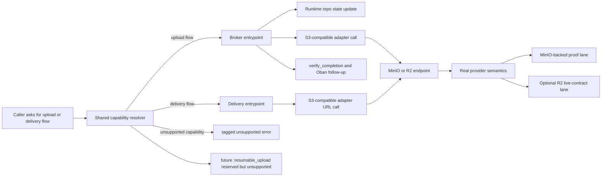

# Phase 8: Storage Capability Confidence - Research

**Researched:** 2026-04-28
**Domain:** storage capability contracts, S3-compatible provider honesty, MinIO proof, Cloudflare R2 compatibility, future GCS resumable boundary
**Confidence:** MEDIUM

<phase_requirements>
## Phase Requirements

| ID | Description | Research Support |
|----|-------------|------------------|
| CAP-01 | Storage adapters advertise precise capability flags for delivery and upload flows (`:presigned_put`, `:multipart_upload`, `:signed_url`, future-resumable-safe extension points) | Centralize capability interpretation in a shared module and stop checking raw atom lists separately in `Rindle.Upload.Broker` and `Rindle.Delivery`. Keep current tagged error families stable. [VERIFIED: .planning/REQUIREMENTS.md] [VERIFIED: lib/rindle/upload/broker.ex] [VERIFIED: lib/rindle/delivery.ex] [VERIFIED: lib/rindle/storage.ex] |
| CAP-02 | MinIO/S3 integration tests exercise both presigned PUT and multipart flows end-to-end against real storage | Reuse the existing MinIO-backed adapter, integration, and adopter suites as the proof base, then add Phase 8 assertions around the centralized capability contract rather than inventing a new harness. [VERIFIED: .planning/REQUIREMENTS.md] [VERIFIED: test/rindle/storage/s3_test.exs] [VERIFIED: test/rindle/upload/lifecycle_integration_test.exs] [VERIFIED: test/adopter/canonical_app/lifecycle_test.exs] [VERIFIED: mix test test/rindle/storage/s3_test.exs --include minio (2026-04-28)] [VERIFIED: mix test test/rindle/upload/lifecycle_integration_test.exs --include integration (2026-04-28)] [VERIFIED: mix test --only adopter test/adopter/canonical_app/lifecycle_test.exs (2026-04-28)] |
| CAP-03 | Cloudflare R2 compatibility is documented and verified so unsupported flows fail explicitly rather than implicitly degrading | Document R2 against the existing S3 adapter seam, because Cloudflare’s official docs show presigned URLs and multipart APIs on the S3-compatible surface; reserve explicit tagged unsupported errors for flows Rindle does not yet expose, especially future resumable uploads. [VERIFIED: .planning/REQUIREMENTS.md] [VERIFIED: lib/rindle/storage/s3.ex] [CITED: https://developers.cloudflare.com/r2/api/s3/presigned-urls/] [CITED: https://developers.cloudflare.com/r2/api/s3/api/] [CITED: https://developers.cloudflare.com/r2/api/s3/tokens/] |
| CAP-04 | Capability negotiation remains extensible for a future GCS resumable adapter without breaking current adapter contracts | Add a forward-declared resumable capability to the centralized contract, but do not add a public resumable API or a GCS adapter in Phase 8; Google’s resumable flow is a distinct POST-then-PUT session model and should remain deferred. [VERIFIED: .planning/REQUIREMENTS.md] [VERIFIED: .planning/PROJECT.md] [CITED: https://cloud.google.com/storage/docs/resumable-uploads] [CITED: https://cloud.google.com/storage/docs/performing-resumable-uploads] |
</phase_requirements>

## Summary

Phase 8 should be planned as a contract-hardening phase, not as a new storage-adapter phase. The current code already has the needed runtime flows for direct presigned PUT upload, multipart upload, and signed delivery, but capability enforcement is split between `Rindle.Upload.Broker` and `Rindle.Delivery`, while adapter `capabilities/0` values still mix adopter-facing flow flags with internal traits such as `:head` and `:local`. That shape is good enough for Phase 7 execution, but it is not yet the centralized, documented, forward-compatible contract CAP-01 asks for. [VERIFIED: lib/rindle/storage.ex] [VERIFIED: lib/rindle/upload/broker.ex] [VERIFIED: lib/rindle/delivery.ex] [VERIFIED: lib/rindle/storage/s3.ex] [VERIFIED: lib/rindle/storage/local.ex]

The good news is that MinIO-backed proof already exists and is substantive. The S3 adapter suite exercises presigned PUT and multipart primitives against real MinIO, the integration suite exercises broker flows, and the adopter lane exercises both direct-upload and multipart end-to-end through promotion, variant processing, signed delivery, attach, and detach. Phase 8 should build on those tests, not replace them. [VERIFIED: test/rindle/storage/s3_test.exs] [VERIFIED: test/rindle/upload/lifecycle_integration_test.exs] [VERIFIED: test/adopter/canonical_app/lifecycle_test.exs] [VERIFIED: mix test test/rindle/storage/s3_test.exs --include minio (2026-04-28)] [VERIFIED: mix test test/rindle/upload/lifecycle_integration_test.exs --include integration (2026-04-28)] [VERIFIED: mix test --only adopter test/adopter/canonical_app/lifecycle_test.exs (2026-04-28)]

The main provider-risk finding is not that R2 obviously lacks the current Rindle flows. Cloudflare’s official R2 docs document S3-compatible presigned URLs and multipart APIs, so the safer Phase 8 posture is: do not invent a separate R2 adapter yet, do not over-claim unsupported behavior without a real failing proof, and do make the capability catalog explicit enough that future non-S3 flows such as GCS resumable upload fail through a single tagged contract instead of ad hoc checks. [CITED: https://developers.cloudflare.com/r2/api/s3/presigned-urls/] [CITED: https://developers.cloudflare.com/r2/api/s3/api/] [CITED: https://cloud.google.com/storage/docs/resumable-uploads]

**Primary recommendation:** keep `capabilities/0` as the adapter callback for now, but add a shared capability resolver/canonical catalog module, route both upload and delivery gates through it, update stale capability docs, and add an R2-specific documentation plus optional live-contract lane without changing current adopter-facing error tuple families. [VERIFIED: lib/rindle/storage.ex] [VERIFIED: lib/rindle/upload/broker.ex] [VERIFIED: lib/rindle/delivery.ex] [VERIFIED: guides/secure_delivery.md] [VERIFIED: guides/profiles.md]

## Architectural Responsibility Map

| Capability | Primary Tier | Secondary Tier | Rationale |
|------------|-------------|----------------|-----------|
| Capability declaration | API / Backend | Storage | Adapters expose raw capability atoms, but the application should own the meaning of those atoms so provider honesty is enforced consistently. [VERIFIED: lib/rindle/storage.ex] [VERIFIED: lib/rindle/storage/s3.ex] [VERIFIED: lib/rindle/storage/local.ex] |
| Upload capability gate | API / Backend | Storage | Multipart initiation, part signing, and completion are already broker-owned decisions and should stay there, but the gate should move to a shared capability resolver. [VERIFIED: lib/rindle/upload/broker.ex] |
| Delivery capability gate | API / Backend | Storage | Signed delivery support is currently enforced in `Rindle.Delivery`; that logic should consume the same centralized contract as upload flows. [VERIFIED: lib/rindle/delivery.ex] |
| Direct upload byte transfer | Browser / Client | Storage | Both presigned PUT and multipart part uploads are direct-to-storage client flows, not Phoenix-proxied byte streams. [VERIFIED: test/adopter/canonical_app/lifecycle_test.exs] |
| Real-provider verification | Storage | API / Backend | MinIO and future R2 live lanes validate the storage-facing truth, while the app layer validates the tagged failure contract and docs. [VERIFIED: test/rindle/storage/s3_test.exs] [VERIFIED: .github/workflows/ci.yml] |
| Future resumable upload support | API / Backend | Storage | GCS resumable upload starts with a server-created session URI and is a different protocol family, so the capability boundary must reserve space for it without exposing it yet. [CITED: https://cloud.google.com/storage/docs/performing-resumable-uploads] |

## Standard Stack

### Core

| Library / Module | Version | Purpose | Why Standard |
|------------------|---------|---------|--------------|
| `Rindle.Storage` | repo code surface [VERIFIED: lib/rindle/storage.ex] | Adapter behavior boundary and existing capability callback surface. [VERIFIED: lib/rindle/storage.ex] | Phase 8 should harden this seam rather than introduce a second capability system. [VERIFIED: lib/rindle/storage.ex] |
| `Rindle.Upload.Broker` | repo code surface [VERIFIED: lib/rindle/upload/broker.ex] | Upload lifecycle orchestration, including direct PUT, multipart, verification, and tagged upload-unsupported errors. [VERIFIED: lib/rindle/upload/broker.ex] | Upload capability checks already live here, so centralization should be an extraction, not a redesign. [VERIFIED: lib/rindle/upload/broker.ex] |
| `Rindle.Delivery` | repo code surface [VERIFIED: lib/rindle/delivery.ex] | Delivery policy and signed-URL capability enforcement. [VERIFIED: lib/rindle/delivery.ex] | Delivery already establishes the tagged unsupported-error pattern Phase 8 should reuse. [VERIFIED: lib/rindle/delivery.ex] [VERIFIED: test/rindle/delivery_test.exs] |
| `Rindle.Storage.S3` | `ex_aws_s3 2.5.9` + `ex_aws 2.6.1` [VERIFIED: deps/ex_aws_s3/mix.exs] [VERIFIED: deps/ex_aws/mix.exs] | Current S3-compatible adapter used for MinIO and the most likely R2 path. [VERIFIED: lib/rindle/storage/s3.ex] | Official R2 docs describe S3-compatible presigned URL and multipart APIs, so the existing S3 adapter seam is the right starting point. [CITED: https://developers.cloudflare.com/r2/api/s3/presigned-urls/] [CITED: https://developers.cloudflare.com/r2/api/s3/api/] |
| `Oban` | `2.21.1` [VERIFIED: deps/oban/mix.exs] | Existing promotion and purge job boundary after verification. [VERIFIED: lib/rindle/upload/broker.ex] [VERIFIED: lib/rindle.ex] | Phase 8 must preserve the already-established promotion lane and should not invent provider-specific async runners. [VERIFIED: .planning/PROJECT.md] |

### Supporting

| Library / Module | Version | Purpose | When to Use |
|------------------|---------|---------|-------------|
| `Ecto` | `3.13.5` [VERIFIED: deps/ecto/mix.exs] | Persists upload-session authority and keeps capability-driven behavior attached to real state transitions. [VERIFIED: lib/rindle/upload/broker.ex] | Use for capability-sensitive upload flows that must remain transactional on local state, even when storage I/O happens outside the transaction. [VERIFIED: lib/rindle/storage.ex] |
| MinIO-backed test lanes | repo workflow + tests [VERIFIED: .github/workflows/ci.yml] [VERIFIED: test/rindle/storage/s3_test.exs] | Existing real S3-compatible proof for direct PUT and multipart behavior. [VERIFIED: test/rindle/storage/s3_test.exs] [VERIFIED: test/adopter/canonical_app/lifecycle_test.exs] | Use as the stable real-backend proof base for CAP-02. [VERIFIED: mix test test/rindle/storage/s3_test.exs --include minio (2026-04-28)] |
| Cloudflare R2 S3 docs | official docs [CITED: https://developers.cloudflare.com/r2/api/s3/presigned-urls/] [CITED: https://developers.cloudflare.com/r2/api/s3/api/] | Primary source for R2 capability claims until a live R2 lane is added. [CITED: https://developers.cloudflare.com/r2/api/s3/presigned-urls/] | Use for CAP-03 docs and for shaping the optional R2 live-contract lane. [CITED: https://developers.cloudflare.com/r2/api/s3/api/] |

### Alternatives Considered

| Instead of | Could Use | Tradeoff |
|------------|-----------|----------|
| Centralizing capability interpretation in-app | Keep checking `adapter.capabilities()` inline in each caller | This preserves duplication, keeps upload and delivery error mapping separate, and leaves Phase 8 without a single forward-compatible capability boundary. [VERIFIED: lib/rindle/upload/broker.ex] [VERIFIED: lib/rindle/delivery.ex] |
| Reusing the S3 adapter seam for R2 | Introduce a brand-new `Rindle.Storage.R2` adapter in Phase 8 | Cloudflare’s official docs describe R2 on the S3-compatible API surface, and the repo has no R2-specific divergence proof yet, so a new adapter now would add churn before evidence. [CITED: https://developers.cloudflare.com/r2/api/s3/api/] [VERIFIED: rg -n "R2|Cloudflare" lib test .github/workflows/ci.yml guides (no matches, 2026-04-28)] |
| Forward-declaring resumable upload as unsupported | Exposing a public resumable API before a real GCS adapter exists | Google’s resumable flow is a different protocol family; exposing it now would create adopter-facing contract debt before there is a verified backend. [CITED: https://cloud.google.com/storage/docs/resumable-uploads] |

**Installation:** No new Mix dependencies are required for Phase 8. The needed storage, test, and job primitives are already in the repo. [VERIFIED: mix.exs]

**Version verification:** `ex_aws_s3` is `2.5.9`, `ex_aws` is `2.6.1`, `ecto` is `3.13.5`, and `oban` is `2.21.1` in the checked-out dependency sources on 2026-04-28. [VERIFIED: deps/ex_aws_s3/mix.exs] [VERIFIED: deps/ex_aws/mix.exs] [VERIFIED: deps/ecto/mix.exs] [VERIFIED: deps/oban/mix.exs]

## Architecture Patterns

### System Architecture Diagram



### Recommended Project Structure

```text
lib/rindle/
├── storage/
│   ├── capabilities.ex          # new canonical capability catalog + shared gates
│   ├── s3.ex                    # existing S3-compatible adapter; keep raw callback implementation here
│   └── local.ex                 # explicit unsupported capability behavior
├── upload/
│   └── broker.ex                # replace inline upload gates with shared capability resolver
└── delivery.ex                  # replace inline delivery gate with shared capability resolver

test/rindle/
├── storage/
│   ├── capabilities_test.exs    # new centralized contract tests
│   ├── storage_adapter_test.exs # update exact capability assertions
│   ├── s3_test.exs              # retain MinIO-backed proof
│   └── r2_test.exs              # optional live R2 contract lane
└── delivery_test.exs            # keep tagged unsupported delivery assertions
```

### Pattern 1: Central Capability Resolver With Stable Error Families

**What:** Introduce a shared module that owns the canonical public capability catalog and the mapping from capability to tagged error family, while preserving `{:error, {:upload_unsupported, capability}}` and `{:error, {:delivery_unsupported, capability}}` as the current adopter-facing tuple shapes. [VERIFIED: lib/rindle/upload/broker.ex] [VERIFIED: lib/rindle/delivery.ex]

**When to use:** Use for every flow gate that currently checks capability atoms directly, starting with `Broker.ensure_capability/2` and `Delivery.ensure_signed_delivery_support/2`. [VERIFIED: lib/rindle/upload/broker.ex] [VERIFIED: lib/rindle/delivery.ex]

**Example:**

```elixir
# Source: repo gate patterns in lib/rindle/upload/broker.ex and lib/rindle/delivery.ex
defmodule Rindle.Storage.Capabilities do
  @type public_capability :: :presigned_put | :multipart_upload | :signed_url | :resumable_upload

  def require(adapter, {:upload, capability}) do
    if capability in adapter.capabilities(), do: :ok, else: {:error, {:upload_unsupported, capability}}
  end

  def require(adapter, {:delivery, capability}) do
    if capability in adapter.capabilities(), do: :ok, else: {:error, {:delivery_unsupported, capability}}
  end
end
```

### Pattern 2: Separate Public Flow Capabilities From Internal Adapter Traits

**What:** Treat adopter-facing contract flags such as `:presigned_put`, `:multipart_upload`, `:signed_url`, and future `:resumable_upload` differently from internal traits like `:head` or local-dev identity markers such as `:local`. [VERIFIED: lib/rindle/storage/s3.ex] [VERIFIED: lib/rindle/storage/local.ex]

**When to use:** Use when updating docs, tests, and contract helpers so CAP-01 describes real adopter-facing behavior instead of every internal implementation hook. [VERIFIED: guides/secure_delivery.md] [VERIFIED: guides/profiles.md]

**Example:**

```elixir
# Source: current adapter capability lists in lib/rindle/storage/s3.ex and lib/rindle/storage/local.ex
%{
  upload: [:presigned_put, :multipart_upload],
  delivery: [:signed_url],
  reserved: [:resumable_upload],
  internal: [:head]
}
```

### Pattern 3: Provider Documentation Plus Optional Live Provider Lanes

**What:** Keep MinIO as the always-on real S3-compatible proof lane, then add an optional `:r2` lane that runs only when Cloudflare credentials are present. Do not make provider claims stronger than either official docs or live proof. [VERIFIED: .github/workflows/ci.yml] [VERIFIED: test/rindle/storage/s3_test.exs] [CITED: https://developers.cloudflare.com/r2/api/s3/api/]

**When to use:** Use for CAP-03 so R2 claims stay grounded without forcing every local developer to have R2 credentials. [VERIFIED: env probe for `RINDLE_R2_*` variables returned no matches on 2026-04-28] [VERIFIED: .github/workflows/ci.yml]

**Example:**

```elixir
# Source: current MinIO tag pattern in test/rindle/storage/s3_test.exs
@tag :r2
@tag skip: @r2_skip_reason
test "presigned put and signed get work against R2 when configured" do
  ...
end
```

### Anti-Patterns to Avoid

- **Ad hoc capability checks in multiple modules:** today upload and delivery each interpret capability atoms separately; leave that split in place and CAP-01 remains unmet. [VERIFIED: lib/rindle/upload/broker.ex] [VERIFIED: lib/rindle/delivery.ex]
- **Treating `capabilities/0` as pure public contract today:** current lists include `:head` and `:local`, which are not the same kind of adopter-facing guarantee as `:signed_url` or `:multipart_upload`. [VERIFIED: lib/rindle/storage/s3.ex] [VERIFIED: lib/rindle/storage/local.ex]
- **Assuming “S3-compatible” means “identical enough to skip provider docs”:** official R2 docs describe compatibility, but they also document specific S3-surface behavior such as presigned URL handling; Phase 8 should cite that reality explicitly. [CITED: https://developers.cloudflare.com/r2/api/s3/presigned-urls/] [CITED: https://developers.cloudflare.com/r2/api/s3/api/]
- **Exposing a resumable API before a real adapter exists:** GCS resumable uploads require a distinct session-creation pattern and should remain deferred in Phase 8. [CITED: https://cloud.google.com/storage/docs/performing-resumable-uploads]

## Concrete Plan Slices

### Slice 1: Centralize the capability contract

- Add a new shared capability module at `lib/rindle/storage/capabilities.ex` and route the existing broker gate at `lib/rindle/upload/broker.ex:79-80`, `lib/rindle/upload/broker.ex:162-163`, `lib/rindle/upload/broker.ex:192-193`, and `lib/rindle/upload/broker.ex:411-429` through it. [VERIFIED: lib/rindle/upload/broker.ex]
- Replace the private delivery gate at `lib/rindle/delivery.ex:101-103` and `lib/rindle/delivery.ex:183-203` with the same resolver so upload and delivery share one contract boundary. [VERIFIED: lib/rindle/delivery.ex]
- Update exact capability assertions in `test/rindle/storage/storage_adapter_test.exs:44-69` and add a dedicated `test/rindle/storage/capabilities_test.exs` file for positive and unsupported-flow cases. [VERIFIED: test/rindle/storage/storage_adapter_test.exs]

### Slice 2: Reframe MinIO-backed proof around capability honesty

- Keep `test/rindle/storage/s3_test.exs:30-78` and `test/rindle/storage/s3_test.exs:106-143` as the real adapter-proof base for multipart and presigned PUT behavior. [VERIFIED: test/rindle/storage/s3_test.exs] [VERIFIED: mix test test/rindle/storage/s3_test.exs --include minio (2026-04-28)]
- Keep `test/rindle/upload/lifecycle_integration_test.exs:69-159` and `test/adopter/canonical_app/lifecycle_test.exs:105-257` as the broker/adopter proof base, but add assertions or comments tying the scenarios explicitly back to the shared capability contract. [VERIFIED: test/rindle/upload/lifecycle_integration_test.exs] [VERIFIED: test/adopter/canonical_app/lifecycle_test.exs]
- Update `.github/workflows/ci.yml:192-195` and `.github/workflows/ci.yml:332-333` only if Phase 8 introduces new targeted capability tests that should run in the existing MinIO integration or adopter lanes. [VERIFIED: .github/workflows/ci.yml]

### Slice 3: Add R2 documentation and an optional live-provider lane

- Add an R2 compatibility section or guide entry that states Rindle’s current S3 adapter path is the intended R2 path for `:presigned_put`, `:signed_url`, and `:multipart_upload`, grounded in Cloudflare’s official docs, while clearly stating that resumable upload stays unsupported in v1.1. [CITED: https://developers.cloudflare.com/r2/api/s3/presigned-urls/] [CITED: https://developers.cloudflare.com/r2/api/s3/api/] [CITED: https://cloud.google.com/storage/docs/resumable-uploads]
- Add an optional `test/rindle/storage/r2_test.exs` file plus `@tag :r2` gating in `test/test_helper.exs:12-23` style, because the current repo has no R2-specific code, tests, guides, or workflow entries. [VERIFIED: test/test_helper.exs] [VERIFIED: rg -n "R2|Cloudflare" lib test .github/workflows/ci.yml guides (no matches, 2026-04-28)]
- If CI secrets become available in Phase 8, add an opt-in workflow job adjacent to `.github/workflows/ci.yml:109-195`; otherwise keep the lane manual/optional and document the missing dependency honestly. [VERIFIED: .github/workflows/ci.yml]

## Don't Hand-Roll

| Problem | Don't Build | Use Instead | Why |
|---------|-------------|-------------|-----|
| Capability negotiation | Separate upload and delivery gate logic with duplicated tuple mapping | One shared resolver module over the existing `capabilities/0` callback | The repo already has the raw atoms and tagged error families; duplication is the actual gap. [VERIFIED: lib/rindle/upload/broker.ex] [VERIFIED: lib/rindle/delivery.ex] |
| R2 support in Phase 8 | A brand-new runtime adapter before a live divergence is proven | The existing S3 adapter seam plus R2 docs and an optional live-contract lane | Cloudflare documents the R2 S3-compatible surface for the current flows. [CITED: https://developers.cloudflare.com/r2/api/s3/api/] |
| Future GCS support | A placeholder public resumable API | A reserved `:resumable_upload` capability marked unsupported for current adapters | Google’s resumable flow requires a different protocol boundary, so Phase 8 should reserve the capability without pretending implementation. [CITED: https://cloud.google.com/storage/docs/performing-resumable-uploads] |
| Provider confidence | New test harnesses parallel to the existing MinIO and adopter lanes | The current MinIO-backed adapter, integration, and adopter suites | The real proof base already exists and passed during this research session. [VERIFIED: test/rindle/storage/s3_test.exs] [VERIFIED: test/rindle/upload/lifecycle_integration_test.exs] [VERIFIED: test/adopter/canonical_app/lifecycle_test.exs] |

**Key insight:** Phase 8’s hard problem is contract shape, not protocol implementation. The repo already has working MinIO-backed flows; it lacks a single source of truth for what those flows mean and how unsupported future flows should fail. [VERIFIED: lib/rindle/upload/broker.ex] [VERIFIED: lib/rindle/delivery.ex] [VERIFIED: mix test test/rindle/storage/s3_test.exs --include minio (2026-04-28)]

## Common Pitfalls

### Pitfall 1: Mixing public capability guarantees with internal adapter traits

**What goes wrong:** Docs and tests talk about raw capability lists as though every atom is an adopter-facing promise, even though the current S3 list includes `:head` and the Local list includes `:local`. [VERIFIED: lib/rindle/storage/s3.ex] [VERIFIED: lib/rindle/storage/local.ex]

**Why it happens:** `capabilities/0` started as a lightweight adapter seam and grew as new flows landed. [VERIFIED: .planning/phases/01-foundation/01-06-SUMMARY.md] [VERIFIED: .planning/phases/07-multipart-uploads/07-01-SUMMARY.md]

**How to avoid:** Introduce a canonical public capability catalog in Phase 8 and make docs/tests speak in terms of upload and delivery flows rather than every raw atom. [VERIFIED: guides/secure_delivery.md] [VERIFIED: guides/profiles.md]

**Warning signs:** Exact assertions like `[:local, :presigned_put]` or `[:presigned_put, :head, :signed_url, :multipart_upload]` being treated as the end-user contract. [VERIFIED: test/rindle/storage/storage_adapter_test.exs]

### Pitfall 2: Leaving capability enforcement duplicated

**What goes wrong:** Upload and delivery drift into different unsupported-error semantics or different future capability taxonomies. [VERIFIED: lib/rindle/upload/broker.ex] [VERIFIED: lib/rindle/delivery.ex]

**Why it happens:** The broker currently has its own `ensure_capability/2`, while delivery has its own `ensure_signed_delivery_support/2`. [VERIFIED: lib/rindle/upload/broker.ex] [VERIFIED: lib/rindle/delivery.ex]

**How to avoid:** Extract a shared resolver and make both call sites depend on it before Phase 8 adds any new provider-specific docs or tests. [VERIFIED: lib/rindle/upload/broker.ex] [VERIFIED: lib/rindle/delivery.ex]

**Warning signs:** Planner tasks that update only `broker.ex` or only `delivery.ex` for capability logic. [VERIFIED: .planning/v1.1-v1.1-MILESTONE-AUDIT.md]

### Pitfall 3: Misreading R2’s limitation as “multipart unsupported”

**What goes wrong:** The project confuses lack of presigned POST form parity with lack of S3 multipart API support and under-claims R2 without a real failing proof. [CITED: https://developers.cloudflare.com/r2/api/s3/presigned-urls/] [CITED: https://developers.cloudflare.com/r2/api/s3/api/]

**Why it happens:** “Multipart upload” can mean HTML form upload to some teams and S3 multipart API to others. Rindle uses presigned PUT and S3 multipart APIs, not browser form POST uploads. [VERIFIED: lib/rindle/upload/broker.ex] [VERIFIED: test/adopter/canonical_app/lifecycle_test.exs]

**How to avoid:** Phrase Phase 8 docs and tests in terms of the exact current flows: presigned PUT, signed GET delivery, and S3 multipart upload. [VERIFIED: .planning/REQUIREMENTS.md] [CITED: https://developers.cloudflare.com/r2/api/s3/presigned-urls/]

**Warning signs:** A plan that disables `:multipart_upload` for R2 without a provider proof or official citation tied to the S3 multipart API. [CITED: https://developers.cloudflare.com/r2/api/s3/api/]

### Pitfall 4: Smuggling GCS design into Phase 8

**What goes wrong:** The capability model is “future-proofed” by adding a public resumable API or GCS-specific broker flow in the same phase. [CITED: https://cloud.google.com/storage/docs/resumable-uploads]

**Why it happens:** Teams try to solve capability honesty and future-provider support in one pass. [VERIFIED: .planning/PROJECT.md]

**How to avoid:** Reserve `:resumable_upload` in the shared catalog, ensure current adapters fail tagged and explicitly, and defer the actual adapter plus public API to the later GCS requirement. [VERIFIED: .planning/REQUIREMENTS.md] [CITED: https://cloud.google.com/storage/docs/performing-resumable-uploads]

**Warning signs:** New public functions such as `initiate_resumable_upload/2` appearing in Phase 8 plan slices. [VERIFIED: .planning/ROADMAP.md]

## Code Examples

Verified patterns from the repo and provider docs:

### Current upload capability gate shape

```elixir
# Source: lib/rindle/upload/broker.ex
defp ensure_capability(adapter, capability) do
  if capability in adapter.capabilities() do
    :ok
  else
    {:error, {:upload_unsupported, capability}}
  end
end
```

### Current delivery capability gate shape

```elixir
# Source: lib/rindle/delivery.ex
defp ensure_signed_delivery_support(adapter, :private) do
  capabilities = safe_capabilities(adapter)

  if :signed_url in capabilities do
    :ok
  else
    {:error, {:delivery_unsupported, :signed_url}}
  end
end
```

### S3-compatible presigned multipart part URL

```elixir
# Source: lib/rindle/storage/s3.ex
S3.presigned_url(s3_config(opts), :put, bucket, key,
  expires_in: expires_in,
  query_params: [
    {"partNumber", Integer.to_string(part_number)},
    {"uploadId", upload_id}
  ]
)
```

### GCS resumable upload boundary to keep deferred

```http
# Source: https://cloud.google.com/storage/docs/performing-resumable-uploads
POST /upload/storage/v1/b/<bucket>/o?uploadType=resumable
-> returns a session URI
PUT <session URI> with object bytes
```

## State of the Art

| Old Approach | Current Approach | When Changed | Impact |
|--------------|------------------|--------------|--------|
| Raw adapter capability atoms interpreted inline by each caller | Centralized capability catalogs and policy helpers in the app layer over stable adapter callbacks | Current repo has not done this yet; Phase 8 is the right place. [VERIFIED: lib/rindle/upload/broker.ex] [VERIFIED: lib/rindle/delivery.ex] | This keeps provider honesty and future capability additions from fragmenting across modules. [VERIFIED: .planning/v1.1-v1.1-MILESTONE-AUDIT.md] |
| Treating all S3-compatible providers as one undifferentiated category | Provider-doc-backed claims plus live-provider contract lanes where credentials exist | Current provider-doc reality on R2 and existing MinIO proof both support this direction. [CITED: https://developers.cloudflare.com/r2/api/s3/api/] [VERIFIED: test/rindle/storage/s3_test.exs] | This avoids both over-claiming and under-claiming support. [CITED: https://developers.cloudflare.com/r2/api/s3/presigned-urls/] |
| Modeling future GCS uploads as “more S3 multipart” | Reserving a resumable capability and deferring protocol-specific implementation | Google’s resumable upload flow is a session-URI protocol, not the S3 multipart API. [CITED: https://cloud.google.com/storage/docs/resumable-uploads] | Phase 8 can stay forward-compatible without public API churn. [VERIFIED: .planning/PROJECT.md] |

**Deprecated/outdated:**

- The capability tables in `guides/secure_delivery.md:125-128` and `guides/profiles.md:122-125` are outdated because they still describe pre-Phase-7 capability lists. [VERIFIED: guides/secure_delivery.md] [VERIFIED: guides/profiles.md]

## Assumptions Log

All material claims in this research were verified from the repo, executed tests, environment probes, or official provider documentation during this session. [VERIFIED: lib/rindle/storage.ex] [VERIFIED: mix test test/rindle/storage/s3_test.exs --include minio (2026-04-28)] [CITED: https://developers.cloudflare.com/r2/api/s3/api/]

## Open Questions

1. **Should Phase 8 include a real R2 CI lane or only an optional/manual R2 contract test?**
   - What we know: the repo currently has no R2-specific code, tests, guide text, workflow job, or environment variables, and the local environment probe found no `RINDLE_R2_*` variables. [VERIFIED: rg -n "R2|Cloudflare" lib test .github/workflows/ci.yml guides (no matches, 2026-04-28)] [VERIFIED: env probe for `RINDLE_R2_*` variables returned no matches on 2026-04-28]
   - What's unclear: whether Phase 8 execution will have access to Cloudflare credentials or GitHub secrets. [VERIFIED: .github/workflows/ci.yml]
   - Recommendation: plan for an optional `:r2` lane and docs in all cases; promote it to required CI only if credentials are available during execution. [VERIFIED: .github/workflows/ci.yml]

## Environment Availability

| Dependency | Required By | Available | Version | Fallback |
|------------|------------|-----------|---------|----------|
| Elixir | All phase tests and code verification | ✓ [VERIFIED: `elixir --version` 2026-04-28] | `1.19.5` [VERIFIED: `elixir --version` 2026-04-28] | — |
| Mix | Test execution | ✓ [VERIFIED: `mix --version` 2026-04-28] | `1.19.5` [VERIFIED: `mix --version` 2026-04-28] | — |
| Docker | MinIO-backed live proof | ✓ [VERIFIED: `docker --version` 2026-04-28] | `29.4.0` [VERIFIED: `docker info --format '{{.ServerVersion}}'` 2026-04-28] | Existing localhost MinIO was already available during research. [VERIFIED: `curl http://localhost:9000/minio/health/ready` 2026-04-28] |
| AWS CLI | Optional bucket/provider smoke work | ✓ [VERIFIED: `aws --version` 2026-04-28] | `2.11.27` [VERIFIED: `aws --version` 2026-04-28] | Not required for the current repo tests. [VERIFIED: test/rindle/storage/s3_test.exs] |
| Cloudflare R2 credentials / secrets | Optional live R2 lane | ✗ [VERIFIED: env probe for `RINDLE_R2_*` variables returned no matches on 2026-04-28] | — | Docs-backed CAP-03 work plus optional/manual `:r2` tests. [CITED: https://developers.cloudflare.com/r2/api/s3/api/] |

**Missing dependencies with no fallback:**

- None for writing the Phase 8 plan artifact itself. [VERIFIED: current repo and tool availability on 2026-04-28]

**Missing dependencies with fallback:**

- Real R2 credentials are missing locally; use provider-doc-backed planning plus an opt-in `:r2` lane until secrets exist. [VERIFIED: env probe for `RINDLE_R2_*` variables returned no matches on 2026-04-28] [CITED: https://developers.cloudflare.com/r2/api/s3/presigned-urls/]

## Validation Architecture

### Test Framework

| Property | Value |
|----------|-------|
| Framework | ExUnit + Mox + Oban.Testing [VERIFIED: test/rindle/delivery_test.exs] [VERIFIED: test/rindle/upload/lifecycle_integration_test.exs] |
| Config file | `test/test_helper.exs` [VERIFIED: test/test_helper.exs] |
| Quick run command | `mix test test/rindle/storage/storage_adapter_test.exs test/rindle/delivery_test.exs test/rindle/upload/broker_test.exs` [VERIFIED: mix test test/rindle/storage/storage_adapter_test.exs test/rindle/delivery_test.exs test/rindle/upload/broker_test.exs (2026-04-28)] |
| Full suite command | `mix test` [VERIFIED: mix.exs] |

### Phase Requirements → Test Map

| Req ID | Behavior | Test Type | Automated Command | File Exists? |
|--------|----------|-----------|-------------------|-------------|
| CAP-01 | Shared capability contract drives upload and delivery tagged failures consistently | unit + contract | `mix test test/rindle/storage/storage_adapter_test.exs test/rindle/delivery_test.exs test/rindle/upload/broker_test.exs test/rindle/storage/capabilities_test.exs` | ❌ Wave 0 for `test/rindle/storage/capabilities_test.exs` [VERIFIED: test/rindle/storage/storage_adapter_test.exs] |
| CAP-02 | MinIO proves presigned PUT and multipart flows end-to-end | integration + adopter + live provider | `mix test test/rindle/storage/s3_test.exs --include minio && mix test test/rindle/upload/lifecycle_integration_test.exs --include integration && mix test --only adopter test/adopter/canonical_app/lifecycle_test.exs` | ✅ current files exist [VERIFIED: test/rindle/storage/s3_test.exs] [VERIFIED: test/rindle/upload/lifecycle_integration_test.exs] [VERIFIED: test/adopter/canonical_app/lifecycle_test.exs] |
| CAP-03 | R2 docs are explicit and unsupported non-current flows fail tagged | docs + optional live contract | `mix test test/rindle/storage/r2_test.exs --include r2` | ❌ Wave 0 for `test/rindle/storage/r2_test.exs` [VERIFIED: rg -n "R2|Cloudflare" lib test .github/workflows/ci.yml guides (no matches, 2026-04-28)] |
| CAP-04 | Capability model reserves resumable upload without public API churn | unit | `mix test test/rindle/storage/capabilities_test.exs` | ❌ Wave 0 [VERIFIED: lib/rindle/storage.ex] |

### Sampling Rate

- **Per task commit:** `mix test test/rindle/storage/storage_adapter_test.exs test/rindle/delivery_test.exs test/rindle/upload/broker_test.exs` [VERIFIED: mix test test/rindle/storage/storage_adapter_test.exs test/rindle/delivery_test.exs test/rindle/upload/broker_test.exs (2026-04-28)]
- **Per wave merge:** `mix test test/rindle/storage/s3_test.exs --include minio` plus any new `:r2` command when available. [VERIFIED: mix test test/rindle/storage/s3_test.exs --include minio (2026-04-28)]
- **Phase gate:** `mix test` plus MinIO-backed provider tests and the adopter lane before `/gsd-verify-work`. [VERIFIED: .github/workflows/ci.yml]

### Wave 0 Gaps

- [ ] `test/rindle/storage/capabilities_test.exs` — explicit centralized capability-catalog coverage for CAP-01 and CAP-04. [VERIFIED: lib/rindle/upload/broker.ex] [VERIFIED: lib/rindle/delivery.ex]
- [ ] `test/rindle/storage/r2_test.exs` — optional live R2 contract lane for CAP-03. [VERIFIED: rg -n "R2|Cloudflare" lib test .github/workflows/ci.yml guides (no matches, 2026-04-28)]
- [ ] Docs drift guard for capability tables in `guides/secure_delivery.md` and `guides/profiles.md`. [VERIFIED: guides/secure_delivery.md] [VERIFIED: guides/profiles.md]

## Security Domain

### Applicable ASVS Categories

| ASVS Category | Applies | Standard Control |
|---------------|---------|-----------------|
| V2 Authentication | no [VERIFIED: Phase 8 scope in .planning/ROADMAP.md] | — |
| V3 Session Management | no [VERIFIED: Phase 8 scope in .planning/ROADMAP.md] | — |
| V4 Access Control | yes [VERIFIED: lib/rindle/delivery.ex] | Delivery authorization stays in `Rindle.Delivery.authorize_delivery/4` and must not be bypassed by provider-specific shortcuts. [VERIFIED: lib/rindle/delivery.ex] |
| V5 Input Validation | yes [VERIFIED: lib/rindle/upload/broker.ex] | Multipart part lists are normalized and validated before completion, and capability requests should be normalized centrally. [VERIFIED: lib/rindle/upload/broker.ex] |
| V6 Cryptography | yes [VERIFIED: lib/rindle/storage/s3.ex] | Signed URLs remain delegated to `ExAws.S3.presigned_url/5`; do not hand-roll signatures. [VERIFIED: lib/rindle/storage/s3.ex] |

### Known Threat Patterns for this stack

| Pattern | STRIDE | Standard Mitigation |
|---------|--------|---------------------|
| Provider over-claim leading to insecure fallback | Tampering | Centralized capability checks that return tagged unsupported errors instead of silently switching flows. [VERIFIED: lib/rindle/delivery.ex] [VERIFIED: lib/rindle/upload/broker.ex] |
| Unsigned private delivery due to capability drift | Information Disclosure | Keep signed delivery gated by `:signed_url` and route the gate through the shared contract. [VERIFIED: lib/rindle/delivery.ex] |
| Upload protocol confusion between S3 multipart and GCS resumable | Spoofing / Tampering | Reserve `:resumable_upload` as unsupported until a real GCS adapter exists, rather than mapping it onto multipart. [CITED: https://cloud.google.com/storage/docs/resumable-uploads] |

## Sources

### Primary (HIGH confidence)

- `lib/rindle/storage.ex` — current adapter behavior and raw capability surface. [VERIFIED: lib/rindle/storage.ex]
- `lib/rindle/upload/broker.ex` — current upload capability gates, multipart flows, and tagged upload errors. [VERIFIED: lib/rindle/upload/broker.ex]
- `lib/rindle/delivery.ex` — current delivery capability gate and tagged delivery errors. [VERIFIED: lib/rindle/delivery.ex]
- `lib/rindle/storage/s3.ex` and `lib/rindle/storage/local.ex` — current capability lists and adapter semantics. [VERIFIED: lib/rindle/storage/s3.ex] [VERIFIED: lib/rindle/storage/local.ex]
- `test/rindle/storage/s3_test.exs`, `test/rindle/upload/lifecycle_integration_test.exs`, `test/adopter/canonical_app/lifecycle_test.exs` — MinIO-backed proof base. [VERIFIED: test/rindle/storage/s3_test.exs] [VERIFIED: test/rindle/upload/lifecycle_integration_test.exs] [VERIFIED: test/adopter/canonical_app/lifecycle_test.exs]
- `https://developers.cloudflare.com/r2/api/s3/presigned-urls/` — official R2 presigned URL behavior. [CITED: https://developers.cloudflare.com/r2/api/s3/presigned-urls/]
- `https://developers.cloudflare.com/r2/api/s3/api/` — official R2 S3 API compatibility surface, including multipart operations. [CITED: https://developers.cloudflare.com/r2/api/s3/api/]
- `https://cloud.google.com/storage/docs/resumable-uploads` and `https://cloud.google.com/storage/docs/performing-resumable-uploads` — official GCS resumable-upload model. [CITED: https://cloud.google.com/storage/docs/resumable-uploads] [CITED: https://cloud.google.com/storage/docs/performing-resumable-uploads]

### Secondary (MEDIUM confidence)

- `.github/workflows/ci.yml` — existing MinIO integration/adopter workflow shape. [VERIFIED: .github/workflows/ci.yml]
- `guides/secure_delivery.md` and `guides/profiles.md` — current capability docs that now lag the code. [VERIFIED: guides/secure_delivery.md] [VERIFIED: guides/profiles.md]

### Tertiary (LOW confidence)

- None. [VERIFIED: current research notes on 2026-04-28]

## Metadata

**Confidence breakdown:**

- Standard stack: HIGH - the relevant modules, dependency versions, and MinIO-backed proof are all present and were verified locally. [VERIFIED: lib/rindle/storage.ex] [VERIFIED: deps/ex_aws_s3/mix.exs] [VERIFIED: mix test test/rindle/storage/s3_test.exs --include minio (2026-04-28)]
- Architecture: HIGH - the current upload and delivery gates are explicit in repo code, and the recommended extraction path is low-churn. [VERIFIED: lib/rindle/upload/broker.ex] [VERIFIED: lib/rindle/delivery.ex]
- Provider-specific pitfalls: MEDIUM - official R2 docs are clear enough for planning, but this environment does not currently have R2 credentials for live proof. [CITED: https://developers.cloudflare.com/r2/api/s3/api/] [VERIFIED: env probe for `RINDLE_R2_*` variables returned no matches on 2026-04-28]

**Research date:** 2026-04-28
**Valid until:** 2026-05-05
