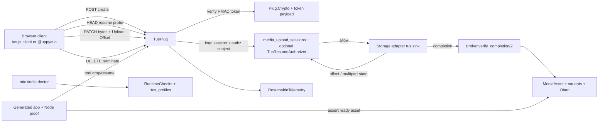

# Phase 44: auth-hardening-dx-docs-telemetry-ci-proof - Research

**Researched:** 2026-05-23
**Domain:** tus auth hardening, operator DX, resumable telemetry, adopter docs, generated-app proof CI
**Confidence:** HIGH

<user_constraints>
## User Constraints (from CONTEXT.md)

### Locked Decisions
- **D-01:** Keep HMAC-signed tus URLs as the default resume authority and keep same-user resume enforcement OPTIONAL via `config :rindle, :tus_resume_authorizer, MyApp.TusAuth`. Do NOT make same-user enforcement the library default. This preserves the adopter-owned auth boundary, keeps anonymous/login-churn/shared-device flows possible, and matches the bare-Plug/library posture. [VERIFIED: .planning/phases/44-auth-hardening-dx-docs-telemetry-ci-proof/44-CONTEXT.md]
- **D-02:** Be explicit in docs and operator language that the returned tus `Location` is a short-lived bearer credential. HMAC proves URL integrity and issuance, not same-user binding. The optional authorizer is the additive hardening layer for apps that need same-user resume semantics. [VERIFIED: .planning/phases/44-auth-hardening-dx-docs-telemetry-ci-proof/44-CONTEXT.md]
- **D-03:** Actor extraction remains adopter-defined through the Plug mount's `identity_fn` and auth pipeline. Rindle does NOT standardize cross-app actor semantics beyond passing `token_actor`, `session`, `profile`, and `method` to the configured authorizer. [VERIFIED: .planning/phases/44-auth-hardening-dx-docs-telemetry-ci-proof/44-CONTEXT.md]
- **D-04:** Keep the public tus-facing `Rindle.Error` vocabulary THIN and fix-oriented: `:tus_session_not_found`, `:tus_session_expired`, `:tus_offset_conflict`, `:tus_size_exceeded`, `:tus_url_signature_invalid`, and `{:upload_unsupported, :tus_upload}`. Do NOT grow a wider public atom taxonomy for environment/setup edge cases. [VERIFIED: .planning/phases/44-auth-hardening-dx-docs-telemetry-ci-proof/44-CONTEXT.md]
- **D-05:** `TusPlug` itself stays protocol-native at the HTTP edge: use tus status/header semantics (`404/410/409/413/401` plus tus headers) instead of mirroring those cases through a second public HTTP-error abstraction. [VERIFIED: .planning/phases/44-auth-hardening-dx-docs-telemetry-ci-proof/44-CONTEXT.md]
- **D-06:** `mix rindle.doctor` is the supported place for tus capability and config drift checks. Keep it config-driven through `:tus_profiles`; do NOT try to introspect Phoenix routes. Cross-component setup diagnosis belongs in doctor and guides, not in extra runtime error variants. [VERIFIED: .planning/phases/44-auth-hardening-dx-docs-telemetry-ci-proof/44-CONTEXT.md]
- **D-07:** Reuse the existing public resumable telemetry namespace `[:rindle, :upload, :resumable, *]` for tus. Distinguish topology through a low-cardinality `protocol` metadata field (`:tus` vs `:gcs_native`) instead of creating a new `[:rindle, :upload, :tus, *]` family. [VERIFIED: .planning/phases/44-auth-hardening-dx-docs-telemetry-ci-proof/44-CONTEXT.md]
- **D-08:** Preserve the deny-by-default metadata posture. Never emit `session_uri`, `upload_key`, raw headers, request bodies, or decoded upload metadata in tus telemetry. Metadata remains allowlisted, redacted, and operator-useful rather than exhaustively descriptive. [VERIFIED: .planning/phases/44-auth-hardening-dx-docs-telemetry-ci-proof/44-CONTEXT.md]
- **D-09:** `guides/resumable_uploads.md` is the canonical adopter document for the tus edge. It must carry the parser/CORS/security/client-setup story, clearly separate `tus-js-client` from modern `@uppy/tus` behavior, and call out client-version footguns instead of trying to encode those nuances in the runtime error surface. [VERIFIED: .planning/phases/44-auth-hardening-dx-docs-telemetry-ci-proof/44-CONTEXT.md]
- **D-10:** Keep one merge-blocking generated-app package-consumer tus proof lane that mounts `TusPlug`, performs one real socket-level interrupted upload and resume through `tus-js-client` against MinIO, and asserts downstream `MediaAsset`/variant convergence. Do NOT downgrade this to fake-only proof. Broader soak or matrix expansion can be nightly/manual later. [VERIFIED: .planning/phases/44-auth-hardening-dx-docs-telemetry-ci-proof/44-CONTEXT.md]
- **D-11:** The S3/MinIO tus posture remains single-node or sticky-session in v1. Document it honestly in the guide and proof expectations; Phase 44 does NOT try to solve cross-node tail sharing. [VERIFIED: .planning/phases/44-auth-hardening-dx-docs-telemetry-ci-proof/44-CONTEXT.md]
- **D-12:** Resolve the Phase 35 review findings that directly strengthen this phase's trust boundary and operator UX: WR-01, WR-02, WR-03, WR-04, WR-05, and WR-06. They harden body limits, idempotency drift, config honesty, and runtime-status usefulness. [VERIFIED: .planning/phases/44-auth-hardening-dx-docs-telemetry-ci-proof/44-CONTEXT.md]
- **D-13:** INFO-only or speculative Phase 35 items stay waived unless they materially change current adopter-facing behavior. This phase is not a blanket webhook cleanup pass; it is a targeted trust-boundary polish pass. [VERIFIED: .planning/phases/44-auth-hardening-dx-docs-telemetry-ci-proof/44-CONTEXT.md]

### Claude's Discretion
- Exact doctor copy and guide phrasing, as long as they remain calm, production-aware, and explicit about footguns. [VERIFIED: .planning/phases/44-auth-hardening-dx-docs-telemetry-ci-proof/44-CONTEXT.md]
- Whether POLISH-02 findings are closed by code changes versus narrow wording improvements when the operator-facing outcome is identical. [VERIFIED: .planning/phases/44-auth-hardening-dx-docs-telemetry-ci-proof/44-CONTEXT.md]

### Deferred Ideas (OUT OF SCOPE)
- Making same-user resume enforcement the default policy. [VERIFIED: .planning/phases/44-auth-hardening-dx-docs-telemetry-ci-proof/44-CONTEXT.md]
- Splitting tus into a separate public telemetry family. [VERIFIED: .planning/phases/44-auth-hardening-dx-docs-telemetry-ci-proof/44-CONTEXT.md]
- Broader tus soak/matrix coverage beyond one merge-blocking package-consumer proof lane. [VERIFIED: .planning/phases/44-auth-hardening-dx-docs-telemetry-ci-proof/44-CONTEXT.md]
- Cross-node/shared-tail S3 tus resume. [VERIFIED: .planning/phases/44-auth-hardening-dx-docs-telemetry-ci-proof/44-CONTEXT.md]
</user_constraints>

<phase_requirements>
## Phase Requirements

| ID | Description | Research Support |
|----|-------------|------------------|
| TUS-10 | Optional same-user resume authorization. | `TusPlug` already validates `:tus_resume_authorizer`, passes `token_actor/session/profile/method`, and has focused tests for `:ok` and `:reject`. [VERIFIED: lib/rindle/upload/tus_plug.ex, test/rindle/upload/tus_plug_test.exs] |
| TUS-11 | Tagged tus errors through `Rindle.Error`. | `Rindle.Error` already exposes the locked tus reasons and exact fix-oriented messages, with message contract tests. [VERIFIED: lib/rindle/error.ex, test/rindle/error_test.exs] |
| TUS-12 | tus edge telemetry through `[:rindle, :upload, :resumable, *]`. | `ResumableTelemetry` already emits `:start/:patch/:stop/:status/:cancel`, and the contract lane checks event names plus metadata hygiene. [VERIFIED: lib/rindle/upload/resumable_telemetry.ex, test/rindle/contracts/telemetry_contract_test.exs] |
| TUS-13 | `mix rindle.doctor` tus capability/config mismatch reporting. | `RuntimeChecks.check_tus_capability/1` already keys off `config :rindle, :tus_profiles` and has a dedicated failing-profile test. [VERIFIED: lib/rindle/ops/runtime_checks.ex, test/rindle/ops/runtime_checks_test.exs] |
| TUS-14 | Canonical guide plus generated-app package-consumer drop/resume proof. | The guide, Node `tus-js-client` proof helper, generated-app tus smoke test, and package-consumer CI lane already exist; planning should focus on doc/version correctness and parity coverage. [VERIFIED: guides/resumable_uploads.md, test/install_smoke/support/generated_app_helper.ex, test/install_smoke/generated_app_smoke_test.exs, .github/workflows/ci.yml] |
| POLISH-02 | Resolve or waive Phase 35 review findings. | WR-02/03/04/05/06 appear resolved in the current tree; WR-01 body-cap fallback remains visibly open in `WebhookPlug.fetch_raw_body/1` and is the only clear warning-level carryover still affecting this phase boundary. [VERIFIED: lib/rindle/delivery/webhook_plug.ex, lib/rindle/streaming/provider/mux.ex, lib/rindle/ops/runtime_status.ex, .planning/milestones/v1.6-phases/35-signed-webhook-plug-idempotent-ingest/35-REVIEW.md] |
</phase_requirements>

## Summary

Phase 44 is not greenfield in the current tree. The main implementation seams named in TUS-10 through TUS-14 already exist: `TusPlug` has the optional resume authorizer hook and protocol-native 401/404/409/410/413 handling, `Rindle.Error` already carries the narrow tus reason vocabulary, `ResumableTelemetry` already emits the resumable namespace, `RuntimeChecks` already performs the config-driven `:tus_profiles` capability check, `guides/resumable_uploads.md` already exists, and the generated-app tus proof plus package-consumer CI lane are already present and passing in focused local test runs. [VERIFIED: lib/rindle/upload/tus_plug.ex, lib/rindle/error.ex, lib/rindle/upload/resumable_telemetry.ex, lib/rindle/ops/runtime_checks.ex, guides/resumable_uploads.md, test/install_smoke/generated_app_smoke_test.exs, .github/workflows/ci.yml, local `mix test` run 2026-05-23]

The planning value is therefore in contract alignment, not feature invention. The highest-signal remaining issue is documentation correctness around current browser clients: `tus-js-client` stable is still `4.3.1` as of January 16, 2025, while modern `@uppy/tus` stable is `5.1.1` as of February 3, 2026, and Uppy’s migration guide says `resume` and `removeFingerprintOnSuccess` were removed because resume and cleanup are now automatic. The repo guide currently still shows `removeFingerprintOnSuccess: true` for both clients, so the plan should explicitly separate `tus-js-client` guidance from modern Uppy 5 guidance. [VERIFIED: npm registry for `tus-js-client` and `@uppy/tus`; CITED: https://uppy.io/docs/guides/migration-guides/; VERIFIED: guides/resumable_uploads.md]

The other planning hotspot is POLISH-02 scoping. Comparing the Phase 35 review to the current code shows WR-02, WR-03, WR-04, WR-05, and WR-06 are already reflected in code, but WR-01 still appears open because `WebhookPlug.fetch_raw_body/1` falls back to `Plug.Conn.read_body(conn)` without an explicit `:length` cap. That issue is adjacent to, and materially relevant to, this phase's "trustworthy adopter-ready edge" goal. [VERIFIED: .planning/milestones/v1.6-phases/35-signed-webhook-plug-idempotent-ingest/35-REVIEW.md, lib/rindle/delivery/webhook_plug.ex, lib/rindle/streaming/provider/mux.ex, lib/rindle/ops/runtime_status.ex]

**Primary recommendation:** Plan Phase 44 as a contract-alignment, proof-hardening, and review-debt closure pass over already-existing surfaces; prioritize the modern client-doc correction, the remaining WR-01 fix-or-waiver decision, and parity checks that keep guide, proof helper, and CI behavior synchronized. [VERIFIED: codebase scan + local focused test runs 2026-05-23; CITED: https://uppy.io/docs/guides/migration-guides/]

## Architectural Responsibility Map

| Capability | Primary Tier | Secondary Tier | Rationale |
|------------|-------------|----------------|-----------|
| Resume authorization (`:tus_resume_authorizer`) | API / Backend | Frontend Server (SSR) | The authorization decision happens inside `TusPlug` before body/storage I/O, while the adopter may supply identity through upstream auth plugs or router pipeline assigns. [VERIFIED: lib/rindle/upload/tus_plug.ex] |
| Signed tus URL verification and status mapping | API / Backend | — | HMAC verification, session lookup, and protocol-native 401/404/409/410/413 responses all live in the bare Plug edge. [VERIFIED: lib/rindle/upload/tus_plug.ex; CITED: https://tus.io/protocols/resumable-upload] |
| Public error contract | API / Backend | Docs | `Rindle.Error` is the stable adopter-facing vocabulary; guides mirror it but do not replace it. [VERIFIED: lib/rindle/error.ex, guides/troubleshooting.md] |
| Resumable telemetry emission | API / Backend | Observability | `ResumableTelemetry` wraps `:telemetry.execute/3` and constrains metadata at the library boundary. [VERIFIED: lib/rindle/upload/resumable_telemetry.ex, test/rindle/contracts/telemetry_contract_test.exs] |
| Capability/config drift diagnosis | API / Backend | CLI / Ops | `mix rindle.doctor` delegates to `RuntimeChecks`; it is config-driven and intentionally does not inspect routes. [VERIFIED: lib/mix/tasks/rindle.doctor.ex, lib/rindle/ops/runtime_checks.ex] |
| Browser resumable client behavior | Browser / Client | API / Backend | Resume persistence, fingerprint reuse, and retry posture are client concerns, but they must match the server’s supported tus subset and headers. [CITED: https://github.com/tus/tus-js-client; CITED: https://uppy.io/docs/tus/; CITED: https://uppy.io/docs/guides/migration-guides/] |
| Generated-app proof | CI / Tooling | API / Backend | The proof exercises the packaged artifact through Phoenix, Node, MinIO, FFmpeg, and Postgres rather than unit-level seams. [VERIFIED: test/install_smoke/generated_app_smoke_test.exs, test/install_smoke/support/generated_app_helper.ex, .github/workflows/ci.yml] |

## Standard Stack

### Core
| Library | Version | Purpose | Why Standard |
|---------|---------|---------|--------------|
| `plug` | Repo constraint `~> 1.16`; latest Hex release `1.19.2` updated 2026-05-14. [VERIFIED: mix.exs; VERIFIED: hex.pm API] | Bare `TusPlug`, `Plug.Crypto`, `Plug.Parsers`, `Plug.Conn.read_body/2`. [VERIFIED: lib/rindle/upload/tus_plug.ex] | Rindle already uses bare Plug surfaces instead of Phoenix-only abstractions, and Plug docs explicitly support `:pass` for unparsed content types such as tus PATCH bodies. [VERIFIED: codebase; CITED: https://hexdocs.pm/plug/Plug.Parsers.html] |
| `telemetry` | Repo constraint `~> 1.2`; latest Hex release `1.4.2` updated 2026-05-11. [VERIFIED: mix.exs; VERIFIED: hex.pm API] | Stable public resumable event namespace. [VERIFIED: lib/rindle/upload/resumable_telemetry.ex] | Existing contract tests already lock event names and metadata rules, so planning should extend that surface instead of inventing a new one. [VERIFIED: test/rindle/contracts/telemetry_contract_test.exs] |
| `tus-js-client` | `4.3.1`, published 2025-01-16. [VERIFIED: npm registry] | Canonical browser/Node tus client and the package-consumer proof client. [VERIFIED: test/install_smoke/support/generated_app_helper.ex] | The repo already pins this exact version for the Node proof, and the upstream README still documents `findPreviousUploads()`/`resumeFromPreviousUpload()`. [VERIFIED: codebase; CITED: https://github.com/tus/tus-js-client] |

### Supporting
| Library | Version | Purpose | When to Use |
|---------|---------|---------|-------------|
| `@uppy/tus` | `5.1.1`, published 2026-02-03. [VERIFIED: npm registry] | UI-oriented browser uploader that wraps `tus-js-client`. [CITED: https://uppy.io/docs/tus/] | Use for adopter docs/examples when the adopter wants Uppy UI, but document modern Uppy 5 behavior separately from raw `tus-js-client`. [CITED: https://uppy.io/docs/tus/; CITED: https://uppy.io/docs/guides/migration-guides/] |
| Docker + MinIO | Local Docker `29.4.1`; CI uses `minio/minio` plus `mc`. [VERIFIED: local environment; VERIFIED: .github/workflows/ci.yml] | Real S3-compatible backing for the package-consumer tus proof. [VERIFIED: .github/workflows/ci.yml] | Use for merge-blocking proof, not for unit tests. [VERIFIED: test/install_smoke/generated_app_smoke_test.exs, .github/workflows/ci.yml] |
| FFmpeg | Local `8.0.1`; CI installs current release via `setup-ffmpeg`. [VERIFIED: local environment; VERIFIED: .github/workflows/ci.yml] | Generates the >=200 MB MP4 fixture and verifies downstream AV convergence. [VERIFIED: test/install_smoke/support/generated_app_helper.ex] | Use only for the generated-app proof and AV flows. [VERIFIED: codebase] |

### Alternatives Considered
| Instead of | Could Use | Tradeoff |
|------------|-----------|----------|
| Raw `tus-js-client` browser example | `@uppy/tus` | Better adopter UI, but current Uppy 5 docs removed `resume` and `removeFingerprintOnSuccess`, so examples must be version-aware. [CITED: https://uppy.io/docs/tus/; CITED: https://uppy.io/docs/guides/migration-guides/] |
| New tus telemetry family | Existing `[:rindle, :upload, :resumable, *]` | Existing family is already contract-tested and aligns with locked decision D-07. [VERIFIED: test/rindle/contracts/telemetry_contract_test.exs, .planning/phases/44-auth-hardening-dx-docs-telemetry-ci-proof/44-CONTEXT.md] |
| Route introspection in doctor | `config :rindle, :tus_profiles` | Config is explicit, testable, and already implemented; route introspection would couple Rindle to adopter router internals. [VERIFIED: lib/rindle/ops/runtime_checks.ex, guides/resumable_uploads.md] |

**Installation:**
```bash
npm install tus-js-client @uppy/core @uppy/tus
```

**Version verification:** [VERIFIED: npm registry; VERIFIED: hex.pm API]
```bash
npm view tus-js-client version
npm view @uppy/tus version
curl -fsSL https://hex.pm/api/packages/plug | jq '.latest_version'
curl -fsSL https://hex.pm/api/packages/telemetry | jq '.latest_version'
```

## Architecture Patterns

### System Architecture Diagram



The data flow above matches the current implementation boundary: browser requests hit `TusPlug`, which owns protocol mechanics and HMAC verification; storage writes and completion converge into existing broker/session state; telemetry and doctor remain side-channel contract surfaces; the generated-app proof validates the packaged artifact end to end. [VERIFIED: lib/rindle/upload/tus_plug.ex, lib/rindle/upload/broker.ex, lib/rindle/ops/runtime_checks.ex, test/install_smoke/support/generated_app_helper.ex]

### Recommended Project Structure
```text
lib/
├── rindle/upload/        # TusPlug, broker, resumable telemetry, adapter dispatch
├── rindle/ops/           # doctor/runtime checks and maintenance logic
├── rindle/delivery/      # adjacent trust-boundary review debt (POLISH-02 WR-01)
└── mix/tasks/            # operator CLI surfaces such as rindle.doctor
guides/
├── resumable_uploads.md  # canonical adopter tus guide
└── troubleshooting.md    # public error vocabulary mirror
test/
├── rindle/upload/        # TusPlug and telemetry unit tests
├── rindle/contracts/     # public telemetry contract
└── install_smoke/        # packaged-app proof and docs parity
```

### Pattern 1: Thin Protocol Edge With Optional Identity Hook
**What:** Keep `TusPlug` responsible for token verification, session lookup, protocol-native status codes, and an optional adopter-supplied `TusResumeAuthorizer`. [VERIFIED: lib/rindle/upload/tus_plug.ex, lib/rindle/tus_resume_authorizer.ex]
**When to use:** Any same-user resume hardening or future auth tweaks should stay inside this hook shape instead of introducing a new auth subsystem. [VERIFIED: .planning/phases/44-auth-hardening-dx-docs-telemetry-ci-proof/44-CONTEXT.md]
**Example:**
```elixir
# Source: lib/rindle/upload/tus_plug.ex [VERIFIED: codebase]
case authorizer.authorize(actor, :resume, %{
       token_actor: Map.get(payload, "actor"),
       session: session,
       profile: opts[:profile],
       method: method
     }) do
  :ok -> :ok
  :reject -> {:error, :resume_rejected}
end
```

### Pattern 2: Contracted Telemetry Wrapper, Not Ad Hoc Emits
**What:** Emit resumable events only through `ResumableTelemetry`, which enforces allowed metadata keys and required measurements. [VERIFIED: lib/rindle/upload/resumable_telemetry.ex]
**When to use:** All new tus edge observability should extend this wrapper and its contract tests, not call `:telemetry.execute/3` directly from random sites. [VERIFIED: test/rindle/contracts/telemetry_contract_test.exs]
**Example:**
```elixir
# Source: lib/rindle/upload/tus_plug.ex [VERIFIED: codebase]
ResumableTelemetry.emit_patch(
  to_string(opts[:profile]),
  opts[:adapter],
  advanced,
  %{state: advanced.state, source: :patch, outcome: :ok, protocol: :tus},
  %{committed_bytes: new_offset, offset_delta: new_offset - session.last_known_offset}
)
```

### Pattern 3: Generated-App Proof Over the Release Artifact
**What:** Keep the merge-blocking tus proof at the generated-app/package-consumer layer, where Phoenix wiring, Node client behavior, MinIO, FFmpeg, migrations, and the packaged library are all exercised together. [VERIFIED: test/install_smoke/generated_app_smoke_test.exs, test/install_smoke/support/generated_app_helper.ex, .github/workflows/ci.yml]
**When to use:** Any change that affects adopter wiring, docs, or browser resume behavior should prove itself here, not only in unit tests. [VERIFIED: codebase]
**Example:**
```elixir
# Source: test/install_smoke/generated_app_smoke_test.exs [VERIFIED: codebase]
test "generated Phoenix app proves a real-socket tus-js-client drop-and-resume flow against MinIO",
     %{report: report} do
  assert report.tus_previous_uploads >= 1
  assert report.tus_byte_size >= 200 * 1024 * 1024
  assert report.tus_content_type == "video/mp4"
end
```

### Anti-Patterns to Avoid
- **Treating the tus `Location` as same-user proof:** It is a bearer credential by design; same-user semantics belong in the optional authorizer hook. [VERIFIED: .planning/phases/44-auth-hardening-dx-docs-telemetry-ci-proof/44-CONTEXT.md, lib/rindle/upload/tus_plug.ex]
- **Documenting modern `@uppy/tus` as if it still required `removeFingerprintOnSuccess`:** Uppy’s current migration guide says that option was removed because automatic resume plus cleanup are default now. [CITED: https://uppy.io/docs/guides/migration-guides/]
- **Adding new public error atoms for setup drift:** Locked decision D-06 pushes capability/config diagnosis into doctor and guides. [VERIFIED: 44-CONTEXT.md, lib/rindle/ops/runtime_checks.ex]
- **Replacing the real drop/resume proof with mocks:** The current package-consumer lane already proves the exact failure mode the phase exists to harden. [VERIFIED: test/install_smoke/generated_app_smoke_test.exs, .github/workflows/ci.yml]

## Don't Hand-Roll

| Problem | Don't Build | Use Instead | Why |
|---------|-------------|-------------|-----|
| Browser resumable state and URL persistence | A custom localStorage/fingerprint layer | `tus-js-client` or `@uppy/tus` | Upstream clients already implement resume discovery and URL reuse; the repo’s Node proof depends on that exact behavior. [VERIFIED: test/install_smoke/support/generated_app_helper.ex; CITED: https://github.com/tus/tus-js-client; CITED: https://uppy.io/docs/tus/] |
| Separate telemetry contract for tus | A new `[:rindle, :upload, :tus, *]` family | `ResumableTelemetry` with `protocol: :tus` | Existing contract tests already lock the public namespace and metadata shape. [VERIFIED: lib/rindle/upload/resumable_telemetry.ex, test/rindle/contracts/telemetry_contract_test.exs] |
| Runtime drift discovery | Phoenix route inspection or extra runtime error atoms | `mix rindle.doctor` + `:tus_profiles` config | It is already implemented, testable, and matches the locked operator posture. [VERIFIED: lib/rindle/ops/runtime_checks.ex, guides/resumable_uploads.md] |
| "Realistic" tus proof by mocking retries | Stubbed HTTP retry tests | Generated-app Node proof against MinIO | Only the real-socket proof validates resume persistence after a deliberate drop. [VERIFIED: test/install_smoke/support/generated_app_helper.ex, test/install_smoke/generated_app_smoke_test.exs] |

**Key insight:** The current tree already has the hard parts of the Phase 44 surface. The avoidable risk is not underbuilding; it is drifting docs, tests, and CI away from what the shipped library actually does. [VERIFIED: codebase scan 2026-05-23]

## Common Pitfalls

### Pitfall 1: Modern Uppy Option Drift
**What goes wrong:** The guide or error copy tells adopters to set `removeFingerprintOnSuccess: true` on current `@uppy/tus`, even though Uppy’s current migration guide says the option was removed. [VERIFIED: guides/resumable_uploads.md; CITED: https://uppy.io/docs/guides/migration-guides/]
**Why it happens:** The repo correctly pins `tus-js-client@4.3.1` for the proof, but Uppy’s wrapper evolved independently. [VERIFIED: test/install_smoke/support/generated_app_helper.ex; VERIFIED: npm registry]
**How to avoid:** Split the guide into `tus-js-client` guidance versus modern Uppy 5 guidance and mention the version boundary explicitly. [CITED: https://uppy.io/docs/tus/; CITED: https://uppy.io/docs/guides/migration-guides/]
**Warning signs:** Docs parity tests keep passing while adopters report that copied Uppy config is ignored or type-invalid. [ASSUMED]

### Pitfall 2: Confusing Bearer URL Integrity With Same-User Authorization
**What goes wrong:** An operator assumes HMAC-signed `Location` URLs alone enforce same-user resume semantics. [VERIFIED: 44-CONTEXT.md, lib/rindle/upload/tus_plug.ex]
**Why it happens:** HMAC proves issuance and tamper resistance, not actor equality. [VERIFIED: 44-CONTEXT.md]
**How to avoid:** Keep docs explicit that same-user binding is optional and implemented through `:tus_resume_authorizer`. [VERIFIED: guides/resumable_uploads.md, lib/rindle/tus_resume_authorizer.ex]
**Warning signs:** Requests authenticated as a different user still resume successfully when they possess the exact signed URL. [VERIFIED by design: lib/rindle/upload/tus_plug.ex]

### Pitfall 3: Fake-Only Proof Misses the Actual Failure Mode
**What goes wrong:** Unit tests pass, but packaged-app browser resume breaks after a network drop. [VERIFIED: generated-app proof exists specifically for drop/resume]
**Why it happens:** The critical behavior depends on URL storage, actual socket interruption, MinIO multipart behavior, and end-to-end completion convergence. [VERIFIED: test/install_smoke/support/generated_app_helper.ex]
**How to avoid:** Keep the generated-app Node proof merge-blocking and aligned with the canonical guide. [VERIFIED: .github/workflows/ci.yml, test/install_smoke/generated_app_smoke_test.exs]
**Warning signs:** CI stops running `bash scripts/install_smoke.sh tus`, or the proof no longer asserts `tus_previous_uploads >= 1`. [VERIFIED: current CI and tests]

### Pitfall 4: Remaining POLISH-02 Debt Is Easy To Miss Because Most Warnings Are Already Closed
**What goes wrong:** Planning assumes Phase 35 review debt is entirely gone and leaves the remaining trust-boundary warning unaddressed. [VERIFIED: current code comparison against 35-REVIEW]
**Why it happens:** WR-02 through WR-06 are visible as code changes now, but WR-01 still appears open in `WebhookPlug.fetch_raw_body/1`. [VERIFIED: lib/rindle/delivery/webhook_plug.ex, lib/rindle/streaming/provider/mux.ex, lib/rindle/ops/runtime_status.ex]
**How to avoid:** Make WR-01 an explicit plan decision: fix it now or waive it with rationale tied to Phase 44 scope. [VERIFIED: 35-REVIEW, codebase]
**Warning signs:** `fetch_raw_body/1` still calls `Plug.Conn.read_body(conn)` without a `length:` cap. [VERIFIED: lib/rindle/delivery/webhook_plug.ex]

## Code Examples

Verified patterns from official and in-repo sources:

### Mount `TusPlug` And Allow Raw tus PATCH Bodies
```elixir
# Source: guides/resumable_uploads.md [VERIFIED: codebase]
plug Plug.Parsers,
  parsers: [:urlencoded, :multipart, :json],
  pass: ["application/offset+octet-stream", "*/*"],
  json_decoder: Phoenix.json_library()

forward "/uploads/tus", Rindle.Upload.TusPlug,
  profile: MyApp.VideoProfile,
  secret_key_base: MyAppWeb.Endpoint.config(:secret_key_base)
```

### `tus-js-client` Resume Flow
```javascript
// Source: https://github.com/tus/tus-js-client [CITED]
const upload = new tus.Upload(file, { endpoint: "/uploads/tus" })
const previousUploads = await upload.findPreviousUploads()
if (previousUploads.length > 0) upload.resumeFromPreviousUpload(previousUploads[0])
upload.start()
```

### Modern `@uppy/tus` Baseline
```javascript
// Source: https://uppy.io/docs/tus/ [CITED]
new Uppy().use(Tus, { endpoint: "/uploads/tus" })
```

## State of the Art

| Old Approach | Current Approach | When Changed | Impact |
|--------------|------------------|--------------|--------|
| Treat `@uppy/tus` as a thin place to copy raw `tus-js-client` options verbatim. [ASSUMED] | Uppy 5 docs and migration guide document wrapper-specific behavior and say `resume` / `removeFingerprintOnSuccess` were removed because resume and cleanup are automatic. [CITED: https://uppy.io/docs/tus/; CITED: https://uppy.io/docs/guides/migration-guides/] | Uppy migration guide documents the removal before the current 5.x line; latest stable `@uppy/tus` is `5.1.1` published 2026-02-03. [VERIFIED: npm registry] | Phase 44 docs should separate modern Uppy guidance from `tus-js-client` guidance instead of prescribing one shared config block. [VERIFIED: guides/resumable_uploads.md; CITED: https://uppy.io/docs/guides/migration-guides/] |
| Fake or unit-only proof for resume flows. [ASSUMED] | Keep one merge-blocking generated-app drop/resume proof through the packaged artifact. [VERIFIED: 44-CONTEXT.md, test/install_smoke/generated_app_smoke_test.exs, .github/workflows/ci.yml] | Already present in the current tree by 2026-05-23. [VERIFIED: codebase] | Planning should protect this lane, not redesign it. [VERIFIED: codebase] |
| Route introspection for capability drift. [ASSUMED] | Config-driven `:tus_profiles` doctor check. [VERIFIED: lib/rindle/ops/runtime_checks.ex, guides/resumable_uploads.md] | Already present in the current tree by 2026-05-23. [VERIFIED: codebase] | Keeps Rindle router-agnostic and easier to test. [VERIFIED: codebase] |

**Deprecated/outdated:**
- `@uppy/tus` examples that still require `removeFingerprintOnSuccess` for current Uppy 5 are outdated unless they are explicitly version-pinned to an older Uppy line. [CITED: https://uppy.io/docs/guides/migration-guides/]

## Assumptions Log

| # | Claim | Section | Risk if Wrong |
|---|-------|---------|---------------|
| A1 | Older `@uppy/tus` examples widely copied raw `tus-js-client` options verbatim. | State of the Art | Low; the plan still stands because the current official Uppy docs and migration guide are the source of truth. |
| A2 | Fake or unit-only resume proofs were the prior norm. | State of the Art | Low; the recommendation to keep the real package-consumer proof is still driven by the verified current repo shape. |
| A3 | Route introspection was a plausible earlier alternative. | State of the Art | Low; the locked decision and current implementation already choose config-driven doctor checks. |

## Open Questions (RESOLVED)

1. **Should the guide keep `removeFingerprintOnSuccess: true` in the `@uppy/tus` section at all?**
   - What we know: The current repo guide includes it, but Uppy’s migration guide says the option was removed and cleanup is automatic now. [VERIFIED: guides/resumable_uploads.md; CITED: https://uppy.io/docs/guides/migration-guides/]
   - Resolution: The canonical guide should be modern-Uppy-first. Keep `removeFingerprintOnSuccess: true` only in the `tus-js-client` example, remove it from the modern `@uppy/tus` example, and mention that older Uppy guidance must be version-pinned if documented at all. [DECIDED: 2026-05-23]
   - Why this is the right resolution: It matches the current upstream docs, preserves accurate copy-paste behavior for new adopters, and avoids encoding a removed option into the default public contract. [CITED: https://uppy.io/docs/tus/; CITED: https://uppy.io/docs/guides/migration-guides/]

2. **Is WR-01 fixed in this phase or explicitly waived?**
   - What we know: The fallback body-cap warning from Phase 35 still appears open in `WebhookPlug.fetch_raw_body/1`; the other warning-level findings appear resolved. [VERIFIED: lib/rindle/delivery/webhook_plug.ex, .planning/milestones/v1.6-phases/35-signed-webhook-plug-idempotent-ingest/35-REVIEW.md]
   - Resolution: WR-01 should be fixed in Phase 44, not waived. It is a narrow, high-signal trust-boundary hardening change that fits D-12 exactly and does not widen public API surface. [DECIDED: 2026-05-23]
   - Why this is the right resolution: The warning is still live, touches a security-sensitive edge, and has a clear low-risk code path plus regression-test shape already described in `35-REVIEW.md`. [VERIFIED: review/code comparison]

## Environment Availability

| Dependency | Required By | Available | Version | Fallback |
|------------|------------|-----------|---------|----------|
| Node.js | Generated-app Node tus proof | ✓ | `v22.14.0` [VERIFIED: local environment] | CI uses `actions/setup-node@v4` with Node 20. [VERIFIED: .github/workflows/ci.yml] |
| npm | Installing `tus-js-client` in generated app | ✓ | `11.1.0` [VERIFIED: local environment] | None needed. |
| Elixir/Mix | All library tests and smoke proofs | ✓ | `Mix 1.19.5`, OTP 28 locally; CI pins Elixir 1.17 / OTP 27. [VERIFIED: local environment; VERIFIED: .github/workflows/ci.yml] | None needed. |
| Docker | MinIO-backed package-consumer proof | ✓ | `29.4.1` [VERIFIED: local environment] | CI also provides Docker; without Docker, local MinIO-backed proof is blocked. [VERIFIED: .github/workflows/ci.yml] |
| PostgreSQL tooling | Test DB readiness | ✓ | `psql 14.17`; `pg_isready` accepting on `/tmp:5432`. [VERIFIED: local environment] | CI uses a Postgres 16 service container. [VERIFIED: .github/workflows/ci.yml] |
| FFmpeg | Generating >=200 MB MP4 fixture and AV convergence | ✓ | `8.0.1` [VERIFIED: local environment] | CI installs FFmpeg via `setup-ffmpeg`. [VERIFIED: .github/workflows/ci.yml] |
| MinIO client `mc` | Manual bucket bootstrap in package-consumer lane | ✗ | — [VERIFIED: local environment] | CI downloads `mc` before the package-consumer job. [VERIFIED: .github/workflows/ci.yml] |

**Missing dependencies with no fallback:**
- None for planning research. Local execution of the full MinIO package-consumer lane would need either Docker plus CI-like `mc` bootstrap, or a manual equivalent. [VERIFIED: local environment; VERIFIED: .github/workflows/ci.yml]

**Missing dependencies with fallback:**
- `mc` is missing locally, but CI installs it with `curl` and the repo’s package-consumer lane already relies on that bootstrap. [VERIFIED: local environment; VERIFIED: .github/workflows/ci.yml]

## Validation Architecture

### Test Framework
| Property | Value |
|----------|-------|
| Framework | ExUnit on Elixir/Mix. [VERIFIED: test/test_helper.exs] |
| Config file | No separate config file; setup lives in `test/test_helper.exs`. [VERIFIED: test/test_helper.exs] |
| Quick run command | `mix test test/rindle/upload/tus_plug_test.exs test/rindle/error_test.exs test/rindle/ops/runtime_checks_test.exs` [VERIFIED: local test run 2026-05-23] |
| Full suite command | `mix test` plus `bash scripts/install_smoke.sh tus` for the package-consumer gate. [VERIFIED: scripts/install_smoke.sh, .github/workflows/ci.yml] |

### Phase Requirements -> Test Map
| Req ID | Behavior | Test Type | Automated Command | File Exists? |
|--------|----------|-----------|-------------------|-------------|
| TUS-10 | Optional resume authorizer allows `:ok` and rejects with `401`. [VERIFIED: test/rindle/upload/tus_plug_test.exs] | unit | `mix test test/rindle/upload/tus_plug_test.exs` | ✅ |
| TUS-11 | Locked tus reason atoms and `Rindle.Error.message/1` copy. [VERIFIED: test/rindle/error_test.exs] | unit | `mix test test/rindle/error_test.exs` | ✅ |
| TUS-12 | Resumable telemetry event names, metadata hygiene, and wrapper measurements. [VERIFIED: test/rindle/upload/resumable_telemetry_test.exs, test/rindle/contracts/telemetry_contract_test.exs] | contract | `mix test test/rindle/upload/resumable_telemetry_test.exs test/rindle/contracts/telemetry_contract_test.exs --include contract` | ✅ |
| TUS-13 | Doctor surfaces `:tus_profiles` capability drift. [VERIFIED: test/rindle/ops/runtime_checks_test.exs] | unit | `mix test test/rindle/ops/runtime_checks_test.exs` | ✅ |
| TUS-14 | Generated-app tus drop/resume proof against MinIO. [VERIFIED: test/install_smoke/generated_app_smoke_test.exs] | integration | `bash scripts/install_smoke.sh tus` | ✅ |
| POLISH-02 | Phase 35 warning closures or waivers remain explicit. [VERIFIED: 35-REVIEW + code comparison] | manual + targeted tests | `mix test test/rindle/error_test.exs test/rindle/ops/runtime_checks_test.exs test/rindle/upload/tus_plug_test.exs` plus review diff | ✅ |

### Sampling Rate
- **Per task commit:** `mix test test/rindle/upload/tus_plug_test.exs test/rindle/error_test.exs test/rindle/ops/runtime_checks_test.exs`
- **Per wave merge:** `mix test`
- **Phase gate:** `bash scripts/install_smoke.sh tus` locally when feasible, and the package-consumer CI lane green before `/gsd-verify-work`

### Wave 0 Gaps
- [ ] Add or update docs-parity assertions for the Uppy 5 version-specific guidance if `guides/resumable_uploads.md` changes. [VERIFIED: current docs parity suite exists but does not appear to lock this nuance explicitly]
- [ ] Add an explicit POLISH-02 tracking note in plan tasks so WR-01 cannot disappear behind already-closed warning items. [VERIFIED: review/code comparison]

## Security Domain

### Applicable ASVS Categories

| ASVS Category | Applies | Standard Control |
|---------------|---------|-----------------|
| V2 Authentication | yes | Adopter-owned auth pipeline feeds `identity_fn`; optional `Rindle.TusResumeAuthorizer` re-checks actor semantics. [VERIFIED: lib/rindle/upload/tus_plug.ex, lib/rindle/tus_resume_authorizer.ex] |
| V3 Session Management | yes | Short-lived HMAC-signed tus `Location` URLs, server-side session TTL, `Upload-Expires`, and 401/410 handling. [VERIFIED: lib/rindle/upload/tus_plug.ex; CITED: https://tus.io/protocols/resumable-upload] |
| V4 Access Control | yes | Capability gating (`:tus_upload`), optional same-user authorizer, and no silent downgrade. [VERIFIED: lib/rindle/upload/tus_plug.ex, lib/rindle/ops/runtime_checks.ex] |
| V5 Input Validation | yes | `Upload-Length`, `Upload-Offset`, `Content-Type`, and max-size checks at the tus edge. [VERIFIED: lib/rindle/upload/tus_plug.ex] |
| V6 Cryptography | yes | `Plug.Crypto.sign/verify` for URL integrity; no hand-rolled token scheme. [VERIFIED: lib/rindle/upload/tus_plug.ex] |

### Known Threat Patterns for this stack

| Pattern | STRIDE | Standard Mitigation |
|---------|--------|---------------------|
| Tampered or forged tus resume URL | Tampering / Spoofing | Verify signed token on every `HEAD`/`PATCH`/`DELETE`; return `404` or `401`, never `200`. [VERIFIED: lib/rindle/upload/tus_plug.ex, test/rindle/upload/tus_plug_test.exs] |
| Cross-user resume using a leaked bearer URL | Elevation of Privilege | Mount behind adopter auth and use optional resume authorizer when same-user semantics matter. [VERIFIED: guides/resumable_uploads.md, lib/rindle/tus_resume_authorizer.ex] |
| Oversized or malformed PATCH input | Denial of Service | Bound `Upload-Length`, per-read `read_length`, `Upload-Offset`, and content-type before committing bytes. [VERIFIED: lib/rindle/upload/tus_plug.ex] |
| Metadata or secret leakage in observability | Information Disclosure | Keep resumable telemetry allowlisted; never emit `session_uri`, `upload_key`, body, or raw headers. [VERIFIED: lib/rindle/upload/resumable_telemetry.ex, test/rindle/contracts/telemetry_contract_test.exs] |
| Misconfigured unsupported adapter mounted for tus | Tampering / Reliability | Fail loudly at init and in doctor rather than silently downgrading. [VERIFIED: lib/rindle/upload/tus_plug.ex, lib/rindle/ops/runtime_checks.ex] |

## Sources

### Primary (HIGH confidence)
- `.planning/phases/44-auth-hardening-dx-docs-telemetry-ci-proof/44-CONTEXT.md` - locked phase decisions and scope. [VERIFIED: codebase]
- `lib/rindle/upload/tus_plug.ex` - auth hook, protocol edge, HMAC validation, status mapping. [VERIFIED: codebase]
- `lib/rindle/error.ex` and `test/rindle/error_test.exs` - public tus error vocabulary and exact copy. [VERIFIED: codebase]
- `lib/rindle/upload/resumable_telemetry.ex` and `test/rindle/contracts/telemetry_contract_test.exs` - telemetry namespace and metadata contract. [VERIFIED: codebase]
- `lib/rindle/ops/runtime_checks.ex` and `test/rindle/ops/runtime_checks_test.exs` - doctor capability check behavior. [VERIFIED: codebase]
- `guides/resumable_uploads.md` - current adopter guide baseline. [VERIFIED: codebase]
- `test/install_smoke/generated_app_smoke_test.exs`, `test/install_smoke/support/generated_app_helper.ex`, `.github/workflows/ci.yml` - generated-app proof and package-consumer CI lane. [VERIFIED: codebase]
- `https://tus.io/protocols/resumable-upload` - tus 1.0 protocol requirements for `Location`, `Upload-Expires`, and 404/410 expiration behavior. [CITED]
- `https://github.com/tus/tus-js-client` - current tus JS client usage and resume API. [CITED]
- `https://uppy.io/docs/tus/` - current `@uppy/tus` wrapper docs. [CITED]
- `https://uppy.io/docs/guides/migration-guides/` - modern Uppy removal of `resume` / `removeFingerprintOnSuccess`. [CITED]
- npm registry (`npm view tus-js-client`, `npm view @uppy/tus`) - current package versions and publish dates. [VERIFIED: npm registry]
- Hex package API (`https://hex.pm/api/packages/plug`, `https://hex.pm/api/packages/telemetry`) - current Hex versions. [VERIFIED: hex.pm API]

### Secondary (MEDIUM confidence)
- `https://hexdocs.pm/plug/Plug.Parsers.html` - authoritative Plug parser `:pass` behavior and request-length defaults. [CITED]
- `https://hexdocs.pm/cors_plug/readme.html` - `Access-Control-Expose-Headers` support in `cors_plug`. [CITED]

### Tertiary (LOW confidence)
- None. Context7 CLI fallback was attempted but quota-blocked, so external claims were verified through official docs and registries instead. [VERIFIED: local command output 2026-05-23]

## Metadata

**Confidence breakdown:**
- Standard stack: HIGH - the repo already uses the relevant Elixir surfaces, and browser-client version claims were verified from npm/Hex registries plus official docs.
- Architecture: HIGH - the current tree already contains the exact phase seams, and focused local tests passed on 2026-05-23.
- Pitfalls: HIGH - the biggest remaining risk (modern Uppy docs mismatch) is confirmed by both the current repo guide and official Uppy migration docs; the remaining Phase 35 warning status is directly visible in code.

**Research date:** 2026-05-23
**Valid until:** 2026-06-22
