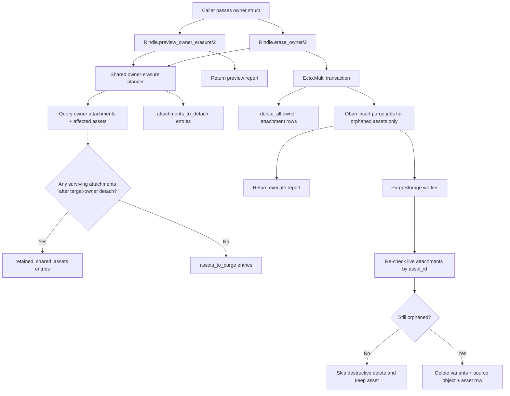

# Phase 54: Execute + Orphan-Safe Purge Wiring - Research

**Researched:** 2026-05-26
**Domain:** Elixir owner-erasure orchestration over Ecto + Oban
**Confidence:** HIGH

<user_constraints>
## User Constraints (from CONTEXT.md)

### Locked Decisions
## Implementation Decisions

### Public execute lane
- **D-01:** Ship `Rindle.erase_owner/2` as the public execute entrypoint and
  keep `Rindle.preview_owner_erasure/2` as its explicit dry-run companion.
- **D-02:** `Rindle.erase_owner/2` should execute synchronously from the
  caller's perspective: compute the erasure plan, detach owner attachments
  transactionally, enqueue purge work, and return `{:ok, owner_erasure_report()}`.
- **D-03:** Reuse the current owner input contract used by `attach/4` and
  `detach/3`: an owner struct with `id`, resolved internally through
  `get_owner_info/1`.
- **D-04:** The execute lane erases only Rindle-managed media associations for
  the owner. It does not delete the adopter's account row.

### Planning and transaction boundary
- **D-05:** Build a shared internal owner-erasure planning helper used by both
  preview and execute so both surfaces compute the same semantic partition.
- **D-06:** Execute should recompute the plan inside its own transaction path;
  do not trust a prior preview result as execution input.
- **D-07:** Use `Ecto.Multi` for the execute flow so the dynamic detach set and
  purge enqueue set remain named, auditable, and transactionally coupled.
- **D-08:** Keep storage deletion out of the DB transaction. The transaction is
  for attachment-row mutation and purge-job enqueue only.

### Shared-asset and purge safety
- **D-09:** Partition affected assets into `assets_to_purge` and
  `retained_shared_assets` before enqueueing any purge jobs.
- **D-10:** An asset is purge-eligible only if detaching the target owner's
  attachment rows leaves it with zero surviving attachments.
- **D-11:** `PurgeStorage` must re-check for surviving attachments immediately
  before destructive deletion, even if the asset was previously classified as
  orphaned.
- **D-12:** The worker-side re-check is mandatory because the current worker
  deletes by `asset_id` and the schema permits multiple attachments per asset;
  a stale purge job must not delete media still owned elsewhere.
- **D-13:** Current `attach/4` and `detach/3` purge enqueueing must remain safe
  under the strengthened purge-worker semantics; Phase 54 should improve the
  worker boundary, not invent a second destructive lane.

### Idempotency and uniqueness
- **D-14:** Re-running `Rindle.erase_owner/2` after the owner's attachments are
  already gone must return `{:ok, zeroed_report}` rather than error.
- **D-15:** Purge jobs should be unique by asset identity for active job
  states, but worker idempotency is the primary guarantee and uniqueness is
  only a dedupe aid.
- **D-16:** Treat Oban enqueue conflicts as "already queued" success, not as an
  operation failure.
- **D-17:** Do not use a completed-forever uniqueness policy that could block a
  legitimate later purge after an earlier no-op/shared-asset skip.

### Public report shape
- **D-18:** Keep the frozen public vocabulary:
  `attachments_to_detach`, `assets_to_purge`, `retained_shared_assets`, and
  `purge_enqueued`.
- **D-19:** Distinguish preview vs execute with semantic result fields such as
  `mode`, not with a separate payload family.
- **D-20:** Report entries should be plain semantic maps, not raw `Ecto.Multi`,
  `Oban.Job`, schema structs, or internal step names.
- **D-21:** `attachments_to_detach.entries` should include enough audit detail
  to explain the detach set without leaking unrelated owner data; the minimum
  useful shape is `attachment_id`, `asset_id`, and `slot`.
- **D-22:** `assets_to_purge.entries` should identify assets semantically
  enough for proof and operator understanding; `asset_id` and `profile` are the
  core useful fields.
- **D-23:** `retained_shared_assets.entries` should explain retention
  explicitly; include `surviving_attachment_count` so shared-asset behavior is
  proof-friendly without exposing full surviving attachment rows.
- **D-24:** If enqueue conflicts need to be reported, prefer a semantic field
  like `purge_already_queued` rather than leaking raw Oban conflict details.

### Support-truth and planning posture
- **D-25:** Public docs and proof for this phase and Phase 55 must describe
  execute semantics honestly as "detach now, purge enqueued later" rather than
  "bytes deleted immediately."
- **D-26:** `detach/3` remains slot-scoped and `cleanup_orphans` remains
  maintenance-only; neither should be reframed as the supported owner-erasure
  API.
- **D-27:** Any move toward force-delete behavior, bulk/admin orchestration, or
  a broader public API reshaping is high-blast-radius scope and remains
  deferred beyond this phase.

### the agent's Discretion
- Exact internal module/helper layout behind the shared plan-builder and
  execute flow.
- Whether `mode` and "already queued" details are encoded as atoms or strings,
  as long as the public semantic contract stays stable and proof-friendly.
- Exact `Ecto.Multi` step naming and query helper decomposition.

### Deferred Ideas (OUT OF SCOPE)
## Deferred Ideas

- Force-delete policy for still-shared assets.
- Bulk/admin/compliance orchestration around the core owner-erasure facade.
- Any UI surface for operator review or account-deletion workflows.
- Broader public lifecycle API reshaping beyond `preview_owner_erasure/2` and
  `erase_owner/2`.
- App-level durable purge markers beyond Oban uniqueness unless later proof or
  compliance needs justify the extra state complexity.

### Reviewed Todos (not folded)
None — `todo.match-phase 54` returned no relevant todos.
</user_constraints>

<phase_requirements>
## Phase Requirements

| ID | Description | Research Support |
|----|-------------|------------------|
| LIFE-02 | Adopter can execute owner/account erasure through one public facade call that detaches every attachment for that owner and reuses the existing async purge lane only for assets that become newly orphaned. | Public `Rindle.erase_owner/2`, shared planner, `Ecto.Multi.delete_all` detach, and in-transaction `Oban.insert` for orphan-only purge jobs. [VERIFIED: 54-CONTEXT.md] [CITED: https://hexdocs.pm/ecto/Ecto.Multi.html] [CITED: https://hexdocs.pm/oban/Oban.html] |
| LIFE-03 | If any target asset still has a surviving attachment after the owner's rows are removed, Rindle retains that asset in storage and reports the retention explicitly instead of deleting shared media. | Planner must partition retained shared assets up front, and `PurgeStorage` must re-check attachments immediately before deletion. [VERIFIED: 54-CONTEXT.md] [VERIFIED: lib/rindle/workers/purge_storage.ex] |
| LIFE-04 | Re-running owner/account erasure for the same owner is idempotent and returns a stable no-op/report result rather than raising or double-purging already-cleared state. | Zero-row planner result must return success, and Oban conflict handling should be treated as semantic skip rather than failure. [VERIFIED: 54-CONTEXT.md] [VERIFIED: lib/rindle/ops/variant_maintenance.ex] [CITED: https://hexdocs.pm/oban/unique_jobs.html] |
</phase_requirements>

## Summary

Phase 54 is not only “wire the execute lane.” The codebase currently exposes the owner-erasure contract in docs and types, but there is no implemented `preview_owner_erasure/2` or `erase_owner/2` function yet, and the existing purge path is still asset-wide and unconditional. [VERIFIED: codebase grep] [VERIFIED: lib/rindle.ex] [VERIFIED: lib/rindle/workers/purge_storage.ex]

The safest implementation shape is one shared internal planner that computes `attachments_to_detach`, `assets_to_purge`, and `retained_shared_assets`, with `preview_owner_erasure/2` returning that plan as a report and `erase_owner/2` recomputing the same plan inside its own transaction before deleting attachment rows and enqueueing purge jobs. `Ecto.Multi` is the right fit because it supports named transactional steps, dependent queries, dynamic composition through `merge/2`, and `delete_all` for set-based detach work. [VERIFIED: 54-CONTEXT.md] [CITED: https://hexdocs.pm/ecto/Ecto.Multi.html]

The highest-risk seam is the purge worker, not the facade. Today `detach/3` always enqueues `PurgeStorage`, and `PurgeStorage` deletes storage keys and the asset row without checking for surviving attachments. Phase 54 therefore must harden the worker before the public execute lane can be considered safe for shared assets. Oban uniqueness should be used only to suppress duplicate active jobs; worker idempotency remains the primary safety guarantee because Oban documents uniqueness as insertion-time dedupe rather than an execution-time lock. [VERIFIED: lib/rindle.ex] [VERIFIED: lib/rindle/workers/purge_storage.ex] [CITED: https://hexdocs.pm/oban/unique_jobs.html]

**Primary recommendation:** Implement `Rindle.preview_owner_erasure/2`, `Rindle.erase_owner/2`, a shared internal planner, and a survivor-aware `PurgeStorage` together as one narrow slice; do not split the facade from the worker hardening. [VERIFIED: 54-CONTEXT.md]

## Architectural Responsibility Map

| Capability | Primary Tier | Secondary Tier | Rationale |
|------------|-------------|----------------|-----------|
| Public owner-erasure API | API / Backend | Database / Storage | `Rindle` is the established public facade for lifecycle entrypoints, while persistence and purge happen underneath it. [VERIFIED: lib/rindle.ex] |
| Owner attachment discovery and report planning | Database / Storage | API / Backend | The truth lives in `media_attachments` and `media_assets`, and the facade should only orchestrate query/report shaping. [VERIFIED: lib/rindle/domain/media_attachment.ex] [VERIFIED: lib/rindle/domain/media_asset.ex] |
| Transactional detach + purge enqueue | API / Backend | Database / Storage | `Ecto.Multi` composes the write set and `Oban.insert` can run inside the same transaction boundary. [CITED: https://hexdocs.pm/ecto/Ecto.Multi.html] [CITED: https://hexdocs.pm/oban/Oban.html] |
| Destructive storage deletion | API / Backend | Database / Storage | `PurgeStorage` is already the async destructive seam and must remain outside the DB transaction. [VERIFIED: lib/rindle/workers/purge_storage.ex] [VERIFIED: 54-CONTEXT.md] |
| Shared-asset safety re-check | Database / Storage | API / Backend | The final decision about whether an asset is still orphaned must be made against live attachment rows immediately before deletion. [VERIFIED: 54-CONTEXT.md] |

## Standard Stack

### Core

| Library | Version | Purpose | Why Standard |
|---------|---------|---------|--------------|
| `ecto` / `Ecto.Multi` | Repo locked `3.13.5`; upstream latest `3.14.0` released `2026-05-19`. [VERIFIED: mix.lock] [VERIFIED: mix hex.info ecto] | Named transaction orchestration for shared planner execution, set-based deletes, and auditable step results. [CITED: https://hexdocs.pm/ecto/Ecto.Multi.html] | The official API supports `run/3`, `merge/2`, `delete_all/4`, and `to_list/1`, which directly match this phase’s transactional shape. [CITED: https://hexdocs.pm/ecto/Ecto.Multi.html] |
| `oban` | Repo locked `2.21.1`; upstream latest `2.22.1` released `2026-04-30`. [VERIFIED: mix.lock] [VERIFIED: mix hex.info oban] | Transaction-safe purge job enqueueing and duplicate active-job suppression. [CITED: https://hexdocs.pm/oban/Oban.html] [CITED: https://hexdocs.pm/oban/unique_jobs.html] | The repo already uses Oban for destructive lifecycle work, and official docs support insert-time uniqueness with conflict detection via `job.conflict?`. [VERIFIED: lib/rindle/ops/variant_maintenance.ex] [CITED: https://hexdocs.pm/oban/unique_jobs.html] |
| `Rindle` facade + `PurgeStorage` worker | Repo local `0.1.5`. [VERIFIED: mix.exs] | Public API boundary on `Rindle`; async destructive boundary in `PurgeStorage`. [VERIFIED: lib/rindle.ex] [VERIFIED: lib/rindle/workers/purge_storage.ex] | This phase reuses existing repo seams rather than adding a new service layer or deletion subsystem. [VERIFIED: 54-CONTEXT.md] |

### Supporting

| Library | Version | Purpose | When to Use |
|---------|---------|---------|-------------|
| `Oban.Testing` | Comes from repo-locked `oban 2.21.1`. [VERIFIED: mix.lock] | Assert enqueue behavior and conflict-safe semantics without inventing a custom queue harness. [VERIFIED: test/rindle/attach_detach_test.exs] | Use for Phase 54 unit/service tests that need to prove purge enqueue or skip behavior. [VERIFIED: test/rindle/ops/variant_maintenance_test.exs] |
| `ExUnit` | Bundled with local `Elixir 1.19.5`. [VERIFIED: elixir --version] | Fast proof of facade semantics and worker safety. [VERIFIED: mix test] | Use for targeted service and worker coverage in Phase 54; defer broader adopter-facing smoke proof to Phase 55. [VERIFIED: .planning/REQUIREMENTS.md] |

### Alternatives Considered

| Instead of | Could Use | Tradeoff |
|------------|-----------|----------|
| `Ecto.Multi` | Manual `Repo.transaction(fn -> ... end)` branches | Manual branching hides named step results and makes dry-run structure and dynamic enqueue composition harder to audit. [CITED: https://hexdocs.pm/ecto/Ecto.Multi.html] |
| Oban uniqueness on active states | Custom dedupe tables or completed-forever uniqueness | Custom state increases blast radius, while default/successful-state uniqueness can block legitimate later purges after earlier no-op runs. [VERIFIED: 54-CONTEXT.md] [CITED: https://hexdocs.pm/oban/unique_jobs.html] |
| Hardened existing worker | A second “owner erasure purge” worker | A second destructive lane would duplicate safety logic and violate the locked decision to reuse the existing async purge seam. [VERIFIED: 54-CONTEXT.md] |

**Installation:**
```bash
# No new dependencies are required for Phase 54.
mix deps.get
```

**Version verification:** Current repo and upstream package versions were verified with:
```bash
mix hex.info ecto
mix hex.info oban
```

## Architecture Patterns

### System Architecture Diagram



### Recommended Project Structure

```text
lib/
├── rindle.ex                         # Public preview/execute facade functions
├── rindle/internal/owner_erasure.ex  # Shared planner + execute transaction builder
└── rindle/workers/purge_storage.ex   # Survivor-aware async destructive worker

test/
├── rindle/owner_erasure_test.exs     # New facade/report/idempotency coverage
└── rindle/workers/purge_storage_test.exs
```

### Pattern 1: Shared Planner First

**What:** Build one internal planner that resolves owner identity through `get_owner_info/1`, selects all attachment rows for that owner, groups by asset, computes survivor counts, and formats the stable report buckets. [VERIFIED: lib/rindle.ex] [VERIFIED: lib/rindle/domain/media_attachment.ex] [VERIFIED: 54-CONTEXT.md]

**When to use:** Use it for both `preview_owner_erasure/2` and `erase_owner/2`; do not maintain separate query code paths. [VERIFIED: 54-CONTEXT.md]

**Example:**
```elixir
# Source: https://hexdocs.pm/ecto/Ecto.Multi.html
def preview_owner_erasure(owner, opts \\ []) do
  Rindle.Internal.OwnerErasure.preview(owner, opts)
end

def erase_owner(owner, opts \\ []) do
  Rindle.Internal.OwnerErasure.execute(owner, opts)
end
```

### Pattern 2: Set-Based Detach, Then Enqueue

**What:** In execute mode, recompute the plan, delete the target owner’s attachment rows with a set-based query, and enqueue purge work for the orphan-only asset set inside the same `Ecto.Multi`. [CITED: https://hexdocs.pm/ecto/Ecto.Multi.html] [CITED: https://hexdocs.pm/oban/Oban.html]

**When to use:** Use when the planner has already identified concrete attachment ids and orphaned asset ids for the current transaction. [VERIFIED: 54-CONTEXT.md]

**Example:**
```elixir
# Source: https://hexdocs.pm/ecto/Ecto.Multi.html
multi =
  Ecto.Multi.new()
  |> Ecto.Multi.put(:plan, plan)
  |> Ecto.Multi.delete_all(:detach_attachments, fn %{plan: plan} ->
    from(a in MediaAttachment, where: a.id in ^plan.attachment_ids)
  end)
```

### Pattern 3: Conflict-As-Skip Oban Insert

**What:** Use unique job settings keyed by asset identity and treat `%Oban.Job{conflict?: true}` as semantic success rather than a hard error. [VERIFIED: lib/rindle/ops/variant_maintenance.ex] [CITED: https://hexdocs.pm/oban/unique_jobs.html]

**When to use:** Use for purge enqueue inside the execute lane so reruns and concurrent callers do not fail when equivalent purge work is already queued. [VERIFIED: 54-CONTEXT.md]

**Example:**
```elixir
# Source: https://hexdocs.pm/oban/unique_jobs.html
case Oban.insert(changeset) do
  {:ok, %Oban.Job{conflict?: true}} -> :already_queued
  {:ok, _job} -> :enqueued
end
```

### Anti-Patterns to Avoid

- **Preview-as-input execute:** Do not accept a preview payload or cached plan as execution input; execute must re-query live DB state. [VERIFIED: 54-CONTEXT.md]
- **Unconditional asset purge after detach:** The current `detach/3` and `PurgeStorage` shape is unsafe for shared assets and cannot be reused as-is for public owner erasure. [VERIFIED: lib/rindle.ex] [VERIFIED: lib/rindle/workers/purge_storage.ex]
- **Storage deletion inside the DB transaction:** Official `Ecto.Multi` patterns are for transactional DB work; storage deletion belongs in the worker after commit. [VERIFIED: 54-CONTEXT.md] [CITED: https://hexdocs.pm/ecto/Ecto.Multi.html]
- **Default Oban uniqueness states:** Oban’s default `:successful` uniqueness set can keep completed jobs deduping future inserts, which conflicts with the locked requirement for later legitimate purges. [CITED: https://hexdocs.pm/oban/unique_jobs.html] [VERIFIED: 54-CONTEXT.md]

## Don't Hand-Roll

| Problem | Don't Build | Use Instead | Why |
|---------|-------------|-------------|-----|
| Transaction orchestration | Custom nested `Repo.transaction` trees with ad hoc maps | `Ecto.Multi` with `put`, `run`, `delete_all`, and `merge` | The official API already supports dependent steps, named failure points, and introspection through `to_list/1`. [CITED: https://hexdocs.pm/ecto/Ecto.Multi.html] |
| Duplicate active purge suppression | Custom “purge marker” tables or cache flags | Oban unique jobs keyed by `asset_id` for active states only | Oban already returns `%Job{conflict?: true}` on duplicate insert, and the repo has a local pattern for treating that as skip. [VERIFIED: lib/rindle/ops/variant_maintenance.ex] [CITED: https://hexdocs.pm/oban/unique_jobs.html] |
| Shared-asset safety | One-time planner boolean without runtime re-check | Re-query attachments in `PurgeStorage` immediately before deletion | The worker executes later than the transaction, so only a live DB re-check can catch stale orphan classifications. [VERIFIED: 54-CONTEXT.md] |
| Phase 54 proof scope | Full adopter-facing smoke and docs rewrite in the same phase | Minimal execute + worker safety tests now; broader proof in Phase 55 | Requirements map Phase 54 to execution semantics and Phase 55 to proof/guidance. [VERIFIED: .planning/REQUIREMENTS.md] [VERIFIED: .planning/ROADMAP.md] |

**Key insight:** The hardest part of this phase is not the public facade signature; it is preserving a single source of truth for orphan classification across preview, execute, and the later-running worker. [VERIFIED: 54-CONTEXT.md]

## Common Pitfalls

### Pitfall 1: Contract Drift Between Preview And Execute

**What goes wrong:** Preview and execute return differently computed detach/purge/retain partitions. [VERIFIED: 54-CONTEXT.md]
**Why it happens:** Two separate query paths evolve independently, or execute trusts a stale preview result. [VERIFIED: 54-CONTEXT.md]
**How to avoid:** Put all selection and partition logic behind one planner and have execute recompute it under transaction-time DB truth. [VERIFIED: 54-CONTEXT.md]
**Warning signs:** A preview test passes while execute test expectations need separate fixtures or bucket logic. [VERIFIED: codebase reasoning from locked decisions]

### Pitfall 2: False Orphan Purge Under Concurrent Reattach

**What goes wrong:** An asset classified as orphaned during planning gains a new attachment before the worker runs, and the worker still deletes it. [VERIFIED: 54-CONTEXT.md]
**Why it happens:** The current worker deletes by `asset_id` without checking `media_attachments`. [VERIFIED: lib/rindle/workers/purge_storage.ex]
**How to avoid:** Re-check live attachment existence inside `PurgeStorage` before deleting storage keys or the asset row. [VERIFIED: 54-CONTEXT.md]
**Warning signs:** Worker tests only cover “asset exists” and not “asset now has a surviving attachment.” [VERIFIED: test/rindle/workers/purge_storage_test.exs]

### Pitfall 3: Using Oban Uniqueness As The Only Safety Guarantee

**What goes wrong:** A deduped or completed job is mistaken for proof that destructive work is safe or already done. [CITED: https://hexdocs.pm/oban/unique_jobs.html]
**Why it happens:** Oban documents uniqueness as an insertion-time check, not a concurrency lock or final-state correctness proof. [CITED: https://hexdocs.pm/oban/unique_jobs.html]
**How to avoid:** Keep worker-side survivor checks and treat enqueue conflicts as dedupe hints only. [VERIFIED: 54-CONTEXT.md]
**Warning signs:** Planning language says “unique job means safe to purge” instead of “unique job avoids duplicate active queue rows.” [CITED: https://hexdocs.pm/oban/unique_jobs.html]

### Pitfall 4: Under-Planning The Missing Preview Implementation

**What goes wrong:** The phase plan assumes preview already exists and only schedules execute wiring. [VERIFIED: codebase grep]
**Why it happens:** `lib/rindle.ex` contains owner-erasure docs and types, which can look like an implemented surface at a glance. [VERIFIED: lib/rindle.ex]
**How to avoid:** Treat shared planner + preview facade as prerequisite work inside Phase 54, even though Phase 53 froze the contract. [VERIFIED: codebase grep] [VERIFIED: 54-CONTEXT.md]
**Warning signs:** No tests or functions named `preview_owner_erasure` exist in `lib/` or `test/`. [VERIFIED: codebase grep]

## Code Examples

Verified patterns from official sources:

### Named Transaction With Dynamic Steps
```elixir
# Source: https://hexdocs.pm/ecto/Ecto.Multi.html
multi
|> Ecto.Multi.run(:post, fn repo, _changes ->
  case repo.get(Post, 1) do
    nil -> {:error, :not_found}
    post -> {:ok, post}
  end
end)
|> Ecto.Multi.delete_all(:delete_all, fn %{post: post} ->
  from(c in Comment, where: c.post_id == ^post.id)
end)
```

### Unique Conflict Detection
```elixir
# Source: https://hexdocs.pm/oban/unique_jobs.html
case Oban.insert(changeset) do
  {:ok, %Job{conflict?: true}} -> {:error, :job_already_exists}
  result -> result
end
```

### Local Repo Pattern For Conflict-As-Skip
```elixir
# Source: lib/rindle/ops/variant_maintenance.ex
case enqueue_job(asset_id, variant_name) do
  {:ok, %Oban.Job{conflict?: true}} -> {enq, skip + 1, err}
  {:ok, _job} -> {enq + 1, skip, err}
end
```

## State of the Art

| Old Approach | Current Approach | When Changed | Impact |
|--------------|------------------|--------------|--------|
| Slot-by-slot `detach/3` calls plus later `cleanup_orphans` guidance | Public owner-erasure facade with explicit preview/report and orphan-only purge | Locked in v1.10 planning on `2026-05-26`. [VERIFIED: .planning/PROJECT.md] [VERIFIED: .planning/ROADMAP.md] | Reduces adopter hand-rolled deletion loops and makes shared-asset semantics explicit. [VERIFIED: .planning/REQUIREMENTS.md] |
| Unconditional purge worker by `asset_id` | Survivor-aware purge worker that re-queries attachments before deletion | Required by Phase 54 contract. [VERIFIED: 54-CONTEXT.md] | Prevents stale purge jobs from deleting still-shared media. [VERIFIED: 54-CONTEXT.md] |
| Treat docs/types as enough contract closure | Implemented preview + execute plus targeted tests before proof/docs expansion | Phase split between 54 and 55. [VERIFIED: .planning/ROADMAP.md] | Keeps Phase 54 focused on safe execution semantics and Phase 55 focused on proof/guidance. [VERIFIED: .planning/REQUIREMENTS.md] |

**Deprecated/outdated:**
- Hand-rolled account deletion through repeated `detach/3` plus maintenance cleanup is no longer the planning target for `v1.10`. [VERIFIED: .planning/PROJECT.md] [VERIFIED: test/install_smoke/docs_parity_test.exs]
- Default Oban uniqueness across successful/completed jobs is outdated for this use case because it can suppress legitimate future purge inserts. [CITED: https://hexdocs.pm/oban/unique_jobs.html] [VERIFIED: 54-CONTEXT.md]

## Assumptions Log

| # | Claim | Section | Risk if Wrong |
|---|-------|---------|---------------|
| None | No unverified assumptions remain; all recommendations above were grounded in current repo state or official docs. [VERIFIED: research audit] | — | — |

## Open Questions (RESOLVED)

1. **RESOLVED: no blocking research gaps remain for planning.**
   - What we know: The phase boundary, shared-asset rule, transaction boundary, and proof split between Phase 54 and Phase 55 are all already locked. [VERIFIED: 54-CONTEXT.md] [VERIFIED: .planning/REQUIREMENTS.md]
   - What's unclear: Only local implementation details remain, such as whether `mode` is encoded as an atom or string and whether conflict reporting uses a separate `purge_already_queued` count. [VERIFIED: 54-CONTEXT.md]
   - Recommendation: Let the planner choose the smallest additive report shape that keeps the public vocabulary stable and the report auditable. [VERIFIED: 54-CONTEXT.md]

## Environment Availability

| Dependency | Required By | Available | Version | Fallback |
|------------|------------|-----------|---------|----------|
| Elixir | Implementation and test execution | ✓ [VERIFIED: elixir --version] | `1.19.5` [VERIFIED: elixir --version] | — |
| Mix | Test and dependency commands | ✓ [VERIFIED: mix --version] | `1.19.5` [VERIFIED: mix --version] | — |
| PostgreSQL | Ecto + Oban transactional tests | ✓ [VERIFIED: pg_isready] | Local server accepting connections on `/tmp:5432`. [VERIFIED: pg_isready] | — |

**Missing dependencies with no fallback:**
- None. [VERIFIED: environment audit]

**Missing dependencies with fallback:**
- None. [VERIFIED: environment audit]

## Validation Architecture

### Test Framework

| Property | Value |
|----------|-------|
| Framework | `ExUnit` under `mix test`. [VERIFIED: mix.exs] [VERIFIED: mix test] |
| Config file | None; test setup is driven by Mix aliases and repo test support. [VERIFIED: mix.exs] |
| Quick run command | `mix test test/rindle/owner_erasure_test.exs test/rindle/workers/purge_storage_test.exs --seed 0` [VERIFIED: planning recommendation from current test layout] |
| Full suite command | `mix test --seed 0` [VERIFIED: mix.exs] |

### Phase Requirements → Test Map

| Req ID | Behavior | Test Type | Automated Command | File Exists? |
|--------|----------|-----------|-------------------|-------------|
| LIFE-02 | `Rindle.erase_owner/2` detaches all target-owner attachments and enqueues purge only for newly orphaned assets. [VERIFIED: .planning/REQUIREMENTS.md] | unit/service | `mix test test/rindle/owner_erasure_test.exs --seed 0` | ❌ Wave 0 [VERIFIED: codebase grep] |
| LIFE-03 | Shared assets are retained in the report and skipped by the worker when surviving attachments exist. [VERIFIED: .planning/REQUIREMENTS.md] | unit/service + worker | `mix test test/rindle/owner_erasure_test.exs test/rindle/workers/purge_storage_test.exs --seed 0` | `owner_erasure_test.exs`: ❌ Wave 0; `purge_storage_test.exs`: ✅ [VERIFIED: codebase grep] [VERIFIED: test/rindle/workers/purge_storage_test.exs] |
| LIFE-04 | Reruns return a stable zero/no-op report and duplicate active purge inserts are treated as success. [VERIFIED: .planning/REQUIREMENTS.md] | unit/service | `mix test test/rindle/owner_erasure_test.exs --seed 0` | ❌ Wave 0 [VERIFIED: codebase grep] |

### Sampling Rate

- **Per task commit:** `mix test test/rindle/owner_erasure_test.exs test/rindle/workers/purge_storage_test.exs --seed 0`
- **Per wave merge:** `mix test --seed 0`
- **Phase gate:** Full suite green before `/gsd-verify-work`

### Wave 0 Gaps

- [ ] `test/rindle/owner_erasure_test.exs` — public preview/execute contract, orphan-only enqueue, retained shared assets, and idempotent reruns. [VERIFIED: codebase grep]
- [ ] Expand `test/rindle/workers/purge_storage_test.exs` — add survivor re-check coverage proving the worker skips deletion when an attachment still exists. [VERIFIED: test/rindle/workers/purge_storage_test.exs]
- [ ] Optional narrow integration addition to `test/rindle/upload/lifecycle_integration_test.exs` only if planner needs one end-to-end storage proof in Phase 54; otherwise defer broader lifecycle smoke to Phase 55. [VERIFIED: .planning/REQUIREMENTS.md] [VERIFIED: test/rindle/upload/lifecycle_integration_test.exs]

## Security Domain

### Applicable ASVS Categories

| ASVS Category | Applies | Standard Control |
|---------------|---------|-----------------|
| V2 Authentication | no | This phase does not introduce an authentication surface; callers invoke a library API and must authenticate upstream in the adopter app. [VERIFIED: lib/rindle.ex] [VERIFIED: .planning/PROJECT.md] |
| V3 Session Management | no | No session state is created or mutated by owner erasure. [VERIFIED: codebase inspection] |
| V4 Access Control | yes | Keep the destructive public API narrow on `Rindle.erase_owner/2` and rely on adopter-layer authorization before calling it. [VERIFIED: .planning/PROJECT.md] [VERIFIED: lib/rindle.ex] |
| V5 Input Validation | yes | Reuse `get_owner_info/1`, set-based queries, and semantic report shaping; reject no-op/error conditions through explicit tagged results rather than hidden side effects. [VERIFIED: lib/rindle.ex] |
| V6 Cryptography | no | This phase does not add cryptographic behavior. [VERIFIED: phase scope audit] |

### Known Threat Patterns for Elixir + Ecto + Oban owner erasure

| Pattern | STRIDE | Standard Mitigation |
|---------|--------|---------------------|
| Shared-asset accidental deletion | Tampering | Survivor-aware planner plus worker-side live attachment re-check before deleting storage keys or asset rows. [VERIFIED: 54-CONTEXT.md] |
| Duplicate purge enqueue on retries | Denial of service | Oban uniqueness scoped to active states and semantic conflict handling via `conflict?`. [VERIFIED: lib/rindle/ops/variant_maintenance.ex] [CITED: https://hexdocs.pm/oban/unique_jobs.html] |
| Preview/execute race drift | Tampering | Recompute the plan inside execute instead of trusting caller-provided preview output. [VERIFIED: 54-CONTEXT.md] |

## Sources

### Primary (HIGH confidence)

- [lib/rindle.ex](/Users/jon/projects/rindle/lib/rindle.ex) - current public facade, owner-erasure types/docs, `attach/4`, `detach/3`, and owner resolution.
- [lib/rindle/workers/purge_storage.ex](/Users/jon/projects/rindle/lib/rindle/workers/purge_storage.ex) - current unconditional purge worker behavior.
- [lib/rindle/domain/media_attachment.ex](/Users/jon/projects/rindle/lib/rindle/domain/media_attachment.ex) - owner join schema and uniqueness boundary.
- [lib/rindle/domain/media_asset.ex](/Users/jon/projects/rindle/lib/rindle/domain/media_asset.ex) - shared asset model and attachment relationship.
- [test/rindle/attach_detach_test.exs](/Users/jon/projects/rindle/test/rindle/attach_detach_test.exs) - current detach enqueue expectations and idempotent slot detach behavior.
- [test/rindle/workers/purge_storage_test.exs](/Users/jon/projects/rindle/test/rindle/workers/purge_storage_test.exs) - current worker proof gap.
- [test/rindle/ops/variant_maintenance_test.exs](/Users/jon/projects/rindle/test/rindle/ops/variant_maintenance_test.exs) - verified local Oban conflict handling pattern.
- [54-CONTEXT.md](/Users/jon/projects/rindle/.planning/phases/54-execute-orphan-safe-purge-wiring/54-CONTEXT.md) - locked phase decisions and boundaries.
- [REQUIREMENTS.md](/Users/jon/projects/rindle/.planning/REQUIREMENTS.md) - requirement mapping and proof split between Phases 54 and 55.
- [ROADMAP.md](/Users/jon/projects/rindle/.planning/ROADMAP.md) - current phase sequencing and success criteria.
- [PROJECT.md](/Users/jon/projects/rindle/.planning/PROJECT.md) - project decision posture and support-truth boundary.
- https://hexdocs.pm/ecto/Ecto.Multi.html - official `Ecto.Multi` docs for `run`, `merge`, `delete_all`, and `to_list`.
- https://hexdocs.pm/oban/Oban.html - official Oban docs for transactional enqueue usage.
- https://hexdocs.pm/oban/unique_jobs.html - official Oban uniqueness semantics and conflict handling.

### Secondary (MEDIUM confidence)

- https://hex.pm/packages/ecto - current Hex release listing for `ecto`.
- https://hex.pm/packages/oban - current Hex release listing for `oban`.

### Tertiary (LOW confidence)

- None.

## Metadata

**Confidence breakdown:**
- Standard stack: HIGH - No new dependencies are required, and the recommended stack is already present in the repo and confirmed against current official docs. [VERIFIED: mix.exs] [VERIFIED: mix.lock] [CITED: https://hexdocs.pm/ecto/Ecto.Multi.html] [CITED: https://hexdocs.pm/oban/unique_jobs.html]
- Architecture: HIGH - The transaction/worker split and shared-planner boundary are locked in phase context and match current repo seams. [VERIFIED: 54-CONTEXT.md] [VERIFIED: lib/rindle.ex] [VERIFIED: lib/rindle/workers/purge_storage.ex]
- Pitfalls: HIGH - The main hazards are directly observable in current code and reinforced by official Oban uniqueness semantics. [VERIFIED: lib/rindle.ex] [VERIFIED: lib/rindle/workers/purge_storage.ex] [CITED: https://hexdocs.pm/oban/unique_jobs.html]

**Research date:** 2026-05-26
**Valid until:** 2026-06-25
