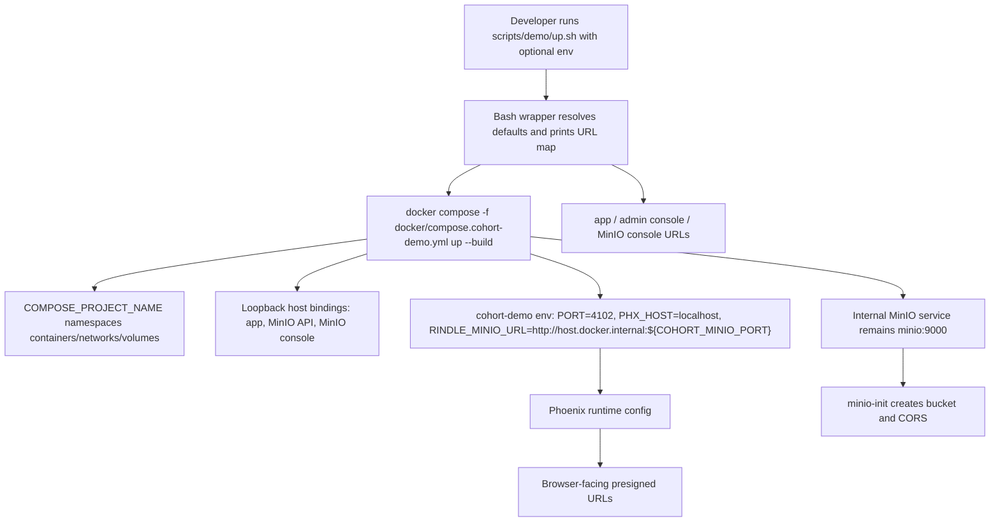

# Phase 87: Docker & Demo DX - Research

**Researched:** 2026-06-11  
**Domain:** Docker Compose preview DX, Phoenix demo runtime, shell launch wrappers  
**Confidence:** HIGH

<user_constraints>
## User Constraints (from CONTEXT.md)

### Locked Decisions
## Implementation Decisions

### Compose Ports And Namespacing

- **D-87-01:** Use `COMPOSE_PROJECT_NAME` as the stack namespacing mechanism so
  maintainers can run sibling demos without container, network, or volume
  collisions.
- **D-87-02:** Replace fixed host port bindings with env-driven defaults:
  `COHORT_DEMO_PORT=4102`, `COHORT_MINIO_PORT=9000`, and
  `COHORT_MINIO_CONSOLE_PORT=9001`.
- **D-87-03:** Bind published app and MinIO ports to loopback. MinIO API and
  console are local developer tooling, not public preview surfaces.
- **D-87-04:** Keep container-internal ports stable: Phoenix still listens on
  `PORT=4102`, MinIO API stays `9000`, and MinIO console stays `9001`.

### Launch Wrapper

- **D-87-05:** Preserve `scripts/demo/up.sh` as the copy-paste Docker preview
  entry point.
- **D-87-06:** Enhance the launch path to print a copy-pasteable URL map with
  exactly these labels: `app`, `admin console`, and `MinIO console`.
- **D-87-07:** The URL map should resolve from the same env-driven host ports
  compose uses. The locked targets are `http://localhost:${COHORT_DEMO_PORT}`,
  `http://localhost:${COHORT_DEMO_PORT}/admin/rindle`, and
  `http://localhost:${COHORT_MINIO_CONSOLE_PORT}` with documented defaults.

### Dockerfile Cache Shape

- **D-87-08:** Reorder `docker/Dockerfile.cohort-demo` so dependency files are
  copied before app source and `mix deps.get` runs before the full repo copy.
- **D-87-09:** Keep Phase 87 to cache-friendly Docker preview improvements.
  Do not introduce a release build, split image, Traefik, or production-style
  deployment topology in this phase.
- **D-87-10:** The dependency-cache contract must cover routine source, style,
  and template edits without re-fetching Hex dependencies.

### MinIO URL Boundary

- **D-87-11:** Preserve the split between container-internal MinIO wiring and
  browser-facing presigned URL reachability. Service-to-service setup can use
  `http://minio:9000`, but URLs emitted to browsers must point at the published
  host MinIO API port.
- **D-87-12:** Keep the existing demo-preview-only credential posture and bucket
  name unless implementation discovers a concrete conflict with env-driven port
  support.

### Docs And Verification

- **D-87-13:** Update the Docker quick-try docs and adoption proof matrix when
  the compose/script contract changes.
- **D-87-14:** Verification should include at least static compose/script checks
  such as rendered `docker compose config`, plus targeted shell syntax or output
  checks for the launch wrappers. Attempt heavier container startup only where
  practical for the plan's risk level.

### the agent's Discretion

The maintainer confirmed the assumptions as presented. Routine helper names,
shell formatting, exact docs wording, and verification command selection can be
resolved by research/planning without returning to the maintainer unless they
change public API shape, security exposure, destructive behavior, recurring
cost, or milestone scope.

### Deferred Ideas (OUT OF SCOPE)
None - analysis stayed within Phase 87 scope.
</user_constraints>

<phase_requirements>
## Phase Requirements

| ID | Description | Research Support |
|----|-------------|------------------|
| DX-01 | Compose stack is port-conflict-free alongside sibling projects through project namespacing, env-driven ports, sane defaults, and conflict guidance. [VERIFIED: `.planning/REQUIREMENTS.md`] | Use `COMPOSE_PROJECT_NAME`; interpolate loopback-bound host ports with `${VAR:-default}`; document override examples; verify with `docker compose config`. [CITED: https://docs.docker.com/compose/how-tos/project-name/; CITED: https://docs.docker.com/reference/compose-file/interpolation/; VERIFIED: `docker compose config`] |
| DX-02 | Dockerfile layer caching is fixed and dev iteration supports style/template changes without rebuilding deps. [VERIFIED: `.planning/REQUIREMENTS.md`] | Copy `mix.exs`, `mix.lock`, `examples/adoption_demo/mix.exs`, and `examples/adoption_demo/mix.lock` before `mix deps.get`, then copy source and run build steps. [VERIFIED: `guides/docker_demo_dx.md`; CITED: https://docs.docker.com/build/cache/optimize/] |
| DX-03 | Launch prints a copy-pasteable URL map for app, admin console, and MinIO console. [VERIFIED: `.planning/REQUIREMENTS.md`] | Enhance `scripts/demo/up.sh` while preserving compose passthrough; derive URLs from `COHORT_DEMO_PORT` and `COHORT_MINIO_CONSOLE_PORT`. [VERIFIED: `87-CONTEXT.md`; VERIFIED: `scripts/demo/up.sh`] |
</phase_requirements>

## Summary

Phase 87 should be planned as a small Docker/demo contract implementation, not a deployment redesign. The locked contract is already precise: keep internal ports stable, make only published host ports env-driven and loopback-bound, preserve `scripts/demo/up.sh`, fix Dockerfile dependency-layer ordering, and keep MinIO browser URLs reachable through the selected host API port. [VERIFIED: `87-CONTEXT.md`; VERIFIED: `guides/docker_demo_dx.md`]

The current baseline has the exact issues Phase 87 targets: the compose file uses fixed all-interface host port strings, `RINDLE_MINIO_URL` is fixed to `http://host.docker.internal:9000`, and the Dockerfile copies the whole repo before `mix deps.get`. [VERIFIED: `docker/compose.cohort-demo.yml`; VERIFIED: `docker/Dockerfile.cohort-demo`] Local `docker compose config` confirmed that `COMPOSE_PROJECT_NAME` already namespaces networks and volumes, but custom port env vars do not affect the current compose because they are not yet interpolated. [VERIFIED: local `docker compose config`]

**Primary recommendation:** Plan one cohesive change set across `docker/compose.cohort-demo.yml`, `scripts/demo/*.sh`, `docker/Dockerfile.cohort-demo`, `examples/adoption_demo/README.md`, and `examples/adoption_demo/docs/adoption-proof-matrix.md`; verify first with static render/shell checks, then treat full startup as an optional heavier check. [VERIFIED: `87-CONTEXT.md`; VERIFIED: `RUNNING.md`]

## Project Constraints (from AGENTS.md)

- Follow `guides/release_publish.md` and `RUNNING.md` for CI lanes and release gates. [VERIFIED: `AGENTS.md`]
- Keep edits focused and run the checks named by `RUNNING.md` for the change. [VERIFIED: `AGENTS.md`]
- Update `.planning/PROJECT.md` only when product scope or shipped claims intentionally change; Phase 87 should not change product scope. [VERIFIED: `AGENTS.md`; VERIFIED: `87-CONTEXT.md`]
- For UI/admin-console work, follow `guides/ui_principles.md`; Phase 87 only prints the future admin URL and does not implement UI. [VERIFIED: `AGENTS.md`; VERIFIED: `87-CONTEXT.md`]
- Maintain green-main release train posture and avoid speculative milestone expansion. [VERIFIED: `AGENTS.md`]
- Before release prep, run `./scripts/maintainer/repo_hygiene_check.sh`; this is not required for the narrow Phase 87 planning gate unless the implementation reaches release prep. [VERIFIED: `AGENTS.md`; ASSUMED]

## Architectural Responsibility Map

| Capability | Primary Tier | Secondary Tier | Rationale |
|------------|--------------|----------------|-----------|
| Compose project namespacing | Docker Compose / Local Runtime | Documentation | Compose project names isolate containers, networks, and volumes for sibling stacks. [CITED: https://docs.docker.com/compose/how-tos/project-name/] |
| Env-driven host ports | Docker Compose / Local Runtime | Shell wrapper | Compose interpolation owns the actual port bindings; wrapper output must mirror those values. [CITED: https://docs.docker.com/reference/compose-file/interpolation/; VERIFIED: `scripts/demo/up.sh`] |
| Browser-facing MinIO URL | Docker Compose env + Phoenix runtime | Docker networking | Phoenix runtime reads `RINDLE_MINIO_URL`; browsers need host-reachable presigned URLs while containers can still talk to `minio:9000`. [VERIFIED: `examples/adoption_demo/config/runtime.exs`; VERIFIED: `87-CONTEXT.md`] |
| Dependency-cache ordering | Dockerfile build layer | `.dockerignore` | Docker cache reuse depends on instruction inputs; copy dependency manifests before frequently changing app source. [CITED: https://docs.docker.com/build/cache/optimize/; VERIFIED: `.dockerignore`] |
| Launch URL map | Shell wrapper | Documentation | `up.sh` is the user-facing entry point and should print URLs derived from the same env defaults as compose. [VERIFIED: `87-CONTEXT.md`; VERIFIED: `scripts/demo/up.sh`] |
| Docs/proof honesty | Documentation | Maintainer scripts | README and proof matrix currently claim fixed `localhost:4102`; they must reflect env overrides and URL map. [VERIFIED: `examples/adoption_demo/README.md`; VERIFIED: `examples/adoption_demo/docs/adoption-proof-matrix.md`] |

## Standard Stack

### Core

| Tool / File | Version | Purpose | Why Standard |
|-------------|---------|---------|--------------|
| Docker Engine | 29.5.2 local | Runs preview containers. [VERIFIED: local `docker --version`] | Existing Docker preview depends on Docker; no alternate runtime is in scope. [VERIFIED: `examples/adoption_demo/README.md`; VERIFIED: `87-CONTEXT.md`] |
| Docker Compose | v5.1.3 local | Orchestrates Postgres, MinIO, MinIO init, and Cohort app. [VERIFIED: local `docker compose version`] | Official Compose project naming and interpolation directly satisfy DX-01. [CITED: https://docs.docker.com/compose/how-tos/project-name/; CITED: https://docs.docker.com/reference/compose-file/interpolation/] |
| Bash wrappers | GNU Bash 5.2.37 local | Maintainer entry points: `up.sh`, `down.sh`, `reset.sh`. [VERIFIED: local `bash --version`; VERIFIED: `scripts/demo/*.sh`] | Existing repo contract exposes scripts, not raw compose commands, as the primary copy-paste path. [VERIFIED: `87-CONTEXT.md`] |
| Phoenix runtime config | Elixir/Mix available locally; app target remains Elixir `~> 1.15`. [VERIFIED: local `mix --version`; VERIFIED: `examples/adoption_demo/mix.exs`] | Reads `PORT`, `PHX_HOST`, `COHORT_DEMO_DOCKER`, and MinIO env. [VERIFIED: `examples/adoption_demo/config/runtime.exs`] | Runtime config is the correct place to consume compose-provided env without changing app source behavior. [VERIFIED: `runtime.exs`] |

### Supporting

| Tool / File | Version | Purpose | When to Use |
|-------------|---------|---------|-------------|
| ShellCheck | 0.11.0 local | Static analysis for wrapper edits. [VERIFIED: local `shellcheck --version`] | Run after changing `scripts/demo/*.sh` or `docker/cohort-demo-entrypoint.sh`. [VERIFIED: current `shellcheck` passes] |
| `docker compose config` | Compose v5.1.3 local | Renders interpolated config and project names. [VERIFIED: local command] | Use as primary static proof for DX-01 and env-driven MinIO URL flow. [VERIFIED: `87-CONTEXT.md`] |
| `check_adoption_proof_matrix.sh` | Repo script | Ensures proof matrix drift gate remains green. [VERIFIED: script run OK] | Run after docs/proof matrix edits. [VERIFIED: `examples/adoption_demo/docs/adoption-proof-matrix.md`] |

### Alternatives Considered

| Instead of | Could Use | Tradeoff |
|------------|-----------|----------|
| Env-driven ports | Traefik / reverse proxy | Rejected for Phase 87 because no multi-host routing requirement exists and it would add services, labels, ports, and failure modes. [VERIFIED: `guides/docker_demo_dx.md`; VERIFIED: `87-CONTEXT.md`] |
| Wrapper URL printing | Raw docs-only command examples | Docs alone would not satisfy DX-03's launch-output requirement. [VERIFIED: `.planning/REQUIREMENTS.md`; VERIFIED: `scripts/demo/up.sh`] |
| Static verification | Always start full stack | Full startup is higher cost and may be impractical; static compose/script verification is explicitly acceptable, with startup attempted where risk justifies it. [VERIFIED: `87-CONTEXT.md`] |

**Installation:** No external packages should be installed for this phase. [VERIFIED: `87-CONTEXT.md`; VERIFIED: current repo tooling]

**Version verification:**

```bash
docker --version
docker compose version
bash --version | head -1
shellcheck --version | head -2
mix --version | head -2
```

## Package Legitimacy Audit

No external language packages are recommended or installed in Phase 87. [VERIFIED: `87-CONTEXT.md`] Slopcheck is not applicable because the plan should modify existing Docker, shell, Phoenix config, and docs only. [VERIFIED: `87-CONTEXT.md`]

| Package | Registry | Age | Downloads | Source Repo | slopcheck | Disposition |
|---------|----------|-----|-----------|-------------|-----------|-------------|
| None | — | — | — | — | not run | No package install in scope. [VERIFIED: `87-CONTEXT.md`] |

**Packages removed due to slopcheck [SLOP] verdict:** none  
**Packages flagged as suspicious [SUS]:** none

## Architecture Patterns

### System Architecture Diagram



### Recommended Project Structure

```text
docker/
├── compose.cohort-demo.yml        # Compose services, project default, env-driven loopback bindings.
├── Dockerfile.cohort-demo         # Cache-friendly dependency manifest copy before source copy.
└── cohort-demo-entrypoint.sh      # Existing boot/migration/seed sequence; keep behavior stable.
scripts/demo/
├── up.sh                          # Primary launch wrapper plus URL map.
├── down.sh                        # Same compose file/project semantics as up.
└── reset.sh                       # Same compose file/project semantics as up, with volumes removed.
examples/adoption_demo/
├── config/runtime.exs             # Docker runtime env consumption.
├── README.md                      # Quick-try docs and port conflict guidance.
└── docs/adoption-proof-matrix.md  # Proof row kept honest.
```

### Pattern 1: Compose Interpolation With Loopback Bindings

**What:** Use Compose's shell-style default interpolation for published host ports, and include `127.0.0.1` in the port binding. [CITED: https://docs.docker.com/reference/compose-file/interpolation/; CITED: https://docs.docker.com/reference/compose-file/services/]

**When to use:** Use for `cohort-demo`, MinIO API, and MinIO console published ports. [VERIFIED: `guides/docker_demo_dx.md`]

**Example:**

```yaml
# Source: Docker Compose interpolation + services docs; locked values from guides/docker_demo_dx.md
ports:
  - "127.0.0.1:${COHORT_DEMO_PORT:-4102}:4102"
```

### Pattern 2: Same Env Source For Compose And URL Output

**What:** Define Bash defaults in `up.sh` that match Compose defaults, print the URL map, then exec compose. [VERIFIED: `87-CONTEXT.md`; VERIFIED: `scripts/demo/up.sh`]

**When to use:** Use before `docker compose up --build` so the user sees URLs immediately and command arguments still pass through. [VERIFIED: `87-CONTEXT.md`]

**Example:**

```bash
# Source: locked Phase 87 URL map labels and current wrapper shape.
cohort_demo_port="${COHORT_DEMO_PORT:-4102}"
cohort_minio_console_port="${COHORT_MINIO_CONSOLE_PORT:-9001}"

printf 'app: %s\n' "http://localhost:${cohort_demo_port}"
printf 'admin console: %s\n' "http://localhost:${cohort_demo_port}/admin/rindle"
printf 'MinIO console: %s\n' "http://localhost:${cohort_minio_console_port}"

exec docker compose -f "${repo_root}/docker/compose.cohort-demo.yml" up --build "$@"
```

### Pattern 3: Dependency Manifest Copy Before Source Copy

**What:** Copy Mix dependency manifests before full source copy, run `mix deps.get`, then copy the rest of the repo and run `mix assets.vendor` and `mix compile`. [VERIFIED: `guides/docker_demo_dx.md`; CITED: https://docs.docker.com/build/cache/optimize/]

**When to use:** Use in `docker/Dockerfile.cohort-demo` to prevent routine source, CSS, and HEEx edits from invalidating the dependency-fetch layer. [VERIFIED: `87-CONTEXT.md`]

**Example:**

```dockerfile
# Source: Docker cache ordering docs; file list locked in guides/docker_demo_dx.md.
COPY mix.exs mix.lock /app/
COPY examples/adoption_demo/mix.exs examples/adoption_demo/mix.lock /app/examples/adoption_demo/
WORKDIR /app/examples/adoption_demo
ENV MIX_ENV=prod
RUN mix local.hex --force \
  && mix local.rebar --force \
  && mix deps.get

COPY . /app
RUN mix assets.vendor \
  && mix compile
```

### Anti-Patterns to Avoid

- **Bare host port bindings:** `"9000:9000"` and `"9001:9001"` bind to all interfaces and miss the loopback-only exposure boundary. [CITED: https://docs.docker.com/reference/compose-file/services/; VERIFIED: `docker/compose.cohort-demo.yml`]
- **Fixed `RINDLE_MINIO_URL`:** Keeping `http://host.docker.internal:9000` breaks browser presigned URLs when `COHORT_MINIO_PORT` is overridden. [VERIFIED: `docker/compose.cohort-demo.yml`; VERIFIED: `87-CONTEXT.md`]
- **Full repo `COPY` before `mix deps.get`:** This invalidates dependency download cache on routine source edits. [VERIFIED: `docker/Dockerfile.cohort-demo`; CITED: https://docs.docker.com/build/cache/optimize/]
- **New reverse proxy or production topology:** Traefik and release-build redesign are explicitly out of scope. [VERIFIED: `guides/docker_demo_dx.md`; VERIFIED: `87-CONTEXT.md`]

## Don't Hand-Roll

| Problem | Don't Build | Use Instead | Why |
|---------|-------------|-------------|-----|
| Compose stack namespacing | Custom container/network/volume names | `COMPOSE_PROJECT_NAME` | Compose already defines project-name precedence and isolation behavior. [CITED: https://docs.docker.com/compose/how-tos/project-name/] |
| Port defaulting | Ad hoc template generation for compose YAML | Compose interpolation `${VAR:-default}` | Compose natively supports default values. [CITED: https://docs.docker.com/reference/compose-file/interpolation/] |
| Port conflict detection | Custom scanner that kills processes | Document env overrides and let Docker fail clearly on occupied ports | The locked requirement is conflict-free defaults/guidance, not process management. [VERIFIED: `.planning/REQUIREMENTS.md`; ASSUMED] |
| URL routing | Traefik / reverse proxy | Direct localhost URLs | Phase 86 rejected reverse proxy for this scope. [VERIFIED: `guides/docker_demo_dx.md`] |

**Key insight:** The risk is not algorithmic complexity; it is contract drift between compose, wrapper output, runtime MinIO URLs, and docs. [VERIFIED: codebase grep; VERIFIED: `87-CONTEXT.md`]

## Common Pitfalls

### Pitfall 1: Host Port Env Vars Do Not Reach Browser-Facing MinIO URLs

**What goes wrong:** MinIO API is published on a non-default host port, but Phoenix still emits presigned URLs pointing at `host.docker.internal:9000`. [VERIFIED: `docker/compose.cohort-demo.yml`; VERIFIED: `runtime.exs`]

**Why it happens:** Compose port interpolation and application env are separate; both must receive the selected `COHORT_MINIO_PORT`. [CITED: https://docs.docker.com/reference/compose-file/interpolation/; VERIFIED: `runtime.exs`]

**How to avoid:** Set `RINDLE_MINIO_URL: "http://host.docker.internal:${COHORT_MINIO_PORT:-9000}"` or an equivalent env-driven value in compose. [VERIFIED: `guides/docker_demo_dx.md`]

**Warning signs:** `docker compose config` still shows `RINDLE_MINIO_URL: http://host.docker.internal:9000` after `COHORT_MINIO_PORT=9200`. [VERIFIED: local `docker compose config`]

### Pitfall 2: Loopback Binding Gets Dropped

**What goes wrong:** MinIO console or API binds to all host interfaces. [CITED: https://docs.docker.com/reference/compose-file/services/]

**Why it happens:** Compose short syntax defaults to all interfaces when host IP is omitted. [CITED: https://docs.docker.com/reference/compose-file/services/]

**How to avoid:** Use `127.0.0.1:${VAR:-default}:container_port` for all published Phase 87 ports. [VERIFIED: `guides/docker_demo_dx.md`]

**Warning signs:** Rendered config lacks `host_ip: 127.0.0.1` or short syntax lacks `127.0.0.1:`. [CITED: https://docs.docker.com/reference/compose-file/services/]

### Pitfall 3: URL Map Prints Defaults While Compose Uses Overrides

**What goes wrong:** `up.sh` prints `localhost:4102` while compose publishes another port. [VERIFIED: `scripts/demo/up.sh`; ASSUMED]

**Why it happens:** Wrapper output computes defaults independently or hard-codes values instead of using the same env vars. [ASSUMED]

**How to avoid:** Add a focused script-output test that runs `COHORT_DEMO_PORT=4212 COHORT_MINIO_CONSOLE_PORT=9201 ./scripts/demo/up.sh --help` only if the wrapper can support a no-start/print path, or test a small extracted helper if the planner chooses to add one. [ASSUMED]

**Warning signs:** `rg "localhost:4102|9001" scripts/demo/up.sh` finds hard-coded output outside default assignments. [VERIFIED: current code grep]

### Pitfall 4: Dockerfile Cache Still Invalidates On Source Edits

**What goes wrong:** Any source or style/template edit causes Hex dependencies to be fetched again. [VERIFIED: `docker/Dockerfile.cohort-demo`; CITED: https://docs.docker.com/build/cache/optimize/]

**Why it happens:** A broad `COPY . /app` still appears before `mix deps.get`. [VERIFIED: `docker/Dockerfile.cohort-demo`]

**How to avoid:** Plan a source-order assertion: dependency manifest `COPY` lines and `mix deps.get` must appear before full source `COPY . /app`. [VERIFIED: `guides/docker_demo_dx.md`]

**Warning signs:** `docker/Dockerfile.cohort-demo` contains `COPY . /app` before `mix deps.get`. [VERIFIED: `docker/Dockerfile.cohort-demo`]

## Code Examples

### Rendered Compose Verification

```bash
# Source: Docker Compose config command behavior verified locally.
COHORT_DEMO_PORT=4212 \
COHORT_MINIO_PORT=9200 \
COHORT_MINIO_CONSOLE_PORT=9201 \
COMPOSE_PROJECT_NAME=rindle-cohort-check \
docker compose -f docker/compose.cohort-demo.yml config
```

Expected post-implementation assertions: rendered project name is `rindle-cohort-check`; app publishes `127.0.0.1:4212 -> 4102`; MinIO API publishes `127.0.0.1:9200 -> 9000`; MinIO console publishes `127.0.0.1:9201 -> 9001`; `RINDLE_MINIO_URL` includes `9200`. [VERIFIED: official docs; VERIFIED: current local command baseline shows what must change]

### Wrapper Static Checks

```bash
# Source: local tool availability and current scripts.
bash -n scripts/demo/up.sh scripts/demo/down.sh scripts/demo/reset.sh docker/cohort-demo-entrypoint.sh
shellcheck scripts/demo/up.sh scripts/demo/down.sh scripts/demo/reset.sh docker/cohort-demo-entrypoint.sh
```

### Docs Drift Check

```bash
# Source: RUNNING.md proof lane and current script.
scripts/maintainer/check_adoption_proof_matrix.sh
```

## State of the Art

| Old Approach | Current Approach | When Changed | Impact |
|--------------|------------------|--------------|--------|
| Fixed host ports in compose | Env-interpolated host ports with defaults | Phase 87 target, locked 2026-06-11 | Allows sibling projects to run without editing compose. [VERIFIED: `87-CONTEXT.md`] |
| Bare port bindings | Loopback-bound published ports | Phase 87 target, locked 2026-06-11 | Keeps MinIO API/console local developer tooling. [VERIFIED: `guides/docker_demo_dx.md`; CITED: https://docs.docker.com/reference/compose-file/services/] |
| Full source copy before dependency fetch | Dependency manifests before source copy | Phase 87 target, locked 2026-06-11 | Keeps dependency layer reusable across source/style/template edits. [VERIFIED: `guides/docker_demo_dx.md`; CITED: https://docs.docker.com/build/cache/optimize/] |

**Deprecated/outdated:**
- Fixed `"4102:4102"`, `"9000:9000"`, and `"9001:9001"` strings in the demo compose are the baseline to replace. [VERIFIED: `guides/docker_demo_dx.md`; VERIFIED: `docker/compose.cohort-demo.yml`]
- Docs claiming only `./scripts/demo/up.sh -> http://localhost:4102` are incomplete after URL map support lands. [VERIFIED: `examples/adoption_demo/README.md`; VERIFIED: `examples/adoption_demo/docs/adoption-proof-matrix.md`]

## Assumptions Log

| # | Claim | Section | Risk if Wrong |
|---|-------|---------|---------------|
| A1 | Release-prep hygiene is not required for the narrow Phase 87 planning gate unless implementation reaches release prep. | Project Constraints | Planner may over-scope verification. |
| A2 | The plan should not build a custom port-conflict scanner or process killer; docs/env guidance is enough. | Don't Hand-Roll | Planner might under-address a hidden maintainer expectation for active detection. |
| A3 | Wrapper-output testing may require a no-start/print path or helper extraction because current `up.sh` immediately execs compose. | Common Pitfalls | Planner might choose a brittle test that starts containers when only output verification is needed. |

## Open Questions

1. **Should `down.sh` and `reset.sh` print or validate `COMPOSE_PROJECT_NAME`?**
   - What we know: they must target the same compose file and project namespace as `up.sh`. [VERIFIED: `87-CONTEXT.md`]
   - What's unclear: whether user-facing output for stop/reset is desired. [ASSUMED]
   - Recommendation: keep them quiet pass-throughs unless adding a tiny shared compose-file helper improves consistency without changing behavior. [ASSUMED]

2. **Should full Docker startup be required in the plan?**
   - What we know: static compose/script checks are required; heavier startup is optional where practical. [VERIFIED: `87-CONTEXT.md`]
   - What's unclear: runtime cost tolerance during execution. [ASSUMED]
   - Recommendation: make full startup a final optional/manual verification after static gates, not a prerequisite for every task. [ASSUMED]

## Environment Availability

| Dependency | Required By | Available | Version | Fallback |
|------------|-------------|-----------|---------|----------|
| Docker Engine | Compose rendering and optional full startup | yes | 29.5.2; daemon available | Static file assertions only if daemon later unavailable. [VERIFIED: local `docker info`] |
| Docker Compose | DX-01 verification | yes | v5.1.3 | Static grep/YAML review, but lower confidence. [VERIFIED: local `docker compose version`] |
| Bash | Wrapper edits and syntax checks | yes | GNU Bash 5.2.37 | POSIX `sh` not recommended because scripts use Bash shebang. [VERIFIED: local `bash --version`; VERIFIED: `scripts/demo/*.sh`] |
| ShellCheck | Wrapper lint | yes | 0.11.0 | `bash -n` plus review. [VERIFIED: local `shellcheck --version`] |
| Mix / Elixir | Optional app config validation | yes | OTP 28 locally; project supports Elixir `~> 1.15` | Skip compile for Docker-only phase unless runtime config changes are nontrivial. [VERIFIED: local `mix --version`; VERIFIED: `mix.exs`] |
| Node/NPM | Existing Playwright lane if needed | yes | Node v22.14.0 / npm 11.1.0 | Not needed for Phase 87 unless planner elects full E2E smoke. [VERIFIED: local commands; VERIFIED: `examples/adoption_demo/package.json`] |

**Missing dependencies with no fallback:** none found. [VERIFIED: local commands]  
**Missing dependencies with fallback:** none found. [VERIFIED: local commands]

## Validation Architecture

### Test Framework

| Property | Value |
|----------|-------|
| Framework | Static shell checks, Docker Compose render checks, ExUnit/Mix if runtime config changes need compile coverage, Playwright only if a heavier smoke is selected. [VERIFIED: repo files] |
| Config file | `docker/compose.cohort-demo.yml`, `mix.exs`, `examples/adoption_demo/mix.exs`, `examples/adoption_demo/playwright.config.js`. [VERIFIED: repo files] |
| Quick run command | `bash -n scripts/demo/up.sh scripts/demo/down.sh scripts/demo/reset.sh docker/cohort-demo-entrypoint.sh && shellcheck scripts/demo/up.sh scripts/demo/down.sh scripts/demo/reset.sh docker/cohort-demo-entrypoint.sh && COHORT_DEMO_PORT=4212 COHORT_MINIO_PORT=9200 COHORT_MINIO_CONSOLE_PORT=9201 COMPOSE_PROJECT_NAME=rindle-cohort-check docker compose -f docker/compose.cohort-demo.yml config >/tmp/rindle-compose-config.yml` [VERIFIED: local commands] |
| Full suite command | `mix test` from repo root remains the broad merge-blocking test lane, but Phase 87 should not require it unless Elixir runtime behavior changes beyond env wiring. [VERIFIED: `RUNNING.md`; ASSUMED] |

### Phase Requirements To Test Map

| Req ID | Behavior | Test Type | Automated Command | File Exists? |
|--------|----------|-----------|-------------------|--------------|
| DX-01 | Compose namespaces stack and renders env-driven loopback ports. | static integration | `COHORT_DEMO_PORT=4212 COHORT_MINIO_PORT=9200 COHORT_MINIO_CONSOLE_PORT=9201 COMPOSE_PROJECT_NAME=rindle-cohort-check docker compose -f docker/compose.cohort-demo.yml config` plus assertions on rendered output. | yes |
| DX-01 | Port conflict guidance is documented. | docs/static | `rg -F 'COHORT_DEMO_PORT' examples/adoption_demo/README.md examples/adoption_demo/docs/adoption-proof-matrix.md` and `scripts/maintainer/check_adoption_proof_matrix.sh`. | yes |
| DX-02 | `mix deps.get` runs after dependency manifests but before full source copy. | static Dockerfile | Use an `awk` or small script assertion on line ordering in `docker/Dockerfile.cohort-demo`. | yes |
| DX-02 | Style/template edits do not rebuild deps. | optional Docker smoke | Build once, touch a non-dependency source/template file, rebuild, and inspect output for cached dependency layer if execution budget permits. | yes |
| DX-03 | Launch prints `app`, `admin console`, and `MinIO console` URLs from env ports. | shell output | Prefer a no-start print/helper test; otherwise use a controlled wrapper test that does not start containers. [ASSUMED] | current file exists; test helper absent |

### Sampling Rate

- **Per task commit:** quick static command above. [ASSUMED]
- **Per wave merge:** `scripts/maintainer/check_adoption_proof_matrix.sh` plus rendered compose assertions. [ASSUMED]
- **Phase gate:** Static gates green; optional full Docker startup if practical. [VERIFIED: `87-CONTEXT.md`]

### Wave 0 Gaps

- [ ] Add a deterministic wrapper URL-output check if `up.sh` remains an immediate `exec docker compose ... up --build`. [ASSUMED]
- [ ] Add a Dockerfile line-order assertion if planner wants more than review for DX-02. [ASSUMED]

## Security Domain

### Applicable ASVS Categories

| ASVS Category | Applies | Standard Control |
|---------------|---------|------------------|
| V2 Authentication | no | Phase 87 does not implement auth or admin console behavior. [VERIFIED: `87-CONTEXT.md`] |
| V3 Session Management | no | Phase 87 does not change session behavior. [VERIFIED: `87-CONTEXT.md`] |
| V4 Access Control | no | Phase 87 prints a future admin URL but does not mount or secure the console. [VERIFIED: `87-CONTEXT.md`] |
| V5 Input Validation | yes | Treat env vars as local developer inputs; use Compose interpolation defaults and avoid shell eval. [CITED: https://docs.docker.com/reference/compose-file/interpolation/; ASSUMED] |
| V6 Cryptography | no | No cryptographic code or secret-generation changes; demo credential posture remains preview-only. [VERIFIED: `87-CONTEXT.md`] |

### Known Threat Patterns for Docker Demo DX

| Pattern | STRIDE | Standard Mitigation |
|---------|--------|---------------------|
| Accidental MinIO exposure on public interfaces | Information Disclosure | Bind MinIO API and console to `127.0.0.1`. [VERIFIED: `guides/docker_demo_dx.md`; CITED: https://docs.docker.com/reference/compose-file/services/] |
| Shell injection through wrapper args/env | Tampering / Elevation of Privilege | Keep quoted variables and pass-through `"$@"`; do not use `eval` in wrappers. [VERIFIED: current wrappers; ASSUMED] |
| Misleading URL output | Spoofing / Repudiation | Generate URL map from same env defaults compose uses and verify rendered compose. [VERIFIED: `87-CONTEXT.md`] |

## Sources

### Primary (HIGH confidence)

- `87-CONTEXT.md` - locked Phase 87 decisions and scope.
- `guides/docker_demo_dx.md` - Phase 86 Docker DX contract.
- `docker/compose.cohort-demo.yml` - current compose baseline.
- `docker/Dockerfile.cohort-demo` - current cache-order baseline.
- `scripts/demo/up.sh`, `down.sh`, `reset.sh` - current wrapper surface.
- `examples/adoption_demo/config/runtime.exs` - Phoenix and MinIO runtime env consumption.
- `examples/adoption_demo/README.md` and `docs/adoption-proof-matrix.md` - docs/proof claims.
- Docker docs: project names, interpolation, service ports, build cache optimization.

### Secondary (MEDIUM confidence)

- Local tool probes: Docker 29.5.2, Compose v5.1.3, Bash 5.2.37, ShellCheck 0.11.0, Node v22.14.0, npm 11.1.0.
- Local static checks: `bash -n`, `shellcheck`, `docker compose config`, `check_adoption_proof_matrix.sh`.

### Tertiary (LOW confidence)

- Assumptions in the Assumptions Log about test helper shape and exact verification sampling.

## Metadata

**Confidence breakdown:**
- Standard stack: HIGH - local tooling and official Docker docs verified.
- Architecture: HIGH - Phase 86/87 contracts and current code converge.
- Pitfalls: HIGH - each critical pitfall maps to an observed current baseline or official Docker behavior.

**Research date:** 2026-06-11  
**Valid until:** 2026-07-11 for local Docker DX planning; re-check Docker Compose docs/tool versions after 30 days.
