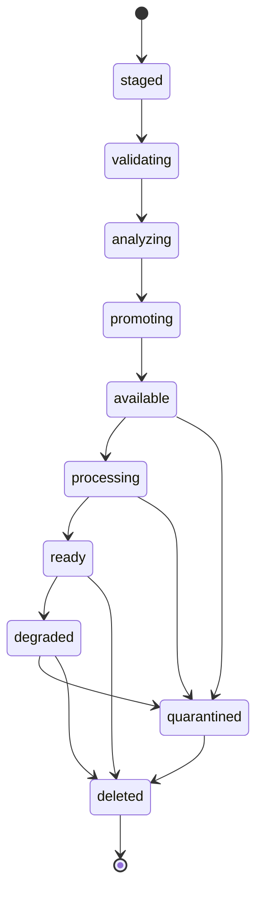
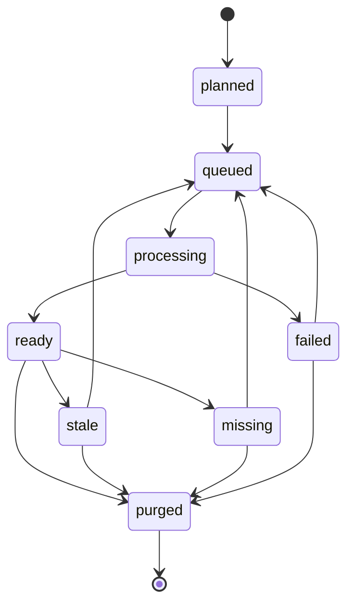
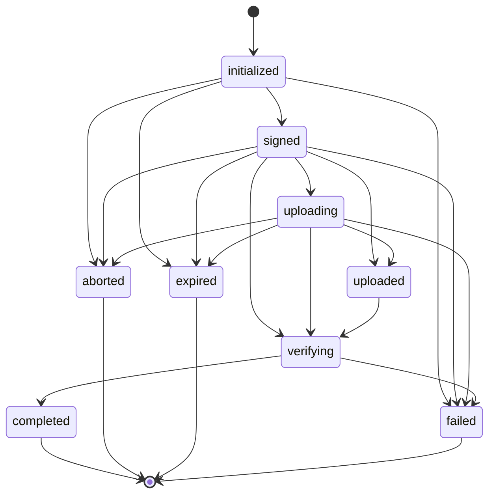

# Core Concepts

Rindle models media as three primary entities, each governed by an explicit
finite-state machine that controls valid transitions:

- **`MediaAsset`** — a single uploaded file (the canonical "original")
- **`MediaVariant`** — a derived output (thumbnail, large, format-converted, etc.)
- **`MediaUploadSession`** — a presigned upload session in flight

Treating lifecycle as a first-class FSM (rather than a JSON column or a
filesystem convention) is what makes Rindle queryable for Day-2 operations:
admins, SREs, and cleanup jobs need to know which assets are quarantined,
which variants are stale, and which sessions never completed. Each entity
also has a corresponding Ecto schema (see `Rindle.Domain.MediaAsset`,
`Rindle.Domain.MediaVariant`, `Rindle.Domain.MediaUploadSession`).

The Mermaid diagrams below mirror the `@allowed_transitions` declarations
in the FSM modules verbatim — if a transition isn't in the diagram, the FSM
will reject it with `{:error, {:invalid_transition, from, to}}`.

## Asset Lifecycle

A `MediaAsset` represents one uploaded original. The FSM governs its journey
from "the upload session staged a row" through to "the asset is fully ready
for delivery" — and the off-ramps for quarantine and deletion.

State meanings:

| State          | Meaning                                                            |
| -------------- | ------------------------------------------------------------------ |
| `staged`       | Row created; upload session in flight (no bytes verified yet)      |
| `validating`   | Upload completion verified; about to validate MIME / size          |
| `analyzing`    | Validation passed; analyzer extracting metadata                    |
| `promoting`    | Analysis complete; about to flip to `available`                    |
| `available`    | Original is durable and queryable; variant generation can begin    |
| `processing`   | One or more variant jobs running                                   |
| `ready`        | All declared variants are in `ready` (or `failed`) state           |
| `degraded`     | Some variants failed but original remains deliverable              |
| `quarantined`  | MIME mismatch, scanner verdict, or other policy rejection          |
| `deleted`      | Soft-deleted; storage purge enqueued                               |

See `Rindle.Domain.AssetFSM` for the canonical transition map.

## Variant Lifecycle

A `MediaVariant` is one derived output declared by a profile (e.g., the
`thumb` variant on `MyApp.MediaProfile`). Each variant gets its own row
with its own state — variants are first-class records, not hidden filenames.
This is what makes regeneration, stale detection, and storage verification
queryable.

State meanings:

| State        | Meaning                                                              |
| ------------ | -------------------------------------------------------------------- |
| `planned`    | Row exists; processing not yet enqueued                              |
| `queued`     | Oban job enqueued via `Rindle.Workers.ProcessVariant`                |
| `processing` | Worker actively running the variant pipeline                         |
| `ready`      | Variant object exists in storage; deliverable                        |
| `stale`      | Profile recipe digest changed; variant predates the new recipe       |
| `missing`    | `mix rindle.verify_storage` confirmed the storage object is gone     |
| `failed`     | Processing exhausted retries                                         |
| `purged`     | Variant intentionally removed (post-detach, post-cleanup)            |

See `Rindle.Domain.VariantFSM`. Stale variants can be re-queued via
`mix rindle.regenerate_variants`; missing variants are detected by
`mix rindle.verify_storage` and similarly re-enqueued.

## Upload Session Lifecycle

A `MediaUploadSession` is the durable handle on a presigned upload in flight.
The session's state machine encodes the direct-upload protocol — initiate,
sign, observe upload progress, verify completion, transition to terminal —
plus the off-ramps for abort, expiry, and failure.

State meanings:

| State         | Meaning                                                             |
| ------------- | ------------------------------------------------------------------- |
| `initialized` | Session row created; presigned URL not yet issued                   |
| `signed`      | Presigned PUT URL issued; client may upload                         |
| `uploading`   | Optional: client reported progress (not all clients do)             |
| `uploaded`    | Optional: client reported completion (not all clients do)           |
| `verifying`   | Server is HEAD-checking the storage object                          |
| `completed`   | Object verified in storage; asset transitioned to `validating`      |
| `aborted`     | Adopter explicitly cancelled the session                            |
| `expired`     | TTL elapsed before completion (`mix rindle.abort_incomplete_uploads`) |
| `failed`      | Verification failed (object missing, integrity check failed, etc.)  |

See `Rindle.Domain.UploadSessionFSM`. Note that the session FSM is more
permissive than the asset/variant FSMs: from `initialized` you can jump
directly to `verifying` (clients that don't report intermediate progress),
and abort/expire/fail are reachable from any non-terminal state.

## How These Connect

A user-initiated upload threads through all three entities:

1. The adopter calls `Rindle.Upload.Broker.initiate_session/2` — this creates
   a `staged` `MediaAsset` and an `initialized` `MediaUploadSession` in a
   single DB transaction.
2. The adopter calls `Rindle.Upload.Broker.sign_url/2` — this transitions the
   session to `signed` and returns a presigned PUT URL.
3. The client PUTs the file bytes directly to storage. Rindle never sees
   the bytes during this step.
4. The adopter calls `Rindle.Upload.Broker.verify_completion/2` — Rindle
   HEAD-checks storage, transitions the session to `completed`, and the
   asset to `validating`. An Oban `PromoteAsset` job is enqueued *inside the
   same Ecto transaction* (transactional enqueueing — see
   [Background Processing](background_processing.html)).
5. `Rindle.Workers.PromoteAsset` advances the asset through `validating →
   analyzing → promoting → available` and enqueues `Rindle.Workers.ProcessVariant`
   jobs for each variant declared on the profile.
6. Each `ProcessVariant` job runs the configured processor and transitions
   its `MediaVariant` row from `queued → processing → ready`.
7. Once attached via `Rindle.attach/4`, the asset is delivered through
   `Rindle.Delivery.url/3` (signed by default — see [Secure Delivery](secure_delivery.html)).

The state machines also enforce key safety properties:

- **Atomic promote** — `MediaVariant` records are reloaded and re-checked
  before a worker writes a `ready` outcome, so a stale background job can't
  overwrite a newer attachment.
- **Async purge** — detach commits *immediately* in a DB transaction; the
  storage delete is enqueued as `Rindle.Workers.PurgeStorage` and runs
  outside the transaction (so storage I/O never blocks or fails a DB write).
- **No silent transitions** — every transition emits
  `[:rindle, :asset, :state_change]` or `[:rindle, :variant, :state_change]`
  telemetry with `from`, `to`, `profile`, `adapter` metadata.

## Schema Reference

| Schema                             | Module                              |
| ---------------------------------- | ----------------------------------- |
| `media_assets`                     | `Rindle.Domain.MediaAsset`          |
| `media_variants`                   | `Rindle.Domain.MediaVariant`        |
| `media_upload_sessions`            | `Rindle.Domain.MediaUploadSession`  |
| `media_attachments` (polymorphic)  | `Rindle.Domain.MediaAttachment`     |
| `media_processing_runs` (audit)    | `Rindle.Domain.MediaProcessingRun`  |

All five are normalized Ecto tables with indexed `state` columns, so admin
LiveViews, dashboards, and cleanup jobs can query lifecycle state directly
without scanning JSON columns.
